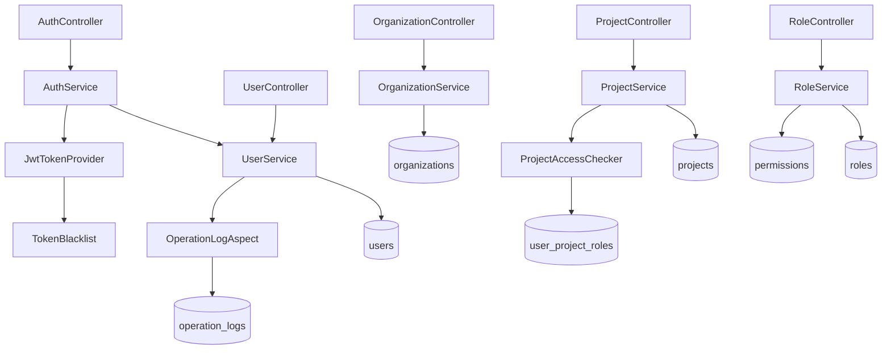

# WI-0001 技术设计：基础数据与权限骨架

> 基于 requirements.md（55条需求/164条AC）和 v1.14 业务定稿生成。技术栈已冻结（裁决C106.2）。

## 1. 架构总览

### DD-1 整体架构与模块划分

refs: [REQ-WI0001-C01] constrained_by: Java17+SpringBoot3.x+PostgreSQL15+Vue3

前后端分离，后端按业务领域划分为5个核心模块：auth(认证) / user(用户) / role-permission(RBAC) / organization(组织机构) / project(项目+参建单位+成员角色)，辅以 audit(审计) / seed(Flyway种子) / common(基础设施)。

| 模块 | "我是X"陈述(A1) |
|------|----------------|
| auth | 访问控制入口（登录/JWT/密码/会话失效） |
| user | 用户身份管理 |
| role-permission | 权限决策中心（角色/权限点/RBAC引擎） |
| organization | 组织主数据中心 |
| project | 项目业务容器（项目/参建单位/成员角色/配置） |
| audit | 操作留痕中心（OperationLog AOP + hash链） |
| seed | 系统初始化器（Flyway迁移/种子数据） |
| common | 共享基础设施（统一响应/错误码/分页/乐观锁） |



### DD-2 后端分层与包结构

refs: [REQ-WI0001-C01]

四层架构 Controller→Service→Repository→Entity。包根 `com.fj1.inspection`，下设 config/ common/ auth/ user/ role/ organization/ project/ audit/ seed/。

- Controller层：请求解析+参数校验(BeanValidation)+调用Service+封装响应，**不含**业务逻辑。
- Service层：业务逻辑+事务边界+权限校验+OperationLog触发。所有Service定义为interface（A3可替换性）。
- Repository层：继承JpaRepository，所有项目数据查询**必须**显式带projectId参数（DD-19）。
- Entity层：JPA @Entity+@Table，字段与数据库列一一对应。

Flyway迁移脚本位于 `seed/db/migration/`，脚本版本规划见DD-31。

### DD-3 前端架构与目录结构

refs: [REQ-WI0001-C01] constrained_by: Vue3+TS+Vite+ElementPlus

前端目录：router/(路由+守卫) stores/(Pinia: auth+permission+app) api/(axios封装+各模块API) views/(login/dashboard/system/user/organization/role/project/audit) components/ directives/(v-permission) composables/ types/ utils/。

---

## 2. 数据库设计

### DD-4 主键/命名/审计字段策略

refs: [REQ-WI0001-C04, REQ-WI0001-090]

- **主键**：所有表用UUID字符串(varchar36)，应用层生成(UUID.randomUUID)，分布式友好+不暴露数据量。
- **命名**：表名小写下划线复数(users)，列名小写下划线(login_name)，FK列`{表单数}_id`，索引`idx_{表}_{列}`，唯一索引`uk_{表}_{列}`。
- **审计字段**(所有业务表统一)：id(varchar36 PK) / created_at(timestamptz) / updated_at(timestamptz) / created_by / updated_by / version(int默认0，JPA @Version乐观锁)。
- **软停用**：status='INACTIVE'，不物理删除(裁决C103.8)。不引入deleted_at。
- **时间存储**：UTC timestamptz，应用层按project_timezone转换(REQ-055)。

### DD-5 users 表

refs: [REQ-010,011,012,013,014,001,002,003,N02] constrained_by: v1.14第101.4节

```
users(
  id varchar36 PK,
  login_name varchar64 UNIQUE NOT NULL,    -- Q1:创建后不可修改
  display_name varchar128 NOT NULL,
  password_hash varchar100 NOT NULL,       -- BCrypt(strength=12)
  phone varchar20, email varchar128,
  organization_id varchar36 FK->organizations NULL,  -- null=未归属(跨组织借调)
  status varchar10 DEFAULT 'ACTIVE',       -- ACTIVE/INACTIVE
  password_must_change bool DEFAULT FALSE, -- Q6:临时密码首次登录强制改密
  failed_login_count int DEFAULT 0,        -- 登录失败计数(REQ-001AC3)
  locked_until timestamp NULL,             -- 锁定截止时间
  last_login_at timestamp NULL,
  created_at/updated_at/created_by/updated_by/version
)
INDEX: idx_users_org_id, idx_users_status, uk_users_login_name
```

### DD-6 roles 表

refs: [REQ-020,021,022]

```
roles(id, role_code UNIQUE, role_name, role_scope[SYSTEM/PROJECT],
  status DEFAULT 'ACTIVE', is_builtin bool DEFAULT FALSE,  -- 预置不可停用
  sort_order int, description, 审计字段)
```

7个标准角色：SYSTEM_ADMIN(scope=SYSTEM) / PROJECT_MANAGER / TEAM_LEADER / INSPECTOR / REPORT_WRITER / REPORT_REVIEWER / VIEWER (后6个scope=PROJECT，全部is_builtin=TRUE)。

> 裁决C13：组长(TEAM_LEADER)与项目负责人(PROJECT_MANAGER)是独立role_code，可由同一用户兼任。

### DD-7 permissions + role_permissions 表

refs: [REQ-030,031,032]

```
permissions(id, permission_code UNIQUE, permission_name,
  permission_category[BASIC/BUSINESS/FLOW], resource_type, action,
  is_special bool DEFAULT FALSE,  -- admin:override标记TRUE
  status DEFAULT 'ACTIVE', 审计字段)

role_permissions(id, role_id FK, permission_id FK,
  UNIQUE(role_id, permission_id), 审计字段)
```

权限三分类(REQ-030)：BASIC(create/edit_draft/submit/approve/publish/void/change_report/view 8项) / BUSINESS(project:manage/organization:maintain/task:dispatch/report:export/admin:override等14项) / FLOW(后续WI审批流，本WI预留)。

### DD-8 organizations 表（树形结构）

refs: [REQ-040~047,042,043] constrained_by: v1.14第101.2节+第18节

```
organizations(id, parent_id FK->self NULL, organization_name varchar256 NOT NULL,
  organization_short_name, organization_code UNIQUE,
  organization_type varchar20 NOT NULL,  -- 10类枚举
  organization_nature[甲方/乙方/第三方/内部], contact_name, contact_phone, region,
  status DEFAULT 'ACTIVE', remark,
  path varchar2000,  -- 物化路径 /root-id/.../self-id/
  sort_order, 审计字段)
INDEX: idx_org_parent_id, idx_org_type, idx_org_status, idx_org_path
```

organization_type 10类(REQ-042)：CLIENT_COMPANY/CLIENT_BRANCH/OPERATION_AREA/STATION/VALVE_ROOM/CONSTRUCTION_UNIT/SUPERVISION_UNIT/INSPECTION_UNIT/THIRD_PARTY_INSPECTOR/OTHER。

**树形设计**：parent_id(直接父子) + path(物化路径，快速查子树) 双重策略。完整树用递归CTE，子树用path LIKE。

循环引用检测(REQ-040AC3)：修改parent_id时沿链向上遍历，遇自身id则拒绝。

### DD-9 projects + project_configs 表

refs: [REQ-050~055,054,055]

```
projects(id, project_name NOT NULL, project_code UNIQUE NULLABLE,
  client_organization_id FK NOT NULL,  -- 甲方单位
  inspection_scope text, specialties JSONB,  -- 多选专业
  status DEFAULT 'IN_PROGRESS',  -- IN_PROGRESS/COMPLETED
  change_permission_open bool DEFAULT FALSE,  -- REQ-101变更重开
  审计字段)

project_configs(  -- 1:1 with projects
  id, project_id FK UNIQUE,
  project_timezone DEFAULT 'Asia/Shanghai',
  require_photo/require_standard_basis/require_severity bool DEFAULT FALSE,
  min_description_length int DEFAULT 100,
  allow_submit_with_unsynced_photos bool DEFAULT TRUE,
  allow_confirm_with_unsynced_photos bool DEFAULT FALSE,
  allow_submit_incomplete_issues bool DEFAULT TRUE,
  require_rectification_deadline_before_confirm bool DEFAULT TRUE,
  审计字段)
```

### DD-10 project_organizations 表

refs: [REQ-060,061,062,063] constrained_by: v1.14第101.3节

```
project_organizations(id, project_id FK, organization_id FK,
  project_role varchar30 NOT NULL,  -- 10类枚举
  is_default bool DEFAULT FALSE, status DEFAULT 'ACTIVE', remark, 审计字段)
UNIQUE INDEX(Q4): uk_po_proj_org_role ON (project_id,organization_id,project_role) WHERE status='ACTIVE'
UNIQUE INDEX(Q5): uk_po_proj_role_default ON (project_id,project_role) WHERE is_default=TRUE AND status='ACTIVE'
```

project_role 10类(REQ-061)：CLIENT_UNIT/INSPECTED_BRANCH/INSPECTION_LOCATION/CONSTRUCTION_UNIT/SUPERVISION_UNIT/INSPECTION_UNIT_ROLE/OPERATION_AREA_ROLE/RESPONSIBLE_UNIT/INSPECTION_EXECUTOR/OTHER_ROLE。

> 枚举值后缀_ROLE避免与organization_type冲突。机构类别与项目角色严格分离(裁决C18.3)。

### DD-11 user_project_roles 表

refs: [REQ-070,071,072,073,074]

```
user_project_roles(id, user_id FK, project_id FK, role_id FK,
  assigned_by FK NOT NULL, assigned_at NOT NULL, status DEFAULT 'ACTIVE',
  is_secondment bool DEFAULT FALSE,  -- 跨组织借调(REQ-072,073)
  secondment_reason text, secondment_confirmed_by, secondment_confirmed_at,
  审计字段)
UNIQUE(user_id, project_id, role_id)  -- REQ-071AC3防重复
INDEX: idx_upr_user, idx_upr_project, idx_upr_project_user
```

一人多角色(REQ-071)：同一(user_id,project_id)可有多行不同role_id，权限叠加。检查员绑定校验：role=INSPECTOR时查user.organization_id是否∈项目INSPECTION_EXECUTOR的组织列表，不属于则is_secondment=TRUE+必填reason。

### DD-12 operation_logs 表（含log_hash链）

refs: [REQ-090,091,N05] constrained_by: 裁决C103.3

```
operation_logs(id, operation_type varchar64 NOT NULL,
  operator_id, operator_name_snapshot, operation_time NOT NULL,
  target_entity_type, target_entity_id, target_entity_name_snapshot,
  project_id NULLABLE, change_summary JSONB, operation_reason text,
  is_override bool DEFAULT FALSE, client_ip, user_agent,
  log_hash varchar64 NOT NULL, prev_log_hash, sequence_number BIGINT NOT NULL,
  created_at NOT NULL)
UNIQUE(sequence_number), INDEX: operator/project/target/time/type
```

operation_type 26种枚举(REQ-090AC1)：USER_CREATE/UPDATE/DEACTIVATE/ACTIVATE, PASSWORD_CHANGE/RESET, SESSION_REVOKE, ROLE_CREATE/DEACTIVATE/PERMISSION_CHANGE, ORG_CREATE/UPDATE/DEACTIVATE, PROJECT_CREATE/UPDATE/COMPLETE/CONFIG_CHANGE/CHANGE_REOPEN, PROJECT_ORG_ADD/UPDATE/DEACTIVATE, MEMBER_ROLE_ASSIGN/DEACTIVATE, SECONDMENT_ASSIGN, OVERRIDE_ACTION, LOGIN_SUCCESS/FAILED。

> 不可修改删除(REQ-091)：应用层无UPDATE/DELETE API，建议DBA执行REVOKE。

### DD-13 种子数据辅助表

refs: [REQ-110,111]

- `data_dictionaries`(id, category, item_code, item_name, sort_order, is_active, parent_code, extra_config JSONB, UNIQUE(category,item_code))
- `approval_templates`(id, template_code UNIQUE, template_name, approval_levels[0/1/2], is_builtin)
- `project_config_template`(id='DEFAULT', 与project_configs字段一致的默认值集合)
- `system_configs`(config_key PK, config_value, config_type, description) — 存储所有可配置项

system_configs 种子值(15项)：login_lockout_threshold=5, login_lockout_minutes=15, min_password_length=8, list_query_p95_target=800, detail_query_p95_target=600, default_page_size=20, bcrypt_strength=12, jwt_access_token_ttl_minutes=120, jwt_refresh_token_ttl_days=7, allow_login_name_edit=FALSE(Q1), role_deactivation_policy=REJECT(Q2), org_deactivation_policy=WARN(Q3), allow_duplicate_project_role=FALSE(Q4), allow_multiple_default_org=FALSE(Q5), force_password_change_on_reset=TRUE(Q6)。

### DD-14 索引与性能设计

refs: [REQ-N01]

关键索引已在各表DDL中定义。核心性能索引：uk_users_login_name(登录查询) / idx_org_parent_id+path(树查询) / idx_upr_project_user(**项目级RBAC权限过滤核心索引**) / uk_po_project_org_role(Q4防重) / uk_po_project_role_default(Q5防重)。

> idx_upr_project_user 是项目级RBAC的性能基石——所有项目数据查询的第一步是"当前用户在该项目是否有角色"。

---

## 3. 安全设计

### DD-15 JWT认证流程

refs: [REQ-001,004,C02] constrained_by: V1仅账号密码

流程：POST /api/auth/login → 校验账号+状态+BCrypt → 生成access_token(2h)+refresh_token(7d)。请求鉴权：JwtAuthFilter解析token→验证签名+过期→查TokenBlacklist→校验用户status=ACTIVE→设置SecurityContext。

JWT payload: {sub, login_name, display_name, status, jti, iat, exp, type:ACCESS}。

Token黑名单(会话失效)：Caffeine内存缓存(key=jti, TTL=token剩余有效期)。用户停用时发布UserDeactivatedEvent→监听器将该用户活跃token加入黑名单。服务重启黑名单丢失：access_token最长2h自然过期，风险可接受(A4假设)。

**JwtTokenProvider接口** Errors: InvalidJwtException(签名无效), ExpiredJwtException(已过期)。

### DD-16 密码安全（BCrypt+强度校验+登录锁定）

refs: [REQ-001,002,N02]

BCrypt(strength=12)存储密码。密码强度校验：长度>=min_password_length(默认8)。

登录锁定(REQ-001AC3)：失败count+=1→达阈值5→locked_until=NOW()+15min+生成OperationLog→锁定期间直接拒绝不校验密码→过期重置→成功重置。

安全错误消息(REQ-001AC2)：统一返回"登录名或密码错误"。

**PasswordService接口** Errors: WeakPasswordException(强度不足)。

### DD-17 项目级RBAC实现（Spring Security+PermissionEvaluator）

refs: [REQ-080,C03] constrained_by: 裁决C103.3

决策流程：请求到达→JWT有效?→用户ACTIVE?→系统管理员?(是→放行+留痕)→ProjectAccessChecker.check→用户在该项目有启用UserProjectRole?(否→403)→加载角色→叠加权限点→包含所需权限?(否→403)→放行。

使用 `@EnableMethodSecurity` + `@PreAuthorize("@projectAccessChecker.checkPermission(#projectId, 'xxx')")` 在Controller方法级校验。

**ProjectAccessChecker接口**：checkProjectAccess(projectId) Errors: ProjectAccessDeniedException; checkPermission(projectId, code) Errors: PermissionDeniedException; isSystemAdmin()。

### DD-18 权限三分类与角色权限叠加

refs: [REQ-030,071] 裁决C25.11.3

**RbacService.getUserProjectPermissions(userId, projectId)** 算法：查启用UserProjectRole→获取role_id列表→查role_permissions→收集permission_code集合(去重)→SYSTEM_ADMIN角色返回全部权限超集。结果Caffeine缓存5分钟，角色权限变更时失效。

### DD-19 project_id权限隔离的数据访问层

refs: [REQ-080,N02,C03] constrained_by: 裁决C103.3

**核心原则**：所有项目范围Repository方法**必须**显式接受projectId参数，**禁止**无projectId的全量查询方法。Code Review强制检查此约定。

系统管理员跨项目访问(REQ-080AC3)：isSystemAdmin()短路判断，不经过projectId过滤，但访问生成OperationLog留痕。

---

## 4. API 设计

### DD-20 统一响应格式与错误码

refs: [全局通用]

成功：`{success:true, code:"OK", data:{...}, timestamp}`。分页：data含{items,total,page,pageSize,totalPages}。错误：`{success:false, code:"ERROR_CODE", message, errors:[{field,message}], timestamp}`。

HTTP状态码：400=参数校验/401=认证/403=权限/404=不存在/409=业务冲突/423=锁定/500=内部。

### DD-21 认证API（6个端点）

refs: [REQ-001,002,003,004]

| # | Method | Path | 说明 | 权限 |
|---|--------|------|------|------|
| 1 | POST | /api/auth/login | 账号密码登录 | 公开 |
| 2 | POST | /api/auth/logout | 登出(吊销token) | 已认证 |
| 3 | POST | /api/auth/refresh | 刷新access_token | refresh有效 |
| 4 | GET | /api/auth/me | 当前用户信息 | 已认证 |
| 5 | POST | /api/auth/change-password | 修改密码 | 已认证 |
| 6 | POST | /api/admin/users/{userId}/reset-password | 重置密码 | system:admin |

**AuthService接口** Errors: InvalidCredentialsException, AccountLockedException, InvalidTokenException, InvalidOldPasswordException, WeakPasswordException。

### DD-22 User/Role/Permission API（14个端点）

refs: [REQ-010~014,020~022,030~032]

| # | Method | Path | 权限 |
|---|--------|------|------|
| 7 | GET | /api/users | system:admin |
| 8 | POST | /api/users | system:admin |
| 9 | GET | /api/users/{userId} | system:admin |
| 10 | PUT | /api/users/{userId} | system:admin |
| 11 | PATCH | /api/users/{userId}/status | system:admin |
| 12 | POST | /api/users/{userId}/revoke-session | system:admin |
| 13 | GET | /api/roles | system:admin |
| 14 | POST | /api/roles | system:admin |
| 15 | GET | /api/roles/{roleId} | system:admin |
| 16 | PATCH | /api/roles/{roleId}/status | system:admin |
| 17 | PUT | /api/roles/{roleId}/permissions | system:admin |
| 18 | GET | /api/permissions | system:admin |
| 19 | POST | /api/permissions | system:admin |
| 20 | GET | /api/permissions/categories | system:admin |

**UserService关键Errors**: DuplicateLoginNameException, OrganizationNotActiveException, SelfDeactivationException(REQ-013AC4)。
**RoleService.deactivateRole Errors**: BuiltinRoleCannotDeactivateException(REQ-022AC3), RoleHasActiveAssignmentsException(Q2)。

### DD-23 Organization API（7个端点）

refs: [REQ-040~047]

| # | Method | Path | 权限 |
|---|--------|------|------|
| 21 | GET | /api/organizations | 已认证 |
| 22 | POST | /api/organizations | system:admin |
| 23 | GET | /api/organizations/{orgId} | 已认证 |
| 24 | PUT | /api/organizations/{orgId} | system:admin |
| 25 | PATCH | /api/organizations/{orgId}/status | system:admin |
| 26 | GET | /api/organizations/tree | 已认证 |
| 27 | GET | /api/organizations/by-type | 已认证 |

**OrganizationService关键Errors**: CircularReferenceException(循环引用), HasChildrenException(REQ-041AC3), DefaultProjectOrgWarningException(Q3警告确认), OrgTypeChangeWarningException(REQ-045AC3)。

### DD-24 Project+ProjectOrganization API（13个端点）

refs: [REQ-050~055,060~063]

| # | Method | Path | 权限 |
|---|--------|------|------|
| 28 | GET | /api/projects | 已认证(按权限过滤) |
| 29 | POST | /api/projects | project:manage |
| 30 | GET | /api/projects/{projectId} | 项目级RBAC |
| 31 | PUT | /api/projects/{projectId} | project:manage |
| 32 | PATCH | /api/projects/{projectId}/status | project:manage |
| 33 | GET | /api/projects/{projectId}/config | 项目级RBAC |
| 34 | PUT | /api/projects/{projectId}/config | project:manage |
| 35 | POST | /api/projects/{projectId}/reopen-change | project:manage+原因 |
| 36 | GET | /api/projects/{projectId}/organizations | 项目级RBAC |
| 37 | POST | /api/projects/{projectId}/organizations | organization:maintain |
| 38 | PUT | /api/projects/{projectId}/organizations/{poId} | organization:maintain |
| 39 | PATCH | /api/projects/{projectId}/organizations/{poId}/status | organization:maintain |
| 40 | PATCH | /api/projects/{projectId}/organizations/{poId}/default | organization:maintain |

**ProjectService.completeProject Errors**: ProjectAlreadyCompletedException。**reopenChangePermission Errors**: ProjectNotCompletedException, EmptyReasonException(REQ-101)。
**ProjectOrganizationService.add Errors**: DuplicateProjectOrgRoleException(Q4), DuplicateDefaultException(Q5)。

### DD-25 UserProjectRole API（5个端点）

refs: [REQ-070~074]

| # | Method | Path | 权限 |
|---|--------|------|------|
| 41 | GET | /api/projects/{projectId}/members | 项目级RBAC |
| 42 | POST | /api/projects/{projectId}/members | project:manage |
| 43 | PATCH | /api/projects/{projectId}/members/{uprId}/status | project:manage |
| 44 | DELETE | /api/projects/{projectId}/members/{uprId} | project:manage |
| 45 | GET | /api/users/{userId}/projects | system:admin或本人 |

**UserProjectRoleService.assignRole Errors**: DuplicateAssignmentException(REQ-071AC3), SecondmentRequiredException(REQ-072), EmptySecondmentReasonException(REQ-073AC3)。

### DD-26 OperationLog+数据字典+系统API（7个端点）

refs: [REQ-090,091,110]

| # | Method | Path | 权限 |
|---|--------|------|------|
| 46 | GET | /api/operation-logs | system:admin |
| 47 | GET | /api/operation-logs/{logId} | system:admin |
| 48 | GET | /api/projects/{projectId}/operation-logs | 项目级RBAC |
| 49 | GET | /api/operation-logs/hash-chain/verify | system:admin |
| 50 | GET | /api/dict/{category} | 已认证 |
| 51 | GET | /api/system/info | 已认证 |
| 52 | GET | /api/system/health | 公开 |

> OperationLog无POST/PUT/DELETE端点（由AOP自动写入，不可手动操作，REQ-091）。

**API端点总计：52个**

---

## 5. 审计设计

### DD-27 OperationLog AOP切面

refs: [REQ-090]

自定义注解 `@OperationLog(operationType="USER_CREATE", entityType="User")`，标注在Service方法上。`OperationLogAspect`在方法成功返回后(@AfterReturning)：获取操作人/时间→提取受影响对象→构建changeSummary(before/after diff)→获取clientIp/userAgent→计算sequence_number→获取prev_log_hash→计算log_hash→异步写入(@Async独立线程池auditTaskExecutor)。

需确保标注的操作(REQ-090AC1)：用户增停启/密码重置/组织增改停/项目创建结束配置变更/参建单位变更/成员角色分配停用/越权操作/角色权限变更。

### DD-28 log_hash计算方式（SHA-256链式）

refs: [REQ-090AC3,N05] 裁决C103.3

**content** = operation_type|operator_id|operation_time_iso8601|target_entity_type|target_entity_id|change_summary_json|is_override|sequence_number

**链式**：第一条prev_hash=64个0(GENESIS)，后续prev_hash=上一条log_hash。log_hash=SHA-256(content|prev_log_hash)。

**完整性验证**(API#49)：按sequence_number排序→逐条重算hash→比对存储值→不匹配报告篡改位置。

### DD-29 越权操作留痕

refs: [REQ-081]

admin:override权限is_special=TRUE。越权请求必须携带overrideReason(Service层校验非空，空则拒绝REQ-081AC2)。OperationLog记录is_override=TRUE+operation_reason。前端通过Header `X-Override-Reason` 传递。

---

## 6. 种子数据与迁移设计

### DD-30 Flyway迁移脚本结构

refs: [REQ-110AC5,C01]

```
V1.0.0__create_tables.sql       # 全部表DDL
V1.0.1__create_indexes.sql      # 所有索引
V1.0.2__seed_system_configs.sql # 15项系统配置
V1.0.3__seed_roles.sql          # 7个标准角色
V1.0.4__seed_permissions.sql    # 22+权限点
V1.0.5__seed_role_permissions.sql # 角色默认权限映射
V1.0.6__seed_dictionaries.sql   # 7类数据字典
V1.0.7__seed_approval_templates.sql # 3个审批模板
V1.0.8__seed_severity_deadlines.sql # 整改期限
V1.0.9__seed_project_config_template.sql
V1.1.0__seed_default_admin.sql  # 默认管理员(首次引导设密)
```

幂等保证(REQ-110AC5)：`INSERT ... ON CONFLICT DO NOTHING`。

默认管理员(REQ-111)：V1.1.0插入admin用户(password_hash=PLACEHOLDER, password_must_change=TRUE)→首次启动检测→引导/api/auth/initial-setup设密→设密后must_change=FALSE。

### DD-31 种子数据详细清单

refs: [REQ-110,111,020,031]

7角色默认权限：SYSTEM_ADMIN=全部; PROJECT_MANAGER=project:manage+organization:maintain+doc:*+report:*+daily_report:confirm+task:dispatch+admin:override; TEAM_LEADER=task:dispatch+daily_report:confirm+team_leader:adjust+issue:manual_link+doc:view/create/edit_draft/submit; INSPECTOR=inspection:execute+doc:create/edit_draft/submit/view; REPORT_WRITER=report:generate+snapshot_edit+doc:view/create/edit_draft; REPORT_REVIEWER=doc:approve+view; VIEWER=doc:view。

数据字典7类(REQ-110AC3)：organization_type(10)/project_role(10)/specialty(初始预置)/issue_category/severity(一般7天/较大3天/重大立即)/photo_type/report_type(WEEKLY/MONTHLY/SPECIAL)。审批模板3个：NO_APPROVAL(0级)/ONE_LEVEL(1级)/TWO_LEVEL(2级)。

---

## 7. 前端设计

### DD-32 前端路由结构

refs: [REQ-C01, v1.14第86节]

路由：/login(公开) /dashboard /system/users+/:userId /system/organizations /system/roles /system/permissions /system/operation-logs /projects /projects/:projectId(+config/members/organizations)。后续WI页面(checklists/tasks/daily-reports/issues/reports)预留占位不实现。

路由守卫：公开路由放行→检查JWT→检查系统级权限(meta.permission)→检查项目级权限(meta.projectAccess)。

### DD-33 状态管理（Pinia）

refs: [REQ-C01]

authStore: accessToken/refreshToken/currentUser/mustChangePassword。permissionStore: systemPermissions(Set)+projectPermissions(Map<projectId,Set>)+isSystemAdmin+loadProjectPermissions/checkProjectAccess。

### DD-34 API请求封装（axios+JWT拦截器）

refs: [REQ-001,004]

请求拦截器：自动附加`Authorization: Bearer {token}`。响应拦截器：success=false→ElMessage.error；401→尝试refreshToken→失败logout跳登录；403→"权限不足"；423→锁定提示。

### DD-35 权限指令（v-permission）

refs: [REQ-080]

`v-permission="'user:create'"` 检查系统级权限，无权限则removeChild。`v-project-permission="{projectId,permission}"` 检查项目级权限。composable usePermission()提供can()/canProject()/isSystemAdmin。

---

## 8. 架构属性自检

**A1单一职责✅**：10个Service组件均能用一句话定义"我是X"（见DD-1）。
**A2显式依赖✅**：所有组件依赖关系在DD-1 Mermaid图中画出，代码调用与图一致。
**A3可替换性✅**：所有Service定义为interface，Controller依赖interface，可mock测试。
**A4失败可观测✅**：每个Service interface列出Errors段，GlobalExceptionHandler统一捕获转标准错误响应。
**A5边界明确✅**：见Out of Scope(§9)和Assumptions(§10)。

---

## 9. Out of Scope

### 后续WI业务范围（排除）
项目检查表(WI-0002)/检查任务(WI-0003)/日报(WI-0003,0004)/问题池(WI-0004)/报告(WI-0005,0006)/报告快照(WI-0006)/标准库(WI-0002)/审批引擎(WI-0005,0006)/LocationDetail+Equipment(WI-0003)/安卓端(WI-0003)。

### 运维与部署范围（不在应用代码内）
PostgreSQL pg_dump备份脚本(REQ-N04运维实施)/HTTPS证书(Nginx层)/operation_logs DBA REVOKE权限/文件系统备份。

### 技术排除项
SSO/手机验证码(REQ-C02后续)/Redis缓存(V1用Caffeine)/复杂权限矩阵(裁决C25.11)/甲方外部门户(裁决C103.8)/统计看板/日报报告编辑锁(后续WI)。

---

## 10. Assumptions（设计假设）

| # | 假设 | 来源 |
|---|------|------|
| A1 | PG15可用，UTC存储+应用层时区转换 | 技术栈冻结 |
| A2 | 20-50用户规模，Caffeine内存缓存足够(无需Redis) | REQ-N01/intake |
| A3 | 组织树数百级以内，递归CTE性能可接受 | REQ-N01AC2 |
| A4 | 服务重启频率低，token黑名单丢失风险可接受(access 2h自然过期) | DD-15权衡 |
| A5 | 文件用本地文件系统(非对象存储)，适合单机部署 | intake选型 |
| A6 | HTTPS在Nginx终止，后端收HTTP | 安全基线 |
| A7 | 首次部署空库，Flyway正常执行 | DD-30 |
| A8 | 默认管理员引导设密一次性完成 | REQ-111 |
| A9 | OperationLog异步写入失败不影响业务请求(最终一致可接受) | DD-27 |
| A10 | log_hash的sequence_number用PG序列对象保证全局递增 | DD-28 |

---

## 11. 开放问题与技术决策

### Q1-Q6配置默认值（已固化，通过system_configs可配置）

| Q | 决策 | config键 | 实现 |
|---|------|---------|------|
| Q1 login_name修改 | **禁止**(默认) | allow_login_name_edit=FALSE | UserService.update不接受login_name |
| Q2 角色停用有启用关联 | **拒绝停用**(默认) | role_deactivation_policy=REJECT | RoleService抛RoleHasActiveAssignmentsException |
| Q3 停用组织为项目默认参建 | **警告确认**(默认) | org_deactivation_policy=WARN | 需confirmedByUser=TRUE |
| Q4 重复project_role关联 | **不允许**(默认) | allow_duplicate_project_role=FALSE | 唯一索引uk_po_project_org_role |
| Q5 多默认参建单位 | **至多一个**(默认) | allow_multiple_default_org=FALSE | 唯一索引uk_po_project_role_default |
| Q6 临时密码强制改密 | **强制**(默认) | force_password_change_on_reset=TRUE | password_must_change+JwtFilter拦截 |

### 需要用户决策的技术开放问题

| T1 | Token黑名单重启丢失是否可接受？V1可接受(access 2h过期)，严格可后续引入Redis。建议：**可接受**。 |
| T2 | 日志文件存储路径是否配置化？默认`/var/lib/fj1/files/`？建议：**配置化**，从application.yml读取。 |
| T3 | 是否需DBA级REVOKE operation_logs的UPDATE/DELETE？建议：**双层保护**(应用层禁止+DBA REVOKE)。 |

---

## 12. 需求覆盖追溯矩阵

### 功能需求(46条)全覆盖✅

| 需求段 | 需求编号范围 | 条数 | 覆盖DD |
|--------|------------|------|--------|
| 3.1认证 | 001,002,003,004 | 4 | DD-15,16,21,27 |
| 3.2 User | 010,011,012,013,014 | 5 | DD-5,22 |
| 3.3 Role | 020,021,022 | 3 | DD-6,22,31 |
| 3.4 Permission | 030,031,032 | 3 | DD-7,18,22,31 |
| 3.5 Organization | 040~047 | 8 | DD-8,23 |
| 3.6 Project | 050~055 | 6 | DD-9,24 |
| 3.7 ProjectOrg | 060~063 | 4 | DD-10,24 |
| 3.8 UserProjectRole | 070~074 | 5 | DD-11,25 |
| 3.9 RBAC | 080,081 | 2 | DD-17,18,19,29 |
| 3.10审计 | 090,091 | 2 | DD-12,27,28 |
| 3.11生命周期 | 100,101 | 2 | DD-5,9,15,24 |
| 3.12种子 | 110,111 | 2 | DD-13,30,31 |

### NFR(5条)全覆盖✅: N01→DD-14 / N02→DD-15,16,17,19 / N03→DD-4(@Version) / N04→运维实施(假设A7) / N05→DD-12,27,28。

### 约束(4条)全覆盖✅: C01→DD-1,2,3,30 / C02→DD-15 / C03→DD-8,11,17 / C04→DD-4,8,12。

### 覆盖统计

| 维度 | 数量 |
|------|------|
| 需求总数 | 55(46功能+5NFR+4约束) |
| 已覆盖 | **55**(100%✅) |
| 设计决策DD | **35** |
| 数据库表 | **14**(users/roles/permissions/role_permissions/organizations/projects/project_configs/project_organizations/user_project_roles/operation_logs/data_dictionaries/approval_templates/project_config_template/system_configs) |
| API端点 | **52** |
| 枚举类型 | 5(Status/OrganizationType/ProjectRole/RoleScope/PermissionCategory) |
| 正确性属性(PBT) | 26条(详见完整版附录) |
| 错误码 | 36种(详见完整版附录) |

---

## 附录A：错误码清单（36种，节选关键）

AUTH_INVALID_CREDENTIALS(401)/AUTH_TOKEN_EXPIRED(401)/ACCOUNT_LOCKED(423)/ACCOUNT_INACTIVE(401)/PERMISSION_DENIED(403)/PROJECT_ACCESS_DENIED(403)/VALIDATION_ERROR(400)/WEAK_PASSWORD(400)/USER_NOT_FOUND(404)/DUPLICATE_LOGIN_NAME(409)/SELF_DEACTIVATION(409)/ROLE_NOT_FOUND(404)/BUILTIN_ROLE_CANNOT_DEACTIVATE(409)/ROLE_HAS_ACTIVE_ASSIGNMENTS(409)/ORGANIZATION_NOT_FOUND(404)/ORGANIZATION_NOT_ACTIVE(409)/CIRCULAR_REFERENCE(409)/HAS_CHILDREN(409)/DEFAULT_PROJECT_ORG_WARNING(409)/PROJECT_NOT_FOUND(404)/PROJECT_ALREADY_COMPLETED(409)/DUPLICATE_PROJECT_ORG_ROLE(409)/DUPLICATE_DEFAULT(409)/DUPLICATE_ASSIGNMENT(409)/SECONDMENT_REQUIRED(409)/EMPTY_SECONDMENT_REASON(400)/EMPTY_REASON(400)/INTERNAL_ERROR(500)。

## 附录B：正确性属性（PBT，26条节选）

P1:login_name全局唯一 / P2:BCrypt不可逆 / P3:密码强度校验 / P4:登录5次锁定15分钟 / P5:锁定期拒绝登录 / P6:停用用户token失效 / P7:不能停用自己 / P8:预置7角色不可停用 / P9:有启用关联角色不可停用(Q2) / P10:组织树无循环引用 / P11:有子节点不可删停 / P12:同项目同组织同role不重复(Q4) / P13:同项目同role至多一个默认(Q5) / P14:同用户同项目同角色不重复 / P15:一人多角色权限叠加 / P16:借调必填原因 / P17:无项目角色不可访问项目数据 / P18:系统管理员可跨项目 / P19:log_hash链完整 / P20:OperationLog不可API修改删除 / P21:越权未填原因拒绝 / P22:种子可重复执行幂等 / P23:项目结束不可编辑业务字段 / P24:临时密码强制改密(Q6) / P25:分页正确 / P26:统一响应格式。

---

*设计文档结束。DD-36编号保留给Task Planner阶段的任务拆分设计衔接。*
