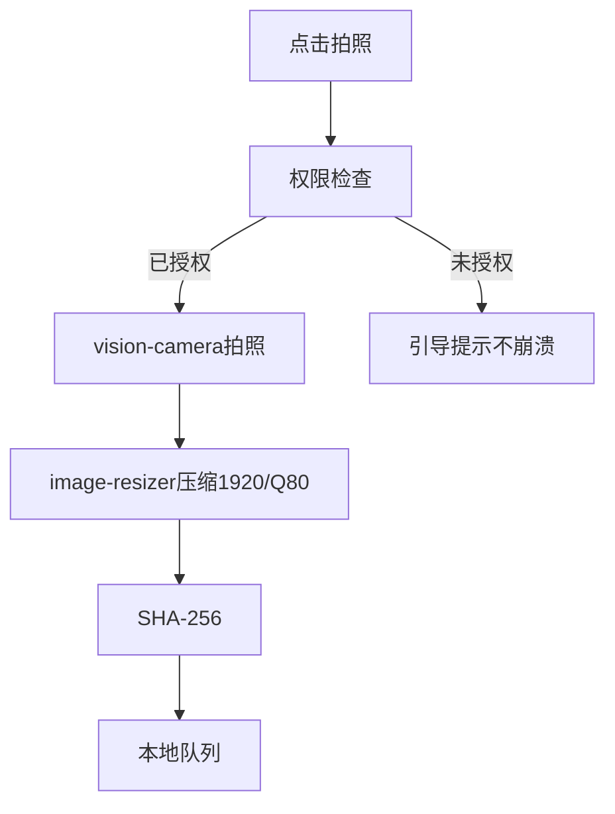
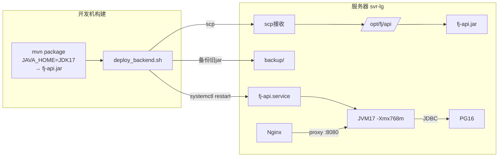

# WI-0002 增量设计 — 飞检现场管理系统产品化

> Work Item: WI-0002 | Workflow: requirement_change_path | Base: WI-0001 (PSV-0001, closed)
> 标准依据: specforge v1.1 §8.1 Delta / §8.2 Candidate

## 1. 增量设计概述

本设计是**增量设计**（Design Delta），**不修改** WI-0001 的 DD-1~DD-11。本次 CR 只做修复设计（DD-FIX-001~011）、部署架构（DD-DEPLOY-001~005）、Android 变更（DD-ANDROID-001~003）。

**约束来源**：3.6GB RAM（内存紧张）| sudo 受限（运维脚本化）| Maven 默认 JDK8（显式 JAVA_HOME）| 服务器无 Java（本地构建+scp）

```mermaid
graph TD
  subgraph WI1[WI-0001 Baseline 不变]
    DD5[DD-5 接口契约] DD9[DD-9 后续更正终态] DD8[DD-8 confirmed_at] DD3[DD-3 报告导出] DD2[DD-2 照片存储] DD7[DD-7 PG升级] DD1[DD-1 WatermelonDB]
  end
  subgraph WI2[WI-0002 增量]
    FIX[11 DD-FIX 修复Gap] DEPLOY[5 DD-DEPLOY 部署] AND[3 DD-ANDROID 安卓]
  end
  FIX --> DD5 & DD9 & DD8 & DD3 & DD2
  DEPLOY --> DD7
  AND --> DD1
```

---

## 2. 修复设计（11 个 Gap）

### DD-FIX-001: UserController 密码哈希脱敏（G1）
refs: [REQ-FIX-001] constrained_by: DD-4 BCrypt, NFR-10

**问题**: `UserController` 的 list/detail/create/update 直接返回 `ApiResponse<User>` Entity，JSON 含 `passwordHash`（BCrypt 哈希），泄露可被离线爆破。

**修复**: 新增 `UserResponseDTO`（排除 passwordHash），Controller 返回 DTO。Entity 的 `passwordHash` 加 `@JsonProperty(access=WRITE_ONLY)` 作第二道防线。

**接口定义**:
```typescript
interface UserResponseDTO { id:number; username:string; realName:string; email:string|null; phone:string|null; status:string; roles:string[]; createdAt:string; updatedAt:string }
// 注意: 无 passwordHash 字段
```

**影响文件**: 新增 `fj-system/dto/UserResponseDTO.java` + `UserResponseConverter.java`; 修改 `UserController.java` + `User.java`

---

### DD-FIX-002: OperationLogAspect 对接 @RequirePermission 越权留痕（G2）
refs: [REQ-FIX-002] constrained_by: §7.4 审计不可改删, REQ-2.3

**问题**: `OperationLogAspect` 只拦截 `@LogOperation`，未覆盖 `@RequirePermission`。越权请求返回 403 但无 OperationLog 审计记录。

**修复**: 在 `OperationLogAspect` 增加 `@AfterThrowing(pointcut="@annotation(requirePermission)")` advice，捕获权限类异常（code=1003 或 2000-2999），写入 action=ACCESS_DENIED 的 OperationLog（含链式哈希 log_hash）。审计写入失败降级为 WARN，不阻断主业务。

**接口定义**:
```typescript
interface OperationLogService { log(userId:number, action:string, targetType:string, targetId:number|null, content:string): void }
// Errors: LogWriteFailedError（降级为 WARN，不传播）
```

**影响文件**: 修改 `fj-common/audit/aspect/OperationLogAspect.java`

---

### DD-FIX-003: DD-9 联动检查实现 isReferencedByPublishedReport（G3）
refs: [REQ-FIX-003] constrained_by: DD-9 终态不可逆, §102.4 状态机守卫

**问题**: `IssueReviewService.isReferencedByPublishedReport()` 硬编码 `return false`。被已发布报告引用的作废问题应进入 CORRECTED 分支（DD-9），当前全部进入 VOIDED。

**修复**: （1）`ReportIssueSnapshotRepository` 新增 `countByIssueIdInPublishedReport` 查询（JOIN Report WHERE status=PUBLISHED）。（2）通过端口接口 `IssueReferenceChecker`（fj-common 定义，fj-report 实现）解耦跨模块依赖。（3）替换 `return false` 为真实查询。

**接口定义**:
```typescript
interface IssueReferenceChecker { isReferencedByPublishedReport(issueId:number): boolean }
// Errors: 无（查询返回 0 视为 false）
```

**影响文件**: 新增 `fj-common/port/IssueReferenceChecker.java` + `fj-report/service/ReportIssueReferenceChecker.java`; 修改 `ReportIssueSnapshotRepository.java` + `IssueReviewService.java`

---

### DD-FIX-004: 报告快照 photo_reference_snapshot 填充（G4）
refs: [REQ-FIX-004] constrained_by: DD-3 导出图片占位符, §101.14

**问题**: `ReportIssueSnapshot.photoReferenceSnapshot` 永远 null。导出引擎 `resolvePhotoPlaceholder()` 拿到 null → 渲染 1x1 透明占位 PNG，报告中照片全部缺失。

**修复**: `ReportSnapshotService.createSnapshot()` 时从源问题 Photo 关联提取压缩照片路径，序列化为 JSON 填入。无照片时存空数组 `{"photos":[],"photoCount":0}` 非 null。快照创建后不可修改（PUBLISHED 后冻结）。

**JSON 格式**: `{"photos":[{"photoId":N,"filePath":"...","fileHash":"sha256:...","capturedAt":"...","gpsStatus":"OBTAINED"}],"photoCount":N,"snapshotAt":"..."}`

**接口定义**:
```typescript
interface ReportSnapshotService { createSnapshot(reportId:number, issue:ProjectIssue, sortOrder:number): ReportIssueSnapshot }
// Errors: ReportAlreadyPublishedError（快照冻结后不可修改）; JsonProcessingException（降级为空数组）
```

**影响文件**: 修改 `fj-report/service/ReportSnapshotService.java`

---

### DD-FIX-005: RectificationDeadlineCalculator hours 起算点（G5）
refs: [REQ-FIX-005] constrained_by: 决策 D1-A（confirmedAt 精确起算）, DD-8, BR-1

**问题**: CRITICAL 的 `major_issue_deadline_hours` 起算点语义此前未与用户确认。

**修复**: 代码逻辑已正确（`confirmedAt.plusHours(hours)`）。本次为（1）Javadoc 明确标注决策 D1-A（从 confirmedAt 精确到秒起算，跨日自动处理，已确认问题 deadline 不回溯）。（2）补充 3 个单元测试：hours=24→精确+24h / hours=0→当日23:59:59 / 跨日 22:00+8h→次日06:00。

**影响文件**: 修改 `RectificationDeadlineCalculator.java`（Javadoc）; 新增 `RectificationDeadlineCalculatorTest.java`

---

### DD-FIX-006: 补充 @EnableJpaRepositories（G6）
refs: [REQ-FIX-006] constrained_by: DD-5 启动配置

**问题**: `FjApplication` 无 `@EnableJpaRepositories`，跨模块 Repository 扫描可能遗漏（编译期无法发现，运行时 NoSuchBeanDefinitionException）。

**修复**: `FjApplication` 添加 `@EnableJpaRepositories(basePackages={"com.fj.common.repository","com.fj.auth.repository","com.fj.system.repository","com.fj.project.repository","com.fj.inspection.repository","com.fj.issue.repository","com.fj.report.repository","com.fj.approval.repository","com.fj.export.repository","com.fj.sync.repository","com.fj.recommend.repository"})` + `@EntityScan(basePackages="com.fj")`。

**影响文件**: 修改 `fj-api/FjApplication.java`

---

### DD-FIX-007: 统一 BaseEntity 到 fj-common（G7）
refs: [REQ-FIX-007] constrained_by: DD-5 实体基类规范

**问题**: `com.fj.common.jpa.BaseEntity` 和 `com.fj.system.entity.BaseEntity` 两份完全相同的基类。fj-common 注释说因依赖方向不能复用，但实际 fj-common 是最底层模块，所有模块都依赖它。

**修复**: 删除 `fj-system/entity/BaseEntity.java`，全局替换 import 为 `com.fj.common.jpa.BaseEntity`。预估影响 15-20 个实体类（更新 import，字段不变）。

**影响文件**: 删除 `fj-system/entity/BaseEntity.java`; 修改所有 `extends BaseEntity` 的 import

---

### DD-FIX-008: ProjectAccessFilter 字段名对齐（G8）
refs: [REQ-FIX-008] constrained_by: DD-5 §5.1, REQ-2

**问题**: `ProjectAccessFilter` 读 `request.getParameter("projectId")`（camelCase），WI-0001 §5.4 设计写的是 snake_case。前端 TS 用 camelCase，与 Filter 一致。

**修复**: 保持 Filter 代码不变（camelCase 已正确），增加 snake_case 兼容（`request.getParameter("project_id")` 作为 fallback）。修正设计约定：URL query 参数统一 camelCase（与前端和 Jackson 一致），DB 列名 snake_case（由 @Column 映射）。

**影响文件**: 修改 `fj-auth/rbac/ProjectAccessFilter.java`

---

### DD-FIX-009: SQLCipher 降级确认与文档化（G9）
refs: [REQ-FIX-009] constrained_by: 决策 D2-B, DD-1, §7.5

**问题**: §7.5 要求 SQLCipher 加密，D2-B 确认 MVP 降级。当前 `package.json` 无 SQLCipher 依赖，WatermelonDB 用普通 SQLite。

**修复**: 无代码修改，为技术债登记。在 `fj-android/src/store/index.ts` 添加注释标注降级状态、升级路径（react-native-sqlcipher-storage + Android Keystore，schema 不变）、风险（Root 后数据可被读取，MVP 设备受控配发）。

**影响文件**: 修改 `fj-android/src/store/index.ts`（注释）

---

### DD-FIX-010: 相机/图片压缩原生模块实现（G10）
refs: [REQ-FIX-010] constrained_by: 决策 D3-A, DD-2（1920px/Q80/≤1MB）

**问题**: `fj-android/src/components/photo/` 有接口定义无原生实现，`package.json` 无相机库，无法实际拍照。

**修复**: 集成 `react-native-vision-camera` v4+ + `react-native-image-resizer`。实现 `VisionCameraPhotoService.captureAndCompress()`：权限检查→拍照→GPS获取（失败不阻断）→压缩1920px/Q80→SHA-256→写入本地 photo_upload_queue。



**接口定义**:
```typescript
interface PhotoCaptureService { captureAndCompress(): Promise<CapturedPhoto> }
// Errors: CameraPermissionDeniedError | CaptureFailedError | CompressFailedError | DiskFullError
interface CapturedPhoto { compressedFilePath:string; compressedFileHash:string; capturedAt:string; gpsStatus:'OBTAINED'|'NOT_OBTAINED'; fileSize:number }
```

**影响文件**: 修改 `package.json` + `AndroidManifest.xml`; 新增 `VisionCameraPhotoService.ts`; 修改 `components/photo/index.ts` + `screens/inspection/IssueEvidenceScreen.tsx`

---

### DD-FIX-011: poi-tl Word 报告模板创建（G11）
refs: [REQ-FIX-011] constrained_by: DD-3 模板占位符, REQ-17/19

**问题**: `PoiTlExportEngine` 引用 `templates/report_default_v1.docx` 但文件不存在，走 fallback 降级（生成最小 Word 骨架，非最终格式）。

**修复**: （1）创建真实 .docx 模板到 `fj-api/src/main/resources/templates/report_default_v1.docx`，含 `{{reportNo}}`/`{{title}}`/`{{#issues}}` 表格循环/`{{@photo_N}}` 图片占位。（2）`application-prod.yml` 设 `fj.export.template-fallback:false`（生产模板缺失 fail-fast，错误码 5001 TemplateNotFoundError）。

**接口定义**:
```typescript
interface ExportService { exportDraftPreview(reportId:number,userId:number): ExportFile; exportOfficialPublish(reportId:number,publisherId:number): ExportFile }
// Errors: TemplateNotFoundError(5001) | ExportRenderError | ExportTimeoutError | DiskFullError
```

**影响文件**: 新增 `templates/report_default_v1.docx`; 修改 `application-prod.yml`

---

## 3. 部署架构设计

### DD-DEPLOY-001: 部署拓扑（本地构建+scp+服务器运行）
refs: [REQ-DEPLOY-006, REQ-DEPLOY-002] constrained_by: 决策 D5-A, 服务器无Java/Maven, sudo受限



**部署流程**: mvn package(JDK17) → 备份远程旧jar → scp jar+config → systemctl restart → 验证 is-active。systemctl restart 需 sudo，如完全不可用则提示用户手动执行。

**接口**: `interface DeploymentService { buildJar(): {jarPath, jarSize}; deployToServer(): {remoteJarPath, backupPath}; restartService(): {status, startupTimeMs} }`
**Errors**: BuildFailedError | ScpFailedError | ServiceStartFailedError

**影响文件**: 新增 `scripts/ops/deploy_backend.sh` + `deploy/config/application-prod.yml` + `deploy/systemd/fj-api.service`

---

### DD-DEPLOY-002: systemd 服务设计
refs: [REQ-DEPLOY-003] constrained_by: 3.6GB RAM, 非root运行

**systemd unit 要点**: User=fj Group=fj WorkingDirectory=/opt/fj/api; JAVA_OPTS="-Xms512m -Xmx768m -XX:MetaspaceSize=128m -XX:MaxMetaspaceSize=192m -XX:+UseG1GC -XX:MaxGCPauseMillis=200 -XX:+HeapDumpOnOutOfMemoryError -XX:HeapDumpPath=/data/logs/jvm"; SPRING_PROFILES_ACTIVE=prod; EnvironmentFile=/opt/fj/api/.env(权限600); Restart=on-failure RestartSec=10 StartLimitBurst=3; TimeoutStartSec=90.

**故障恢复**: 进程crash→10s自动重启 / 连续3次失败→停止重启需人工 / 端口占用→启动失败需排查 / DB连接失败→90s超时标记failed。

**影响文件**: 新增 `deploy/systemd/fj-api.service` + `fj-api.env.template`

---

### DD-DEPLOY-003: Nginx 反向代理设计
refs: [REQ-DEPLOY-004] constrained_by: 4vCPU, 照片分片上传15m

**配置**: Web静态资源 root=/opt/fj/web SPA路由 try_files回退index.html; /api/ proxy_pass http://127.0.0.1:8080 proxy_read_timeout=120s; 照片 /internal/photos/ internal标记(X-Accel-Redirect鉴权后内部转发，Java不读大文件到内存); worker_processes=4 worker_connections=512 client_max_body_size=15m gzip on.

**接口**: `interface NginxConfig { serveWeb(root); proxyApi(upstream); internalPhotoRedirect(internalPath) }` Errors: NginxConfigError

**影响文件**: 新增 `deploy/nginx/fj.conf`

---

### DD-DEPLOY-004: 密钥管理策略（零硬编码）
refs: [REQ-DEPLOY-005, NFR-FIX-002] constrained_by: DD-4 JWT从配置读取, §7.1

**密钥注入**: JWT_SECRET/DB_PASSWORD/CORS → systemd EnvironmentFile(/opt/fj/api/.env 权限600 不提交Git) → application.yml 中 ${JWT_SECRET}/${DB_PASSWORD} 占位符。

**Fail-fast**: `SecurityConfigValidator @PostConstruct` 校验 JWT_SECRET 非空/非默认值/长度≥32，否则 IllegalStateException 启动中止。application-prod.yml 中密钥无默认值（必须注入）。

**影响文件**: 修改 `application.yml`(确认占位符); 新增 `application-prod.yml` + `.env.template` + `SecurityConfigValidator.java`; 修改 `.gitignore`

---

### DD-DEPLOY-005: PG16 安装流程设计（脚本化用户手动执行）
refs: [REQ-DEPLOY-001] constrained_by: DD-7 PG13→16全新安装, sudo受限

**脚本**: `install_pg16.sh`（幂等+交互确认）。流程: 检查现有版本→dnf install postgresql16-server→initdb→pg_hba.conf(scram-sha-256+peer)→postgresql.conf(shared_buffers=512MB effective_cache_size=1GB max_connections=50 work_mem=4MB timezone=Asia/Shanghai)→systemctl enable+start→CREATE USER fj_app + CREATE DATABASE fj_inspect。DB密码从环境变量读取不硬编码。

**JRE17**: `install_jre17.sh` → dnf install java-17-openjdk-headless + JAVA_HOME profile.d。

**接口**: `interface InstallScript { checkInstalled(): boolean; printSummary(): void; execute(): {success, version} }` Errors: InstallationFailedError | PermissionDeniedError

**影响文件**: 新增 `scripts/ops/install_pg16.sh` + `install_jre17.sh`

---

## 4. JVM 调优设计（3.6GB RAM）
refs: [NFR-FIX-001] constrained_by: 服务器3.6GB内存

**内存分配**: OS+服务0.5G + PG16 0.8G(shared_buffers=512MB) + JVM 1.0G(堆768m+Metaspace192m+线程栈+GC) + Nginx 0.1G + 缓冲1.2G = 3.6G

**JVM参数**: -Xms512m -Xmx768m -XX:+UseG1GC -XX:MaxGCPauseMillis=200 -XX:+HeapDumpOnOutOfMemoryError
**连接池**: HikariCP maximum-pool-size=10 minimum-idle=2
**缓存**: Caffeine max-size=10000 expire-minutes=30
**OOM应急**: JVM堆OOM→HeapDump+systemd自动重启; PG压力→max_connections=50; 系统OOM Killer→调Xmx; 磁盘不足→/data/temp清理+告警

---

## 5. 测试策略设计
refs: [REQ-TEST-001, REQ-TEST-002, REQ-E2E-001]

**单元测试**（JUnit5+Mockito，不依赖DB）:
| 测试类 | Gap | 用例 |
|--------|-----|------|
| RectificationDeadlineCalculatorTest | G5 | +24h精确/0默认当日/跨日 |
| IssueReviewServiceTest | G3 | 被引用→CORRECTED/未引用→VOIDED |
| OperationLogAspectTest | G2 | 越权→ACCESS_DENIED/日志失败→降级 |
| ReportSnapshotServiceTest | G4 | 有照片→JSON/无照片→空数组 |
| UserResponseConverterTest | G1 | Entity→DTO无passwordHash |

**集成测试**（@SpringBootTest+Testcontainers PG16）: 登录认证(admin)/项目权限校验(越权403+留痕)/日报提交→确认→入池/报告生成→发布→导出

**E2E**（手动REQ-E2E-001）: Web登录→创建项目→配置检查表→派发任务→Android登录→拍照取证→创建问题→提交日报→Web确认→报告生成→快照→审批→发布→导出Word

---

## 6. Android 架构变更

### DD-ANDROID-001: react-native-vision-camera 集成方案
refs: [REQ-FIX-010, REQ-ANDROID-001] constrained_by: 决策D3-A, DD-2

详见 DD-FIX-010。补充: vision-camera v4+ autolinking; AndroidManifest 添加 CAMERA+ACCESS_FINE_LOCATION 权限; build.gradle debug buildConfigField API_BASE_URL="http://10.0.2.2:8080/api"（模拟器映射宿主机）。

### DD-ANDROID-002: SQLCipher 降级技术债登记
refs: [REQ-FIX-009] constrained_by: 决策D2-B, DD-1, §7.5

技术债 TD-ANDROID-001: 当前未加密（普通SQLite）/ 风险中（Root后可读）/ 缓解（受控配发设备）/ 升级路径（react-native-sqlcipher-storage+Keystore，schema不变）。详见 DD-FIX-009。

### DD-ANDROID-003: Debug Build 配置
refs: [REQ-ANDROID-001] constrained_by: RN0.74

`npm run android` → gradle assembleDebug → app-debug.apk; minSdkVersion=28 targetSdkVersion=34; Metro bundler Debug热重载; 原生模块链接失败→构建报错不生成残缺APK。

---

## 7. 运维脚本设计
| 脚本 | 用途 | sudo |
|------|------|------|
| install_pg16.sh | PG16全新安装+initdb+创建库用户 | ✅用户手动 |
| install_jre17.sh | JRE17 headless安装 | ✅用户手动 |
| deploy_backend.sh | 本地构建+scp+重启 | restart需sudo |
| rollback_backend.sh | 回滚到上一版本jar | restart需sudo |

回滚脚本: 列出backup/中可用备份→选择→cp覆盖→systemctl restart→验证。回滚≤5min。

---

## 8. 回滚方案
refs: [NFR-FIX-004]

| 场景 | 操作 | 耗时 |
|------|------|------|
| jar启动失败 | rollback_backend.sh恢复旧jar | <5min |
| Flyway失败 | PG层面手动SQL回退 | 10-30min |
| 配置错误 | 恢复旧application-prod.yml | <2min |
| PG数据损坏 | pg_dump备份恢复 | 30-60min |

前置: 每次部署备份旧jar + PG安装后pg_dump全量备份 + 配置文件版本化。

---

## 9. 设计追溯

### DD-FIX → WI-0001 追溯
| DD-FIX | Gap | 追溯 | 模块 |
|--------|-----|------|------|
| 001 | G1 | REQ-1,NFR-10 | fj-system |
| 002 | G2 | REQ-2,§7.4 | fj-common,fj-auth |
| 003 | G3 | DD-9,REQ-11/14 | fj-issue,fj-report |
| 004 | G4 | REQ-16,DD-3 | fj-report,fj-export |
| 005 | G5 | REQ-13,BR-1,DD-8 | fj-issue |
| 006 | G6 | DD-5 | fj-api |
| 007 | G7 | DD-5 | fj-common,fj-system |
| 008 | G8 | REQ-2,DD-5§5.1 | fj-auth |
| 009 | G9 | §7.5,REQ-8,DD-1,D2-B | fj-android |
| 010 | G10 | REQ-9,REQ-8,DD-2,D3-A | fj-android |
| 011 | G11 | REQ-17/19,DD-3 | fj-export |

**30/30 需求全覆盖**（11 FIX + 6 DEPLOY + 4 RUNTIME + 2 ANDROID + 2 TEST + 1 E2E + 4 NFR）

---

## 架构属性自检
| 属性 | 结果 | 说明 |
|------|------|------|
| A1单一职责 | ✅ | 每个DD只修复一个Gap/设计一个组件 |
| A2显式依赖 | ✅ | Mermaid含全部箭头;跨模块通过端口接口(IssueReferenceChecker) |
| A3可替换性 | ✅ | 核心组件有interface定义(PhotoCaptureService/ExportService/DeploymentService) |
| A4失败可观测 | ✅ | 每个interface列Errors;外部调用有降级策略(审计降级/JSON降级/故障恢复表) |
| A5边界明确 | ✅ | Out of Scope + Assumptions完整 |

---

## Out of Scope
- 不修改WI-0001 DD-1~DD-11 / 不新增用户可见功能 / 不做SQLCipher加密(D2-B) / 不做HTTPS证书自动签发(MVP技术债) / 不做多机Docker K8s / 不做高测试覆盖率(仅核心Service+Gap) / 不做照片水印原生渲染(MVP元数据记录GPS) / 不做报告变更版本追溯(V1.1) / 不做统计看板(V1.1) / 不做AI/RAG

## Assumptions
- WI-0001首次运行暴露隐性bug≤20个(不含11个已知Gap) / 用户能及时执行sudo脚本 / svr-lg部署期间可用 / Android设备API28+可用 / 构建机有JDK17 / fj-issue不依赖fj-report(否则DD-FIX-003可简化) / Testcontainers开发机可用 / .docx模板可用Word/LibreOffice制作 / Flyway PG13→16兼容性问题可调试解决

## 设计决策总数: 19（11 DD-FIX + 5 DD-DEPLOY + 3 DD-ANDROID）