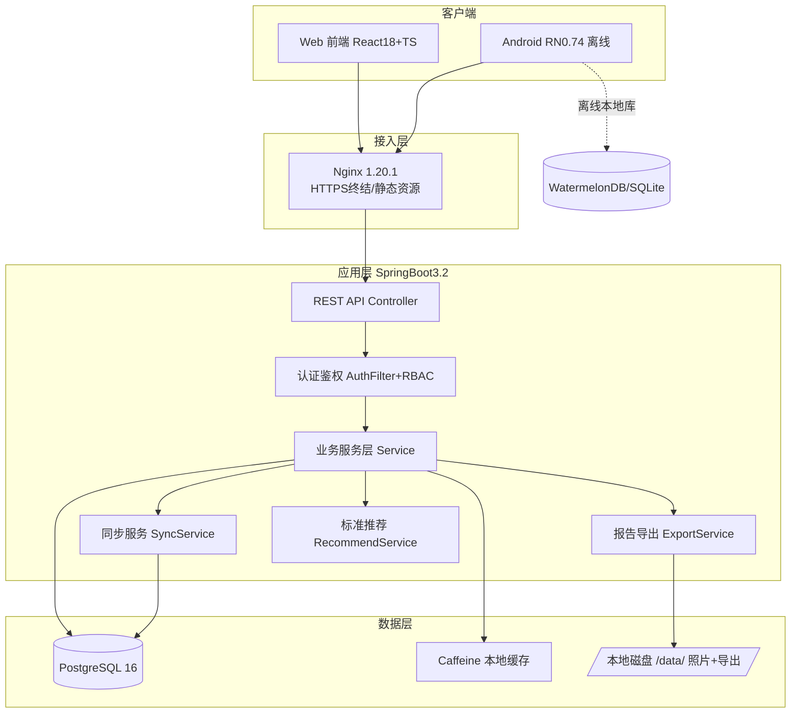
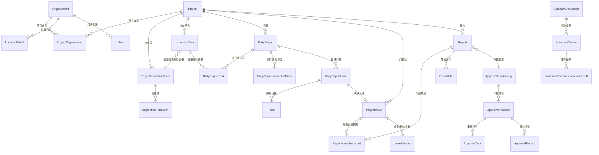

# 飞检现场管理系统 — 设计文档（候选）

> Work Item: WI-0001
> Workflow: feature_spec / requirement_change_path
> Base Spec Version: PSV-0001
> 唯一业务输入: `doc/飞检现场管理系统_业务逻辑定稿_v1.14_最终干净版_开发输入.md`
> 字段基线详见 §101，状态机详见 §102，非功能基线详见 §103。本文档不重复抄录，仅做技术决策与引用。

---

## 1. 概述

本系统为第三方飞检公司提供现场检查管理平台，覆盖项目→检查表→任务→现场→日报→问题池→报告→审批→发布全链路。系统为 Web + Android 双端，Android 端必须支持完整离线作业。MVP 范围为业务文档 §105.1 阶段 1-7。

- 需求来源：`candidates/project/modules/core/requirements.candidate.md`（REQ-1 ~ REQ-21 + NFR-1 ~ NFR-11）
- 用户规模：20-50 用户，10-20 并发（intake §2）
- 数据量基线：单项目 500 任务 / 3000 问题 / 10000 照片 / 200 报告（§103.2）

---

## 2. 系统架构

### 2.1 架构总览



**部署拓扑**：单机裸机部署（svr-lg），Nginx + SpringBoot + PostgreSQL 同机。无 Redis、无 Docker。

### 2.2 后端模块划分（Maven 多模块）

| 模块 | 职责 | 我是 X |
|------|------|--------|
| `fj-common` | 公共 DTO、枚举、异常、工具 | 我是公共基础库 |
| `fj-auth` | 认证、JWT、RBAC 权限 | 我是认证授权层 |
| `fj-system` | 用户、组织、角色、字典管理 | 我是基础数据层 |
| `fj-project` | 项目、检查表、任务、位置、设备 | 我是项目配置层 |
| `fj-inspection` | 日报、日报问题、受检单位、照片 | 我是现场业务层 |
| `fj-issue` | 项目问题池、问题关联、问题状态流转 | 我是问题管理层 |
| `fj-report` | 报告、问题快照、版本管理 | 我是报告生产层 |
| `fj-approval` | 审批流配置、实例、任务、记录 | 我是审批引擎 |
| `fj-export` | poi-tl 报告导出、ExportFile 管理 | 我是导出引擎 |
| `fj-sync` | 安卓同步协议、server_seq、幂等推送 | 我是同步服务 |
| `fj-recommend` | 标准推荐规则引擎（V1 三层匹配） | 我是推荐引擎 |
| `fj-api` | SpringBoot 启动模块，聚合所有 Controller | 我是 API 聚合层 |

### 2.3 Web 前端模块划分

| 模块 | 职责 |
|------|------|
| `src/auth` | 登录、Token 管理、路由守卫 |
| `src/system` | 用户/组织/角色/字典管理页面 |
| `src/project` | 项目配置、检查表编制 |
| `src/task` | 任务派发、任务看板 |
| `src/report-confirm` | 日报确认与问题复核工作台 |
| `src/issue-pool` | 项目问题池管理 |
| `src/report` | 报告生产工作台、快照编辑 |
| `src/approval` | 审批处理、审批记录查看 |
| `src/shared` | 公共组件（表格、表单、文件上传、权限指令） |

### 2.4 安卓端模块划分

| 模块 | 职责 |
|------|------|
| `src/store` | WatermelonDB schema、model、migration |
| `src/api` | 网络层、同步引擎（push/pull/照片上传） |
| `src/screens/today` | 今日检查 |
| `src/screens/inspection` | 检查中、问题取证页 |
| `src/screens/issue-basket` | 问题篮子自查 |
| `src/screens/submit` | 提交今日检查成果 |
| `src/screens/revise` | 退回问题修改 |
| `src/components/photo` | 拍照、压缩、水印、GPS |
| `src/offline/recommend` | 离线标准推荐 |

---

## 3. 技术选型决策

### DD-1 安卓离线数据库选型 — WatermelonDB
refs: [REQ-8, REQ-9, NFR-9, NFR-11]
constrained_by: intake§7 安卓=React Native 0.74+, 无外网时完整离线

**选项对比**：

| 维度 | WatermelonDB | react-native-sqlite-storage |
|------|-------------|---------------------------|
| 离线同步内置支持 | ✅ 内置 push/pull sync adapter | ❌ 需自建 |
| 响应式查询 | ✅ withObservables 自动刷新 UI | ❌ 手动刷新 |
| 懒加载（万级照片） | ✅ 内置 lazy loading | ❌ 需手动分页 |
| 学习曲线 | 中（专有 schema/model） | 低（原生 SQL） |
| 灵活性 | 受框架约束（ID 策略/记录格式） | 高（完全控制） |
| 社区活跃度 | 高（为离线优先设计） | 中 |

**决策：选 WatermelonDB。**

**理由**：
1. 本项目核心难点就是离线同步（impact_analysis §3.1 标为最高风险）。WatermelonDB 内置 sync 模型（push changed records / pull since last_sync）与本项目 server_seq 增量协议天然契合。
2. 万级照片懒加载避免 OOM（intake§8 内存偏紧，Android 设备同样受限）。
3. 响应式查询让"问题篮子"页面随本地保存自动刷新，减少手写状态管理。
4. WatermelonDB 本地使用随机 ID（作为 client_uuid），push 后服务端分配正式 ID 并回写，天然满足 §107.4 幂等推送要求。

**本地 schema 设计原则**：
- 每张本地表增加 `server_id`（服务端正式 ID，同步后回填）、`sync_status`（new/updated/synced/conflict）、`server_seq`（最后同步序号）。
- WatermelonDB 的 `_status`（created/updated/deleted）和 `_changed` 字段用于追踪本地变更。
- 照片文件路径单独存储，不嵌入数据库。

**与 server_seq 增量同步的配合**：
- Pull：`GET /api/v1/sync/pull?since={last_server_seq}` → 返回变更记录 + 新的 `current_server_seq`。
- Push：`POST /api/v1/sync/push`，body 含变更记录数组，每条带 `client_uuid`。
- 同步后更新本地 `ClientSyncState.last_server_seq`（§101.28）。

**Errors**: `SyncConflictError` | `SyncVersionTooOldError` | `NetworkTimeoutError` | `LocalSchemaMigrationError`

### DD-2 照片压缩与本地存储方案
refs: [REQ-9, REQ-16, NFR-5, NFR-9]
constrained_by: §103.4 长边1600-1920px/质量75-85/≤1MB; 服务器磁盘剩23G

**目录规划**：
```
/data/photos/{project_id}/{yyyy-mm}/{daily_report_id}/
  ├── {photo_id}_compressed.jpg      # 压缩图（必存）
  ├── {photo_id}_original.jpg        # 原图（项目配置 retain_original=true 时存）
  └── {photo_id}_watermarked.jpg     # 水印图（展示用，可选）
/data/exports/                       # 报告导出文件
/data/temp/                          # 临时文件（定期清理）
```

**压缩参数**（§103.4 V1 裁决）：
- 长边：1920px（取上限保证清晰度）
- 质量：80（JPEG）
- 目标：≤ 1MB/张
- 安卓端压缩使用 `react-native-image-resizer`，压缩后再上传，减少传输量。

**哈希策略**：
- 压缩图：SHA-256 必填（`compressed_file_hash`）。
- 原图：SHA-256（`original_file_hash`），保留原图时必填。
- 哈希在服务端接收文件后重新计算校验，防止传输损坏。

**原图保留策略**：
- 项目配置项 `retain_original_photos`（默认 `true`，证据要求强的项目）。
- 磁盘不足时可降级为仅保留压缩图（管理员操作 + OperationLog 留痕）。

**照片迟到同步规则**（§60.1）：
- 提交前已有 Photo 元数据 + `client_photo_uuid`：文件迟到上传允许绑定，标记 `is_late_uploaded=true`。
- 锁定后新增照片元数据：不得直接改写锁定日报，走补充照片流程并留痕。
- 已发布报告的迟到照片：必须通过报告变更生成新版本。

**Errors**: `PhotoCompressFailedError` | `PhotoHashMismatchError` | `DiskFullError` | `PhotoLateSyncBlockedError`

### DD-3 报告导出引擎实现
refs: [REQ-17, REQ-19, NFR-5]
constrained_by: §101.16 ExportFile, §103 发布固化不可覆盖

**poi-tl 模板设计原则**：
- 模板文件存放：`/data/templates/report_{report_type}_v{tpl_version}.docx`。
- 占位符语法：`{{field_name}}` 文本占位，`{{@image_ref}}` 图片占位，`{{#list}}...{{/list}}` 列表循环（问题清单）。
- 模板与代码解耦：模板修改不需要重新编译，只需替换文件。
- 渲染数据由 `ExportService` 从 `ReportIssueSnapshot`（§101.14）+ `Report.body_snapshot` 组装。

**图片占位符渲染机制**：
- poi-tl 的 `PictureRenderData` 支持图片流渲染。
- 每个照片占位符对应 `ReportIssueSnapshot.photo_reference_snapshot` 中的照片路径。
- 渲染前验证照片文件存在且 hash 匹配，缺失则渲染占位提示文字（不影响导出完成，但标记 warning）。

**发布固化文件不可覆盖**：
- 版本化路径：`/data/exports/report/{report_id}/v{report_version}_{published_at_yyyyMMddHHmmss}_official.docx`。
- 路径含 report_version + 时间戳，物理上不可重复。
- 发布固化导出失败时：报告状态保持 `审批通过`，不进入 `已发布`，ExportFile 记录 `export_status=失败` + `error_message`。

**ExportFile 记录**（§101.16）：每次导出（草稿预览 / 发布固化 / 手工补导出）均生成一条 ExportFile 记录，含 `file_path`、`file_hash`、`export_scene`、`is_official_publish_file`。

**Errors**: `TemplateNotFoundError` | `ExportRenderError` | `ExportTimeoutError` | `PhotoMissingInExportWarning`(非阻断)

### DD-4 认证方案 — JWT
refs: [REQ-1, REQ-2, NFR-10]
constrained_by: 服务器内存3.6G偏紧(intake§8.1); 不引入Redis; 安卓需离线鉴权

**决策：JWT（无状态令牌），不使用 Session。**

**理由**：
1. **内存优先**：Session 需要服务端存储（内存或 Redis），3.6GB 内存下不宜引入 session 存储。JWT 无状态，服务端不存 session。
2. **安卓离线友好**：JWT 可缓存到本地，离线时不需要联网验证即可判断是否过期。Session 必须每次请求验证服务端。
3. **无 Redis 依赖**：JWT 自校验，不依赖共享 session 存储，契合"不引入 Redis"约束。
4. 撤销问题（JWT 无法主动失效）通过"短 access_token + refresh_token + 黑名单缓存（Caffeine，TTL=token剩余有效期）"解决。

**Token 机制**：
```
access_token:  有效期 30 分钟，每次请求携带于 Authorization: Bearer
refresh_token: 有效期 7 天，仅用于刷新 access_token
签名算法: HS256，密钥从配置文件读取（不硬编码，符合安全基线）
```

**Token 刷新流程**：
1. access_token 过期 → 客户端用 refresh_token 调 `POST /api/v1/auth/refresh`。
2. 服务端校验 refresh_token 有效性 + 用户 status=启用。
3. 签发新 access_token（refresh_token 滑动续期或不续期，V1 不续期，过期需重新登录）。
4. 旧 access_token 加入 Caffeine 黑名单（TTL=剩余有效期）。

**安卓端离线鉴权**：
- Token 存储于 Android Keystore（`react-native-keychain`），不入普通 SharedPreferences。
- 离线时：本地校验 access_token 是否过期（解析 JWT payload 的 exp）。
- 过期且有网络：自动刷新。过期且无网络：提示"登录已过期，请联网后重新登录"，但**不丢失本地草稿数据**（本地数据可继续查看和编辑，仅提交时需重新认证）。
- 本地数据加密见 §7.5。

**Errors**: `InvalidCredentialsError` | `TokenExpiredError` | `TokenRevokedError` | `UserDisabledError`

### DD-5 接口契约规范
refs: [REQ-1~21 全覆盖, NFR-1, NFR-2]
constrained_by: intake§10 接口契约缺失需design补; §103.6 API版本必带

**详见 §5（接口设计）章节。**

### DD-6 安卓同步协议
refs: [REQ-8, REQ-9, REQ-10, NFR-9, NFR-11]
constrained_by: §107.4 文本批量同步+照片独立; §101.28 ClientSyncState/SyncBatch; §62 冲突仅3类

**详见 §6（安卓离线同步协议）章节。**

### DD-7 PostgreSQL 升级方案（13 → 16）
refs: [REQ-1~21, NFR-8]
constrained_by: intake§8 现有PG13.23; 技术栈定稿PG16

**⚠️ 需用户确认**：现有 PostgreSQL 13 中是否有需要保留的数据（实施前必须询问）。

**升级步骤**（假设现有数据需保留）：
```
1. 备份: pg_dumpall > /backup/pg13_full_backup_$(date +%Y%m%d).sql
2. 停服务: systemctl stop postgresql
3. 卸载 PG13: dnf remove postgresql-server postgresql
4. 安装 PG16: dnf install postgresql16-server (需先启用 PGDG repo 或 AppStream)
5. 初始化: /usr/pgsql-16/bin/initdb -D /var/lib/pgsql/16/data
6. 恢复: psql -f /backup/pg13_full_backup_*.sql
7. 启动: systemctl start postgresql-16 && systemctl enable postgresql-16
8. 验证: psql -c "SELECT version();"
```

**pg_hba.conf 认证配置**：
```
# TYPE  DATABASE  USER  ADDRESS       METHOD
local   all       all                 peer          # 本地 Unix socket，OS 用户映射
host    all       all   127.0.0.1/32  scram-sha-256 # 本机 TCP，强哈希
host    all       all   ::1/128       scram-sha-256 # IPv6 本机
# 不配置外部 host（PG 只监听 127.0.0.1，Nginx 反代到后端）
```
- 当前是 md5，升级到 PG16 后改用 scram-sha-256（PG16 默认）。
- local 连接用 peer，避免密码明文配置文件。

**如现有数据库无数据需保留**（全新安装）：
- 直接卸载 PG13 → 安装 PG16 → initdb → 创建业务库和用户即可，更简单。

**Errors**: `PGBackupFailedError` | `PGRestoreFailedError` | `PGVersionMismatchError`

### DD-8 confirmed_at / locked_at 字段语义
refs: [REQ-11, REQ-12, REQ-13, BR-3]
constrained_by: §101.9 DailyReport 字段, §102.2 确认即锁定

**裁决**：
| 字段 | 语义 | 记录时刻 |
|------|------|---------|
| `confirmed_at` | 审批通过的业务动作时间（审批人点击"确认"的时刻） | 审批人操作时刻 |
| `confirmed_by` | 执行确认的审批人 | — |
| `locked_at` | 日报锁定持久化的事务提交时间 | 数据库事务 commit 时刻 |
| `locked_by` | 锁定操作人（通常=confirmed_by） | — |

**说明**：在"确认即锁定"裁决下（§102.2），确认动作和锁定持久化在同一个事务中发生，`confirmed_at` 和 `locked_at` 几乎同时（差毫秒级）。但两者语义不同：
- `confirmed_at` 是业务语义（审批通过时刻），用于整改期限计算起点（BR-1）。
- `locked_at` 是技术语义（数据不可变时刻），用于编辑锁释放和快照边界判断。

**实现**：两者在同一 `@Transactional` 方法中写入。`confirmed_at` 由 Service 层在审批通过逻辑中设置，`locked_at` 由事务提交前设置。

### DD-9 项目问题池"后续更正"是否终态
refs: [REQ-11, REQ-14, BR-3]
constrained_by: §101.11 ProjectIssue status, §102.4 项目问题池状态机

**裁决：是终态。** `后续更正` 状态后，问题不再回到 `有效`。

**理由**：
1. 原始事实已被已发布报告引用（§102.4 守卫条件：已进入已发布报告），必须保留更正追溯。
2. 若允许回到"有效"，会导致已发布报告的问题快照与问题池状态不一致。
3. 更正通过发布新版本报告来纠正，不回退原始问题状态。
4. `后续更正` 状态下 `correction_status`（未更正/已更正/无需更正）跟踪更正进度，更正完成后 `correction_status=已更正`，但 `status` 仍保持 `后续更正`。

### DD-10 照片质量检测 V1 能力边界
refs: [REQ-9, NFR-9]
constrained_by: §105.1 MVP范围; §107.6 AI不进MVP

**裁决：V1 只做规则化提示，不做图像分析。**

**V1 能力（规则化提示）**：
- 照片数量检查：每条问题是否满足项目配置的最低照片数量（如至少 1 张全景 + 1 张细节）。
- 手动标记类型检查：是否缺少全景/细节/补充组合。
- GPS 缺失提醒：gps_status=未获取时提示。

**V1 不做**：
- 模糊检测、过暗/过曝检测、图像内容识别（需 AI 模型）。
- 这些能力进入 V2，届时引入轻量图像分析模型。

### DD-11 标准推荐 V1 实施范围
refs: [REQ-4, REQ-9]
constrained_by: §69 三层规则, §107.4 推荐评分权重, §107.6 AI/RAG不进MVP

**裁决：进 MVP，但只做 §69 三层规则匹配，不做 AI/RAG。**

**V1 三层规则**（§69.1-69.3）：
1. **检查项绑定**（+50 分）：表内问题优先使用来源检查项绑定的标准条款。
2. **分类匹配**（专业 +15、分类 +10+10、设备类型 +10）：按专业/一级分类/二级分类/设备类型筛选候选条款。
3. **关键词匹配**（每个 +5，最多 +20）：从问题描述提取关键词与标准条款 keyword_tags 匹配。

**推荐时机**（§107.4）：创建问题、关键字段变更、用户手动"重新推荐"时调用。
**推荐结果**：保存 `StandardRecommendationResult`（§101.26），含 `score`、`reason_snapshot`、`standard_library_version`。
**离线推荐**：安卓端使用本地缓存的标准库执行同样三层规则，标记"离线推荐"。

**V1 不做**：AI 匹配、RAG 检索、NLP 语义匹配、历史相似问题 NLP 分析。

---

## 4. 数据库设计

### 4.1 Schema 概要

28 个核心对象的完整字段定义见业务文档 §101.1-§101.28，本文档不重复。以下给出表关系图：



**设计原则**：
- 所有表使用 `BIGINT` 自增主键（`*_id`）。
- 业务编号字段（如 `issue_no`、`report_no`）单独建唯一索引。
- 所有涉及快照的字段（`*_snapshot`、`*_name_snapshot`）存储快照值，不依赖外键 JOIN（§103 "历史报告不受基础数据改名影响"）。
- `server_seq` 字段：所有需要同步的表增加 `server_seq BIGINT`，由服务端在事务提交时单调递增分配（使用序列），用于增量同步。
- `client_uuid` 字段：安卓端创建的记录带 `client_uuid UUID`，用于幂等推送去重，建唯一索引。
- 软删除：用 `status` 字段表达（启用/停用、有效/已删除），不做物理删除（审计要求）。

### 4.2 PostgreSQL 升级方案

详见 DD-7。

### 4.3 内存调优（针对 3.6GB 服务器）

**总内存分配**：
```
OS + 系统服务:     ~0.5 GB
PostgreSQL 16:     ~0.8 GB
JVM (SpringBoot):  ~1.0 GB (堆 768m + 非堆 ~250m)
Nginx:             ~0.1 GB
预留缓冲:          ~1.2 GB
合计:              ~3.6 GB
```

**JVM 参数**：
```bash
# /etc/systemd/system/fj-api.service
JAVA_OPTS="-Xms512m -Xmx768m -XX:MetaspaceSize=128m -XX:MaxMetaspaceSize=192m -XX:+UseG1GC -XX:MaxGCPauseMillis=200 -XX:+HeapDumpOnOutOfMemoryError -XX:HeapDumpPath=/data/logs/jvm"
```
- `-Xmx768m`：堆上限 768MB，给 PG 和系统留空间。
- G1GC：适合中等堆，控制 GC 停顿。
- OOM 时自动 dump，便于排查。

**PostgreSQL 16 参数**（`postgresql.conf`）：
```ini
shared_buffers = 512MB          # PG 共享内存缓冲池
effective_cache_size = 1GB      # 告诉优化器可用缓存总量（含 OS page cache）
work_mem = 4MB                  # 单查询排序/哈希内存
maintenance_work_mem = 64MB     # VACUUM/CREATE INDEX 内存
max_connections = 50            # 10-20 并发，留余量
wal_buffers = 16MB
checkpoint_completion_target = 0.9
random_page_cost = 1.1          # SSD 优化
```

**Nginx 参数**：
```nginx
worker_processes 4;          # = CPU 核数
worker_connections 512;      # 10-20 用户，足够
client_max_body_size 15m;    # 单张压缩照片 ≤1MB，分片上传设 15m
keepalive_timeout 65;
gzip on;
gzip_types application/json text/css application/javascript;
```

**风险缓解**：如运行期 OOM，优先检查是否有大结果集查询未分页，其次考虑扩容到 8GB 内存（不换技术栈）。

---

## 5. 接口设计

### 5.1 REST 规范

**URL 命名**：
- 资源用名词复数：`/api/v1/projects`、`/api/v1/daily-reports`、`/api/v1/project-issues`
- 层级最多 2 级：`/api/v1/projects/{id}/tasks`，不嵌套更深。
- 动作用子资源表达：`POST /api/v1/daily-reports/{id}/submit`（提交日报）。

**HTTP 方法语义**：
| 方法 | 语义 | 示例 |
|------|------|------|
| GET | 查询（幂等） | `GET /api/v1/projects` |
| POST | 创建/动作 | `POST /api/v1/daily-reports` |
| PUT | 整体更新 | `PUT /api/v1/projects/{id}` |
| PATCH | 局部更新 | `PATCH /api/v1/daily-report-issues/{id}` |
| DELETE | 软删除 | `DELETE /api/v1/photos/{id}` |

### 5.2 统一响应结构

```typescript
interface ApiResponse<T> {
  code: number;        // 0=成功，非0=错误码
  message: string;     // 人类可读消息
  data: T | null;      // 业务数据
  timestamp: string;   // ISO 8601
  trace_id: string;    // 链路追踪ID（用于排障）
}

interface PageResponse<T> extends ApiResponse<T> {
  data: {
    items: T[];
    total: number;
    page: number;
    page_size: number;
  };
}
```

### 5.3 错误码体系

| 范围 | 类别 | 示例 |
|------|------|------|
| 0 | 成功 | — |
| 1000-1999 | 通用错误（参数/认证/权限） | 1001=参数校验失败, 1002=未认证, 1003=无权限, 1004=Token过期 |
| 2000-2999 | 业务校验错误 | 2001=日报完整性校验失败, 2002=问题状态非法, 2003=审批配置不匹配 |
| 3000-3999 | 状态机错误 | 3001=状态转换非法, 3002=对象已锁定, 3003=报告已发布 |
| 4000-4999 | 同步错误 | 4001=client_uuid重复(幂等忽略), 4002=server_seq冲突, 4003=本地版本过低 |
| 5000-5999 | 系统错误 | 5001=导出失败, 5002=磁盘空间不足, 5003=数据库错误 |

**错误响应示例**：
```json
{
  "code": 2001,
  "message": "日报完整性校验失败：缺少实际受检单位",
  "data": {
    "violations": [
      {"field": "inspected_parties", "rule": "at_least_one"}
    ]
  },
  "timestamp": "2026-07-01T10:00:00Z",
  "trace_id": "abc-123"
}
```

### 5.4 分页/筛选/排序

**分页**：
```
GET /api/v1/project-issues?page=1&page_size=20
```

**筛选**（query 参数）：
```
GET /api/v1/project-issues?project_id=P001&status=有效&severity=重大
GET /api/v1/daily-reports?inspector_id=U001&date_from=2026-07-01&date_to=2026-07-31
```

**排序**：
```
GET /api/v1/project-issues?sort=-created_at,severity   # -前缀=降序
```

**全文搜索**：仅对描述类字段做 `ILIKE` 模糊匹配（V1 不引入全文检索引擎）。关键词搜索用于标准条款库和问题搜索。

---

## 6. 安卓离线同步协议

### 6.1 本地数据库设计（WatermelonDB）

**本地表**（对应服务端实体，增加同步字段）：
```
daily_reports       (server_id, sync_status, server_seq, + 业务字段)
daily_report_issues (server_id, client_uuid, sync_status, ...)
photos              (server_id, client_uuid, local_file_path, sync_status, ...)
inspection_tasks    (server_id, sync_status, ...)
project_issues      (server_id, sync_status, ...)
notifications       (server_id, sync_status, is_read, ...)
standard_clauses    (server_id, library_version, ...)  # 离线标准库缓存
```

**同步元数据表**：
```
client_sync_state (user_id, device_id, project_id, last_server_seq, last_push_batch_id)
sync_queue        (待推送的变更记录队列)
photo_upload_queue(待上传的照片文件队列，独立于文本同步)
```

### 6.2 增量同步协议（server_seq）

**Pull（服务端 → 客户端）**：
```http
GET /api/v1/sync/pull?project_id=P001&since=12345&entity_types=daily_reports,project_issues
```
**响应**：
```json
{
  "code": 0,
  "data": {
    "current_server_seq": 12500,
    "changes": {
      "daily_reports": [{"op": "upsert", "server_id": 101, "server_seq": 12346, "fields": {...}}],
      "project_issues": [{"op": "upsert", "server_id": 201, ...}, {"op": "delete", "server_id": 202}]
    },
    "notifications": [{"server_id": 301, ...}]
  }
}
```
- 服务端维护全局递增 `server_seq` 序列，每次数据变更分配新序号。
- 客户端拉取后更新 `last_server_seq = current_server_seq`。
- `entity_types` 可选，指定只同步部分实体类型（减少传输量）。

### 6.3 推送幂等（client_uuid）

**Push（客户端 → 服务端）**：
```http
POST /api/v1/sync/push
Content-Type: application/json

{
  "client_batch_uuid": "batch-uuid-001",
  "base_server_seq": 12345,
  "project_id": "P001",
  "changes": {
    "daily_report_issues": [
      {
        "client_uuid": "issue-uuid-001",
        "op": "upsert",
        "fields": {"issue_description": "...", "severity": "重大", ...}
      }
    ],
    "photos": [
      {
        "client_uuid": "photo-uuid-001",
        "op": "upsert",
        "fields": {"photo_type": "全景", "captured_at": "...", "compressed_file_hash": "..."}
        // 照片文件通过单独的分片上传接口传输
      }
    ]
  }
}
```

**幂等机制**：
- `client_batch_uuid`：服务端检查 `SyncBatch` 表（§101.28），若已存在且 status=成功，直接返回原结果（幂等忽略）。
- `client_uuid`（单条记录）：服务端检查该 UUID 是否已存在，存在则按 upsert 更新（同一 client_uuid 的多次推送视为同一条记录的更新）。
- `base_server_seq`：用于冲突检测（见 §6.5）。

**响应**：
```json
{
  "code": 0,
  "data": {
    "sync_batch_id": "SB001",
    "status": "success",
    "server_seq_after": 12510,
    "results": {
      "daily_report_issues": [
        {"client_uuid": "issue-uuid-001", "server_id": 501, "status": "created"}
      ]
    }
  }
}
```

### 6.4 照片同步协议

照片文件独立于文本同步，使用分片上传：

```http
# 初始化分片上传
POST /api/v1/photos/upload/init
{"client_photo_uuid": "photo-uuid-001", "project_id": "P001", "total_size": 1048576, "file_hash": "sha256..."}

# 响应 upload_id + chunk_size

# 上传分片（并发 2-3 个）
POST /api/v1/photos/upload/chunk
upload_id=xxx, chunk_index=0, chunk_data=<binary>

# 完成上传
POST /api/v1/photos/upload/complete
{"upload_id": "xxx", "client_photo_uuid": "photo-uuid-001"}
```

- 安卓端维护 `photo_upload_queue`，支持断点续传。
- 单设备默认 2-3 个分片并发上传（§103.2）。
- 失败自动重试，指数退避（1s → 2s → 4s → 8s），最多 5 次。
- 照片元数据（client_uuid、hash、type）随文本 Push 同步，文件异步上传。
- 文件上传完成后回写 `Photo.sync_status=文件已同步`、`uploaded_at`。

### 6.5 冲突检测与处理

**冲突检测**（§62、§101.28 同步契约）：
- Push 时服务端检查 `base_server_seq` 之后该对象是否被他人修改（`server_seq > base_server_seq` 且 `object_id` 匹配）。
- 若检测到冲突，返回 `4002 server_seq冲突`，响应中包含服务端当前版本数据。

**V1 仅处理 3 类冲突**（§62）：
1. **同一问题重复提交**：按 `client_uuid` 幂等处理，返回已有记录。
2. **服务端日报已退回但本地仍在提交**：返回 `4003`，提示用户"日报已被退回，请进入退回修改"。
3. **服务端任务已取消但本地仍在编辑**：返回 `4004`，禁止继续提交，保留本地草稿。

**处理方式**：
- V1 不做自动合并（§103.1 弱网冲突规则第4条）。
- 展示本地版本、服务端版本、冲突字段，用户人工选择保留哪一版。
- 已锁定日报和已发布报告不得被离线同步覆盖（§103.1 第5条）。

**Errors**: `SyncBatchConflictError` | `ReportLockedException` | `TaskCancelledException`

---

## 7. 认证与安全设计

### 7.1 认证方案

详见 DD-4。补充：
- 登录失败不区分"用户名错误"和"密码错误"（REQ-1.2），统一返回 `1001 凭据无效`。
- 密码哈希：BCrypt（cost=12），Spring Security 默认。
- 登录限流：同一 IP 5 次失败后锁定 5 分钟（Caffeine 缓存计数器）。

### 7.2 RBAC 权限模型

**模型**（§101.5）：User → UserProjectRole → Role → Permission。
- 权限粒度：`resource_type` + `action`（如 `daily_report` + `confirm`）。
- 项目级隔离：所有业务数据查询必须带 `project_id`，且校验当前用户在该项目有有效角色（§103.3 授权基线）。

```typescript
interface PermissionChecker {
  // 校验当前用户在项目中是否有指定权限
  check(projectId: string, resourceType: string, action: string): Promise<boolean>;
  // Errors: NoProjectAccessException | PermissionDeniedError
}
```

**落地**：Spring AOP 注解 `@RequirePermission(project=true, resource="daily_report", action="confirm")`，拦截 Controller 方法。

### 7.3 文件鉴权访问

**照片和导出文件不暴露直接路径**（§103.3 安全基线）：
```http
# 照片访问（需鉴权）
GET /api/v1/photos/{photo_id}/file?size=compressed
# 导出文件访问（需鉴权）
GET /api/v1/export-files/{export_file_id}/download
```

- 服务端校验请求者对该文件所属 project_id 的访问权限。
- 文件流通过 `StreamingResponseBody` 返回，Nginx `X-Accel-Redirect` 内部转发（避免 Java 读取大文件占内存）。
- 照片 URL 带时效签名（HMAC，有效期 5 分钟），防止 URL 泄露。

### 7.4 审计与留痕不可改删

**OperationLog / ApprovalRecord 不可改删**（§101.24、§103 审计基线）：
- 数据库层面：不提供 UPDATE/DELETE API。
- `OperationLog` 写入时计算 `log_hash`（前一条 hash + 当前内容 → SHA-256，链式哈希），篡改可检测。
- JPA Entity 不映射 UPDATE/DELETE 方法。
- DB 层面可选：创建只写角色，业务用户无 UPDATE 权限（DBA 配置）。

### 7.5 安卓端本地数据加密

- WatermelonDB 底层 SQLite 使用 `SQLCipher` 加密（`react-native-sqlcipher-storage` 适配）。
- 加密密钥存储于 Android Keystore，不硬编码。
- 设备 Root 后数据仍加密，降低数据泄露风险。

**Errors**: `KeyStoreUnavailableError` | `DecryptionError`

---

## 8. 报告导出引擎设计

详见 DD-3。补充实现细节：

**ExportService 接口定义**：
```typescript
interface ExportService {
  // 草稿预览导出（不改变报告状态）
  exportDraftPreview(reportId: string): Promise<ExportFile>;
  // 发布固化导出（发布流程调用，失败则报告不进入已发布）
  exportOfficialPublish(reportId: string, publisherId: string): Promise<ExportFile>;
  // Errors: TemplateNotFoundError | ExportRenderError | ExportTimeoutError | DiskFullError
}
```

**异步导出策略**：
- 草稿预览导出 ≤ 60s：同步等待（NFR-5）。
- 发布固化导出 ≤ 120s：同步等待但设置 120s 超时，超时返回失败（NFR-5）。
- 若未来导出时间超限，改为异步任务 + 轮询状态（V1 先同步）。

---

## 9. 状态机实现策略（三层状态联动）

### 9.1 三层状态联动一致性

文档 §102.3 定义了 `DailyReport.status` / `DailyReportIssue.status` / `issue_quality_status` 三层联动。

**事务一致性策略**：所有状态联动在**同一个 `@Transactional` 方法**中完成：

```java
@Transactional
public void submitDailyReport(Long dailyReportId) {
    DailyReport report = dailyReportRepository.findById(dailyReportId);
    // 1. 守卫条件检查
    validateReportCompleteness(report);
    // 2. 更新 DailyReport.status
    report.setStatus(DailyReportStatus.SUBMITTED);
    // 3. 联动更新所有 DailyReportIssue.status
    issueRepository.updateStatusByReport(dailyReportId, IssueStatus.SUBMITTED);
    // 4. 联动处理 ProjectIssue（可提交问题生成/更新待确认记录）
    issuePoolService.generateOrUpdatePendingIssues(dailyReportId);
    // 5. 创建审批实例
    approvalService.createInstance(...);
    // 6. 写 OperationLog
    operationLogService.log(...);
    // 事务提交后三层状态一致
}
```

**联动规则表**（对应 §102.3，编码为枚举）：

| 日报动作 | DailyReport.status | DailyReportIssue.status | issue_quality_status | ProjectIssue 处理 |
|---------|-------------------|------------------------|---------------------|-------------------|
| 保存草稿 | 草稿 | 草稿 | 保持 | 不生成 |
| 提交日报 | 已提交 | 已提交 | 保持原值 | 可提交→生成/更新待确认 |
| 撤回审批 | 草稿 | 草稿 | 保持 | 已生成→暂停使用 |
| 退回日报 | 已退回 | 已退回 | 保持/改待完善 | 暂停使用 |
| 确认日报 | 已锁定 | 保持已提交 | 保持 | 待确认→有效 |
| 作废日报 | 已作废 | 已作废 | 保持历史值 | 未发布引用→作废；已发布引用→后续更正 |

**关键约束**：多任务日报整体操作（§101.22），一份日报所有关联的 DailyReportTask 同步变更，不支持局部确认。

### 9.2 报告版本树管理

V1.1 才启用报告变更功能（§105.2），但 MVP 阶段预留字段：
- `root_report_id`：版本树根节点。
- `previous_report_id`：上一版本。
- `report_version`：版本号。
- `is_current_effective`：当前有效版本标记。

MVP 阶段：每份报告首次发布即 v1，`root_report_id=自身`，`is_current_effective=true`。V1.1 发起变更时复制快照生成新草稿。

---

## 10. 并发编辑锁

### 10.1 EditLock 实现（§101.19、§103.1）

**锁策略**：对象级主编辑锁（V1 默认）。

```typescript
interface EditLockService {
  // 尝试获取锁（获取不到抛异常）
  acquireLock(objectType: string, objectId: string, userId: string): Promise<EditLock>;
  // 续期锁（用户仍在编辑）
  renewLock(lockId: string, userId: string): Promise<EditLock>;
  // 释放锁
  releaseLock(lockId: string, userId: string): Promise<void>;
  // 管理员强制释放
  forceRelease(lockId: string, adminId: string, reason: string): Promise<void>;
  // Errors: LockHeldByOtherError | LockExpiredError | LockAlreadyReleasedError
}
```

**TTL 管理**：
- Web 端编辑锁默认 30 分钟（§103.1）。
- 前端每 5 分钟发送心跳续期（`renewLock`），刷新 `expires_at`。
- 过期锁由定时任务（`@Scheduled`，每 5 分钟扫描）标记为 `已过期`。

**释放机制**：
| 方式 | 触发条件 |
|------|---------|
| 主动释放 | 保存退出、提交、离开页面 |
| 超时释放 | 30 分钟无心跳续期 |
| 管理员释放 | 管理员强制释放（必填原因 + OperationLog） |

**安卓端特殊处理**：
- 安卓端离线草稿**不占用**服务端编辑锁（§101.19 固定规则）。
- 安卓同步提交时检查服务端对象是否被他人修改（通过 `server_seq` 比较），冲突则进入"冲突待处理"。

**权限先于锁**：锁检查前必须先通过权限检查（§103.1 固定规则）。

---

## 11. 照片存储与压缩

详见 DD-2。

**补充：磁盘清理策略**：
- 项目结束后：照片和导出文件转为冷归档（§103.5），可移至独立存储或压缩归档。
- 临时文件（`/data/temp/`）：定时任务每天清理 7 天以上的临时文件。
- 磁盘空间监控：定时任务检查磁盘剩余空间，低于 5GB 时告警。

---

## 12. 目录结构规划

### 12.1 后端 Maven 项目

```
fj-backend/
├── pom.xml                      # 父 POM
├── fj-common/                   # 公共模块
│   └── src/main/java/com/fj/common/
├── fj-auth/                     # 认证授权
├── fj-system/                   # 基础数据
├── fj-project/                  # 项目配置
├── fj-inspection/               # 现场业务
├── fj-issue/                    # 问题管理
├── fj-report/                   # 报告生产
├── fj-approval/                 # 审批引擎
├── fj-export/                   # 导出引擎
├── fj-sync/                     # 同步服务
├── fj-recommend/                # 推荐引擎
└── fj-api/                      # 启动模块
    └── src/main/resources/
        ├── application.yml      # 配置（DB/JWT/Caffeine）
        ├── application-prod.yml # 生产配置
        ├── db/migration/        # Flyway 迁移脚本
        └── mapper/              # MyBatis XML（如用）
```

### 12.2 Web 前端

```
fj-web/
├── package.json
├── vite.config.ts
├── src/
│   ├── auth/
│   ├── system/
│   ├── project/
│   ├── task/
│   ├── report-confirm/
│   ├── issue-pool/
│   ├── report/
│   ├── approval/
│   ├── shared/
│   ├── api/                     # API 请求封装
│   ├── router/                  # 路由 + 权限守卫
│   └── store/                   # Zustand/Jotai 状态管理
└── public/
```

### 12.3 安卓端

```
fj-android/
├── package.json
├── app.json
├── src/
│   ├── store/                   # WatermelonDB schema/model/migration
│   ├── api/                     # 网络层 + 同步引擎
│   ├── screens/                 # 页面
│   ├── components/              # 组件
│   ├── offline/                 # 离线推荐
│   ├── utils/
│   └── navigation/              # 导航配置
```

### 12.4 服务器部署目录

```
/opt/fj/                        # 应用主目录
├── api/fj-api.jar              # 后端 jar
├── api/application-prod.yml    # 生产配置
├── web/                        # Web 前端构建产物（Nginx 静态目录）
├── templates/                  # 报告模板
└── logs/                       # 应用日志

/data/                          # 数据目录（独立磁盘/分区）
├── photos/                     # 照片存储
├── exports/                    # 导出文件
├── temp/                       # 临时文件
├── backup/                     # 数据库备份
└── logs/jvm/                   # JVM dump

/etc/systemd/system/
└── fj-api.service              # systemd 服务

/etc/nginx/conf.d/
└── fj.conf                     # Nginx 站点配置
```

---

## 13. 业务文档遗留问题裁决

### 13.1 intake §9 的 11 项待澄清事项

| # | 事项 | 裁决 | 依据 |
|---|------|------|------|
| 1 | 安卓离线数据库选型 | WatermelonDB | DD-1 |
| 2 | 照片压缩与存储 | 目录/压缩/哈希/原图策略 | DD-2 |
| 3 | 报告导出引擎 | poi-tl 模板 + 版本化路径 | DD-3 |
| 4 | 认证方案 | JWT + refresh + Caffeine黑名单 | DD-4 |
| 5 | 接口契约 | REST + 统一响应 + 错误码体系 | §5 |
| 6 | PG 升级方案 | 备份→卸载→安装→恢复 + scram-sha-256 | DD-7 |
| 7 | confirmed_at/locked_at 语义 | 审批动作时间 vs 事务提交时间 | DD-8 |
| 8 | 后续更更是否终态 | 是终态 | DD-9 |
| 9 | 照片质量检测 V1 边界 | 仅规则化提示，无图像分析 | DD-10 |
| 10 | 标准推荐 V1 范围 | 进 MVP，仅三层规则 | DD-11 |
| 11 | 三层状态联动一致性 | 单事务保证 + 联动规则表 | §9.1 |

### 13.2 intake §10 的 6 项遗留问题

| # | 事项 | 处理 |
|---|------|------|
| 1 | 章节号不连续 | 不影响开发，业务内容完整即可 |
| 2 | 通知机制缺失 | P0 共识已补齐（仅 App 内通知） |
| 3 | 接口契约缺失 | §5 已补齐 |
| 4 | 登录认证未定 | DD-4 已定（JWT） |
| 5 | 搜索筛选规范缺失 | §5.4 已补齐 |
| 6 | （无第6项，§10 实际5项） | — |

---

## 14. 需求追溯（DD → REQ 映射）

| DD | 标题 | refs REQ |
|----|------|----------|
| DD-1 | 安卓离线数据库 | REQ-8, REQ-9 |
| DD-2 | 照片压缩存储 | REQ-9, REQ-16 |
| DD-3 | 报告导出引擎 | REQ-17, REQ-19 |
| DD-4 | 认证方案 JWT | REQ-1, REQ-2 |
| DD-5 | 接口契约 | REQ-1~21 |
| DD-6 | 安卓同步协议 | REQ-8, REQ-9, REQ-10 |
| DD-7 | PG 升级 | 全部（基础设施） |
| DD-8 | confirmed_at/locked_at | REQ-11, REQ-12, REQ-13 |
| DD-9 | 后续更正终态 | REQ-11, REQ-14 |
| DD-10 | 照片质量 V1 边界 | REQ-9 |
| DD-11 | 标准推荐 V1 范围 | REQ-4, REQ-9 |
| 架构 | 系统架构/模块划分 | 全部 |
| DB | 数据库 schema | 全部 |
| 安全 | RBAC/文件鉴权/审计 | REQ-2, NFR-10 |
| 状态机 | 三层联动 | REQ-10, REQ-11, REQ-12 |
| 编辑锁 | 并发编辑 | NFR-6 |
| 内存 | 调优参数 | NFR-1~8 |

**REQ 覆盖检查**：REQ-1~21 全部有 DD 覆盖。NFR-1~11 全部有设计支撑（性能→内存调优+索引；离线→DD-1/DD-6；安全→§7；容量→DB 设计）。

---

## 15. 风险与缓解措施

| 风险 | 等级 | 缓解措施 |
|------|------|---------|
| 服务器内存 3.6GB 偏紧 | 高 | JVM 限 768m、PG 限 512MB shared_buffers、监控 OOM、预留扩容方案 |
| 磁盘 23GB 照片瓶颈 | 中 | 压缩图≤1MB、原图按配置保留、项目结束冷归档、磁盘监控告警 |
| 离线同步复杂度高 | 高 | WatermelonDB 降低同步样板代码、§6 完整协议、3 类冲突明确处理 |
| 三层状态联动 bug | 高 | 单事务保证、联动规则表编码为枚举、集成测试覆盖每条联动 |
| 报告导出超时 | 中 | 120s 超时、失败不改状态、异步导出预留升级方案 |
| PG 升级数据丢失 | 中 | 全量备份、实施前确认是否有保留数据 |
| WatermelonDB 学习曲线 | 低 | 文档充分、社区活跃、RN 生态成熟 |

---

## Out of Scope（不做）

- 报告变更与版本追溯管理（V1.1，§105.2 阶段 8）
- 统计看板与质量优化（V1.1，阶段 9）
- AI/RAG 标准匹配（§107.6）
- 甲方外部账号/门户（§103.8）
- 复杂归档与冷热分离（§107.6）
- 复杂冲突自动合并（§103.1，V1 仅人工选择）
- 任务级局部日报确认（§107.6）
- 跨项目日报聚合（§107.6）
- 图像质量分析（模糊/过暗检测，V2）
- 外部推送（短信/邮件/企微/钉钉，P0 共识排除）

---

## Assumptions（设计假设）

- 假设服务器 svr-lg 在项目运行期间稳定可用，不做多机冗余（intake§4 "非长期运行"）。
- 假设现有 PostgreSQL 13 数据库中**无需要保留的业务数据**（全新产品），实施前需向用户确认（DD-7 ⚠️ 标记）。
- 假设安卓设备为检查员自备或公司配发的中端 Android 设备（API 28+，≥4GB RAM）。
- 假设单项目数据量不超过 §103.2 基线（500 任务 / 3000 问题 / 10000 照片 / 200 报告）。
- 假设现场网络在部分区域不可用但非全程断网（日报可联网后同步提交）。
- 假设 JDK 17 可在 CentOS Stream 9 上通过 dnf 安装（OpenJDK 17 在 AppStream 可用）。
- 假设 `prod-environment.md` 和 `project-rules.md` 当前为占位符，约束以 intake.md 和任务上下文为准。

---

## 架构属性自检

| 属性 | 检查结果 |
|------|---------|
| A1 单一职责 | ✅ 12 个后端模块每个能用一句话定义"我是 X" |
| A2 显式依赖 | ✅ Mermaid 架构图含所有组件箭头 |
| A3 可替换性 | ✅ 每个核心组件给出 interface 定义（TS 类型） |
| A4 失败可观测 | ✅ 每个组件 interface 列出 Errors 段 |
| A5 边界明确 | ✅ Out of Scope + Assumptions 完整 |
