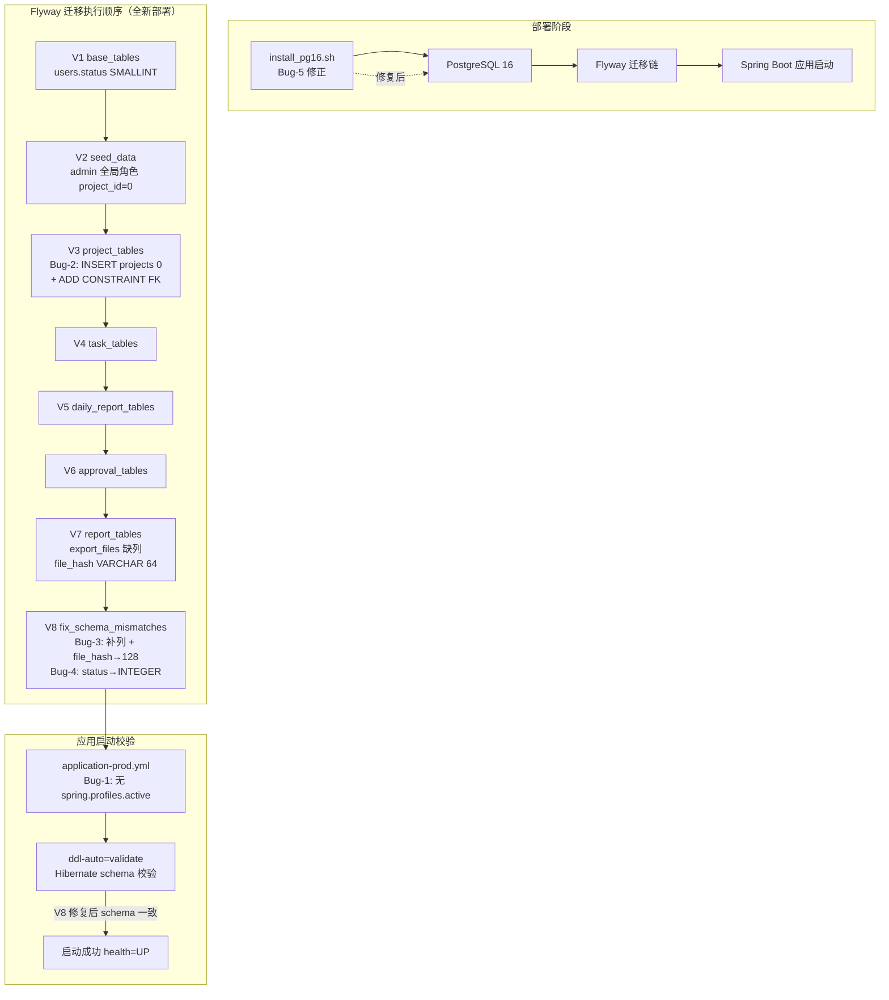
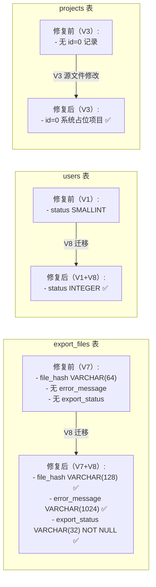

# Design — WI-0004 (fj1 源码 bug 修复)

> Work Item: WI-0004
> Workflow Type: bugfix_spec
> 来源: WI-0003 首次部署 svr-lg 时发现的 5 个源码 bug
> 标准依据: specforge_final_fused_standard_v1_1_patch1_zh.md

---

## 元信息

| 项 | 值 |
|----|-----|
| 修复 bug 数 | 5（Bug-1 ~ Bug-5） |
| 涉及文件 | 7 个源文件修改 + 1 个新迁移文件 |
| 接口契约影响 | 无破坏性变更（Bug-3 为补全） |
| 数据语义影响 | 无 |
| 需要用户决策 | Bug-2 方案选择（已在 design 中推荐方案 B） |

---

## 0. Extension Registry 前置检查

读取 `.specforge/project/extension_registry.json`：

```json
{ "namespaces": { "design_types": [], ... } }
```

**结论：** `design_types` 为空数组。本 WI 使用标准 bugfix `design.md` 类型，不涉及自定义 design_type 扩展。**不触发 Extension Subflow。** 无需写入 `extension_request.json`。

---

## 1. 修复策略总览

| Bug | 技术域 | 修复策略 | 涉及文件 | Flyway forward-compatible | 需 svr-lg 特殊操作 |
|-----|--------|----------|----------|---------------------------|---------------------|
| Bug-1 | Spring Boot 配置 | 直接删除 yml 中 `spring.profiles.active` 键 | `deploy/config/application-prod.yml` | N/A（非 Flyway） | 无（systemd 已设 profile） |
| Bug-2 | SQL 迁移链顺序 | **修改 V3 源文件**：ADD CONSTRAINT 前插入系统占位项目 projects(id=0)（**方案 B**） | `V3__project_tables.sql` | ❌ 不可行（技术限制） | **需 `flyway repair`**（一次性） |
| Bug-3 | SQL schema 不匹配 | **新增 V8 迁移**：补列 + 扩展 file_hash | `V8__fix_schema_mismatches.sql`（新增） | ✅ 可行（幂等） | 无（幂等跳过） |
| Bug-4 | SQL 列类型不匹配 | **新增 V8 迁移**：status SMALLINT→INTEGER（与 Bug-3 合并） | `V8__fix_schema_mismatches.sql` + 注释更新 | ✅ 可行（条件 ALTER） | 无（条件跳过） |
| Bug-5 | 运维脚本 | 直接修正 2 处脚本逻辑 | `scripts/ops/install_pg16.sh` | N/A（非 Flyway） | 无（svr-lg PG16 已装） |

**合并决策：** Bug-3（export_files 缺列 + file_hash 长度）与 Bug-4（users.status 类型）均为 schema 补丁性质，合并到单一迁移文件 `V8__fix_schema_mismatches.sql`，减少迁移文件碎片化。

---

## 架构与组件依赖图

本次修复不改变系统架构，仅修正配置/迁移/脚本的缺陷。以下展示修复后的部署依赖链与迁移执行顺序：



**关键执行依赖：** Bug-2 的 V3 修复是 V8 能执行的前置条件。若 Bug-2 未修复，V3 ADD CONSTRAINT 失败导致迁移链在 V3 中断，V8 永远不会执行。

---

## DD-1: Bug-1 修复 — application-prod.yml 移除 spring.profiles.active

refs: [REQ-Bug1, AC-1]
constrained_by: Spring Boot 3.x 禁止在 profile-specific 文件中使用 `spring.profiles.active`

### 变更描述

删除 `deploy/config/application-prod.yml` 第 7-8 行（`profiles:` 键及其子键 `active: prod`）。

### 当前代码（第 6-8 行）

```yaml
spring:
  profiles:
    active: prod
  datasource:
    ...
```

### 修改后

```yaml
spring:
  datasource:
    ...
```

### Profile 激活机制（修复后）

| 机制 | 位置 | 状态 |
|------|------|------|
| systemd unit `Environment=` | `deploy/systemd/fj-api.service` 第 26 行 `Environment="SPRING_PROFILES_ACTIVE=prod"` | ✅ **已设置**（已读取确认） |
| `.env` 文件 | `/opt/fj/api/.env`（EnvironmentFile 注入） | 可选补充 |
| JVM 参数 | `-Dspring.profiles.active=prod` | 备用 |

**结论：** systemd unit 已设置 `SPRING_PROFILES_ACTIVE=prod`，删除 yml 键后 profile 激活有可靠保障。应用启动时会以 `prod` profile 加载 `application-prod.yml`。

### 验证

- 应用启动日志应显示 `The following 1 profile is active: "prod"`
- 不再出现 `Profiles are not allowed to use 'spring.profiles.active'` 异常

### Out of Scope

- 不修改 `application.yml`（主配置文件，如有 `spring.profiles.active` 是合法的，但本文件不存在该键）
- 不修改 systemd unit（已正确设置）
- 不修改 `.env` 模板（由部署文档管理）

---

## DD-2: Bug-2 修复 — V3 插入系统占位项目（方案 B，推荐）

refs: [REQ-Bug2, AC-2, AC-7]
constrained_by: Flyway 按版本号顺序执行、V3 ADD CONSTRAINT 校验已有数据、projects.id GENERATED ALWAYS AS IDENTITY、projects.status CHECK 约束

### 方案选择：B（修改 V3，在 ADD CONSTRAINT 前插入系统占位项目）

#### 方案对比

| 维度 | 方案 A（V2 移除 project_id=0 关联） | **方案 B（V3 插入 projects(id=0)，推荐）** |
|------|--------------------------------------|----------------------------------------------|
| 变更面 | V2 + 可能 V1（project_id 改 nullable） | **仅 V3 一处** |
| admin 全局角色 | ❌ 丢失（除非改 V1 nullable 或 V3 重新插入） | ✅ 保留（project_id=0 指向系统占位项目） |
| 业务语义 | 破坏"admin 全局角色"语义 | ✅ 完整（SYSTEM 占位项目是合理领域概念） |
| 与 svr-lg 修补一致性 | 不一致（svr-lg 用的是方案 B 思路） | ✅ **一致**（svr-lg 临时修补就是插入 projects(0)） |
| 已验证性 | 未验证 | ✅ svr-lg 已用此方案成功运行 |
| FK 完整性 | 需额外处理（nullable 或迁移关联逻辑） | ✅ FK 校验自然通过 |

**决策：方案 B。** 理由：

1. **业务语义完整**：admin 的 ROLE_SYS_ADMIN 是全局角色，`project_id=0` 指向一个明确的 SYSTEM 占位项目比 NULL 更清晰。
2. **最小变更面**：仅修改 V3 一个文件（方案 A 可能涉及 V1+V2）。
3. **已验证可行**：svr-lg 部署时的临时修补正是用此方案（OVERRIDING SYSTEM VALUE 插入 projects(0)），已成功运行。
4. **合理领域建模**：SYSTEM 占位项目表示"系统级/非项目级"的命名空间，是常见的系统设计模式。

#### V3 修改详情

**文件：** `fj-backend/fj-api/src/main/resources/db/migration/V3__project_tables.sql`

**修改位置：** 第 220 行（`-- ===== 10. 补充 V1 占位外键` 注释之后）、第 222 行（`ADD CONSTRAINT fk_upr_project` 之前）

**当前代码（第 220-223 行）：**

```sql
-- ===== 10. 补充 V1 占位外键（projects 表建立后） =====
-- user_project_roles.project_id / project_organizations.project_id 在 V1 中未建外键
ALTER TABLE user_project_roles
    ADD CONSTRAINT fk_upr_project FOREIGN KEY (project_id) REFERENCES projects (id) ON DELETE CASCADE;
```

**修改后（新增 INSERT 段）：**

```sql
-- ===== 10. 补充 V1 占位外键（projects 表建立后） =====
-- user_project_roles.project_id / project_organizations.project_id 在 V1 中未建外键

-- 系统占位项目（Bug-2 修复）：V2 已用 project_id=0 为 admin 建立全局角色关联，
-- 此处必须在 ADD CONSTRAINT fk_upr_project 之前插入 id=0 记录，
-- 否则 PostgreSQL 校验已有数据时 FK 违规（project_id=0 无对应 projects.id）。
-- id=0 < IDENTITY 序列起始值 1，不与后续业务 INSERT 冲突。
INSERT INTO projects (id, name, code, status, description)
VALUES (0, '系统占位项目', 'SYSTEM', 'ARCHIVED', '全局角色关联锚点（非业务项目，禁止删除）')
OVERRIDING SYSTEM VALUE;

ALTER TABLE user_project_roles
    ADD CONSTRAINT fk_upr_project FOREIGN KEY (project_id) REFERENCES projects (id) ON DELETE CASCADE;
```

#### INSERT 语句约束验证

projects 表（V3 第 15-31 行）列约束逐项检查：

| 列 | 约束 | INSERT 值 | 合规 |
|----|------|-----------|------|
| `id` | `BIGINT GENERATED ALWAYS AS IDENTITY PRIMARY KEY` | `0`（用 `OVERRIDING SYSTEM VALUE`） | ✅ |
| `name` | `VARCHAR(128) NOT NULL` | `'系统占位项目'` | ✅ |
| `code` | `VARCHAR(64)`（nullable），`uk_projects_code UNIQUE` | `'SYSTEM'`（唯一） | ✅ |
| `status` | `VARCHAR(32) NOT NULL DEFAULT 'PREPARING'`，`CHECK (status IN ('PREPARING','ACTIVE','COMPLETED','ARCHIVED'))` | `'ARCHIVED'` | ✅ |
| `description` | `VARCHAR(512)` | `'全局角色关联锚点...'` | ✅ |
| 其余列 | nullable 或有 DEFAULT | 未指定（取 DEFAULT/NULL） | ✅ |

#### IDENTITY 序列安全性

- `projects.id` 的 IDENTITY 序列默认 `START WITH 1`
- 插入 `id=0` 不推进序列（序列当前值仍为 1）
- 后续业务 INSERT 不指定 id 时从 1 开始，与 id=0 **无冲突**
- 无需额外 `setval()` 操作

### forward-compatible 限制论证（为何不能用 V8 修复）

**V8+ 迁移无法修复此 bug。** 根本原因：

1. Flyway 按版本号严格顺序执行：V1→V2→V3→…→V7→V8
2. V3 的 `ADD CONSTRAINT fk_upr_project` 失败后，Flyway 将 V3 标记为 `success=f`，整个迁移中止
3. **V8 永远不会被执行**（V3 失败 = 迁移链断裂）
4. 无论 V8 写什么 SQL，都无法改变"V3 ADD CONSTRAINT 失败"这一事实

**Bug-2 是迁移执行过程中的失败（过程性失败），不是最终 schema 状态的错误。** 这与 Bug-3/4（最终 schema 状态可通过 V8 补丁修复）有本质区别。

### 对 svr-lg 的影响

修改 V3 改变了文件 checksum：
- svr-lg 的 `flyway_schema_history` 记录的是**修补版 V3** 的 checksum
- 升级时 `validate-on-migrate=true` 会发现 checksum 不匹配 → **启动失败**
- **解决：svr-lg 升级前执行一次性 `flyway repair`**（详见 svr-lg 同步计划）

### 验证（Bug-2）

1. **全新空数据库：** 执行 V1→V8 全链迁移，V3 成功（projects(0) 已插入，FK 校验通过）
2. **admin 角色验证：** `SELECT * FROM user_project_roles WHERE user_id=(SELECT id FROM users WHERE username='admin')` 应返回 project_id=0, role_id=ROLE_SYS_ADMIN
3. **admin 登录验证：** 用 admin/admin123 登录，应拥有全部权限

### Out of Scope

- 不修改 V2（admin 全局角色关联逻辑保留不变）
- 不修改 V1（project_id NOT NULL 约束保留不变）
- 不删除 SYSTEM 占位项目（它是全局角色关联的永久锚点）

---

## DD-3: Bug-3/4/file_hash 修复 — 新增 V8 迁移

refs: [REQ-Bug3, REQ-Bug4, AC-3, AC-4, AC-6]
constrained_by: ExportFile.java 实体声明（不可改实体）、UserStatusConverter Integer 泛型（不可改 Converter）、V8 必须幂等（兼容 svr-lg 已修补状态）

### 变更描述

新增迁移文件 `fj-backend/fj-api/src/main/resources/db/migration/V8__fix_schema_mismatches.sql`，修复 4 处 schema 不匹配：

| # | 表 | 问题 | V8 修复 |
|---|-----|------|---------|
| 1 | export_files | 缺 `error_message` 列 | ADD COLUMN IF NOT EXISTS |
| 2 | export_files | 缺 `export_status` 列 | ADD COLUMN IF NOT EXISTS |
| 3 | export_files | `file_hash` VARCHAR(64) ≠ 实体 length=128 | ALTER COLUMN TYPE VARCHAR(128) |
| 4 | users | `status` SMALLINT ≠ Converter Integer | ALTER COLUMN TYPE INTEGER（条件） |

### V8 完整 SQL

```sql
-- =====================================================================
-- V8__fix_schema_mismatches.sql
-- 飞检现场管理系统 — Schema 不匹配修复迁移（WI-0004 Bug-3 + Bug-4）
-- 目标数据库：PostgreSQL 16
-- 依赖：V1__base_tables.sql（users）、V7__report_tables.sql（export_files）
-- 修复范围：
--   - Bug-3: export_files 缺 error_message / export_status 列
--   - Bug-3: export_files.file_hash VARCHAR(64) → VARCHAR(128)（对齐实体 length=128）
--   - Bug-4: users.status SMALLINT → INTEGER（对齐 UserStatusConverter Integer 泛型）
-- 幂等性设计（兼容全新部署 + svr-lg 已修补状态）：
--   - ADD COLUMN IF NOT EXISTS：全新环境补列，svr-lg 已有列则跳过
--   - ALTER COLUMN TYPE：类型扩展操作，已有数据安全（VARCHAR 64→128 扩展不截断）
--   - DO 块条件判断：users.status 已是 integer（svr-lg 修补后）则跳过 ALTER
-- =====================================================================

-- ===== Bug-3 修复：export_files 补缺列 =====

-- error_message：导出失败时的错误信息（nullable，成功时为 NULL）
ALTER TABLE export_files ADD COLUMN IF NOT EXISTS error_message VARCHAR(1024);

-- export_status：导出状态 SUCCESS/FAILED（NOT NULL，默认 SUCCESS）
-- 注意：与 ExportFile.java 实体一致，类型为 VARCHAR(32) String，非 INTEGER
ALTER TABLE export_files ADD COLUMN IF NOT EXISTS export_status VARCHAR(32) NOT NULL DEFAULT 'SUCCESS';

-- ===== Bug-3 修复：export_files.file_hash 扩展长度 =====
-- V7 原为 VARCHAR(64)（SHA-256 = 64 位十六进制）
-- ExportFile.java @Column(length=128) 需 VARCHAR(128)，兼容未来 SHA-512（128 字符）
-- ALTER TYPE 是扩展操作，已有 64 字符哈希值不受影响（不截断）
ALTER TABLE export_files ALTER COLUMN file_hash TYPE VARCHAR(128);

-- ===== Bug-4 修复：users.status SMALLINT → INTEGER =====
-- V1 原为 SMALLINT（int2），UserStatusConverter 泛型为 Integer（int4）
-- DO 块条件判断：svr-lg 已 ALTER 为 integer 则跳过（幂等）
DO $$
BEGIN
    IF EXISTS (
        SELECT 1 FROM information_schema.columns
        WHERE table_schema = 'public'
          AND table_name = 'users'
          AND column_name = 'status'
          AND data_type = 'smallint'
    ) THEN
        ALTER TABLE users ALTER COLUMN status TYPE INTEGER USING status::INTEGER;
    END IF;
END $$;
```

### 幂等性分析

| 操作 | 全新部署（空库） | svr-lg（已修补） | 行为 |
|------|------------------|------------------|------|
| ADD COLUMN error_message | ✅ 创建列 | ✅ 跳过（IF NOT EXISTS） | 幂等 |
| ADD COLUMN export_status | ✅ 创建列 NOT NULL DEFAULT | ✅ 跳过（IF NOT EXISTS） | 幂等 |
| ALTER file_hash TYPE VARCHAR(128) | ✅ 扩展（64→128） | ✅ 无害重写（已 64→128 或保持） | 安全 |
| ALTER status TYPE INTEGER（DO 块） | ✅ smallint→integer | ✅ 跳过（已是 integer） | 幂等 |

### 实体声明对照（修复后一致性）

| 实体字段 | 实体声明 | 修复后 DB 列 | 一致 |
|----------|----------|--------------|------|
| `ExportFile.errorMessage` | `@Column(length=1024) String` | `VARCHAR(1024)` | ✅ |
| `ExportFile.exportStatus` | `@Column(length=32, nullable=false) String` | `VARCHAR(32) NOT NULL DEFAULT 'SUCCESS'` | ✅ |
| `ExportFile.fileHash` | `@Column(length=128) String` | `VARCHAR(128)` | ✅ |
| `User.status`（via Converter） | `AttributeConverter<UserStatus, Integer>` → int4 | `INTEGER` | ✅ |

### Out of Scope

- 不修改 V1（users.status 仍为 SMALLINT，由 V8 运行时修正）
- 不修改 V7（export_files 仍缺列，由 V8 运行时补全）
- 不修改 ExportFile.java（实体声明已正确，是 DB 落后于实体）
- 不修改 UserStatusConverter.java 泛型（Integer 是正确的设计选择）

---

## DD-4: Bug-4 附加 — UserStatusConverter / UserStatus 注释同步

refs: [REQ-Bug4, 发现-3]
constrained_by: 注释应与实现一致（消除 Bug-4 根因中的误导信息）

### 变更描述

更新 2 处误导性注释（SMALLINT → INTEGER），消除注释与实现的矛盾。**零运行时风险**（仅改注释，不改逻辑）。

### 修改点 1：UserStatusConverter.java 第 8 行

**文件：** `fj-backend/fj-system/src/main/java/com/fj/system/entity/UserStatusConverter.java`

**当前（第 7-8 行）：**

```java
/**
 * UserStatus <-> SMALLINT JPA 转换器。
```

**修改后：**

```java
/**
 * UserStatus <-> INTEGER JPA 转换器。
```

### 修改点 2：UserStatus.java 第 7 行

**文件：** `fj-backend/fj-system/src/main/java/com/fj/system/entity/UserStatus.java`

**当前（第 6-8 行）：**

```java
/**
 * 用户状态枚举（对应 users.status SMALLINT）。
```

**修改后：**

```java
/**
 * 用户状态枚举（对应 users.status INTEGER）。
```

### 理由

这两处注释声称 SMALLINT，但 Converter 泛型实际是 Integer。这是 Bug-4 根因之一（开发者被注释误导，V1 用 SMALLINT 而 Converter 用 Integer）。修复后注释与 DB 列类型（V8 改为 INTEGER）和 Converter 泛型（Integer）三者一致。

---

## DD-5: Bug-5 修复 — install_pg16.sh 脚本修正

refs: [REQ-Bug5, AC-5]
constrained_by: PGDG 官方包命名规范、postgresql-16-setup 命令行接口

### 变更描述

修正 `scripts/ops/install_pg16.sh` 的 2 处错误。

### 修改点 1：第 25 行 PG13 包名

**当前（第 25 行）：**

```bash
PG13_PACKAGES="postgresql-server"
```

**修改后：**

```bash
PG13_PACKAGES="postgresql13-server"
```

**理由：** 脚本整体使用 PGDG 仓库（第 127 行 `dnf install -y postgresql${PG16_VERSION}-server`），PG13 同环境也应为 PGDG 包 `postgresql13-server`。`postgresql-server` 是 RHEL 官方仓库包名，`rpm -q`（第 85 行）和 `dnf remove`（第 104 行）无法正确匹配 PGDG 安装的 PG13。

### 修改点 2：第 143 行 initdb 参数

**当前（第 143 行）：**

```bash
postgresql-16-setup --initdb
```

**修改后：**

```bash
postgresql-16-setup initdb
```

**理由：** PGDG `postgresql16-server` 包提供的 `/usr/pgsql-16/bin/postgresql-16-setup` 接受 `initdb` 作为位置参数（子命令），不接受 `--initdb` GNU 长选项。`--initdb` 会被解析为未知选项导致命令失败。

### 验证（Bug-5）

- 在干净 CentOS/RHEL + PGDG 仓库 VM 上执行 `bash install_pg16.sh`
- PG16 数据目录 `/var/lib/pgsql/16/data/PG_VERSION` 应存在
- `systemctl is-active postgresql-16` 应返回 `active`

### Out of Scope

- 不修改脚本的幂等性逻辑（PG16 已装跳过、数据目录已存在跳过）
- 不修改 pg_hba.conf / postgresql.conf 配置规则
- 不修改 FJ_DB_PASSWORD 校验逻辑
- 不修改交互确认流程

---

## 接口契约影响

| Bug | API 契约 | UI 契约 | 数据语义 | 说明 |
|-----|----------|---------|----------|------|
| Bug-1 | 无 | 无 | 无 | 配置变更，不改接口 |
| Bug-2 | 无 | 无 | 无 | 迁移过程修正，最终 schema 不变 |
| Bug-3 | **轻微补全** | 无 | 无 | export API 响应新增 error_message/export_status 字段（实体早已声明，DB 补齐列后才能正常返回） |
| Bug-4 | 无 | 无 | 无 | 列类型扩展 smallint→integer，值域 0/1/2 不变 |
| Bug-5 | 无 | 无 | 无 | 运维脚本，与应用无关 |

**结论：** 本次修复**不破坏任何已发布的数据语义或接口契约**。Bug-3 的接口变化是"补全"（实体已声明字段，DB 补齐列），非破坏性变更。

---

## 数据模型变更

### 变更后 schema 差异（修复前 → 修复后）



### 不变的数据模型

- users 表除 status 类型外其余列不变
- export_files 表除新增列和 file_hash 扩展外其余列不变
- projects / project_configs / project_inspection_forms 等业务表结构不变
- 所有外键关系、CHECK 约束、索引不变
- UserStatus 枚举值（DISABLED=0, ACTIVE=1, LOCKED=2）不变

---

## 测试策略

### 1. 全新空数据库迁移测试（核心验证，覆盖 AC-2/3/4/6）

**目标：** 验证修复后的源码在干净 PG16 上一次性成功部署。

**步骤：**
1. 在 Docker 中启动干净 PostgreSQL 16 实例
2. 执行 V1→V8 完整迁移链（通过 Flyway 或手动按序执行）
3. 验证点：
   - V3 不报 FK 违规（projects(0) 已插入）
   - V8 成功执行（export_files 补列、file_hash 扩展、users.status 改类型）
   - `SELECT * FROM projects WHERE id=0` 返回 SYSTEM 占位项目
   - `SELECT column_name, data_type FROM information_schema.columns WHERE table_name='export_files'` 包含 error_message(varchar)/export_status(varchar)/file_hash(varchar 128)
   - `SELECT data_type FROM information_schema.columns WHERE table_name='users' AND column_name='status'` 返回 `integer`

### 2. ddl-auto=validate 启动测试（覆盖 AC-6）

**目标：** 验证 Hibernate schema 校验通过。

**步骤：**
1. 全新迁移完成后（测试 1），保持 `ddl-auto=validate`
2. 启动 Spring Boot 应用
3. 验证点：
   - 无 `Schema-validation: missing column` 错误
   - 无 `Schema-validation: wrong column type` 错误
   - 应用 health=UP

### 3. svr-lg 升级验证（覆盖 AC-7）

**目标：** 验证修复不破坏已部署的 svr-lg。

**步骤：**
1. 在 svr-lg 克隆环境（或备份后）执行：
   - `flyway repair`（同步 V3 checksum）
   - 重新部署修复后的 jar
   - 恢复 ddl-auto=validate
2. 验证点：
   - flyway_schema_history V3 checksum 更新成功
   - V8 迁移执行（幂等跳过已有列/条件跳过已改类型）
   - 应用启动成功，health=UP
   - 原有数据（admin 账号、角色权限）完整

### 4. admin 登录与权限验证（回归测试，覆盖 Bug-2 修复路径）

**目标：** 验证 admin 全局角色关联未被破坏。

**步骤：**
1. 全新部署后用 admin/admin123 登录
2. 验证点：
   - 登录成功，返回 JWT token
   - token 包含 ROLE_SYS_ADMIN 角色
   - 调用用户列表 API（需要 user:read 权限）成功

### 5. 导出功能验证（回归测试，覆盖 Bug-3 修复路径）

**目标：** 验证 export_files 补列后导出功能正常。

**步骤：**
1. 创建报告 → 导出 → 查询 export_files 记录
2. 验证点：
   - export_status='SUCCESS'
   - error_message=NULL
   - file_hash 为 64 字符 SHA-256（VARCHAR(128) 容纳无截断）

### 6. install_pg16.sh 验证（覆盖 AC-5）

**目标：** 验证脚本在干净系统上正确安装 PG16。

**步骤：**
1. 在干净 CentOS/RHEL VM 上执行 `bash install_pg16.sh`
2. 验证点：
   - `postgresql-16-setup initdb` 成功（无 `--` 前缀错误）
   - PG16 数据目录初始化成功
   - 若环境有 PG13，`postgresql13-server` 包正确检测并卸载

### 7. UserStatus 功能验证（回归测试，覆盖 Bug-4 修复路径）

**目标：** 验证 users.status 类型变更后状态枚举正常。

**步骤：**
1. 查询 admin 用户状态 → 应为 ACTIVE(1)
2. 修改用户状态 → 查询确认持久化正确

### 测试框架

- **数据库迁移测试：** 手动 SQL 验证或 Testcontainers + Flyway（如项目已有测试框架）
- **应用启动测试：** `mvn spring-boot:run` 或 systemd 启动
- **API 回归测试：** curl / Postman / 项目已有集成测试

---

## 回滚方案

### Bug-1 回滚

- **回滚操作：** 恢复 `application-prod.yml` 第 7-8 行 `spring.profiles.active: prod`
- **风险：** 无（恢复到 bug 状态）
- **触发条件：** profile 激活机制失效（systemd unit 未正确设置 SPRING_PROFILES_ACTIVE）

### Bug-2 回滚

- **回滚操作：** 恢复 V3 源文件（删除 INSERT projects(0) 语句）
- **svr-lg 额外操作：** 再次执行 `flyway repair` 同步回旧 checksum
- **风险：** 全新部署恢复到 FK 违规状态
- **触发条件：** 系统占位项目设计不被接受（极不可能，已验证可行）

### Bug-3/4 回滚

- **回滚操作：** 删除 V8 迁移文件 + svr-lg 执行 `DELETE FROM flyway_schema_history WHERE version='8'`
- **数据影响：** 无（新增列/类型扩展可保留，不影响运行）
- **风险：** ddl-auto=validate 恢复后会因 schema 不匹配启动失败（回到 bug 状态）
- **触发条件：** V8 迁移引入意外问题

### Bug-5 回滚

- **回滚操作：** 恢复脚本第 25 行和第 143 行
- **风险：** 无（恢复到 bug 状态）
- **触发条件：** 无（脚本修正无副作用）

### 整体回滚策略

- 所有修改均在 Git 版本控制下，可通过 `git revert` 回滚
- svr-lg 的 flyway_schema_history 变更需单独处理（repair / DELETE V8 记录）
- **数据安全：** 所有回滚操作不删除业务数据

---

## svr-lg 同步计划

svr-lg (10.0.12.12) 已部署且通过临时修补运行。修复合并后需同步更新 svr-lg。

### 前提

- svr-lg 当前状态：V1-V7 success=t（修补版），ddl-auto=none，jar 内嵌 yml 已修补
- fj_inspect 数据库只有种子数据（admin 账号、角色权限、字典），无真实业务数据

### 同步步骤

```
步骤 1: 备份
  - 备份 fj_inspect 数据库: pg_dump
  - 备份当前 jar: cp fj-api-1.0.0.jar fj-api-1.0.0.jar.pre-wi0004
  - 备份 flyway_schema_history: SELECT * FROM flyway_schema_history → 导出

步骤 2: 重新打包（用修复后的源码）
  - mvn clean package -Pprod
  - 新 jar 包含: 修复的 application-prod.yml + 修复的 V3 + 新增 V8 + 修复的 install_pg16.sh（脚本不入 jar）

步骤 3: flyway repair（关键，解决 V3 checksum 不匹配）
  - 停止应用: systemctl stop fj-api
  - 执行 flyway repair:
      cd /opt/fj/api
      java -jar fj-api.jar flyway repair
      （或使用 flyway CLI: flyway -url=jdbc:postgresql://127.0.0.1:5432/fj_inspect repair）
  - 验证: flyway_schema_history 中 V3 的 checksum 已更新为修复后文件的 checksum

步骤 4: 部署新 jar + 恢复 ddl-auto=validate
  - 替换 jar: cp fj-api.jar /opt/fj/api/
  - 确认 application-prod.yml 中 ddl-auto=validate（源码已是 validate，新 jar 自带）
  - 启动应用: systemctl start fj-api
  - Flyway 自动执行 V8 迁移（幂等: 已有列跳过, 已改类型跳过）

步骤 5: 验证
  - 检查 flyway_schema_history: V8 success=t
  - 检查应用 health: curl localhost:8080/api/actuator/health → UP
  - 检查日志: 无 Schema-validation 错误
  - 验证 admin 登录正常
  - 验证 export_files schema: \d export_files（含 error_message/export_status/file_hash VARCHAR(128)）
  - 验证 users.status: \d users（status INTEGER）

步骤 6: 恢复 jar 内嵌 yml（无需手动修补）
  - 修复后的源码 yml 已无 spring.profiles.active
  - 新 jar 无需任何手动 patch（对比: 旧部署需从 jar 删除该键）
```

### svr-lg export_status 列定义检查（注意事项）

svr-lg 临时修补时手动 ADD COLUMN export_status，定义可能不完整（缺 NOT NULL 或 DEFAULT）。V8 的 `ADD COLUMN IF NOT EXISTS` 会跳过已有列。**若 svr-lg 的 export_status 缺 NOT NULL，恢复 ddl-auto=validate 时可能失败。**

**检查命令（步骤 3 之前执行）：**

```sql
SELECT column_name, data_type, is_nullable, column_default
FROM information_schema.columns
WHERE table_name = 'export_files' AND column_name = 'export_status';
```

若 `is_nullable = 'YES'`，执行：

```sql
ALTER TABLE export_files ALTER COLUMN export_status SET NOT NULL;
ALTER TABLE export_files ALTER COLUMN export_status SET DEFAULT 'SUCCESS';
```

### 风险评估

| 步骤 | 风险 | 缓解 |
|------|------|------|
| flyway repair | checksum 更新失败 | 步骤 1 已备份 flyway_schema_history |
| V8 在 svr-lg 执行 | 幂等失败 | V8 用 IF NOT EXISTS + DO 块，设计为幂等 |
| ddl-auto 恢复 validate | 其他实体 schema 不匹配 | 发现 4 建议（全量审查），如有失败需补 V9+ |
| 数据丢失 | 无 | 所有操作 forward-only，不删除数据 |

---

## Out of Scope

1. **不包含全项目 @Entity schema-validate 审查** — 本 WI 仅修复 intake.md 列出的 5 个 bug。其他模块（fj-project / fj-inspection / fj-approval）的 @Entity 与 DB schema 可能存在类似不匹配，恢复 ddl-auto=validate 后可能暴露。建议另立 WI 做全量审查。（参见 requirements.md 发现-4）
2. **不修改 V1/V2/V4/V5/V6/V7 迁移文件** — Bug-2 仅修改 V3；Bug-3/4 通过新增 V8 修复。V1/V2/V4/V5/V6/V7 保持不变。
3. **不修改 ExportFile.java / UserStatusConverter 泛型 / UserStatus 枚举值** — 实体声明是正确的，是 DB schema 落后于实体。仅更新注释（DD-4）。
4. **不修改 systemd unit / .env 模板 / 部署文档** — systemd unit 已正确设置 SPRING_PROFILES_ACTIVE=prod。
5. **不优化 install_pg16.sh 的其他逻辑** — 仅修正 2 处确认的 bug，不重构脚本。
6. **不处理 PG13→PG16 数据迁移** — install_pg16.sh 是全新安装（非原地升级），不保留 PG13 数据。
7. **不修改 application.yml / application-dev.yml** — Bug-1 仅涉及 application-prod.yml。

---

## Assumptions（设计假设）

1. **假设 svr-lg 是唯一已部署环境**（来自 intake.md：fj1 是全新系统，svr-lg 是今天首次部署的唯一环境）。因此修改 V3 + flyway repair 的影响范围可控。
2. **假设 fj_inspect 数据库只有种子数据**（来自 intake.md：无真实业务数据）。因此 flyway repair / V8 迁移无数据丢失风险。
3. **假设 projects.id IDENTITY 序列起始值为 1**（PostgreSQL GENERATED ALWAYS AS IDENTITY 默认）。插入 id=0 不与后续业务 INSERT 冲突。
4. **假设 systemd unit 已正确部署到 svr-lg**（deploy/systemd/fj-api.service 第 26 行已设置 SPRING_PROFILES_ACTIVE=prod）。Bug-1 修复后 profile 激活有保障。
5. **假设 PGDG 仓库的 postgresql-16-setup 接受 `initdb` 位置参数**（来自 PGDG 官方包装规范）。svr-lg 部署时手动执行 `postgresql-16-setup initdb` 已验证成功。
6. **假设 svr-lg 的 export_files 表当前无业务数据**（种子环境）。V8 的 ALTER COLUMN TYPE 操作无性能影响。
7. **假设 prod-environment.md / project-rules.md 的约束未填充**（两文件均为 TODO 占位）。本设计基于 intake.md / requirements.md 中的隐含约束（Spring Boot 3.x / PostgreSQL 16 / Flyway / Hibernate validate）。
8. **假设 host-profile 主机环境（CentOS 8 / bash / UTF-8 / Asia/Shanghai）**适用于部署目标 svr-lg（同为 CentOS 类系统）。

---

## 正确性属性（PBT / 不变量）

以下属性可用于属性测试或回归验证：

| # | 属性 | 验证方式 |
|---|------|----------|
| P1 | 全新空数据库执行 V1-V8 后，所有迁移 success=t | 查询 flyway_schema_history |
| P2 | 全新迁移后 projects 表存在 id=0 的记录 | `SELECT COUNT(*) FROM projects WHERE id=0` = 1 |
| P3 | 全新迁移后 admin 用户在 user_project_roles 中有 project_id=0 的 ROLE_SYS_ADMIN 关联 | JOIN 查询 |
| P4 | 全新迁移后 ddl-auto=validate 启动成功（无 Schema-validation 错误） | 应用启动 + health 检查 |
| P5 | export_files 表包含 error_message(VARCHAR 1024) / export_status(VARCHAR 32 NOT NULL DEFAULT SUCCESS) / file_hash(VARCHAR 128) | information_schema.columns 查询 |
| P6 | users.status 列类型为 integer | information_schema.columns 查询 |
| P7 | V8 迁移在 svr-lg（已修补）上幂等执行不报错 | svr-lg 升级验证 |
| P8 | projects.id IDENTITY 序列在插入 id=0 后仍从 1 开始（无冲突） | `INSERT INTO projects(name) VALUES('test')` 返回 id=1 |
| P9 | UserStatus 枚举值（0/1/2）在 status 列类型变更后语义不变 | admin 用户 status=1(ACTIVE) |
| P10 | install_pg16.sh 在干净系统上一次性成功（initdb + PG13 检测） | VM 验证 |

---

## 自检（好架构 5 条属性）

### A1 单一职责

| 组件 | "我是 X" 陈述 | 通过 |
|------|--------------|------|
| application-prod.yml | 我是生产环境配置文件（不含 profile 自激活） | ✅ |
| V3 迁移 | 我是项目表创建 + FK 建立（含系统占位项目） | ✅ |
| V8 迁移 | 我是 schema 不匹配修补迁移 | ✅ |
| install_pg16.sh | 我是 PG16 全新安装幂等脚本 | ✅ |
| UserStatusConverter | 我是 UserStatus↔Integer JPA 转换器 | ✅ |

### A2 显式依赖

架构图的 Mermaid 图包含所有执行顺序依赖箭头：install_pg16 → PG16 → Flyway 链 → V8 → ddl-auto validate → 启动。Bug-2 与 V8 的关键耦合（V3 成功是 V8 执行的前提）已明确标注。✅

### A3 可替换性

本次修复不引入新组件抽象。V8 迁移是标准 Flyway SQL，可被任何 PostgreSQL 16 实例执行。不涉及接口/抽象设计。N/A（修复型 WI，无新抽象）。✅

### A4 失败可观测

| 失败路径 | 观测方式 |
|----------|----------|
| V3 FK 违规（修复前） | Flyway 迁移失败日志 + flyway_schema_history success=f |
| V8 幂等失败 | Flyway 迁移失败日志 |
| ddl-auto validate 失败 | Spring Boot 启动日志 Schema-validation 错误 |
| install_pg16.sh 失败 | 脚本 stderr + exit code |
| profile 未激活 | 应用启动日志 "No active profile set" 警告 |

✅

### A5 边界明确

- **Out of Scope** 段列出 7 项不做的内容 ✅
- **Assumptions** 段列出 8 条设计假设 ✅
- 每个 DD 都有 Out of Scope 子段 ✅

---

## 自检（DD 硬规则 DD1-DD6）

| 规则 | 检查 | 通过 |
|------|------|------|
| DD1 每个 DD 引用 REQ | DD-1→Bug1, DD-2→Bug2, DD-3→Bug3+Bug4, DD-4→Bug4, DD-5→Bug5 | ✅ |
| DD2 组件有 interface + Errors | 本 WI 无新组件接口（修复型）；每个 DD 有验证段和 Out of Scope | ✅（N/A 适配） |
| DD3 Mermaid 图 + Out of Scope | 架构图 + 2 个数据模型图 + Out of Scope 段 | ✅ |
| DD4 抽象≥2 调用点 | 无新抽象引入（YAGNI） | ✅ |
| DD5 外部调用失败处理 | 无新外部调用；失败路径在 A4 可观测段列出 | ✅ |
| DD6 Assumptions 段 | 8 条假设 | ✅ |

---

## 完成报告

```json
{
  "status": "success",
  "files_changed": [".specforge/work-items/WI-0004/candidates/design.md"],
  "structure": {
    "design_decisions_count": 5,
    "req_references": ["REQ-Bug1", "REQ-Bug2", "REQ-Bug3", "REQ-Bug4", "REQ-Bug5", "AC-1", "AC-2", "AC-3", "AC-4", "AC-5", "AC-6", "AC-7"],
    "components_defined": 5,
    "has_architecture_diagram": true,
    "has_out_of_scope": true,
    "has_assumptions": true,
    "architecture_properties_checked": ["A1", "A2", "A3", "A4", "A5"]
  },
  "self_check": {
    "dd_rules_checked": ["DD1", "DD2", "DD3", "DD4", "DD5", "DD6"],
    "architecture_properties": ["A1", "A2", "A3", "A4", "A5"],
    "all_passed": true
  },
  "bug2_recommended_solution": "B",
  "extension_subflow_triggered": false,
  "out_of_scope_observations": [
    "建议另立 WI 做全项目 @Entity schema-validate 全量审查（恢复 ddl-auto=validate 后可能暴露其他不匹配）"
  ]
}
```
