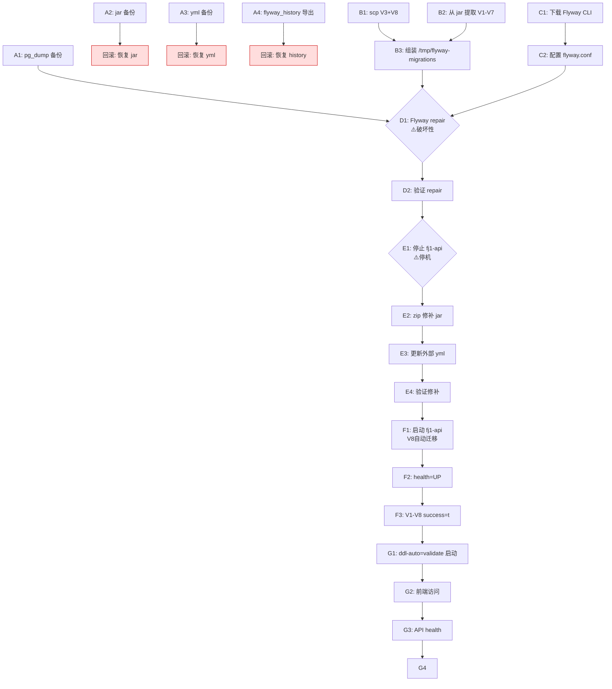

# Impact Analysis — WI-0005 (svr-lg 同步 WI-0004 源码修复)

> Work Item: WI-0005
> Workflow Type: ops_task
> 分析时间: 2026-07-04
> 分析者: sf-design
> 标准依据: specforge_final_fused_standard_v1_1_patch1_zh.md

---

## 1. 影响范围总览

### 1.1 影响矩阵

| 影响对象 | 影响类型 | 影响程度 | 影响时长 | 可恢复 |
|----------|----------|----------|----------|--------|
| fj1-api 服务 | 服务停机 | 中 | 2-5 分钟（含缓冲 5-10 分钟） | ✅ 自动恢复（启动后） |
| fj1-api jar 文件 | 文件修改 | 中 | 永久（直到下次部署） | ✅ jar 备份回滚 |
| 外部 application-prod.yml | 配置修改 | 低 | 永久（直到下次修改） | ✅ yml 备份回滚 |
| PostgreSQL flyway_schema_history | 元数据修改 | 中 | 永久（V3 checksum 更新） | ✅ history 导出回滚 |
| PostgreSQL schema（export_files） | DDL 变更 | 低 | 永久（补列 + file_hash 扩展） | ✅ pg_dump 回滚 |
| PostgreSQL schema（users） | DDL 变更 | 低 | 永久（status 已是 integer，V8 跳过） | ✅ pg_dump 回滚（实际无变化） |
| nginx 代理服务 | ❌ 无影响 | — | — | — |
| PostgreSQL 16 服务 | ❌ 无影响（不重启） | — | — | — |
| 前端静态资源 | ❌ 无影响 | — | — | — |
| .env 机密文件 | ❌ 无影响 | — | — | — |
| systemd unit | ❌ 无影响 | — | — | — |

### 1.2 影响时间线

```
T+0:00  阶段 A-D（备份 + 准备 + Flyway repair）   [服务正常运行]
        ├── A1-A4: 备份（~3 分钟）
        ├── B1-B3: 准备迁移文件（~2 分钟）
        ├── C1-C2: 安装 Flyway CLI（~3 分钟，含下载）
        └── D1-D2: Flyway repair（~1 分钟）⚠️ 破坏性但服务不停

T+0:09  阶段 E（停机开始）                         [⚠️ 服务停机窗口]
        ├── E1: 停止 fj1-api（~5 秒）
        ├── E2: zip 修补 jar（~10 秒）
        ├── E3: 更新外部 yml（~5 秒）
        └── E4: 验证修补结果（~10 秒）

T+0:10  阶段 F（启动 + Flyway migrate）            [⚠️ 服务启动中]
        ├── F1: 启动 fj1-api（~30-60 秒，含 Flyway V8 迁移）
        ├── F2: 验证 health=UP（~5 秒）
        └── F3: 验证 flyway_schema_history（~5 秒）

T+0:11  阶段 G（最终验证）                         [✅ 服务恢复]
        └── G1-G4: 全链路验证（~2 分钟）

T+0:13  阶段 H（清理，可选）                       [✅ 操作完成]
        └── H1: 清理临时文件（~1 分钟）
```

**关键停机窗口：** T+0:09 ~ T+0:11（约 2 分钟实际停机，含缓冲预估 5 分钟）

---

## 2. 服务影响详细分析

### 2.1 fj1-api 服务影响

| 阶段 | 服务状态 | 用户可访问 | 说明 |
|------|----------|------------|------|
| A-D（备份+repair） | ✅ 运行中 | ✅ 可访问 | Flyway repair 不影响运行中的服务（repair 操作 flyway_schema_history 表，不锁业务表） |
| E1（停止服务） | ❌ 停止 | ❌ 不可访问 | `systemctl stop fj-api` |
| E2-E4（修补+验证） | ❌ 停止 | ❌ 不可访问 | jar/yml 修补，服务未启动 |
| F1（启动中） | ⏳ 启动中 | ❌ 不可访问 | Spring Boot 启动 + Flyway V8 迁移（~30-60 秒） |
| F2-G4（验证） | ✅ 运行中 | ✅ 可访问 | health=UP，全链路验证 |

### 2.2 nginx 代理影响

nginx 反向代理 fj1-api（80 → 8080），fj1-api 停机期间：
- nginx 本身**不停机**，继续运行
- 代理请求到 8080 会返回 502 Bad Gateway（后端不可用）
- 前端静态资源（nginx 直接服务）**仍可访问**
- 恢复后 nginx 自动代理恢复（无需重启 nginx）

### 2.3 PostgreSQL 服务影响

- PostgreSQL 16 服务**不重启**
- Flyway repair 操作 `flyway_schema_history` 表（轻量级 UPDATE，不锁业务表）
- V8 迁移操作 export_files（ADD COLUMN / ALTER TYPE）和 users（DO 块条件 ALTER）
  - export_files 当前无业务数据（种子环境），ALTER 无性能影响
  - users.status 在 svr-lg 已是 integer（DO 块跳过），实际无 DDL 执行
- **无数据库锁争用风险**

---

## 3. 数据影响详细分析

### 3.1 数据安全评估

| 数据类别 | 数据量 | 影响风险 | 恢复方式 |
|----------|--------|----------|----------|
| 业务数据（projects/tasks/reports 等） | 无（种子环境） | ❌ 无影响 | N/A |
| 种子数据（admin 账号、角色、权限、字典） | 少量 | ❌ 无影响（V8 不删除/修改业务数据） | pg_dump 备份 |
| Flyway 元数据（flyway_schema_history） | 7→8 行 | ⚠️ V3 checksum 更新 + V8 新增记录 | history 导出备份 |
| Schema 结构（DDL） | — | ⚠️ export_files 补列 + file_hash 扩展 | pg_dump 备份（schema 部分） |

### 3.2 V8 迁移数据影响逐项分析

| V8 操作 | 当前 svr-lg 状态 | V8 执行结果 | 数据风险 |
|---------|------------------|-------------|----------|
| `ADD COLUMN IF NOT EXISTS error_message` | 列已存在（手动 ALTER 添加） | ⏭️ 跳过 | ❌ 无 |
| `ADD COLUMN IF NOT EXISTS export_status` | 列已存在（手动 ALTER 添加） | ⏭️ 跳过 | ❌ 无 |
| `ALTER COLUMN file_hash TYPE VARCHAR(128)` | 当前 VARCHAR(64) | ✅ 执行扩展（64→128） | ❌ 无（扩展不截断） |
| `DO 块: users.status smallint→integer` | 当前已是 integer | ⏭️ 跳过（条件判断） | ❌ 无 |

**⚠️ 关键风险点：export_status 列定义完整性**

svr-lg 手动 ALTER 添加 export_status 时，可能缺少 `NOT NULL` 或 `DEFAULT 'SUCCESS'` 约束。V8 的 `ADD COLUMN IF NOT EXISTS` 会跳过已有列，**不会修补缺失的约束**。

如果 export_status 缺 NOT NULL，`ddl-auto=validate` 时 Hibernate 校验实体声明（`@Column(nullable=false)`）与 DB 列（nullable）不匹配 → **启动失败**。

**必须在阶段 D（repair 前）检查并修复此问题。**（详见 ops_plan.md 前置检查步骤）

### 3.3 Flyway repair 数据影响

Flyway repair 操作 `flyway_schema_history` 表：
- **不删除任何记录**
- **不添加任何记录**
- 仅 UPDATE V3 记录的 `checksum` 字段（从旧值更新为新文件的 checksum）
- 可能 UPDATE `description` 字段（如果文件名/描述变化）

**回滚方式：** 阶段 A4 导出 flyway_schema_history 全表，需要时可 `psql < flyway_history_backup.sql` 恢复。

---

## 4. 用户影响分析

### 4.1 用户群体影响

| 用户群体 | 影响 | 说明 |
|----------|------|------|
| 系统管理员（admin） | 部署窗口期间无法登录 | fj1-api 停机，API 不可用 |
| 业务用户 | 部署窗口期间无法访问 | 同上 |
| 前端浏览者 | 可访问前端页面，但 API 调用失败（502） | nginx 仍运行，静态资源可用 |

### 4.2 影响程度评估

- **影响人数：** 极少（fj1 是新部署系统，仅有 admin 种子账号，无真实业务用户）
- **影响时长：** 2-5 分钟（含缓冲 5-10 分钟）
- **影响严重度：** 低（种子环境，无业务数据风险）
- **建议执行时间：** 业务低峰期（建议凌晨或非工作时间）

---

## 5. 依赖关系分析

### 5.1 操作依赖链



### 5.2 关键依赖约束

| 依赖 | 说明 |
|------|------|
| D1 必须在 E1 之前 | Flyway repair 在服务运行时执行（repair 不影响运行服务）；若先停机再 repair，repair 也可行但延长停机窗口 |
| D1 必须在 B3 之后 | repair 需要新的迁移文件目录（/tmp/flyway-migrations），Flyway CLI 从该目录读取新 V3 计算 checksum |
| E2 必须在 E1 之后 | jar 修补需在服务停止后执行（避免文件锁/运行时冲突） |
| F1 依赖 E2+E3 | 启动时 jar 内有新 V3+V8，外部 yml ddl-auto=validate，Flyway validate-on-migrate 校验通过（D1 已 repair） |
| G1 依赖 F1 | ddl-auto=validate 启动验证（如果 schema 仍有不匹配，此处暴露） |

### 5.3 外部依赖

| 依赖项 | 必需性 | 风险 | Fallback |
|--------|--------|------|----------|
| `ssh lg` 连接（root） | ✅ 必需 | 连接失败 → 无法操作 | 检查 SSH 配置/网络 |
| Flyway CLI 下载（外网） | ⚠️ 方案 A 必需 | 下载失败 → 切方案 B | 阿里云/腾讯云镜像；方案 B（Python checksum） |
| 本地修复文件存在 | ✅ 必需 | 文件缺失 → 无法 scp | 检查 WI-0004 产物 |
| svr-lg zip/unzip | ✅ 必需 | 命令缺失 → 无法修补 jar | yum install zip unzip |

---

## 6. 回滚影响分析

### 6.1 回滚场景与影响

| 回滚场景 | 触发条件 | 回滚影响 | 回滚后状态 |
|----------|----------|----------|------------|
| Flyway repair 失败 | repair 报错/checksum 计算异常 | 恢复 flyway_history 导出 | 回到操作前（V1-V7 旧 checksum） |
| jar 修补失败 | zip 命令报错/jar 损坏 | 恢复 jar 备份 | 回到旧 jar（修补版 V3） |
| 外部 yml 修改失败 | yml 格式错误/配置丢失 | 恢复 yml 备份 | 回到 ddl-auto=none |
| V8 迁移失败 | Flyway migrate 报错 | pg_dump 恢复数据库 | 回到操作前 schema |
| ddl-auto=validate 启动失败 | Schema-validation 错误 | 恢复 yml ddl-auto=none + 旧 jar | 回到临时修补运行状态 |
| health 检查失败 | 启动超时/异常 | 恢复旧 jar + 重启 | 回到操作前运行状态 |

### 6.2 回滚后系统状态

**最坏情况回滚（所有修复撤销）：**
- svr-lg 回到 WI-0005 操作前的状态
- fj1-api 运行临时修补版 jar（ddl-auto=none）
- flyway_schema_history V1-V7（旧 checksum）
- 数据库 schema 保持当前（export_files 已有列、users.status 已 integer）
- **系统可用**，但仍是"临时修补"状态（非干净修复版）

**回滚不导致数据丢失。** 所有回滚操作都是 forward-safe（不删除业务数据）。

---

## 7. 风险评估矩阵

| 风险 | 概率 | 影响 | 风险等级 | 缓解措施 |
|------|------|------|----------|----------|
| Flyway CLI 下载失败（网络） | 中 | 中 | 中 | 多镜像 fallback + 方案 B（Python checksum） |
| Flyway CLI 版本不兼容 | 低 | 高 | 中 | 先检查 jar 内 Flyway 版本；9.x 系列兼容 |
| Flyway repair 失败 | 低 | 高 | 中 | history 导出备份可回滚 |
| V8 迁移失败 | 极低 | 中 | 低 | V8 幂等设计 + pg_dump 备份 |
| jar 修补后损坏 | 低 | 高 | 中 | jar 备份 + 修补后 `unzip -t` 验证 |
| ddl-auto=validate 暴露其他 schema 不匹配 | 中 | 高 | 中 | WI-0004 已提示另立 WI 全量审查；本 WI 回滚到 none |
| export_status 缺 NOT NULL | 中 | 中 | 中 | 阶段 D 前置检查 + 手动 ALTER 修补 |
| 停机时间超预期 | 低 | 低 | 低 | 操作前预演；缓冲 5-10 分钟 |
| SSH 连接中断 | 极低 | 中 | 低 | 使用 nohup/screen 执行长命令 |

---

## 8. 影响分析结论

### 8.1 总体影响评估

| 维度 | 评估 |
|------|------|
| **服务可用性影响** | 中（停机 2-5 分钟，有缓冲） |
| **数据完整性影响** | 低（V8 幂等 + 四重备份） |
| **回滚可行性** | 高（6 种回滚场景全部可操作） |
| **业务影响** | 低（种子环境，无真实业务用户） |
| **综合风险** | **中（可控）** |

### 8.2 操作建议

1. ✅ **建议执行：** 影响可控，回滚方案完备，收益（消除临时修补隐患）大于风险
2. ⏰ **建议时间：** 业务低峰期（凌晨或非工作时间）
3. 📋 **建议预演：** 操作前在测试环境预演阶段 B-D（Flyway CLI 下载+repair）
4. 🔔 **关键确认点：** D1（Flyway repair）和 E1（停止服务）需用户确认

### 8.3 不适合执行的情况

- ❌ svr-lg SSH 不可达
- ❌ fj1-api 当前 health≠UP（先排查现有问题）
- ❌ PostgreSQL 服务异常
- ❌ 无部署窗口（用户未同意停机）
- ❌ 磁盘空间不足（<500MB）

---

## 自检

| 检查项 | 通过 |
|--------|------|
| 影响矩阵完整（11 个对象） | ✅ |
| 服务影响分阶段分析（A-H） | ✅ |
| 数据影响逐项分析（V8 四项操作） | ✅ |
| 用户影响分析（3 类用户） | ✅ |
| 依赖链 Mermaid 图（含回滚节点） | ✅ |
| 外部依赖+fallback（4 项） | ✅ |
| 回滚场景分析（6 种） | ✅ |
| 风险评估矩阵（9 项） | ✅ |
| export_status NOT NULL 风险识别 | ✅ |
| 结论明确（建议执行+条件） | ✅ |
