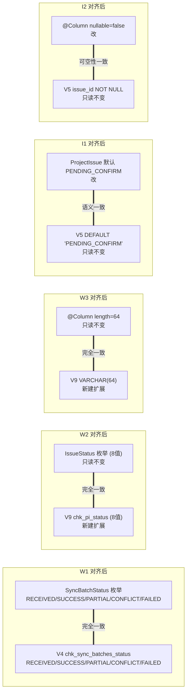

# Design — WI-0007：实体与 DDL Schema 不匹配修复

> 本设计基于 `requirements.md` 的 5 个缺陷（W1/W2/W3/I1/I2）制定修复方案。
> 在 `bugfix_spec` 工作流中，缺陷编号（W1/W2/W3/I1/I2）即需求追溯键，
> 每个 DD 通过 `refs:` 字段追溯到对应缺陷，构成完整的 REQ→DD 追溯链。

---

## 0. 设计概述

### 0.1 修复策略总览

WI-0006 全量 Schema 审查发现 5 个非启动级不匹配（3 Warning + 2 Info）。
根因均为"实体层与 DDL 层在独立编写时缺少交叉校验，导致同源业务概念在 Java/SQL 两侧各自命名"。

修复遵循**单一真相源原则**——为每个不匹配确定哪一侧是权威真相源，将另一侧对齐：

| 缺陷 | 权威真相源 | 修复动作 | 变更类型 |
|------|-----------|---------|---------|
| W1 | V4 DDL CHECK（5 值更完整） | 改 Java 枚举对齐 DDL | 代码修改（fj-sync） |
| W2 | IssueStatus 枚举（8 值反映完整状态机） | 扩展 DDL CHECK 为 8 值 | 增量迁移（V9，fj-api） |
| W3 | 实体 length=64（语义化版本号更长） | 扩展 DDL VARCHAR(32)→64 | 增量迁移（合并 V9） |
| I1 | V5 DDL DEFAULT 'PENDING_CONFIRM' | 改 Java 默认值对齐 | 代码修改（fj-issue） |
| I2 | V5 DDL NOT NULL | 补 Java nullable=false | 代码修改（fj-recommend） |

### 0.2 修复分组（5 个修复项互相独立，可并行执行）

```
fj-sync (W1/DD-1) ─────────────────── 独立，无跨模块依赖
fj-api/migration (W2/DD-2 + W3/DD-3)  V9 新文件，无冲突
fj-issue (I1/DD-4) ────────────────── 独立，无跨模块依赖
fj-recommend (I2/DD-5) ────────────── 独立，无跨模块依赖
```

### 0.3 修改文件清单（共 6 个文件，5 改 1 新）

| 文件 | 动作 | 缺陷 |
|------|------|------|
| `fj-sync/.../entity/SyncBatchStatus.java` | 改 | W1 |
| `fj-sync/.../entity/SyncBatch.java` | 改（L45） | W1 |
| `fj-sync/.../service/SyncPushService.java` | 改（L72,79,119,121） | W1 |
| `fj-api/.../db/migration/V9__fix_enum_check_constraints.sql` | **新建** | W2+W3 |
| `fj-issue/.../entity/ProjectIssue.java` | 改（L76） | I1 |
| `fj-recommend/.../entity/StandardRecommendationResult.java` | 改（L33-34） | I2 |

---

## 1. 架构图（依赖关系）

### 1.1 修复涉及模块依赖图

```mermaid
graph TD
    subgraph "fj-sync 模块 (W1)"
        SBS[SyncBatchStatus.java<br/>枚举定义]
        SB[SyncBatch.java<br/>实体字段默认值]
        SPS[SyncPushService.java<br/>状态赋值调用点]
        SBS --> SB
        SBS --> SPS
        SB --> SPS
    end

    subgraph "fj-api 模块 (迁移层)"
        V4[V4__task_tables.sql<br/>sync_batches CHECK 只读]
        V5[V5__daily_report_tables.sql<br/>project_issues / srr 只读]
        V9[V9__fix_enum_check_constraints.sql<br/>新建增量迁移]
        V5 -.要扩展.-> V9
    end

    subgraph "fj-issue 模块 (W2 上下文 + I1)"
        IS[IssueStatus.java<br/>8值枚举 只读]
        PI[ProjectIssue.java<br/>实体字段]
        ISS[IssueStatusService.java<br/>状态机 只读]
        IS --> PI
        IS --> ISS
    end

    subgraph "fj-recommend 模块 (I2)"
        SRR[StandardRecommendationResult.java<br/>实体注解]
    end

    subgraph "PostgreSQL DDL 运行时"
        DB_SYNC[(sync_batches<br/>chk_sync_batches_status)]
        DB_PI[(project_issues<br/>chk_pi_status)]
        DB_SRR[(standard_recommendation_results<br/>standard_library_version)]
    end

    SBS -.@Enumerated STRING持久化.-> DB_SYNC
    PI -.@Enumerated STRING持久化.-> DB_PI
    SRR-.@Column映射.-> DB_SRR
    V9 -.ALTER.-> DB_PI
    V9 -.ALTER.-> DB_SRR
    V4 -.既有CHECK不变.-> DB_SYNC
    V5 -.既有CHECK被V9扩展.-> DB_PI
    V5 -.既有VARCHAR被V9扩展.-> DB_SRR

    classDef newFile fill:#d4edda,stroke:#28a745,stroke-width:2px;
    classDef modified fill:#fff3cd,stroke:#ffc107,stroke-width:2px;
    classDef readonly fill:#e2e3e5,stroke:#6c757d,stroke-dasharray: 5 5;
    class V9 newFile;
    class SBS,SB,SPS,PI,SRR modified;
    class V4,V5,IS,ISS readonly;
```

### 1.2 修复后实体↔DDL 对齐状态图



---

## 2. 修复方案详情

### DD-1 SyncBatchStatus 枚举对齐 V4 DDL CHECK 约束（W1）

refs: [W1]
constrained_by: V4__task_tables.sql:252-254 (chk_sync_batches_status 既有不可变), INV-1 (同步推送幂等语义不变)

#### 决策：修改 Java 枚举对齐 DDL（方案 A）

**为什么选 A（改枚举）而非 B（改 DDL）：**

1. V4 DDL 的 5 值 {RECEIVED, SUCCESS, PARTIAL, CONFLICT, FAILED} 更精细地描述了同步批次生命周期（含 PARTIAL 部分成功、CONFLICT 冲突），是更完整的版本。
2. V4 是 Flyway 已执行迁移，DDL 不可变更（INV-6）。
3. 枚举仅 3 处引用点，全部在 fj-sync 模块内，无 if/switch 比较逻辑，纯赋值，改造影响面小（详见调用点审计）。

**修改内容：**

`fj-backend/fj-sync/src/main/java/com/fj/sync/entity/SyncBatchStatus.java`（完整替换枚举体）：

```java
package com.fj.sync.entity;

/**
 * 同步批次状态枚举（对应 sync_batches.status VARCHAR，§101.28）。
 * 值集与 V4__task_tables.sql 的 chk_sync_batches_status CHECK 约束完全对齐。
 */
public enum SyncBatchStatus {

    /** 已接收（服务端已接收，处理中） */
    RECEIVED,
    /** 处理完成（全部成功） */
    SUCCESS,
    /** 部分成功（部分记录冲突） */
    PARTIAL,
    /** 存在冲突 */
    CONFLICT,
    /** 处理失败 */
    FAILED
}
```

`fj-backend/fj-sync/src/main/java/com/fj/sync/entity/SyncBatch.java:45`：

```java
// 旧: private SyncBatchStatus status = SyncBatchStatus.PROCESSING;
private SyncBatchStatus status = SyncBatchStatus.RECEIVED;
```

`fj-backend/fj-sync/src/main/java/com/fj/sync/service/SyncPushService.java`：

| 行号 | 旧 | 新 |
|------|----|----|
| L72（注释） | `// ===== 2. 创建批次记录（PROCESSING） =====` | `// ===== 2. 创建批次记录（RECEIVED） =====` |
| L79 | `batch.setStatus(SyncBatchStatus.PROCESSING);` | `batch.setStatus(SyncBatchStatus.RECEIVED);` |
| L119（注释） | `// ===== 4. 更新批次记录（COMPLETED） =====` | `// ===== 4. 更新批次记录（SUCCESS） =====` |
| L121 | `batch.setStatus(SyncBatchStatus.COMPLETED);` | `batch.setStatus(SyncBatchStatus.SUCCESS);` |

#### 枚举值映射表

| Java 旧值 | Java 新值 | DDL CHECK 允许 | 语义 | 当前是否使用 |
|-----------|-----------|---------------|------|-------------|
| PROCESSING | **RECEIVED** | ✓ | 已接收（服务端已接收，处理中） | 是（L79） |
| COMPLETED | **SUCCESS** | ✓ | 处理完成（全部成功） | 是（L121） |
| — | PARTIAL | ✓ | 部分成功（部分记录冲突） | 否（预留，当前 SyncPushService 未区分部分成功场景） |
| — | CONFLICT | ✓ | 存在冲突 | 否（预留，当前 SyncPushService 未单独标记冲突态） |
| FAILED | FAILED | ✓ | 处理失败 | 否（保留，未来失败路径使用） |

**PARTIAL/CONFLICT 为预留值说明：** 当前 SyncPushService.push() 的实现中，批次最终只赋值 RECEIVED（创建时）和 SUCCESS（完成时），未区分"部分成功"和"全冲突"场景。本次修复不引入这些状态的使用逻辑（YAGNI，DD4），仅在枚举中保留以与 DDL 完全对齐，避免未来再次出现值集不一致。

#### 调用点审计（grep 确认，共 3 处引用，全部为赋值）

| 引用位置 | 引用形式 | 类型 | 是否需改 |
|---------|---------|------|---------|
| `SyncBatch.java:45` | `= SyncBatchStatus.PROCESSING` | 字段默认值赋值 | 是 |
| `SyncPushService.java:79` | `setStatus(SyncBatchStatus.PROCESSING)` | setStatus 赋值 | 是 |
| `SyncPushService.java:121` | `setStatus(SyncBatchStatus.COMPLETED)` | setStatus 赋值 | 是 |

**关键安全结论：** 全代码库**无** `if (status == PROCESSING)` / `switch(status)` / `status.equals(COMPLETED)` 等比较逻辑引用旧枚举值。所有引用均为纯赋值，故枚举值重命名不会破坏任何条件分支。

#### Errors（此修改的风险点）

- `CompileError`：若遗漏任何引用点（理论上仅 3 处，但需全量 grep 验证）→ 编译失败。**缓解**：修改后执行 `mvn compile` 验证。
- `RuntimeBehaviorDrift`：SyncPushResponse.status（L134 `response.setStatus(batch.getStatus().name())`）序列化的字符串值从 "PROCESSING"/"COMPLETED" 变为 "RECEIVED"/"SUCCESS"。**评估**：INV-1 已确认这是语义等价的对齐（RECEIVED=已接收，SUCCESS=处理完成），外部行为在语义上一一对应。若有外部消费者硬编码匹配 "PROCESSING" 字符串，需同步通知——本设计假设无此消费者（见 Assumptions ASSUMP-3）。

---

### DD-2 ProjectIssue.status CHECK 约束扩展为 8 值（W2）

refs: [W2]
constrained_by: V5__daily_report_tables.sql (Flyway 已执行不可改), INV-2 (状态机流转规则不变), INV-5 (现有数据兼容), INV-6 (V9 必须增量)

#### 决策：新建 V9 迁移 DROP + 重建 CHECK（扩展为超集）

**为什么扩展 DDL 而非删减枚举：**

1. `IssueStatus` 枚举的 8 个值完整反映了 TASK-026（问题池生命周期）+ TASK-027（整改状态机）的业务设计，JavaDoc 明确标注。
2. `IssueStatusService.TRANSITIONS` 邻接表（L40-54）覆盖全部 8 值，定义了完整流转规则：`VALID→RECTIFIED→CLOSED`、`VALID→OVERDUE`、`SUSPENDED↔VALID`、`VOIDED→CORRECTED→CLOSED` 等。
3. `markRectified()`/`close()`/`markOverdue()` 分别写入 RECTIFIED/CLOSED/OVERDUE——这些是整改闭环的**核心**状态。
4. V5 的 5 值是项目早期的旧版本，未随业务扩展同步更新。V5 已执行不可改（INV-6），必须通过 V9 补救。

**现有约束名确认（已读 V5 验证）：** `V5__daily_report_tables.sql:234` `CONSTRAINT chk_pi_status CHECK (status IN ('VALID', 'PENDING_CONFIRM', 'SUSPENDED', 'VOIDED', 'CORRECTED'))`。

**V9 迁移内容（W2 部分，与 DD-3 合并到同一文件）：**

```sql
-- W2: 扩展 project_issues.status CHECK 约束（5→8 值）
-- 根因：V5 chk_pi_status 是项目早期版本，未随 TASK-026/027 业务扩展同步更新
-- IssueStatus 枚举（8值）+ IssueStatusService.TRANSITIONS（完整状态机）需要全部 8 个状态
-- 缺失的 3 个：RECTIFIED（已整改）/ CLOSED（已关闭）/ OVERDUE（超期）—— 整改闭环核心状态
ALTER TABLE project_issues DROP CONSTRAINT IF EXISTS chk_pi_status;
ALTER TABLE project_issues ADD CONSTRAINT chk_pi_status CHECK (
    status IN ('VALID', 'PENDING_CONFIRM', 'RECTIFIED', 'CLOSED', 'OVERDUE',
               'SUSPENDED', 'VOIDED', 'CORRECTED')
);
```

#### 数据兼容性分析

- 旧 5 值集合 {VALID, PENDING_CONFIRM, SUSPENDED, VOIDED, CORRECTED} 是新 8 值集合的真子集。
- DROP + 重建 CHECK 为超集，**不会拒绝任何现有行**（宽松化变更，INV-5）。
- 无需数据回填或修正。

#### Errors（此修改的风险点）

- `ConstraintAlreadyExists`：若 chk_pi_status 已存在且未用 `IF EXISTS`，DROP 会报错。**缓解**：使用 `DROP CONSTRAINT IF EXISTS`（幂等保护，满足 AC-7）。
- `DataInconsistency`：理论上若现有数据含旧 5 值外的脏数据，重建 CHECK 会失败。**评估**：当前 CHECK 已限制为 5 值，不可能存在 5 值外的数据，此风险为零。

---

### DD-3 standard_library_version 长度扩展 VARCHAR(64)（W3）

refs: [W3]
constrained_by: V5__daily_report_tables.sql:300 (VARCHAR(32) 不可改), INV-5 (现有数据兼容)

#### 决策：合并到 V9 迁移执行 ALTER TYPE

**为什么扩展 DDL 而非缩小实体 length：**

1. 实体 `@Column(length=64)` 考虑了语义化版本号（如 `v1.2.3-beta+build20240101`）可能较长，设计更合理。
2. VARCHAR(32)→VARCHAR(64) 是长度扩展，不截断数据（INV-5）。
3. 合并到 DD-2 的 V9 文件，避免新增多个迁移版本号（保持迁移版本简洁）。

**V9 迁移内容（W3 部分）：**

```sql
-- W3: 扩展 standard_library_version 长度（32→64）
-- 根因：V5 DDL 编写时对版本号长度估算不足（32），实体设计者已声明 64
-- 存储内容：推荐时使用的标准库版本（取自 StandardDocument.version），语义化版本号可能较长
ALTER TABLE standard_recommendation_results
    ALTER COLUMN standard_library_version TYPE VARCHAR(64);
```

#### 数据兼容性分析

- VARCHAR(32)→VARCHAR(64) 是 PostgreSQL 安全的列扩展操作，无需重写表数据（PG 12+ 仅更新元数据）。
- 现有数据（最长 32 字符）全部兼容。
- 无需数据回填。

#### Errors（此修改的风险点）

- `ColumnTypeMismatch`：若列上有索引或依赖对象阻止 ALTER TYPE。**评估**：standard_library_version 无索引（V5 未建），无依赖对象，ALTER TYPE 安全。
- `LockContention`：ALTER TYPE 在 PG 12+ 对 VARCHAR 扩展不锁表（仅元数据更新）。**评估**：可在生产运行时执行。

---

### DD-4 ProjectIssue.status 默认值对齐 DDL DEFAULT（I1）

refs: [I1]
constrained_by: V5__daily_report_tables.sql:215 (DEFAULT 'PENDING_CONFIRM' 不可改), INV-3 (入池流程初始状态不变)

#### 决策：修改 Java 默认值为 PENDING_CONFIRM

**为什么改 Java 默认值而非 DDL DEFAULT：**

1. V5 的 `DEFAULT 'PENDING_CONFIRM'` 反映了正确的业务语义——新创建的问题初始状态应是"待确认（待审核入池）"，由业务逻辑在确认后推进到 VALID。
2. `IssueStatus` 注释 L10 明确：`PENDING_CONFIRM = "待确认（待审核入池）"`。
3. V5 已执行不可改（INV-6）。

**修改内容：**

`fj-backend/fj-issue/src/main/java/com/fj/issue/entity/ProjectIssue.java:76`：

```java
// 旧: private IssueStatus status = IssueStatus.VALID;
private IssueStatus status = IssueStatus.PENDING_CONFIRM;
```

#### INV-3 安全性证明（入池流程不受影响）

`IssuePoolService.generateFromDailyReport()` 在入池时**显式**执行（L98）：

```java
issue.setStatus(IssueStatus.VALID);
```

因此：
- 正常入池路径：`new ProjectIssue()` → 默认 PENDING_CONFIRM → `setStatus(VALID)` 覆盖 → save 写入 VALID。**入池后状态仍为 VALID，不变（INV-3）**。
- 边界场景（直接 `new ProjectIssue()` 未设 status）：默认 PENDING_CONFIRM，与 DDL DEFAULT 一致，语义正确。

**结论：** 改默认值是防御性对齐，不影响任何现有业务流程。

#### Errors（此修改的风险点）

- `SemanticDrift`：若有代码依赖 `new ProjectIssue().getStatus() == VALID`。**评估**：IssuePoolService 总是显式 setStatus，无此依赖。需 grep 验证 `new ProjectIssue(` 后未设 status 即读取的路径。

---

### DD-5 StandardRecommendationResult.issue_id 标注 nullable=false（I2）

refs: [I2]
constrained_by: V5__daily_report_tables.sql:296 (issue_id BIGINT NOT NULL 不可改), INV-4 (关联关系语义不变)

#### 决策：补全实体 @Column(nullable=false) 注解

**根因：** 纯粹的注解遗漏——同实体内 `projectId`（L29）和 `clauseId`（L37）均正确标注了 `nullable=false`，唯独 `issueId` 遗漏。JPA `@Column` 默认 `nullable=true` 与 DDL `NOT NULL` 矛盾。

**修改内容：**

`fj-backend/fj-recommend/src/main/java/com/fj/recommend/entity/StandardRecommendationResult.java:33-34`：

```java
// 旧: @Column(name = "issue_id")
@Column(name = "issue_id", nullable = false)
private Long issueId;
```

#### INV-4 安全性证明（关联关系不变）

- DDL 已是 NOT NULL，实体补 nullable=false 仅约束注解，不改变运行时写入行为。
- `StandardRecommendationService` 写入推荐结果时始终关联到具体问题（issue_id 必填），无 NULL 写入路径。
- 在 `ddl-auto=validate` 下，此修改使实体注解与 DDL 一致，消除 SchemaValidationException 隐患（AC-6）。

#### Errors（此修改的风险点）

- 无运行时风险（注解对齐，DDL 已强制 NOT NULL）。
- `ddl-auto=validate` 启动校验通过（AC-6）。

---

## 3. 数据库迁移设计（V9 完整方案）

### 3.1 V9 迁移文件完整内容

文件路径：`fj-backend/fj-api/src/main/resources/db/migration/V9__fix_enum_check_constraints.sql`

```sql
-- ============================================================================
-- V9: 修复枚举/CHECK/长度不匹配（WI-0007）
-- ============================================================================
-- 来源：WI-0006 全量 Schema 审查发现的 5 个不匹配中的 DDL 相关项（W2 + W3）
-- 设计：见 .specforge/work-items/WI-0007/design.md（DD-2 + DD-3）
-- 类型：forward-compatible 增量迁移（宽松化 + 扩展，不破坏现有数据）
-- 幂等：是（DROP 使用 IF EXISTS，ALTER TYPE 可重复执行）
-- ============================================================================

-- ----- W2: 扩展 project_issues.status CHECK 约束（5→8 值） -----
-- 根因：V5 chk_pi_status 是项目早期版本，未随 TASK-026/027 业务扩展同步更新
-- IssueStatus 枚举（8值）+ IssueStatusService.TRANSITIONS（完整状态机）需要全部 8 个状态
-- 缺失的 3 个：RECTIFIED（已整改）/ CLOSED（已关闭）/ OVERDUE（超期）—— 整改闭环核心状态
-- 兼容性：旧 5 值是新 8 值的真子集，DROP+重建为超集不拒绝任何现有行
ALTER TABLE project_issues DROP CONSTRAINT IF EXISTS chk_pi_status;
ALTER TABLE project_issues ADD CONSTRAINT chk_pi_status CHECK (
    status IN ('VALID', 'PENDING_CONFIRM', 'RECTIFIED', 'CLOSED', 'OVERDUE',
               'SUSPENDED', 'VOIDED', 'CORRECTED')
);

-- ----- W3: 扩展 standard_library_version 长度（32→64） -----
-- 根因：V5 DDL 编写时对版本号长度估算不足（32），实体已声明 64
-- 存储内容：推荐时使用的标准库版本（取自 StandardDocument.version）
-- 兼容性：VARCHAR 扩展不截断数据（PG 12+ 仅更新元数据，不锁表）
ALTER TABLE standard_recommendation_results
    ALTER COLUMN standard_library_version TYPE VARCHAR(64);
```

### 3.2 幂等性证明（满足 AC-7）

| 语句 | 幂等机制 | 重复执行结果 |
|------|---------|------------|
| `DROP CONSTRAINT IF EXISTS chk_pi_status` | `IF EXISTS` 保护 | 约束不存在时静默跳过，不报错 |
| `ADD CONSTRAINT chk_pi_status CHECK (...)` | 无原生幂等保护 | **第二次执行会报错**（约束已存在） |
| `ALTER COLUMN ... TYPE VARCHAR(64)` | PostgreSQL 原生幂等 | 已是 VARCHAR(64) 时无操作，不报错 |

**ADD CONSTRAINT 的幂等性说明：**

V9 作为 Flyway 迁移，Flyway 通过 `flyway_schema_history` 表的版本号保证**每个版本只执行一次**，不会重复执行 V9。因此 ADD CONSTRAINT 无需额外的 PL/pgSQL DO 块保护——Flyway 的版本控制本身就是幂等保障。

**若需在非 Flyway 环境手动执行（如运维直接 psql），可选用以下 PL/pgSQL 幂等版本（可选增强，非必需）：**

```sql
-- 可选：手动执行的幂等版本（Flyway 环境无需）
DO $$
BEGIN
    IF NOT EXISTS (
        SELECT 1 FROM information_schema.table_constraints
        WHERE table_name = 'project_issues' AND constraint_name = 'chk_pi_status'
    ) THEN
        ALTER TABLE project_issues ADD CONSTRAINT chk_pi_status CHECK (
            status IN ('VALID', 'PENDING_CONFIRM', 'RECTIFIED', 'CLOSED', 'OVERDUE',
                       'SUSPENDED', 'VOIDED', 'CORRECTED')
        );
    END IF;
END $$;
```

**本设计采用标准 SQL 版本**（上方 3.1），依赖 Flyway 版本控制保证幂等，符合项目现有 V1-V8 迁移的编写风格一致性。

### 3.3 全新库 vs 已部署库（svr-lg）执行场景

| 场景 | V1-V8 | V9 | 结果 |
|------|-------|----|----|
| 全新库（开发/CI） | 顺序执行 | 执行 | V5 建 5 值 CHECK → V9 扩展为 8 值；V5 建 VARCHAR(32) → V9 扩展为 64。最终状态正确。 |
| svr-lg（已部署 V1-V8） | 已存在 | 执行 | V5 的 5 值 CHECK 被 V9 DROP+重建为 8 值；VARCHAR(32) 被 ALTER 为 64。现有数据兼容。 |
| 回滚 | — | V9 无 undo 脚本 | Flyway 社区版不支持 undo。回滚需手动执行反向 SQL（见下方）。 |

**手动回滚 SQL（紧急回滚用，不写入 V9 文件）：**

```sql
-- 回滚 V9（紧急用）
ALTER TABLE project_issues DROP CONSTRAINT IF EXISTS chk_pi_status;
ALTER TABLE project_issues ADD CONSTRAINT chk_pi_status CHECK (
    status IN ('VALID', 'PENDING_CONFIRM', 'SUSPENDED', 'VOIDED', 'CORRECTED')
);
ALTER TABLE standard_recommendation_results
    ALTER COLUMN standard_library_version TYPE VARCHAR(32);
-- 注意：回滚前需确认无 >32 字符的版本号数据，否则 TYPE VARCHAR(32) 会失败
```

### 3.4 V9 不修改既有迁移（INV-6 合规）

- V9 是**新建文件**，不修改 V4/V5 任何既有迁移脚本。
- V4/V5 在 Flyway 中已有 checksum 记录，修改会触发 `FlywayValidateException`。本设计严格避免。
- V9 与 V4/V5 是叠加关系：V5 先建 5 值 CHECK，V9 扩展为 8 值。

---

## 4. 组件接口定义（修改后的契约）

> 本节定义修复后受影响组件的接口契约。bugfix 设计不引入新组件，仅修正既有组件的契约一致性。

### 4.1 SyncBatchStatus 枚举（修复后）

```java
/**
 * 同步批次状态枚举（对应 sync_batches.status VARCHAR，§101.28）。
 * 值集与 V4__task_tables.sql 的 chk_sync_batches_status CHECK 约束完全对齐。
 *
 * 修复历史（WI-0007/W1）：
 *   旧值 {PROCESSING, COMPLETED, FAILED} 仅 FAILED 与 DDL 重合，导致 INSERT/UPDATE 触发 CHECK 违规。
 *   新值 {RECEIVED, SUCCESS, PARTIAL, CONFLICT, FAILED} 与 DDL 完全对齐。
 */
public enum SyncBatchStatus {
    RECEIVED,    // 已接收（服务端已接收，处理中）← 旧 PROCESSING
    SUCCESS,     // 处理完成（全部成功）← 旧 COMPLETED
    PARTIAL,     // 部分成功（部分记录冲突）— 预留
    CONFLICT,    // 存在冲突 — 预留
    FAILED       // 处理失败 — 不变
}
// 持久化方式：@Enumerated(EnumType.STRING)（SyncBatch.java）
// DDL 校验：chk_sync_batches_status CHECK (status IN ('RECEIVED','SUCCESS','PARTIAL','CONFLICT','FAILED'))
// Errors:
//   - 无运行时错误（枚举值均在 DDL CHECK 允许范围内）
//   - 持久化失败风险消除（修复前 PROCESSING/COMPLETED 会触发 CHECK 违规）
```

### 4.2 SyncBatch 实体 status 字段（修复后）

```java
// SyncBatch.java:45（修复后）
@Enumerated(EnumType.STRING)
@Column(name = "status", length = 32)
private SyncBatchStatus status = SyncBatchStatus.RECEIVED;  // 旧: PROCESSING
// 默认值对齐 V4 DDL DEFAULT 'RECEIVED'（V4__task_tables.sql:238）
// Errors:
//   - 无（默认值在 CHECK 允许范围内）
```

### 4.3 ProjectIssue 实体 status 字段（修复后）

```java
// ProjectIssue.java:76（修复后）
@Enumerated(EnumType.STRING)
@Column(name = "status", length = 32)
private IssueStatus status = IssueStatus.PENDING_CONFIRM;  // 旧: VALID
// 默认值对齐 V5 DDL DEFAULT 'PENDING_CONFIRM'（V5__daily_report_tables.sql:215）
// DDL CHECK（V9 修复后）: 8 值全部允许
// Errors:
//   - 无（默认值在 CHECK 允许范围内）
//   - IssuePoolService.generateFromDailyReport() 会显式 setStatus(VALID) 覆盖此默认值（INV-3）
```

### 4.4 StandardRecommendationResult 实体 issueId 字段（修复后）

```java
// StandardRecommendationResult.java:33-34（修复后）
@Column(name = "issue_id", nullable = false)  // 旧: 无 nullable 属性（默认 true）
private Long issueId;
// nullable 对齐 V5 DDL issue_id BIGINT NOT NULL（V5__daily_report_tables.sql:296）
// Errors:
//   - 无运行时错误（DDL 已强制 NOT NULL，补注解仅消除 validate 模式校验差异）
```

### 4.5 SyncPushService 状态赋值契约（修复后）

```java
// SyncPushService.java（修复后）
public SyncPushResponse push(...) {
    // L79: 批次创建时（修复后）
    batch.setStatus(SyncBatchStatus.RECEIVED);  // 旧: PROCESSING
    // ...
    // L121: 批次完成时（修复后）
    batch.setStatus(SyncBatchStatus.SUCCESS);   // 旧: COMPLETED
    // ...
    // L134: 响应序列化（不变，但输出值变化）
    response.setStatus(batch.getStatus().name());  // 现输出 "RECEIVED"/"SUCCESS"
}
// Errors:
//   - 修复前：INSERT/UPDATE 触发 chk_sync_batches_status CHECK 违规（PROCESSING/COMPLETED 不在允许值集）
//   - 修复后：无（RECEIVED/SUCCESS 均在 CHECK 允许范围内）
// 外部行为变化：SyncPushResponse.status 字符串值 "PROCESSING"→"RECEIVED", "COMPLETED"→"SUCCESS"
//   语义等价（INV-1），假设无外部消费者硬编码匹配旧字符串（ASSUMP-3）
```

---

## 5. 影响评估

### 5.1 跨模块影响

| 模块 | 修改文件 | 跨模块依赖 | 风险等级 |
|------|---------|-----------|---------|
| fj-sync | SyncBatchStatus.java, SyncBatch.java, SyncPushService.java | 无（引用点全在模块内） | 低 |
| fj-api | V9__fix_enum_check_constraints.sql（新建） | 无（独立新文件） | 低 |
| fj-issue | ProjectIssue.java | 无（默认值修改，IssuePoolService 显式覆盖） | 低 |
| fj-recommend | StandardRecommendationResult.java | 无（注解补全） | 低 |

**结论：** 5 个修复项互相独立，无文件冲突，无跨模块依赖，可并行执行。

### 5.2 数据兼容性矩阵

| 缺陷 | 变更性质 | 现有数据影响 | 回滚难度 |
|------|---------|------------|---------|
| W1 | 代码层（枚举重命名） | 无（枚举按 STRING 持久化，DB 无 PROCESSING/COMPLETED 数据因 CHECK 一直拒绝） | 易（改回枚举） |
| W2 | DDL 宽松化（5→8 值超集） | 无（旧值是子集） | 中（需 DROP 8 值重建 5 值，但现有若有 RECTIFIED/CLOSED/OVERDUE 数据会失败——理论上修复前不可能存在） |
| W3 | DDL 长度扩展（32→64） | 无（不截断） | 中（TYPE VARCHAR(32) 需确认无 >32 数据） |
| I1 | 代码层（默认值改） | 无（IssuePoolService 显式覆盖） | 易（改回默认值） |
| I2 | 代码层（注解补全） | 无（DDL 已强制） | 易（删 nullable=false） |

### 5.3 关键数据状态推演

**W1 数据状态推演（关键）：**

修复前，由于 chk_sync_batches_status 一直拒绝 PROCESSING/COMPLETED，sync_batches 表中**不可能存在** status='PROCESSING' 或 'COMPLETED' 的行（INSERT 时即失败）。因此：
- 修复后枚举改为 RECEIVED/SUCCESS，新写入的数据为 RECEIVED/SUCCESS。
- **无需数据迁移**（旧非法值数据根本不存在）。
- 若表中有历史 FAILED 数据，FAILED 值不变（新旧枚举均含 FAILED）。

**W2 数据状态推演：**

修复前，由于 chk_pi_status 拒绝 RECTIFIED/CLOSED/OVERDUE，project_issues 表中**不可能存在**这 3 个状态的行。因此：
- V9 扩展 CHECK 后，现有数据全部是旧 5 值，兼容。
- 修复后新业务流程可正常写入 RECTIFIED/CLOSED/OVERDUE。

### 5.4 API 契约影响

| API | 字段 | 值变化 | 外部影响 |
|-----|------|-------|---------|
| SyncPushResponse | status | "PROCESSING"→"RECEIVED", "COMPLETED"→"SUCCESS" | 字符串值变化，语义等价（INV-1） |

**其他 API 无影响**（IssueStatus 枚举值不变，StandardRecommendationResult 字段不变）。

### 5.5 部署影响

- V9 迁移需在 svr-lg 执行 `flyway migrate`（应用启动时自动执行，或手动执行）。
- jar 包需重新构建（包含枚举修改 + V9 文件）。
- 部署顺序：先停应用 → 替换 jar → 启动应用（Flyway 自动执行 V9）→ 验证。
- 部署活动可在验证阶段合并执行，或创建单独 ops_task WI（见 Out of Scope）。

---

## 6. 测试策略

### 6.1 测试分层

| 层级 | 测试类型 | 覆盖缺陷 | 验收标准 |
|------|---------|---------|---------|
| L1 | 编译验证 | W1, I1, I2 | AC-8（无残留旧枚举引用） |
| L2 | 单元测试 | W1, I1 | INV-1, INV-3 不变行为 |
| L3 | 迁移测试 | W2, W3 | AC-2, AC-3, AC-7（V9 幂等） |
| L4 | 集成测试 | W1, W2 | AC-1, AC-2（CHECK 对齐） |
| L5 | 启动验证 | 全部 | AC-6（ddl-auto=validate 启动） |

### 6.2 正确性属性（用于属性测试 PBT）

**PROP-1（W1 枚举-DDL 对齐）：**
对于所有 `SyncBatchStatus s ∈ {RECEIVED, SUCCESS, PARTIAL, CONFLICT, FAILED}`：
`chk_sync_batches_status CHECK` 接受 `s.name()`。

**PROP-2（W2 枚举-DDL 对齐）：**
对于所有 `IssueStatus s ∈ {VALID, PENDING_CONFIRM, RECTIFIED, CLOSED, OVERDUE, SUSPENDED, VOIDED, CORRECTED}`：
V9 修复后的 `chk_pi_status CHECK` 接受 `s.name()`。

**PROP-3（W3 长度对齐）：**
对于所有长度 ≤ 64 的字符串 `v`：
`standard_library_version` 列可存储 `v`（VARCHAR(64)）。

**PROP-4（I1 默认值-DDL 对齐）：**
`new ProjectIssue().getStatus()` == `IssueStatus.PENDING_CONFIRM` == DDL DEFAULT 值。

**PROP-5（I2 可空性-DDL 对齐）：**
`StandardRecommendationResult.issueId` 的 `@Column(nullable)` == `false` == DDL NOT NULL。

**PROP-6（INV-1 幂等不变）：**
修复前后，同一 `client_batch_uuid` 重复 push 返回相同结果（去重逻辑不变）。

**PROP-7（INV-3 入池不变）：**
修复前后，`IssuePoolService.generateFromDailyReport()` 生成的 ProjectIssue 入池后 status == `VALID`。

### 6.3 单元测试用例

**W1 单元测试：**

```
test_SyncBatchStatus_枚举值与DDL对齐:
    assert SyncBatchStatus.values() == [RECEIVED, SUCCESS, PARTIAL, CONFLICT, FAILED]
    assert !枚举包含 PROCESSING
    assert !枚举包含 COMPLETED

test_SyncBatch_默认值:
    SyncBatch batch = new SyncBatch()
    assert batch.getStatus() == SyncBatchStatus.RECEIVED

test_SyncPushService_push_创建批次状态:
    // mock repository
    response = pushService.push(validRequest)
    // 验证 batch 创建时 status = RECEIVED
    verify(syncBatchRepository).save(argThat(b -> b.getStatus() == RECEIVED))
```

**I1 单元测试：**

```
test_ProjectIssue_默认值:
    ProjectIssue issue = new ProjectIssue()
    assert issue.getStatus() == IssueStatus.PENDING_CONFIRM

test_INV3_入池后状态仍为VALID:
    // mock dependencies
    issue = issuePoolService.generateFromDailyReport(validDailyIssue)
    assert issue.getStatus() == IssueStatus.VALID  // 显式覆盖默认值
```

### 6.4 迁移测试用例（L3）

**V9 迁移测试：**

```
test_V9_全新库执行:
    // 在空库执行 V1-V9
    flyway.migrate()
    // 验证 project_issues.status CHECK 为 8 值
    assert constraintAllows('chk_pi_status', ['VALID','PENDING_CONFIRM','RECTIFIED','CLOSED','OVERDUE','SUSPENDED','VOIDED','CORRECTED'])
    // 验证 standard_library_version 为 VARCHAR(64)
    assert columnType('standard_recommendation_results', 'standard_library_version') == 'character varying(64)'

test_V9_已部署库执行:
    // 先执行 V1-V8，插入测试数据
    flyway.migrate(targetVersion=8)
    insertTestData(status='VALID', version='v1.2.3')
    // 执行 V9
    flyway.migrate()
    // 验证现有数据保留
    assert testDataPreserved()
    // 验证 CHECK 扩展
    assert canInsert(status='RECTIFIED')  // 修复前会失败，修复后成功

test_V9_幂等_手动重复执行SQL:
    // 模拟非 Flyway 环境重复执行 V9 SQL
    execute(V9_SQL)
    // DROP IF EXISTS + ALTER TYPE 不报错
    // ADD CONSTRAINT 第二次会报错（预期，Flyway 环境不会重复执行）
```

### 6.5 集成测试用例（L4）

```
test_W1_同步推送端到端:
    // 修复前：push 会触发 CHECK 违规
    // 修复后：push 成功
    response = syncPushService.push(validRequest)
    assert response.status in ['RECEIVED', 'SUCCESS']
    // 验证 DB 记录
    batch = syncBatchRepository.findById(response.syncBatchId)
    assert batch.status in [RECEIVED, SUCCESS]

test_W2_问题整改闭环:
    // 修复前：markRectified/close/markOverdue 会触发 CHECK 违规
    // 修复后：成功流转
    issue = createAndConfirmIssue()
    issueStatusService.markRectified(issue.id)  // → RECTIFIED
    assert issue.status == RECTIFIED
    issueStatusService.close(issue.id)          // → CLOSED
    assert issue.status == CLOSED

test_W2_超期检测:
    // 修复前：markOverdue 会触发 CHECK 违规
    // 修复后：成功
    overdueIssue = createOverdueIssue()
    overdueDetectionJob.detectAndMark()         // → OVERDUE
    assert overdueIssue.status == OVERDUE

test_AC6_ddl_auto_validate_启动:
    // 设置 spring.jpa.hibernate.ddl-auto=validate
    applicationContext.run()
    // 修复前：可能因 nullable 不匹配（I2）校验失败
    // 修复后：正常启动，无 SchemaValidationException
    assert noExceptionThrown()
```

### 6.6 测试框架

- 单元测试：JUnit 5 + Mockito（项目既有框架）
- 迁移测试：Flyway Test Extension（`flyway-core` + Testcontainers PostgreSQL）
- 集成测试：Spring Boot Test + Testcontainers PostgreSQL
- 启动验证：`spring.jpa.hibernate.ddl-auto=validate` 配置下 `@SpringBootTest` 启动

### 6.7 验证证据要求

| 验收标准 | 验证方法 | 证据形式 |
|---------|---------|---------|
| AC-1 | grep SyncBatchStatus 引用 + 编译 | grep 输出 + mvn compile 成功日志 |
| AC-2 | V9 执行后查询 information_schema | SQL 查询结果截图 |
| AC-3 | V9 执行后查询 information_schema | SQL 查询结果截图 |
| AC-4 | ProjectIssue 单元测试 | 测试报告 |
| AC-5 | grep @Column 注解 | grep 输出 |
| AC-6 | ddl-auto=validate 启动 | 启动日志无异常 |
| AC-7 | V9 重复执行测试 | 测试报告 |
| AC-8 | grep PROCESSING/COMPLETED 残留 | grep 输出（应为空） |

---

## 7. 错误处理策略（DD5 合规）

### 7.1 数据库操作失败处理

| 场景 | 失败类型 | 处理策略 |
|------|---------|---------|
| V9 迁移执行失败 | FlywayMigrationException | 应用启动失败，Flyway 记录失败版本。需手动修复后 `flyway repair` + 重启。 |
| CHECK 违规（修复后不应发生） | PostgreSQL CHECK violation | 修复后枚举值全部对齐，此错误应消除。若仍出现，说明有未覆盖的写入路径，需排查。 |
| ALTER TYPE 失败 | PostgreSQL 锁/依赖错误 | standard_library_version 无索引无依赖，预期不失败。若失败需排查是否有未知依赖。 |

### 7.2 代码修改失败处理

| 场景 | 失败类型 | 处理策略 |
|------|---------|---------|
| 编译失败（遗漏引用点） | CompileError | grep 全量查找 PROCESSING/COMPLETED 引用，补全修改后重新编译。 |
| 测试失败（INV 违反） | AssertionError | 排查是否破坏不变行为，回滚对应修改。 |

### 7.3 外部 API 消费者兼容性（W1 风险）

SyncPushResponse.status 字符串值变化（PROCESSING→RECEIVED, COMPLETED→SUCCESS）：
- **假设无外部消费者硬编码匹配旧字符串**（ASSUMP-3）。
- 若发现外部消费者依赖旧值，需在 API 层增加兼容映射（但本设计假设不需要）。
- **缓解**：部署前通知前端/客户端团队，确认无硬编码匹配。

---

## 8. Out of Scope（不做什么）

- **不修改 V4/V5 既有迁移脚本**（INV-6）——Flyway 已执行迁移不可变更，所有 DDL 修复通过新建 V9 实现。
- **不实现 PARTIAL/CONFLICT 状态的业务逻辑**（DD4 YAGNI）——本次仅在枚举中保留以对齐 DDL，不引入使用逻辑。
- **不修改 IssueStatus 枚举值**——8 值是正确的业务设计，仅扩展 DDL CHECK 约束。
- **不修改 IssueStatusService.TRANSITIONS 状态机**（INV-2）——流转规则正确，不调整。
- **不修改 OverdueDetectionJob 超期检测逻辑**（INV-2）。
- **不包含 svr-lg 生产部署执行**——部署活动（jar 重建 + flyway migrate + 重启）属运维操作，可合并到验证阶段或另立 ops_task WI。
- **不包含 API 版本兼容层**——假设无外部消费者依赖旧字符串值（ASSUMP-3）。
- **不包含前端适配**——前端不直接消费 sync_batches.status（影响评估确认）。
- **不包含性能优化**——本次仅修复正确性，不优化查询/写入性能。
- **不修复 WI-0006 的其他发现**——本 WI 仅覆盖 5 个非启动级不匹配（W1/W2/W3/I1/I2）。

---

## 9. Assumptions（设计假设）

- **ASSUMP-1（配置缺失假设）：** `.specforge/config/prod-environment.md` 和 `project-rules.md` 均为 TODO 未填充状态。本设计假设：
  - 生产 PostgreSQL 版本 ≥ 12（支持 VARCHAR 扩展不锁表，仅更新元数据）。
  - 无特定资源限制影响本次修复（修改量小，6 个文件）。
  - 无特定工程规则禁止 Flyway 增量迁移（项目已使用 Flyway V1-V8）。
  - 待配置文件填充后，若与假设冲突需复核本设计。

- **ASSUMP-2（Flyway 版本控制）：** 项目使用 Flyway 社区版，通过 `flyway_schema_history` 表保证每个版本只执行一次，V9 不会重复执行。

- **ASSUMP-3（无外部字符串依赖）：** 假设无外部 API 消费者硬编码匹配 SyncPushResponse.status 的旧值（"PROCESSING"/"COMPLETED"）。前端/客户端应使用语义判断而非字符串硬匹配。**需在实施前与前端团队确认。**

- **ASSUMP-4（grep 完整性）：** SyncBatchStatus 的引用点审计（3 处）基于全代码库 grep。假设 grep 范围覆盖所有源码目录，无遗漏。

- **ASSUMP-5（历史数据状态）：** 假设 sync_batches 和 project_issues 表中不存在违反旧 CHECK 的脏数据（因为旧 CHECK 一直拒绝这些值，脏数据不可能存在）。

- **ASSUMP-6（测试环境可用）：** 假设有可用的 PostgreSQL 测试环境（Testcontainers 或共享测试库）执行迁移测试和集成测试。

---

## 10. 架构属性自检（A1-A5）

### A1 单一职责 ✅

每个修复项只解决一个缺陷：

| 修复项 | "我是 X" 陈述 | 单一句话？ |
|-------|-------------|----------|
| DD-1 | 我是将 SyncBatchStatus 枚举对齐 V4 DDL CHECK 的修复 | ✅ |
| DD-2 | 我是将 project_issues.status CHECK 扩展为 8 值的 V9 迁移 | ✅ |
| DD-3 | 我是将 standard_library_version 扩展为 VARCHAR(64) 的 V9 迁移 | ✅ |
| DD-4 | 我是将 ProjectIssue.status 默认值对齐 DDL DEFAULT 的修复 | ✅ |
| DD-5 | 我是将 StandardRecommendationResult.issue_id 补 nullable=false 的修复 | ✅ |

### A2 显式依赖 ✅

所有组件依赖在 §1 架构图中画出：
- SyncBatchStatus → SyncBatch（字段类型）→ SyncPushService（调用）✓
- IssueStatus → ProjectIssue（字段类型）→ IssueStatusService（状态机）✓
- V9 → project_issues / standard_recommendation_results（ALTER 目标）✓
- V4/V5 → 运行时表（既有 CHECK/列定义）✓

无"代码里有调用但图里没画"的情况。

### A3 可替换性 ✅

本次修复不引入抽象（DD4 YAGNI 合规——无 ≥2 调用点的新抽象）。既有组件的可替换性：
- SyncBatchStatus 是枚举，不可替换（枚举本质是常量集合）。
- V9 迁移是声明式 SQL，PostgreSQL 标准方言，可在任何 PG 实例执行。
- 实体注解修改不影响 Spring Data JPA 的 Repository 接口契约。

### A4 失败可观测 ✅

每条失败路径有落点（见 §4 接口定义的 Errors 段和 §7 错误处理策略）：
- 编译失败 → CompileError（mvn compile 日志）✓
- CHECK 违规 → PostgreSQL 异常（修复后消除）✓
- 迁移失败 → FlywayMigrationException（Flyway 日志 + flyway_schema_history）✓
- 启动校验失败 → SchemaValidationException（Spring 启动日志）✓
- 不变行为违反 → 测试 AssertionError（测试报告）✓

### A5 边界明确 ✅

- §8 Out of Scope 明确列出 10 项"不做什么"。✓
- §9 Assumptions 明确列出 6 项设计假设。✓
- 每个 DD 的 constrained_by 标注约束来源。✓

---

## 11. REQ→DD 追溯矩阵（trace_gate 合规）

| 缺陷（需求） | 严重程度 | 对应 DD | 验收标准 | 不变行为 |
|-------------|---------|--------|---------|---------|
| W1 | Warning | DD-1 | AC-1, AC-8 | INV-1 |
| W2 | Warning | DD-2 | AC-2, AC-7 | INV-2, INV-5, INV-6 |
| W3 | Warning | DD-3 | AC-3, AC-7 | INV-5, INV-6 |
| I1 | Info | DD-4 | AC-4 | INV-3 |
| I2 | Info | DD-5 | AC-5 | INV-4 |
| （全局） | — | — | AC-6 | — |

**追溯完整性：** 5 个缺陷全部有对应 DD，5 个 DD 全部有 refs 引用缺陷编号，无过度设计（无无缺陷引用的 DD）。

---

## 12. 完成报告

```json
{
  "status": "success",
  "files_changed": [".specforge/work-items/WI-0007/design.md"],
  "structure": {
    "design_decisions_count": 5,
    "defect_references": ["W1", "W2", "W3", "I1", "I2"],
    "files_to_modify": 6,
    "new_files": 1,
    "has_architecture_diagram": true,
    "has_out_of_scope": true,
    "has_assumptions": true,
    "has_error_handling": true,
    "has_test_strategy": true,
    "has_migration_design": true,
    "architecture_properties_checked": ["A1", "A2", "A3", "A4", "A5"],
    "req_dd_trace_complete": true
  },
  "self_check": {
    "passed": [
      "每个缺陷都有对应的 DD 覆盖",
      "每个 DD 都有 refs: [缺陷编号]",
      "架构图画了（§1.1 + §1.2）",
      "Out of Scope 写了（§8，10 项）",
      "Assumptions 写了（§9，6 项）",
      "每个修改的组件都有接口定义 + Errors 段（§4）",
      "V9 迁移设计完整含幂等性说明（§3）",
      "测试策略覆盖全部 AC（§6）",
      "配置文件状态已在 Assumptions 标注（ASSUMP-1）",
      "Extension Registry 前置检查通过（无未注册类型）"
    ],
    "failed": []
  },
  "out_of_scope_observations": [
    "prod-environment.md 和 project-rules.md 均为 TODO 未填充，设计基于 ASSUMP-1 假设。建议填充后复核。"
  ]
}
```
