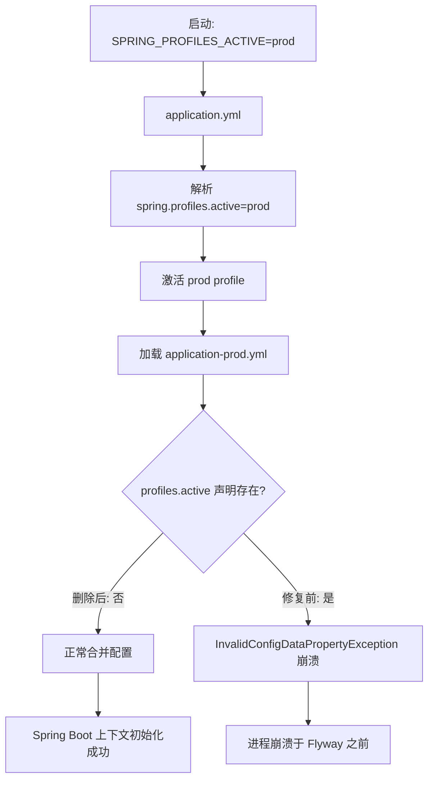

# Design — WI-0009: 修复 application-prod.yml 非法 profile 声明

> Work Item: WI-0009
> Workflow Type: bugfix_spec
> Base Spec Version: current
> 标准依据: specforge_final_fused_standard_v1_1_patch1_zh.md

## 修复方案概述

### DD-1 删除 application-prod.yml 中的 spring.profiles.active 声明

refs: [AC-1, AC-2, AC-3, AC-4]
constrained_by: Spring Boot 3.2.5 ConfigData 机制（profile-specific 资源禁止 spring.profiles.active 声明）

**变更动作**：删除 `fj-backend/fj-api/src/main/resources/application-prod.yml` 第 7-8 行（`profiles:` 与 `active: prod`），保留第 6 行 `spring:` 键，使其下直接接 `datasource:`。

修复前（第 6-9 行）：
```yaml
spring:
  profiles:
    active: prod
  datasource:
```

修复后（第 6-8 行）：
```yaml
spring:
  datasource:
```

**为什么是删除而非其他方案**：
- profile-specific 资源（文件名含 `-prod`）的加载入口由外部机制决定，文件内不应自声明 profile。
- `application.yml:12-13` 已提供合法激活入口 `spring.profiles.active: ${SPRING_PROFILES_ACTIVE:dev}`。
- 删除后 profile 激活路径完全不变，仅清除阻塞点。

---

## 技术依据

### DD-2 Spring Boot ConfigData 规则约束

refs: [AC-4]
constrained_by: Spring Boot 3.2.5（fj-backend/pom.xml:40）

Spring Boot 2.4+ 引入 ConfigData 机制，明确规定：
- profile-specific 资源（文件名匹配 `application-<profile>.yml`）**禁止**在其内部声明 `spring.profiles.active`。
- 违反此规则会在 `ConfigDataEnvironmentPostProcessor` 阶段抛出 `InvalidConfigDataPropertyException`。
- 文件名后缀 `-prod` 已经声明了该文件的 profile 归属，内部再声明构成语义冗余与规则违反。

本项目使用 Spring Boot 3.2.5（`fj-backend/pom.xml:40`），严格执行该规则。该写法在任何 2.4+ 版本都非法，非版本兼容性问题。

---

## 影响分析

### DD-3 profile 激活路径保障

refs: [AC-4]
constrained_by: application.yml:12-13

删除 `application-prod.yml` 内的 `spring.profiles.active` 后，prod profile 的激活路径如下：



**结论**：删除不影响 profile 激活语义，反而清除阻塞点。配置合并阶段（datasource, flyway, jpa, jackson, fj.*, logging, management）不受任何影响。

---

## 风险评估

### DD-4 变更风险评估

refs: [AC-1, AC-2]

| 维度 | 评估 | 说明 |
|------|------|------|
| 变更范围 | 极小 | 单文件、2 行删除，零新增 |
| 行为影响 | 零功能影响 | 仅移除非法声明，不改任何配置语义 |
| 回滚成本 | 极低 | git revert 单次提交即可 |
| 兼容性风险 | 无 | 修复方向与 Spring Boot 官方规则一致 |
| 数据风险 | 无 | 不涉及数据库 schema 或数据变更 |
| 配置丢失风险 | 无 | 被删除的 `profiles.active` 本就非法且冗余，激活入口由 application.yml 承担 |

**总体风险等级：极低（Minimal）**

本修复属于"删除一行非法代码"类，是缺陷修复中风险最低的类别。

---

## 不变行为保障

### DD-5 不变行为契约

refs: [AC-1, AC-2]
constrained_by: requirements.md「不变行为」章节 7 项约束

修复必须保持以下不变量（invariants）：

1. **配置完整性**：除被删除的第 7-8 行外，application-prod.yml 其余所有行字节级保持不变。
2. **YAML 结构有效性**：`spring:` 键下直接接 `datasource:`（缩进 2 空格），无悬挂键、无结构断裂。
3. **主配置不变**：`application.yml` 零修改（其第 12-13 行的激活入口合法且必要）。
4. **环境变量注入不变**：`${DB_USER}`、`${DB_PASSWORD}`、`${JWT_SECRET}`、`${CORS_ALLOWED_ORIGINS}` 等占位符语义保持。
5. **profile 激活机制不变**：仍通过 `application.yml:13` 的 `${SPRING_PROFILES_ACTIVE:dev}` 激活，外部注入 `prod` 时加载 application-prod.yml。
6. **其余配置组不变**：server、spring.datasource（含 HikariCP 池参数）、spring.flyway、spring.jpa、spring.jackson、spring.servlet.multipart、fj.security、fj.cache、fj.export、logging、management 全部保持原值。

---

## Out of Scope（不做什么）

- 不修改 `application.yml`（主配置合法且必要）
- 不新增任何 profile 文件或配置项
- 不修改数据库 schema 或执行数据迁移
- 不执行重新构建 jar 与部署（该职责归属 WI-0008 ops_task）
- 不修改 svr-lg 生产环境外部配置（.env、nginx、外部 application-prod.yml 等）
- 不重构配置加载机制或引入配置校验工具
- 不引入启动健康检查脚本
- 不回溯处理 WI-0002 脚手架源头缺陷（仅作根因参考）

---

## Assumptions（设计假设）

- 假设 `application.yml:12-13` 的 `${SPRING_PROFILES_ACTIVE:dev}` 声明在部署时由外部注入 `prod`（WI-0008 部署流程负责）。
- 假设 Spring Boot 3.2.5 的 ConfigData 规则版本稳定（该规则自 2.4 起未变）。
- 假设本地验证时可通过设置 `SPRING_PROFILES_ACTIVE=prod` 复现 prod profile 加载路径。
- 假设项目中仅 `application-prod.yml` 一处含此非法声明（已通过 E9 文件清单确认 resources 目录仅有 application.yml + application-prod.yml 两个 profile 文件）。
- 假设本地构建环境（Maven + JDK）可正常执行 `mvn package` 以验证 AC-3。

---

## 正确性属性（用于验证 / PBT）

- **P1**：修复后 `grep -c "spring.profiles.active" application-prod.yml` 返回 0。
- **P2**：修复后 `grep -c "profiles:" application-prod.yml` 返回 0。
- **P3**：修复后 YAML 解析无错误，`spring.datasource.url` 键存在且值为 `jdbc:postgresql://127.0.0.1:5432/fj_inspect`。
- **P4**：修复后源文件总行数为 71（原 73 行 - 删除 2 行）。
- **P5**：`application.yml` 内容字节级不变（修改前后 md5 一致）。
- **P6**：修复后 `spring:` 键的直接子键集合为 `{datasource, flyway, jpa, jackson, servlet}`，与修复前完全一致（仅移除了 `profiles` 子键）。

---

## 架构自检（A1-A5）

- **A1 单一职责**：本次修复仅作用于"配置合法性"单一关注点，不混入其他变更。✅
- **A2 显式依赖**：Mermaid 图显式标注了 profile 激活的完整依赖链（外部变量 → application.yml → profile 激活 → application-prod.yml）。✅
- **A3 可替换性**：N/A（配置文件修复，无组件抽象）。✅（不适用项已声明）
- **A4 失败可观测**：失败路径明确——若修复无效，Spring Boot 启动日志会再次抛 `InvalidConfigDataPropertyException`，定位精确。✅
- **A5 边界明确**：Out of Scope 与 Assumptions 段已明确边界。✅
