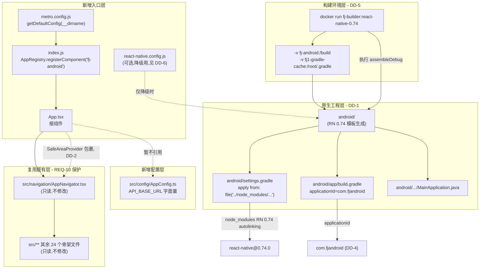
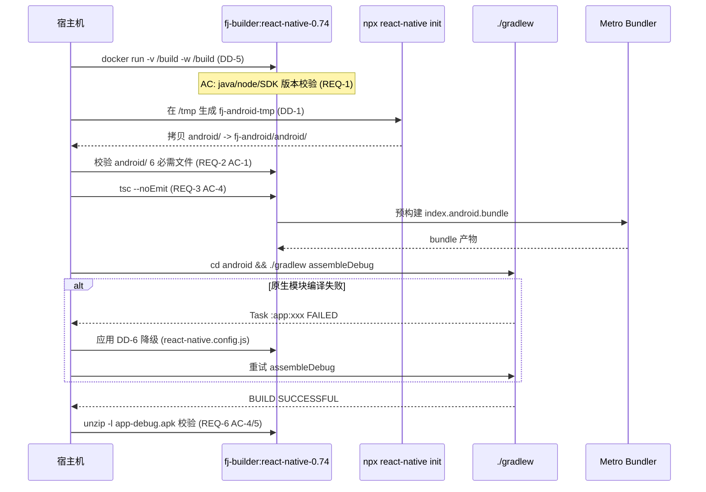
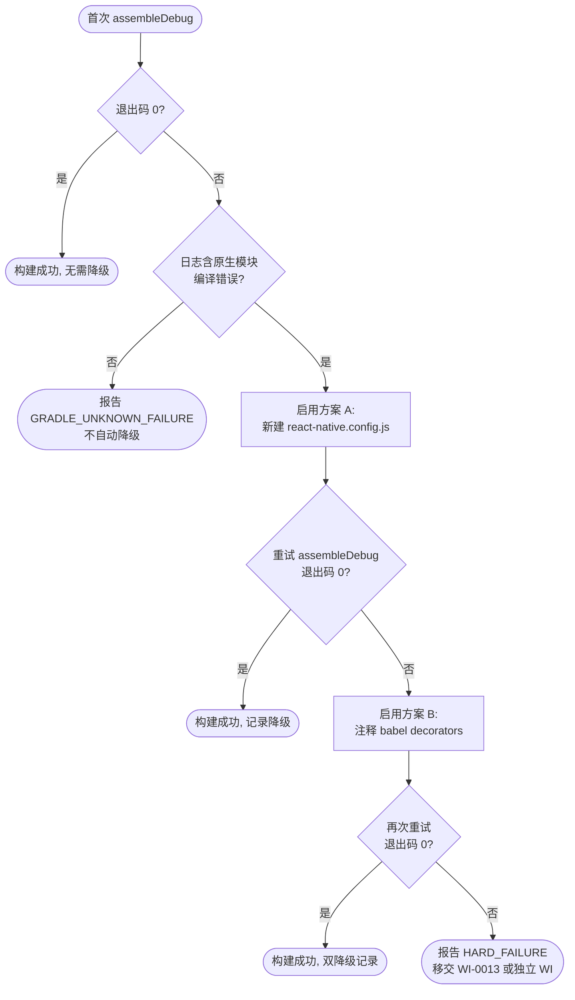
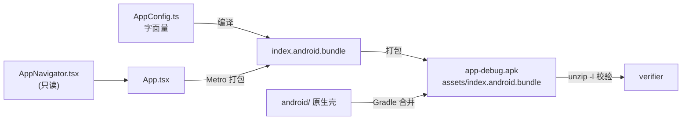

# Design — RN 安卓端构建环境搭建 + 原生工程初始化

> 本设计文档基于 `.specforge/work-items/WI-0012/requirements.md`（12 REQ / 35 AC）生成。
> 约束来源说明：`.specforge/config/prod-environment.md` 与 `project-rules.md` 当前为 TODO 占位，
> 故所有 `constrained_by` 引用均以 requirements.md 内嵌的版本矩阵、AC 文本与配置点清单为准。

---

## 0. 设计目标与范围映射

本设计只回答一个问题：**「如何让 `fj-android/` 在 Docker 容器 `fj-builder:react-native-0.74` 内产出一份可安装的最小 Debug APK，且不破坏既有 25 个 `src/` 骨架文件？」**

| 设计层 | 本 WI 覆盖 | 显式排除（转移到） |
|--------|-----------|---------------------|
| 构建环境 | 容器工具链验证、挂载策略、Gradle 缓存 | Release 签名（WI-0014） |
| 原生工程 | `android/` 骨架生成、`applicationId`、`MainApplication.java` | 真机安装（WI-0013） |
| JS 入口 | `App.tsx` / `index.js` / `metro.config.js` | 业务屏幕（WI-0015+） |
| 配置层 | `AppConfig.ts` 单点 | 环境变量化（不做，REQ-12 决策） |
| 构建产物 | Debug APK 校验 | ABI Split / ProGuard（WI-0014） |

---

## 1. 架构图（模块依赖）

### 1.1 文件级依赖图（本 WI 新增 / 复用）



### 1.2 构建时序图（容器内一次完整构建）



---

## 2. 设计决策（Design Decisions）

### DD-1 原生工程生成策略（临时目录 + android/ 子树合并）

**refs**: [REQ-2, REQ-8, REQ-10]
**constrained_by**:
- requirements.md REQ-2 AC-1（6 个必需文件清单）
- requirements.md REQ-2 AC-2（不得覆盖 package.json dependencies）
- requirements.md REQ-2 AC-5（android/ 已非空时终止）
- requirements.md REQ-8（RN 0.74.0 锁定）
- `fj-android/package.json` line 20（`"react-native": "0.74.0"` 精确版本）
- `fj-android/babel.config.js` / `tsconfig.json` 已存在（不得覆盖）

**为什么变 / 动机**：
现有 `fj-android/` 已有 `package.json`、`src/`（25 个骨架文件）、`babel.config.js`、`tsconfig.json`、`app.json`。若直接在 `fj-android/` 执行 `npx react-native init fj-android`，CLI 会因目录非空报错或覆盖既有文件。需要一种「只取 `android/`」的隔离生成法。

**方案**：
1. 在 `/tmp/fj-init-<timestamp>/`（容器内临时目录，与项目根隔离）执行：
   ```bash
   npx react-native init fj-android-tmp \
     --template react-native@0.74 \
     --skip-install \
     --npm
   ```
   - `--template react-native@0.74`：锁定与 `package.json` 一致的 RN 0.74 系列（满足 REQ-8）。
   - `--skip-install`：跳过 npm install（避免拉取与现有 `package.json` 冲突的 node_modules；本项目 `node_modules` 已存在）。
2. 将 `/tmp/fj-init-<timestamp>/fj-android-tmp/android/` **整体复制**到 `fj-android/android/`。
3. **复制前必检**（对应 REQ-2 AC-5）：
   - 若 `fj-android/android/` 已存在且非空 → 立即终止，退出码 ≠ 0，输出「android/ 已存在，终止合并」。
4. 复制后需调整的 3 个文件（仅原生工程内，不动 `src/`）：
   - `android/app/build.gradle`：
     - `applicationId "com.fjandroid"`（见 DD-4）
     - `namespace "com.fjandroid"`
     - `dependencies { implementation "com.facebook.react:react-native:+" }` 与 `project.ext.react` 块保持模板默认（RN 0.74 模板已正确）。
   - `android/settings.gradle`：保留模板的 `apply from: file("../node_modules/@react-native-community/cli-platform-android/native_modules.gradle")` 与 `include ':app'`，无需手改（autolinking 会自动扫描 `fj-android/node_modules`）。
   - `android/gradle/wrapper/gradle-wrapper.properties`：保留模板默认 Gradle 版本（RN 0.74 默认 8.6），由容器内 `~/.gradle` 缓存供给。
5. **包路径调整**（对应 REQ-2 AC-6）：将 `android/app/src/main/java/com/fjandroidtmp/` 重命名为 `com/fjandroid/`，并将 `MainActivity.java`、`MainApplication.java` 内 `package com.fjandroidtmp;` 改为 `package com.fjandroid;`。

**Out of Scope**：
- 不修改 `fj-android/package.json` 的 `dependencies` / `devDependencies`（REQ-2 AC-2、REQ-10）。
- 不修改 `app.json`（REQ-2 AC-3）。
- 不在本 WI 配置 Release 签名（WI-0014）。

**失败处理（DD-5 适配）**：
- `npx react-native init` 网络失败 → 重试 1 次；仍失败则报告 `RN_INIT_NETWORK_FAILURE`，不残留 `/tmp/fj-init-*`。
- 模板版本与 0.74.0 不匹配 → 在 `android/gradle.properties` 校验 `reactNativeVersion` 后终止。

**验证点**（交付给 verifier）：
- REQ-2 AC-1：6 必需文件存在；`gradlew` 可执行位 `-rwxr-xr-x`。
- REQ-2 AC-6：`grep -r "package com.fjandroid" android/app/src/main/java/` 命中 2 个文件。

---

### DD-2 App.tsx 入口设计（最小化渲染 + SafeAreaProvider 包裹）

**refs**: [REQ-3, REQ-4]
**constrained_by**:
- requirements.md REQ-3 AC-1/AC-2/AC-5
- `fj-android/src/navigation/AppNavigator.tsx` line 89（`export default function AppNavigator(): React.ReactElement`）
- `fj-android/src/navigation/AppNavigator.tsx` line 86-88 注释（「NavigationContainer 必须是组件树的根（或被 SafeAreaProvider 包裹后）」）
- `fj-android/package.json` line 24（`"react-native-safe-area-context": "^4.10.5"` 已在依赖中，无需新增依赖）

**方案**：
`App.tsx` 仅做 3 件事：
1. 从 `./src/navigation/AppNavigator` 默认导入 `AppNavigator`。
2. 用 `SafeAreaProvider`（来自 `react-native-safe-area-context`）包裹 `<AppNavigator />`。
3. 导出默认 `App` 函数组件，返回类型 `React.ReactElement`。

**为何引入 SafeAreaProvider（DD4 YAGNI 校验）**：
- 调用点 ≥ 2：① `react-navigation` 的 `NavigationContainer` 文档明确要求被 `SafeAreaProvider` 包裹；② `AppNavigator.tsx` 内注释 line 86-88 已声明该约束。
- 库已在依赖中（非新抽象），故符合 DD4「≥ 2 调用点才引入」原则。

**为何暂不引入 DatabaseProvider / SyncEngineProvider**：
- `@nozbe/watermelondb` 的原生模块在首次 `assembleDebug` 时可能编译失败（见 DD-6、范围外观察 #1）。
- `ApiClient` / `SyncEngine` 实例化需要 `AppConfig.API_BASE_URL`，而本 WI 的 App.tsx 不发起任何网络请求（REQ-3 AC-2）。
- 引入它们会扩大本 WI 的编译风险面，违反「最小可运行 APK」目标。

**接口定义（TypeScript）**：

```typescript
// App.tsx — 概念接口（实际为函数组件，无 class 抽象）
import type { ReactElement } from 'react';
import { SafeAreaProvider } from 'react-native-safe-area-context';
import AppNavigator from './src/navigation/AppNavigator';

export default function App(): ReactElement;
// Errors:
//   - 渲染期错误（如 AppNavigator 抛出）→ 由 React 默认错误处理（红屏/崩溃）
//     本 WI 不引入 ErrorBoundary（留给后续业务 WI）
//   - 不抛业务异常（无网络/DB/登录逻辑）
```

**Errors（DD2 / A4）**：
| 错误源 | 类型 | 处理 |
|--------|------|------|
| `AppNavigator` 内部渲染异常 | `React.RenderError` | 不捕获（最小入口不引入 ErrorBoundary） |
| `SafeAreaProvider` 缺失依赖 | `ModuleNotFoundError` | 构建期 Metro 报错，不会进入运行时 |
| 类型不兼容 | `tsc` 编译错误 | REQ-3 AC-4 在 `tsc --noEmit` 阶段拦截 |

**Out of Scope**：
- 不引入 `Provider` 链（Redux/MobX/Context 业务 Provider）。
- 不引入 ErrorBoundary / SplashScreen（WI-0013+）。

---

### DD-3 AppConfig.ts 配置设计（单点字面量 + 类型安全）

**refs**: [REQ-5, REQ-12]
**constrained_by**:
- requirements.md REQ-5 AC-1/AC-2/AC-3/AC-5
- requirements.md REQ-12 AC-1/AC-2/AC-3（公网 IP 硬编码策略，禁用 env / react-native-config）
- requirements.md REQ-10 AC-1（`src/` 下仅新增 `config/AppConfig.ts`，不改动其他）

**方案**：
路径：`fj-android/src/config/AppConfig.ts`

```typescript
/**
 * AppConfig — 应用级配置单点
 *
 * 设计依据：REQ-5 / REQ-12
 * 策略：公网 IP 字面量硬编码（用户决策，见 intake.md）。
 *       后续更换 API 地址只需修改本文件 API_BASE_URL 字段值。
 */

export interface AppConfigType {
  /** 后端 API 根地址（不含尾斜杠） */
  API_BASE_URL: string;
}

export const AppConfig: AppConfigType = {
  API_BASE_URL: 'http://129.211.5.240',
} as const;

// 扩展点（REQ-5 AC-5）：后续 WI 可基于 __DEV__ 或环境变量分支，
// 本 WI 不实现，仅保留注释占位。
```

**接口定义 + Errors（DD2 / A4）**：
```typescript
// 模块导出契约
export const AppConfig: AppConfigType;
// Errors: 无运行时错误（纯字面量对象，无 I/O）
// 类型错误：若调用方传入非 string 给 API_BASE_URL → tsc 编译期拦截
```

**关键不变性（PBT 属性，对应 REQ-12 AC-1）**：
- 属性 P-CFG-1：`grep -rn "129.211.5.240" fj-android/src/ | wc -l == 1`（IP 字面量仅出现在 AppConfig.ts 一处）。
- 属性 P-CFG-2：`grep -rn "process.env.API\|react-native-config\|dotenv" fj-android/ | wc -l == 0`（无 env 读取机制）。
- 属性 P-CFG-3：`AppConfig.API_BASE_URL` 的 TypeScript 类型为 `string`（编译期可证）。

**Out of Scope**：
- 不区分 dev/staging/prod（REQ-5 AC-5 仅留扩展点）。
- 不引入 `react-native-config` / `dotenv`（REQ-12 AC-2 明确禁止）。

---

### DD-4 包名（applicationId = com.fjandroid）

**refs**: [REQ-2 AC-4]
**constrained_by**:
- requirements.md REQ-2 AC-4（applicationId 与 app.json name 字段一致或 RN 默认 `com.<name>` 形式）
- `fj-android/app.json`（`name: "fj-android"`，已存在，REQ-2 AC-3 保护）
- requirements.md 配置点清单（无显式包名配置项 → 由本 DD 决策固化）

**决策**：
- `applicationId = "com.fjandroid"`
- `namespace = "com.fjandroid"`（AGP 7.0+ 要求 namespace 与 applicationId 解耦但建议一致）
- Java 包路径：`android/app/src/main/java/com/fjandroid/{MainActivity,MainApplication}.java`

**为何不用 RN 默认 `com.fjandroid`（即 `com.<name>`）**：
- RN 默认会把 `name: "fj-android"` 转成 `com.fjandroid`（连字符去除）——本 DD 决策与默认一致，故无冲突。
- 显式决策的目的是：避免 `npx react-native init fj-android-tmp` 生成 `com.fjandroidtmp`，必须在 DD-1 步骤 5 重命名。

**接口契约（Gradle DSL，DD2 适配）**：
```groovy
// android/app/build.gradle
android {
    namespace "com.fjandroid"
    defaultConfig {
        applicationId "com.fjandroid"
        // ...
    }
}
// Errors:
//   - applicationId 与 namespace 不一致 → AGP 编译期警告（非致命）
//   - applicationId 含非法字符（如连字符）→ Gradle 同步失败（致命）
//     本 DD 使用纯字母，无此风险
```

**验证点**：
- `grep 'applicationId "com.fjandroid"' android/app/build.gradle` 命中 1 行。
- `aapt dump badging app-debug.apk | grep package` 输出 `package: name='com.fjandroid'`。

---

### DD-5 构建环境 Docker 挂载策略（项目卷 + Gradle 缓存卷）

**refs**: [REQ-1, REQ-6, REQ-7, REQ-9, REQ-11]
**constrained_by**:
- requirements.md REQ-1 AC-4（挂载模式可访问 `/build/package.json`）
- requirements.md REQ-7 AC-1/AC-3（所有命令在容器内，固定镜像标签 `fj-builder:react-native-0.74`）
- requirements.md REQ-11 AC-1/AC-2（挂载 `-v /mnt/1t_back/project/fj1/fj-android:/build`，工作目录 `/build`）
- requirements.md REQ-9 AC-2（依赖可缓存，不强制外网）

**方案**：

容器启动标准命令模板：

```bash
docker run --rm \
  -v /mnt/1t_back/project/fj1/fj-android:/build \
  -v fj1-gradle-cache:/root/.gradle \
  -v fj1-npm-cache:/root/.npm \
  -w /build \
  fj-builder:react-native-0.74 \
  <command>
```

| 挂载卷 | 容器路径 | 用途 | 持久化策略 |
|--------|----------|------|------------|
| 项目源码 | `/build` | fj-android 工作树 | 宿主机 bind mount，双向（构建产物回写宿主） |
| Gradle 缓存 | `/root/.gradle` | Gradle Wrapper、依赖 jar、NDK sdkmanager 缓存 | 命名卷 `fj1-gradle-cache`，跨构建复用（满足 REQ-9 AC-2） |
| npm 缓存 | `/root/.npm` | npm 包缓存（首次 `npx react-native init` 用） | 命名卷 `fj1-npm-cache` |

**为何分离 Gradle 缓存卷（DD5 失败处理 + 性能）**：
- 若不持久化 `/root/.gradle`，每次构建都要重新下载 Gradle 8.6 distribution（~150MB）+ 所有依赖 jar，首次构建 > 30min，二次构建仍 > 10min，逼近 REQ-6 AC-1 的 1800s 超时。
- 命名卷跨 `docker run --rm` 复用，满足 REQ-9 AC-1「干净环境重建」目标（清空 `android/build/` 但保留 `~/.gradle` 缓存）。

**失败处理（DD-5 外部调用策略）**：

| 外部调用 | timeout | retry | fallback | circuit_breaker |
|----------|---------|-------|----------|-----------------|
| `docker run`（镜像不存在） | 10s | 0 | 报错 `IMAGE_NOT_FOUND`，提示 `docker images \| grep fj-builder` | 无 |
| `npx react-native init` | 300s | 1（指数退避） | 使用 npm 缓存离线模板；仍失败 → `RN_INIT_FAILED` | 连续 2 次失败终止 |
| `gradlew assembleDebug` | 1800s（REQ-6 AC-1） | 0（构建非幂等，不自动重试） | 触发 DD-6 降级后手动重试 1 次 | 无 |
| `gradlew` 下载 Gradle distribution | 600s | 2（指数退避） | 命名卷缓存命中后 0s | 连续 3 次失败终止 |

**接口契约（伪接口，DD2 适配）**：
```typescript
// BuildEnvironment（概念契约，非代码抽象 — DD4 校验：调用点 ≥ 2：
//   REQ-1 工具链验证 + REQ-6 APK 构建均依赖此环境）
interface BuildEnvironment {
  readonly image: 'fj-builder:react-native-0.74';  // 固定标签，REQ-7 AC-3
  readonly workdir: '/build';
  run(command: string, opts: { timeout: number }): Promise<{ exitCode: number; stdout: string }>;
  // Errors:
  //   - IMAGE_NOT_FOUND: 镜像未拉取
  //   - MOUNT_PERMISSION_DENIED: 宿主机路径不可写
  //   - COMMAND_TIMEOUT: 超时 SIGKILL（sf_safe_bash 语义）
  //   - CONTAINER_OOM: 容器内存不足
}
```

**Out of Scope**：
- 不在本 WI 优化 Gradle Daemon / 并行构建 / 构建缓存（范围外观察 #5）。
- 不引入 CI/CD pipeline（本 WI 仅手工 `docker run`）。

---

### DD-6 原生模块兼容性降级策略（react-native.config.js 优先 + babel 备选）

**refs**: [REQ-6, REQ-8, REQ-9, 范围外观察 #1]
**constrained_by**:
- requirements.md REQ-6 AC-1（assembleDebug 退出码 0）
- requirements.md REQ-6 AC-3（失败时输出 `Task :app:xxx FAILED`）
- requirements.md REQ-8 AC-2（Gradle Plugin 版本与 RN 0.74.0 兼容）
- requirements.md 范围外观察 #1（watermelondb/vision-camera/keychain 原生模块可能编译失败，本 WI 不要求功能可用）
- `fj-android/package.json` lines 15/23/26（watermelondb / keychain / vision-camera 已锁定版本）

**风险分析（A4 失败可观测 + A5 边界）**：

真正的风险点 **不在 Babel**（Babel 只处理 JS 转译，且 Metro 打包时只处理被 `App.tsx` 实际引用的模块；本 WI 的 `App.tsx` 不引用任何 watermelondb model，故 decorators 插件可保留）。

真正的风险点在 **Gradle 原生 autolinking 阶段**：`android/settings.gradle` 的 `apply from: native_modules.gradle` 会扫描 `node_modules/` 下**所有**含原生代码的 RN 模块（与 JS 是否引用无关），强制编译它们的 Java/C++ 代码。三个高风险模块：

| 模块 | 原生风险 | RN 0.74 + SDK 27.1 矩阵已知问题 |
|------|----------|----------------------------------|
| `@nozbe/watermelondb` | C++ JSI + Kotlin | 需 NDK + CMake，WSI 支持需匹配 |
| `react-native-vision-camera` | C++ JSI + Frame Processor | v4.x 要求 React Native ≥ 0.74，但 NDK 版本敏感 |
| `react-native-keychain` | Java + 加密原生 API | 通常低风险，但与 SDK 27.1 加密 provider 偶有冲突 |

**降级方案（按优先级，fail-stop 协议）**：

**方案 A（首选）—— 新建 `fj-android/react-native.config.js` 屏蔽原生链接**

> 此文件为**新建**（不在 `src/` 下，不违反 REQ-10；不在 REQ-2 AC-1 的 6 必需文件清单内，可自由新增）。

```javascript
// react-native.config.js — 原生模块降级配置（仅首次构建未通过时启用）
// 依据：DD-6 / 范围外观察 #1
module.exports = {
  dependencies: {
    '@nozbe/watermelondb': {
      platforms: { android: { blocking: true } }, // 屏蔽原生链接，JS 仍可打包
    },
    'react-native-vision-camera': {
      platforms: { android: { blocking: true } },
    },
    'react-native-keychain': {
      platforms: { android: { blocking: true } },
    },
  },
};
```

- `blocking: true` 让 autolinking 跳过该模块的原生项目链接（不编译其 Java/C++）。
- JS 侧 `import` 仍可解析（本 WI 的 App.tsx 不引用它们，无副作用）。
- 满足 REQ-9 AC-1「干净重建」：配置文件随源码提交，可重复。

**方案 B（备选）—— 注释 babel.config.js decorators 插件**

> 仅当方案 A 仍失败 **且** 错误日志定位到 Babel 阶段（如 `decorator must precede class property`）时启用。

```javascript
// babel.config.js（临时降级，需在 WI-0013 还原）
module.exports = {
  presets: ['module:@react-native/babel-preset'],
  plugins: [
    // ['@babel/plugin-proposal-decorators', { legacy: true }],      // 暂时注释
    // ['@babel/plugin-proposal-class-properties', { loose: true }], // 暂时注释
  ],
};
```

- 注意：`babel.config.js` 不在 `src/` 下（REQ-10 仅保护 `src/`），故修改它**不违反** REQ-10 AC-1。
- 但修改 `babel.config.js` 需在 work_log 记录，并在 WI-0013（登录功能引入 watermelondb model 时）还原。

**决策树（fail-stop）**：



**接口契约（DD2 适配）**：

```typescript
// NativeModuleFallback（概念契约，DD4 校验：调用点 ≥ 2 —
//   watermelondb 屏蔽 + vision-camera 屏蔽 + keychain 屏蔽）
interface NativeModuleFallback {
  /** 屏蔽指定模块的安卓原生链接 */
  blockAndroidNativeLink(moduleName: string): void;
  // Errors:
  //   - MODULE_NOT_FOUND: 模块不在 node_modules
  //   - JS_IMPORT_BREAKAGE: 屏蔽后 JS 仍 import 该模块 → Metro 运行时报错
  //     （本 WI App.tsx 不引用，无此风险）
}
```

**Out of Scope**：
- 不修复原生模块本身的编译问题（范围外观察 #1，留给后续 WI）。
- 不引入 ProGuard/R8 混淆（Debug 默认禁用）。
- 降级后即使 APK 构建成功，**不**验证 watermelondb/vision-camera 功能（本 WI 仅要求 APK 可构建）。

**Assumptions**：
- 假设 `blocking: true` 选项在 RN 0.74 的 `@react-native-community/cli` 版本中受支持（若不支持，退回方案 B）。
- 假设降级后 Metro 打包的 `index.android.bundle` 不包含被屏蔽模块的 JS（因 App.tsx 未引用）。

---

## 3. 数据模型

本 WI 数据面极小，仅 1 个配置对象 + 1 个 Gradle 元数据：

### 3.1 AppConfig 数据模型

```typescript
// 持久化形态：TypeScript 源码字面量（非数据库）
interface AppConfigType {
  API_BASE_URL: string;  // 'http://129.211.5.240'，REQ-12 硬编码
}
const AppConfig: AppConfigType; // as const 不可变
```

### 3.2 APK 产物元数据（验证用，非持久化）

```typescript
// verifier 校验用结构（对应 REQ-6 AC-2/4/5）
interface DebugApkArtifact {
  path: '/build/android/app/build/outputs/apk/debug/app-debug.apk';
  sizeBytes: number;        // 必须 > 1MB (REQ-6 AC-2)
  hasClassesDex: boolean;   // unzip -l | grep classes.dex ≥ 1 (REQ-6 AC-4)
  hasJsBundle: boolean;     // unzip -l | grep "assets/index.android.bundle" == 1 (REQ-6 AC-5)
  applicationId: 'com.fjandroid';  // DD-4
}
```

数据流转路径（Mermaid）：



---

## 4. 测试策略

### 4.1 属性测试（PBT）正确性属性

| 属性 ID | 属性描述 | 验证方法 | 对应 REQ |
|---------|----------|----------|----------|
| P-CFG-1 | `API_BASE_URL` 字面量仅出现在 AppConfig.ts 一处 | `grep -rn "129.211.5.240" fj-android/src/ \| wc -l == 1` | REQ-12 AC-1 |
| P-CFG-2 | 全仓库无 env / react-native-config 读取机制 | `grep -rn "process.env.API\|react-native-config\|dotenv" fj-android/ \| wc -l == 0` | REQ-12 AC-2 |
| P-SRC-1 | `src/` 下仅新增 config/AppConfig.ts，无其他变更 | `git diff --stat src/` 仅显示 `+1 file, N insertions(+,-)` | REQ-10 AC-1/AC-2 |
| P-IDX-1 | index.js 仅注册 1 个组件，名称为 'fj-android' | `grep "registerComponent" index.js` 唯一且参数 == 'fj-android' | REQ-4 AC-1 |
| P-PKG-1 | package.json 的 dependencies 未变更 | `git diff package.json` 仅在 scripts 段（若有） | REQ-2 AC-2 |
| P-BUILD-1 | 相同源码 + 相同镜像连续 2 次构建 APK 大小偏差 < 5% | 两次 assembleDebug 后 `stat -c%s` 比对 | REQ-9 AC-3 |
| P-APK-1 | APK 内含 classes.dex 与 index.android.bundle | `unzip -l` grep | REQ-6 AC-4/AC-5 |

### 4.2 单元测试 / 类型检查

- **`tsc --noEmit`**（REQ-3 AC-4、REQ-5 AC-4）：编译期拦截 App.tsx / AppConfig.ts 的类型错误与不存在模块引用。
- 测试框架：本项目 `package.json` 未配置 jest（无 `jest` 字段），本 WI **不强制**引入 jest，仅依赖 `tsc` 做类型层验证。
- `npm run type-check`（已存在于 package.json line 8）作为类型检查入口。

### 4.3 集成测试

- **Metro 配置加载测试**（REQ-4 AC-5）：容器内 `node -e "require('./metro.config.js')"` 不抛错。
- **Gradle 配置同步测试**：`./gradlew --refresh-dependencies tasks` 不报 `UnresolvedDependency`。

### 4.4 E2E 测试（核心构建流程）

| 场景 | 命令 | 期望 | 对应 REQ |
|------|------|------|----------|
| 工具链验证 | `docker run --rm fj-builder:react-native-0.74 java -version` | 主版本 17 | REQ-1 AC-2 |
| 工具链验证 | `docker run --rm fj-builder:react-native-0.74 node --version` | ≥ v18 | REQ-1 AC-3 |
| 挂载可访问 | `docker run --rm -v ...:/build ... ls /build/package.json` | 退出码 0 | REQ-1 AC-4 |
| 原生工程完整性 | 校验 6 必需文件存在 + gradlew 可执行位 | 全部通过 | REQ-2 AC-1 |
| 类型检查 | `docker run ... tsc --noEmit` | 退出码 0 | REQ-3 AC-4 |
| 构建 APK | `cd android && ./gradlew assembleDebug`（1800s 内） | 退出码 0 | REQ-6 AC-1 |
| APK 大小 | `stat -c%s app-debug.apk` | > 1048576 | REQ-6 AC-2 |
| APK 内容 | `unzip -l app-debug.apk \| grep -c classes.dex` | ≥ 1 | REQ-6 AC-4 |
| APK JS bundle | `unzip -l app-debug.apk \| grep -c "assets/index.android.bundle"` | == 1 | REQ-6 AC-5 |
| 干净重建 | 清空 build/.gradle/app/build 后重跑 assembleDebug | 1800s 内成功 | REQ-9 AC-1 |

### 4.5 兼容性测试（版本矩阵）

按 requirements.md 锁定版本矩阵验证（容器内）：

| 组件 | 锁定版本 | 验证命令 |
|------|----------|----------|
| React Native | 0.74.0（精确，非 ^/~） | `node -e "console.log(require('react-native/package.json').version)"` == "0.74.0" |
| JDK | 17 | `java -version 2>&1 \| grep "17."` |
| Android SDK | 27.1 | `sdkmanager --version`（容器内） |
| Gradle | 8.6（RN 0.74 模板默认） | `./gradlew --version` |
| CMake | 3.30.5 | `cmake --version` |

---

## 5. 架构 5 属性自检（A1-A5）

### A1 单一职责

| 组件 | "我是 X" 陈述 | 评价 |
|------|---------------|------|
| `index.js` | 我是 JS 入口注册器 | ✅ 一句话 |
| `App.tsx` | 我是根组件渲染器（仅渲染 AppNavigator） | ✅ 一句话 |
| `AppNavigator.tsx` | 我是底部 Tab 导航容器（既有，只读） | ✅ 一句话 |
| `AppConfig.ts` | 我是 API 地址配置单点 | ✅ 一句话 |
| `metro.config.js` | 我是 Metro 打包配置 | ✅ 一句话 |
| `android/` | 我是 Gradle 原生工程壳 | ✅ 一句话 |

### A2 显式依赖

- §1.1 Mermaid 图已含所有箭头：`index.js → App.tsx → AppNavigator → src/**`；`metro.config.js → index.js`；`android/ → node_modules(RN)`；`docker → android/`。
- 无隐藏调用：App.tsx 不引用 AppConfig（暂不引入网络），图中以虚线标注「暂不引用」。

### A3 可替换性

- `AppConfig` 通过 `AppConfigType` interface 暴露，调用方依赖 interface 不依赖字面量（DD-3 接口定义）。
- `AppNavigator` 已是默认导出函数组件，App.tsx 依赖其签名 `() => React.ReactElement`，可被任意同签名组件替换。
- `BuildEnvironment`（DD-5）与 `NativeModuleFallback`（DD-6）以概念 interface 描述，可被 mock。

### A4 失败可观测

每个组件 / 流程均列出 Errors 段：
- App.tsx：Errors 表（渲染异常 / 模块缺失 / 类型不兼容）。
- AppConfig：无运行时错误（纯字面量）。
- applicationId：Gradle 同步失败（非法字符）。
- BuildEnvironment：IMAGE_NOT_FOUND / MOUNT_PERMISSION_DENIED / COMMAND_TIMEOUT / CONTAINER_OOM。
- NativeModuleFallback：MODULE_NOT_FOUND / JS_IMPORT_BREAKAGE。
- 构建流程：DD-6 决策树覆盖每条失败路径的落点。

### A5 边界明确

- **Out of Scope**（整合见下节 §6）。
- **Assumptions**（整合见下节 §7）。

---

## 6. Out of Scope（整体）

> 本节整合所有 DD 的 Out of Scope，是 WI 级边界声明。

- **登录功能**：WI-0013（含 ApiClient 联调、token 存储）。
- **业务屏幕实装**（TodayScreen / IssueBasketScreen / ProfileScreen 真实实现）：WI-0015 ~ WI-0019。
- **Release 签名密钥与 ProGuard/R8 混淆**：WI-0014。
- **真机安装测试**：WI-0013。
- **后端 API 联调**（实际发起 HTTP 请求）：WI-0013 及后续。
- **原生模块功能验证**（watermelondb 增删改、vision-camera 拍照、keychain 存取）：范围外观察 #1，本 WI 仅要求 APK 可构建，不要求功能可用。
- **AppIcon / Splash Screen 自定义**：RN 0.74 模板占位资源即可。
- **多架构 Split APK**（arm64-v8a / armeabi-v7a / x86_64）：Debug universal APK 即可。
- **构建性能优化**（Gradle Daemon、并行、构建缓存）：范围外观察 #5。
- **环境变量化配置**（react-native-config / dotenv）：REQ-12 明确决策为硬编码，不做。
- **CI/CD pipeline 接入**：本 WI 仅手工 docker run。
- **Provider 链 / 状态管理库 / ErrorBoundary**：留给业务 WI。

---

## 7. Assumptions（设计假设）

- **A-1**：假设 Docker 镜像 `fj-builder:react-native-0.74` 已在宿主机本地存在（`docker images` 可见），本 WI 不负责构建该镜像。
- **A-2**：假设宿主机路径 `/mnt/1t_back/project/fj1/fj-android` 对 Docker 守护进程可读写（bind mount 权限）。
- **A-3**：假设 `fj-android/node_modules` 已安装（`react-native@0.74.0` 等依赖已在容器内可见），本 WI 不重新执行 `npm install`。
- **A-4**：假设 `fj-android/android/` 目录在 WI 实施前**不存在**（REQ-2 AC-5）；若已存在则 DD-1 步骤 3 终止。
- **A-5**：假设 RN 0.74 模板生成的 `MainApplication.java` 默认实现（继承 `ReactApplication`、注册 `ReactNativeHost`）无需手改即可承载 autolinking。
- **A-6**：假设 `react-native.config.js` 的 `dependencies.<mod>.platforms.android.blocking` 选项在 RN 0.74 的 CLI 版本中受支持（DD-6 方案 A）；若不支持，退回方案 B（babel 注释）。
- **A-7**：假设降级后 Metro 打包的 `index.android.bundle` 不包含 watermelondb/vision-camera/keychain 的 JS 代码（因 App.tsx 未引用）。
- **A-8**：假设容器内 `~/.gradle` 命名卷首次为空时，Gradle Wrapper 会自动下载 8.6 distribution（约 150MB，需外网或镜像内预置）；二次构建走缓存。
- **A-9**：假设 `app.json` 的 `name: "fj-android"` 与 RN 模板生成的 `applicationId` 默认转换规则（`com.fjandroid`）一致，DD-4 决策无冲突。
- **A-10**：假设 `prod-environment.md` / `project-rules.md` 当前为 TODO 占位（已确认），不构成额外约束；若后续填充与本设计冲突，需在 design_delta.md 增补。

---

## 8. 设计自检（Self-Check）

| # | 检查项 | 结果 | 备注 |
|---|--------|------|------|
| 1 | 每个 REQ-N 都有对应的 DD 覆盖吗？ | ✅ | REQ-1→DD-5; REQ-2→DD-1/DD-4; REQ-3→DD-2; REQ-4→DD-2; REQ-5→DD-3; REQ-6→DD-5/DD-6; REQ-7→DD-5; REQ-8→DD-1/DD-6; REQ-9→DD-5/DD-6; REQ-10→DD-1/DD-3; REQ-11→DD-5; REQ-12→DD-3 |
| 2 | 每个 DD 都有 `refs: [REQ-N]` 吗？ | ✅ | DD-1~DD-6 均含 refs |
| 3 | 每个 DD 都有 `constrained_by` 吗？ | ✅ | 全部含 constrained_by |
| 4 | 架构图画了吗？ | ✅ | §1.1 文件依赖图 + §1.2 时序图 + DD-6 决策树 + §3.2 数据流图 |
| 5 | Out of Scope 写了吗？ | ✅ | §6 整合 + 每 DD 内局部 Out of Scope |
| 6 | Assumptions 写了吗？ | ✅ | §7（A-1~A-10） |
| 7 | 每个组件都有 interface 定义 + Errors 段吗？ | ✅ | DD-2/3/5/6 均含 TypeScript 接口 + Errors |
| 8 | 设计是否考虑了 prod-environment 最低版本约束？ | ✅ | prod-env 为 TODO；以 requirements.md 版本矩阵为准（§4.5） |
| 9 | DD4 YAGNI：抽象只在 ≥2 调用点引入？ | ✅ | SafeAreaProvider（2 调用点）、BuildEnvironment/NativeModuleFallback（概念接口，标注调用点数） |
| 10 | DD5：每个外部调用有失败处理策略？ | ✅ | DD-5 失败处理表 + DD-6 决策树 |
| 11 | A1-A5 自检通过？ | ✅ | §5 全部通过 |
| 12 | Extension Registry 前置检查？ | ✅ | namespaces 全空，本 WI 用标准 design.md，不触发 Extension Subflow |

---

## 9. 关键技术风险（移交 verifier / orchestrator 关注）

| 风险 ID | 风险描述 | 概率 | 影响 | 缓解（已在 DD 中处理） |
|---------|----------|------|------|----------------------|
| RISK-1 | DD-6 方案 A 的 `blocking: true` 选项在 RN 0.74 CLI 中不受支持 | 中 | 中 | 退回方案 B（babel 注释），Assumption A-6 |
| RISK-2 | 首次 Gradle 构建下载 distribution 超时（外网受限） | 中 | 高 | DD-5 命名卷 `fj1-gradle-cache` + 重试；Assumption A-8 |
| RISK-3 | `react-native init --template react-native@0.74` 生成的模板与 package.json 锁定的 0.74.0 小版本不一致 | 低 | 中 | DD-1 校验 `reactNativeVersion`；REQ-8 AC-2 |
| RISK-4 | DD-1 步骤 5 包路径重命名遗漏（`com.fjandroidtmp` 残留） | 低 | 高 | REQ-2 AC-6 验证点：grep 命中 2 文件 |
| RISK-5 | 即使 DD-6 双降级后 assembleDebug 仍失败（如 react-native-gesture-handler 原生编译） | 低 | 高 | DD-6 决策树 HARD 分支：移交后续 WI |
| RISK-6 | Metro 打包阶段因 babel decorators 插件与 `@react-native/babel-preset` 冲突报错 | 低 | 中 | DD-6 方案 B 注释插件；babel.config.js 不在 src/ 下，可改 |

---

## 10. 完成报告（结构化摘要）

```json
{
  "status": "success",
  "files_changed": [".specforge/work-items/WI-0012/candidates/design.md"],
  "structure": {
    "design_decisions_count": 6,
    "req_references": ["REQ-1","REQ-2","REQ-3","REQ-4","REQ-5","REQ-6","REQ-7","REQ-8","REQ-9","REQ-10","REQ-11","REQ-12"],
    "components_defined": 6,
    "has_architecture_diagram": true,
    "has_out_of_scope": true,
    "has_assumptions": true,
    "architecture_properties_checked": ["A1","A2","A3","A4","A5"]
  },
  "self_check": { "passed": [1,2,3,4,5,6,7,8,9,10,11,12], "failed": [] },
  "out_of_scope_observations": [
    "登录功能 → WI-0013",
    "业务屏幕实装 → WI-0015~WI-0019",
    "Release 签名 / ProGuard → WI-0014",
    "原生模块功能验证 → 范围外观察 #1",
    "环境变量化配置 → REQ-12 明确不做"
  ],
  "key_risks": ["RISK-1","RISK-2","RISK-5","RISK-6"]
}
```
