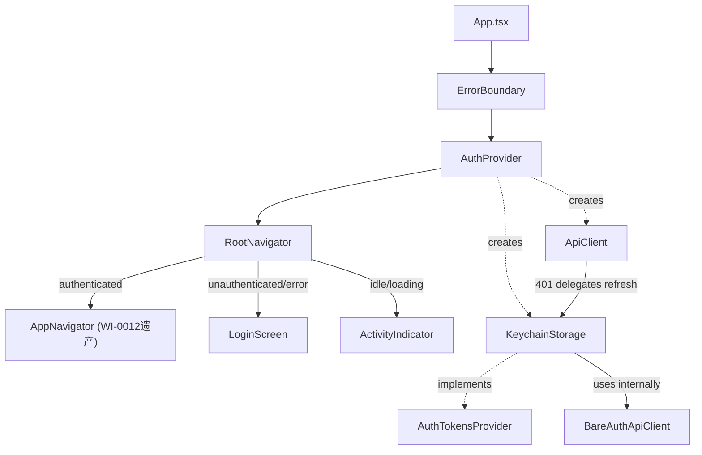
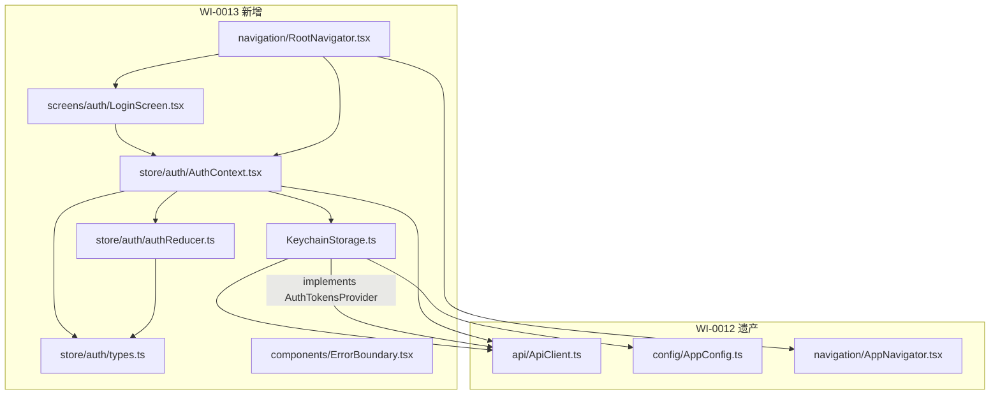
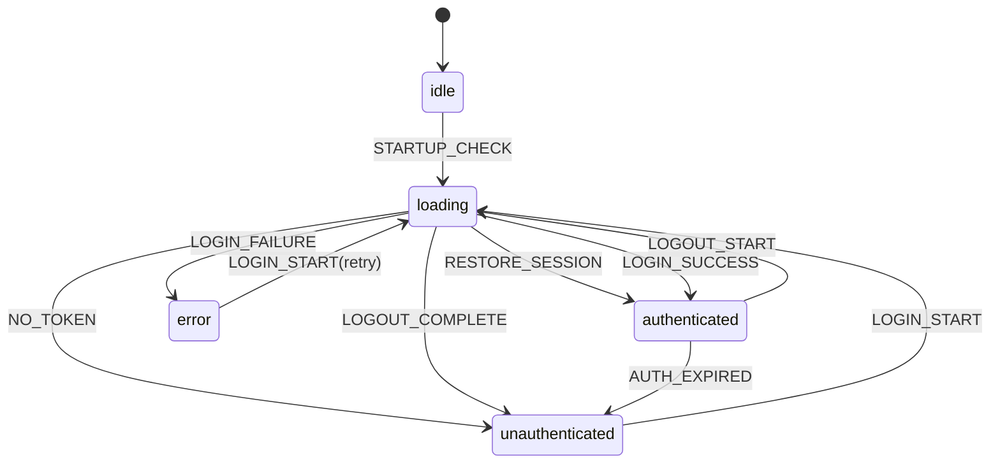
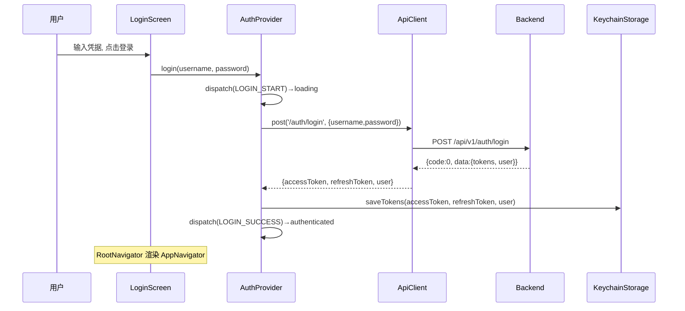
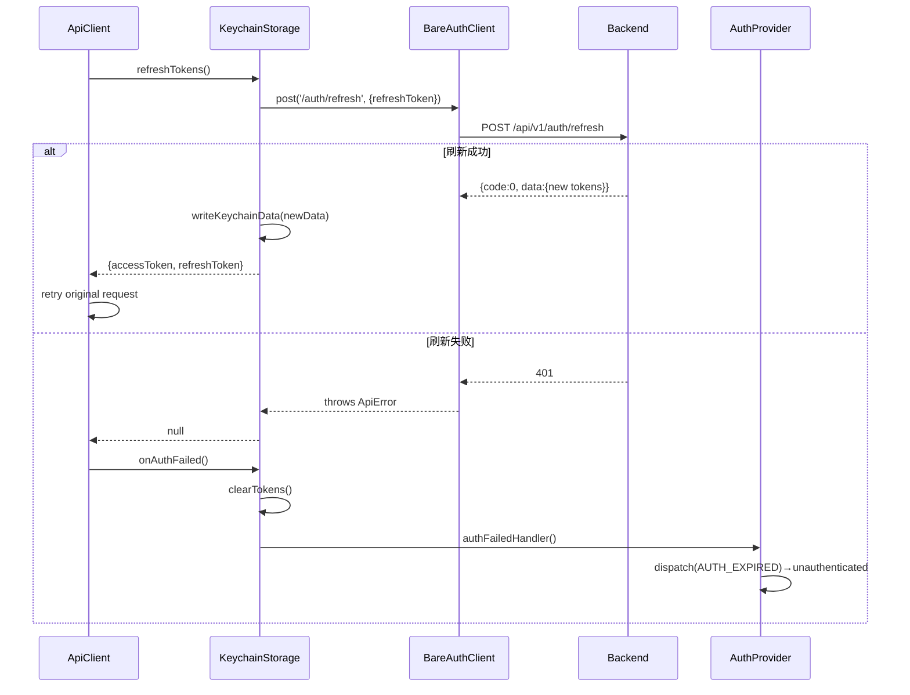

# Design Candidate — 登录功能实现 + 真机安装测试

## 简介

本文档为 WI-0013 的设计候选，基于 requirements.candidate.md（18 REQ / 103 AC）和 WI-0012 遗产代码，定义登录功能技术方案。涵盖：AuthStore 状态管理、KeychainStorage 安全存储、LoginScreen UI、导航守卫、ErrorBoundary、keychain autolinking 恢复、cleartext HTTP 配置。

---

## 架构总览

### 组件树



### 模块依赖图



---

## 设计决策

### DD-1 整体架构分层

refs: [REQ-010, REQ-011, REQ-018]
constrained_by: WI-0012 App.tsx 仅渲染 AppNavigator; REQ-018 AC-2 允许修改 App.tsx

**决策**：三层包裹架构 `ErrorBoundary → AuthProvider → RootNavigator`。

| 层 | 组件 | 职责 |
|----|------|------|
| L1 | ErrorBoundary | 捕获整个应用渲染期未捕获异常（REQ-011 AC-1） |
| L2 | AuthProvider | 创建 ApiClient+KeychainStorage；管理认证状态机；提供 useAuth() hook（REQ-010 AC-5） |
| L3 | RootNavigator | 根据 authState.status 条件渲染（REQ-010 AC-1/2/3） |

App.tsx 结构：`<ErrorBoundary><AuthProvider><RootNavigator /></AuthProvider></ErrorBoundary>`

**层级理由**：ErrorBoundary 最外层确保 AuthProvider 异常也被捕获；AuthProvider 在 RootNavigator 外提供 context；RootNavigator 仅做渲染决策。

**YAGNI(DD4)**：AuthProvider 有 ≥2 消费者（LoginScreen、RootNavigator）。ErrorBoundary/RootNavigator 虽各 1 调用点但是 React 标准模式。

---

### DD-2 AuthStore：React Context + useReducer

refs: [REQ-005, REQ-009, REQ-010]
constrained_by: package.json 未安装 Zustand/MobX; REQ-018 AC-4 不新增依赖

**决策**：AuthStore 基于 Context + useReducer，零新增依赖。

**方案对比**：Context+useReducer（0KB，✅选择）vs Zustand（~3KB，需安装 ❌）vs MobX（~15KB，需安装 ❌）。认证状态更新频率低，Context 重渲染开销可忽略。

**模块拆分**（3 文件）：`types.ts`（类型定义，被 2 文件导入）、`authReducer.ts`（纯函数 reducer，可独立单测）、`AuthContext.tsx`（Provider+hook+副作用逻辑）。

---

### DD-3 AuthState / AuthAction 数据模型

refs: [REQ-005, REQ-009, REQ-017]
constrained_by: REQ-005 AC-1 固定 5 状态; REQ-017 AC-1 User 结构; ApiErrorKind 5 种

**AuthStatus**（REQ-005 AC-1）：
```typescript
type AuthStatus = 'idle' | 'loading' | 'authenticated' | 'unauthenticated' | 'error';
```

**User**（REQ-017 AC-1 契约对齐）：
```typescript
interface User { id: number; username: string; realName: string; }
```

**AuthError**（REQ-004 错误分类）：
```typescript
interface AuthError {
  kind: 'network' | 'timeout' | 'server' | 'auth' | 'parse';
  message: string; // 用户可读中文文案
}
```

**AuthState**：
```typescript
interface AuthState {
  status: AuthStatus;
  user: User | null;   // 仅 authenticated 时非 null
  error: AuthError | null; // 仅 error 时非 null
}
```

**AuthAction**（9 种，对应合法状态转换）：
- 启动期：`STARTUP_CHECK`、`RESTORE_SESSION(user)`、`NO_TOKEN`
- 登录：`LOGIN_START`、`LOGIN_SUCCESS(user)`、`LOGIN_FAILURE(error)`
- 登出：`LOGOUT_START`、`LOGOUT_COMPLETE`
- 过期：`AUTH_EXPIRED`

**AuthContextValue**（useAuth 返回值）：
```typescript
interface AuthContextValue {
  status: AuthStatus;
  user: User | null;
  error: AuthError | null;
  login: (username: string, password: string) => Promise<void>;
  logout: () => Promise<void>;
}
```

---

### DD-4 KeychainStorage 设计

refs: [REQ-006, REQ-007, REQ-012, REQ-017]
constrained_by: ApiClient.AuthTokensProvider 接口签名（ApiClient.ts L89-101）; react-native-keychain v8.2.0; REQ-012 AC-1 禁止 AsyncStorage

**存储方案**：`Keychain.setInternetCredentials('fj1-auth', 'fj1-user', JSON.stringify(KeychainData))`。Android 上 react-native-keychain v8+ 使用 EncryptedSharedPreferences（Android Keystore AES-256 加密），非明文落盘。

**KeychainData**（REQ-009 AC-5 用户信息与令牌一起持久化）：
```typescript
interface KeychainData { accessToken: string; refreshToken: string; user: User; }
```

**KeychainStorage 类**：implements `AuthTokensProvider`，包含：
- 接口方法：`getAccessToken()`、`getRefreshToken()`、`refreshTokens()`、`onAuthFailed()`
- 扩展方法：`saveTokens(a,r,u)`、`clearTokens()`、`getKeychainData()`、`setAuthFailedHandler(cb)`
- 内部持有 `bareAuthClient: ApiClient`（无 authProvider，用于 /auth/refresh，见 DD-5）
- `authFailedHandler` 回调由 AuthProvider 注入（setter 模式打破循环依赖）

**refreshTokens() 流程**：读 keychain → 取 refreshToken → 用 bareAuthClient.post('/auth/refresh', {refreshToken}) → 成功则写回 keychain 返回新令牌对；失败返回 null。

**onAuthFailed() 流程**：clearTokens() → 调用 authFailedHandler()（触发 AuthStore AUTH_EXPIRED）。

**失败处理**：
| 操作 | 失败处理 |
|------|---------|
| get*Token() 读取异常 | catch → 返回 null（REQ-006 AC-7） |
| refreshTokens() 失败 | catch → 返回 null（REQ-007 AC-3） |
| saveTokens() 写入失败 | 异常向上传播 → AuthStore error 状态 |
| clearTokens() 清除失败 | catch → warn 日志，不阻塞登出 |

---

### DD-5 ApiClient 注入与 refresh 循环预防

refs: [REQ-007, REQ-017, REQ-018]
constrained_by: ApiClient.ts 401 自动刷新逻辑; REQ-018 AC-4 不修改 ApiClient.ts

**问题**：如果 KeychainStorage.refreshTokens() 使用同一个带 authProvider 的 ApiClient，refresh 请求 401 会再次触发 refreshTokens()，无限递归。

**方案**：双 ApiClient 实例。主 ApiClient（authProvider=KeychainStorage，用于 login/logout/业务API）在 AuthContext.tsx 的 useMemo 中创建。BareAuthApiClient（无 authProvider，仅用于 /auth/refresh）在 KeychainStorage 构造函数内创建。BareAuthApiClient 无 authProvider → 401 时不触发刷新 → parseResponse 抛 ApiError → KeychainStorage catch → 返回 null。无递归。

---

### DD-6 LoginScreen UI 设计

refs: [REQ-001, REQ-002, REQ-003, REQ-004, REQ-012]
constrained_by: REQ-018 AC-4 不引入 UI 库; RN 内置组件

**决策**：RN 内置组件 + StyleSheet 内联样式。

**组件结构**：`KeyboardAvoidingView` 包裹 → 标题 Text + 用户名 Label+TextInput + 密码 Label+TextInput(secureTextEntry) + 错误 Text(条件) + TouchableOpacity 按钮。

**表单状态**：LoginScreen 本地 useState 管理 username/password（不进入 AuthStore 全局状态）。

**派生状态**：`isLoading = status==='loading'`；`isButtonDisabled = username.trim()=='' || password.trim()=='' || isLoading`；`hasError = status==='error' && error!==null && !errorDismissed`。

**REQ-004 AC-6 错误清除**：LoginScreen 维护 `errorDismissed` 本地 flag，编辑任一输入框时设 true。重新提交时新 error 覆盖。

**REQ-002 AC-3 禁用态**：`disabled={isButtonDisabled}` + `style={[styles.button, isButtonDisabled && {opacity:0.5}]}`。

**REQ-003 AC-2 加载态**：按钮内 `isLoading ? <ActivityIndicator/> : <Text>登录</Text>`。

**REQ-003 AC-4 加载期不清空字段**：username/password 是 useState，重渲染间保持。authenticated 后 LoginScreen 卸载，useState 自然销毁。

**样式**：container(flex:1,center,padding:24)、input(borderWidth:1,borderRadius:8,padding:12)、button(bgColor:#1677ff,borderRadius:8)、buttonDisabled(opacity:0.5)、errorText(color:#ff4d4f)。

---

### DD-7 错误分类映射

refs: [REQ-004, REQ-015]
constrained_by: ApiErrorKind 5 种

**映射表**：
| ApiError.kind | 中文文案 |
|---------------|---------|
| auth | 用户名或密码错误（REQ-004 AC-1） |
| network | 网络连接失败，请检查网络后重试（AC-2） |
| timeout | 请求超时，请重试（AC-3） |
| server | 服务暂时不可用，请稍后重试（AC-4） |
| parse | 服务暂时不可用，请稍后重试（归类 server） |

`mapApiErrorToAuthError(error: unknown): AuthError` 纯函数，不打印完整 error.message 到 UI，console.warn 中截断 ≤100 字符。

---

### DD-8 状态转换矩阵

refs: [REQ-005]
constrained_by: REQ-005 AC-7 非法转换拒绝+warn

**合法转换**（action → from→to）：
- `STARTUP_CHECK`: idle→loading
- `RESTORE_SESSION`: loading→authenticated
- `NO_TOKEN`: loading→unauthenticated
- `LOGIN_START`: unauthenticated|error→loading
- `LOGIN_SUCCESS`: loading→authenticated
- `LOGIN_FAILURE`: loading→error
- `LOGOUT_START`: authenticated→loading
- `LOGOUT_COMPLETE`: loading→unauthenticated
- `AUTH_EXPIRED`: authenticated|loading→unauthenticated

非法转换：console.warn + 返回原 state（引用不变）。reducer 含 exhaustive check（default → never）。



---

### DD-9 ErrorBoundary 设计

refs: [REQ-011]
constrained_by: React 错误边界必须 Class Component; 不引入第三方库

**决策**：React Class Component，`getDerivedStateFromError` + `componentDidCatch`。

- 捕获异常 → state.hasError=true，降级 UI：「⚠️ 应用发生异常」+「重新加载」按钮。
- 重新加载 → setState({hasError:false})，重渲染子组件树。
- `componentDidCatch` → console.error（不向用户显示堆栈，REQ-011 AC-4）。
- 降级 UI 自身崩溃 → RN 默认红屏兜底（REQ-011 AC-5）。

---

### DD-10 react-native.config.js 修改

refs: [REQ-014, REQ-018]
constrained_by: WI-0012 屏蔽 7 模块; REQ-014 AC-2 保留其他 6 模块屏蔽

**决策**：仅删除 `'react-native-keychain': { platforms: { android: null } }` 行，保留其他 6 模块不变。

**其他导航模块决策**（REQ-014 备注）：不解除 react-native-screens / safe-area-context / gesture-handler 的屏蔽。理由：本 WI Tab 导航+条件渲染不需要原生屏幕优化；LoginScreen 用 KeyboardAvoidingView 不需要 SafeArea；无手势导航需求。真机测试如发现假设有误，记录并升级为 follow-up WI。

---

### DD-11 AndroidManifest.xml cleartext 配置

refs: [REQ-013]
constrained_by: Android 7.0+ 禁止 cleartext; 后端 http://129.211.5.240

**决策**：`<application>` 标签添加 `android:usesCleartextTraffic="true"`。

选择 usesCleartextTraffic 而非 networkSecurityConfig.xml 的理由：Debug 构建单后端、减少文件修改数。HTTPS 迁移时移除此配置（后续 WI）。

---

### DD-12 App 启动初始化与 login/logout 逻辑

refs: [REQ-003, REQ-004, REQ-008, REQ-009]
constrained_by: REQ-009 AC-6 异常降级; REQ-008 AC-4 后端失败不阻塞本地登出

**AuthProvider 初始化**（useEffect）：
1. `useMemo` 创建 KeychainStorage + ApiClient（带 authProvider）
2. `useEffect` 注入 `keychainStorage.setAuthFailedHandler(() => dispatch({type:'AUTH_EXPIRED'}))`
3. `useEffect` 启动检查：dispatch STARTUP_CHECK → keychainStorage.getKeychainData() → 有 token: dispatch RESTORE_SESSION(user) → 无 token/异常: dispatch NO_TOKEN

**login(username, password)**：
1. dispatch LOGIN_START
2. apiClient.post('/auth/login', {username, password})
3. 成功：keychainStorage.saveTokens(a,r,u) → dispatch LOGIN_SUCCESS(user)
4. 失败：mapApiErrorToAuthError → dispatch LOGIN_FAILURE(error)

**logout()**：
1. dispatch LOGOUT_START
2. try apiClient.post('/auth/logout') catch → warn（不阻塞）
3. keychainStorage.clearTokens()
4. dispatch LOGOUT_COMPLETE

---

### DD-13 登录时序图

refs: [REQ-003, REQ-005, REQ-006, REQ-017]



---

### DD-14 Token 刷新时序图

refs: [REQ-007]



---

### DD-15 回滚预案

refs: [REQ-014, REQ-018]
constrained_by: REQ-018 AC-7 允许 AsyncStorage 降级; REQ-014 AC-4 构建失败启动回滚

**触发**：解除 keychain 屏蔽后 `./gradlew assembleDebug` 失败。

**回滚步骤**：
1. 记录构建失败详情到验证报告
2. 回退 react-native.config.js（重新添加 keychain 屏蔽）
3. 创建 KeychainStorageAsyncFallback.ts（implements 相同 AuthTokensProvider 接口，用 AsyncStorage 替代 keychain）
4. AuthContext.tsx import 切换到 Fallback
5. 重新构建
6. 验证报告标注「**降级模式：AsyncStorage 明文存储**」

**限制**：AsyncStorage 降级违反 REQ-006 AC-5/REQ-012 AC-1（令牌明文落盘），仅作最后手段，后续 WI 必须优先修复。

---

## REQ → DD 追溯矩阵

| REQ | DD 覆盖 | REQ | DD 覆盖 |
|-----|---------|-----|---------|
| REQ-001 | DD-1,DD-6 | REQ-010 | DD-1,RootNavigator |
| REQ-002 | DD-6 | REQ-011 | DD-1,DD-9 |
| REQ-003 | DD-6,DD-12,DD-13 | REQ-012 | DD-4,DD-6,DD-7 |
| REQ-004 | DD-6,DD-7,DD-13 | REQ-013 | DD-11 |
| REQ-005 | DD-2,DD-3,DD-8 | REQ-014 | DD-10 |
| REQ-006 | DD-4 | REQ-015 | DD-5,DD-7 |
| REQ-007 | DD-4,DD-5,DD-14 | REQ-016 | 文件清单支持 |
| REQ-008 | DD-12,DD-15 | REQ-017 | DD-3,DD-4,DD-5 |
| REQ-009 | DD-4,DD-12 | REQ-018 | 文件清单 |

---

## 文件变更清单

### 新增文件（7）

| # | 文件 | 内容 | DD |
|---|------|------|----|
| 1 | src/api/KeychainStorage.ts | AuthTokensProvider 实现，~180 行 | DD-4,5 |
| 2 | src/store/auth/types.ts | 类型定义，~70 行 | DD-3 |
| 3 | src/store/auth/authReducer.ts | reducer+转换校验，~90 行 | DD-8 |
| 4 | src/store/auth/AuthContext.tsx | Provider+hook+逻辑，~160 行 | DD-2,7,12 |
| 5 | src/screens/auth/LoginScreen.tsx | 登录界面，~140 行 | DD-6 |
| 6 | src/components/ErrorBoundary.tsx | 错误边界，~70 行 | DD-9 |
| 7 | src/navigation/RootNavigator.tsx | 条件路由守卫，~40 行 | DD-1 |

### 修改文件（3）

| # | 文件 | 修改 | REQ |
|---|------|------|-----|
| 1 | App.tsx | ErrorBoundary→AuthProvider→RootNavigator | REQ-010,011 |
| 2 | react-native.config.js | 删除 keychain 条目 | REQ-014 |
| 3 | AndroidManifest.xml | 添加 usesCleartextTraffic="true" | REQ-013 |

### 不修改（REQ-018 AC-4）：ApiClient.ts、AppConfig.ts、AppNavigator.tsx、package.json、babel.config.js、tsconfig.json、app.json

---

## 正确性属性（PBT）

| # | 属性 |
|---|------|
| P1 | reducer 返回 status 始终 ∈ 5 个合法值 |
| P2 | 非法转换返回 state 引用不变（===） |
| P3 | status=authenticated ⟹ user≠null；其他 ⟹ user=null |
| P4 | status=error ⟹ error≠null；其他 ⟹ error=null |
| P5 | saveTokens 后 getKeychainData 数据 JSON 往返无损 |
| P6 | clearTokens 幂等，调用后 getAccessToken 返回 null |
| P7 | mapApiErrorToAuthError 对 5 种 kind 均返回非空 AuthError |
| P8 | RootNavigator 对 5 种 status 均有渲染分支 |
| P9 | login 全过程 console 不打印 password 原文 |
| P10 | 日志中 token 字符串 ≤8 字符预览 |

---

## Out of Scope

业务屏幕实装(WI-0015~19)、Release签名(WI-0014)、HTTPS/证书绑定、生物识别、多账号、注册/找回、Token主动刷新、Jest基础设施、UI美化、screens/safe-area/gesture-handler解除屏蔽、networkSecurityConfig精细化、登录限流。

---

## Assumptions

1. 后端 login 凭据无效返回 HTTP 401（使 ApiClient 映射为 ApiError kind=auth）
2. react-native-keychain v8.2.0 Android Keystore 模式正常工作
3. @react-navigation/bottom-tabs v6 不依赖 screens/safe-area 原生模块
4. 真机 Android ≥7.0 (API 24+)
5. 真机与 129.211.5.240 网络可达
6. getInternetCredentials 无数据时返回 false
7. Docker fj-builder:react-native-0.74 可用且含 keychain 编译依赖
8. KeyboardAvoidingView 足够处理键盘适配
9. LoginScreen 不需要 Stack Navigator
10. ApiClient 不需要在 AuthProvider 外被访问（YAGNI）

---

## 架构自检

A1单一职责✅ | A2显式依赖✅(Mermaid含所有箭头) | A3可替换性✅(AuthTokensProvider 2实现+Fallback) | A4失败可观测✅(每条路径有catch+warn/dispatch) | A5边界明确✅(12 Out of Scope+10 Assumptions)
