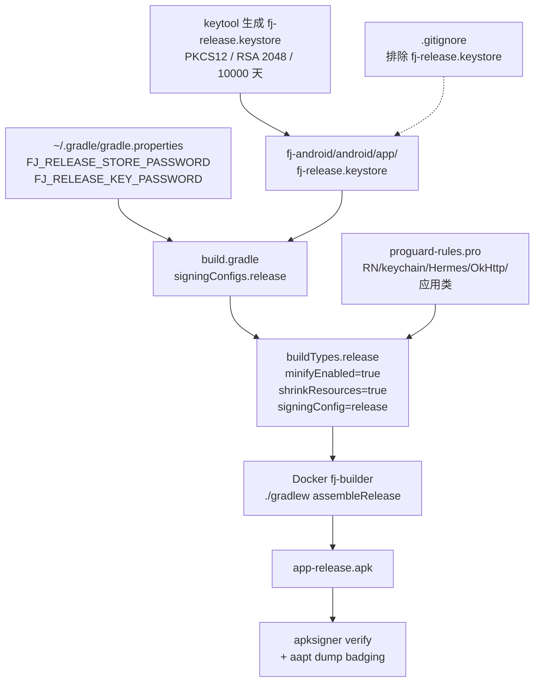

# Design — WI-0014: Release 签名 + ProGuard/R8 混淆

> Work Item: WI-0014
> Date: 2026-07-05
> Workflow: feature_spec / requirement_change_path
> Base Spec Version: PSV-0001
> 标准依据: specforge_final_fused_standard_v1_1_patch1_zh.md

---

## 文档概述

本设计文档说明如何在 fj-android（React Native 0.74）项目上启用 Release 签名与 ProGuard/R8 代码混淆、资源压缩，以生成可分发的 Release APK。

### 设计输入

- `intake.md` — IN-SCOPE / OUT-OF-SCOPE / 技术约束
- `impact_analysis.md` — 影响文件清单 + 风险 + 依赖
- 现状文件：
  - `fj-android/android/app/build.gradle`（118 行；release 当前 `signingConfig signingConfigs.debug`；`enableProguardInReleaseBuilds = false`）
  - `fj-android/android/gradle.properties`（41 行；`hermesEnabled=true`；无 R8 显式配置）
  - `fj-android/android/app/proguard-rules.pro`（10 行空模板）
  - `.gitignore`（15 行，未覆盖 keystore）

### 需求追溯（隐式 REQ，来自 intake/impact）

| REQ | 描述 | 覆盖 DD |
|-----|------|---------|
| REQ-1 | 生成 Release 签名密钥（keystore） | DD-1 |
| REQ-2 | 配置 `build.gradle` 的 signingConfigs.release | DD-2 |
| REQ-3 | 创建 ProGuard/R8 保留规则 | DD-3 |
| REQ-4 | 启用 buildTypes.release 的 minifyEnabled + shrinkResources | DD-2 |
| REQ-5 | Docker 内执行 assembleRelease 并验证产物 | DD-4 |
| REQ-6 | .gitignore 防止密钥泄露 | DD-5 |
| REQ-7 | 密钥部署与备份说明 | DD-6 |

### 约束来源

- `prod-environment.md`：当前为 TODO（未填充），无显式约束；实际约束继承自 intake：Docker 镜像 `fj-builder:react-native-0.74`、React Native 0.74、`hermesEnabled=true`、目标 API 由 RN 0.74 模板决定。
- `project-rules.md`：当前为 TODO（未填充），无显式约束；遵守 RN 0.74 默认 Gradle DSL。

---

## 架构图



组件（"我是 X" 单一职责陈述）：

| 组件 | 我是 X | 验证 |
|------|--------|------|
| KEYSTORE | 我是签名密钥文件 | ✅ 一句话 |
| CREDENTIALS | 我是构建时密码注入源 | ✅ |
| GRADLE_CONFIG | 我是构建配置（签名+混淆开关） | ✅ |
| PROGUARD_RULES | 我是混淆保留规则 | ✅ |
| BUILDER | 我是构建执行器（Docker+Gradle） | ✅ |
| VERIFIER | 我是产物校验器（apksigner+aapt） | ✅ |
| GITGUARD | 我是 Git 防泄露闸门 | ✅ |

A2 显式依赖：图中每条调用边均画出（CREDENTIALS → GRADLE_CONFIG、KEYSTORE → GRADLE_CONFIG、PROGUARD_RULES → buildTypes.release、GITGUARD 仅阻断 commit 不阻断读取）。

---

## 设计决策

### DD-1 签名密钥生成方案

refs: [REQ-1]
constrained_by: intake.技术约束.构建环境=Docker `fj-builder:react-native-0.74`；intake.技术约束.密钥由 AI 生成

#### 决策

使用 JDK 自带的 `keytool` 生成 PKCS12 格式的 RSA 2048 位密钥，有效期 10000 天。

```bash
keytool \
  -genkeypair \
  -v \
  -storetype PKCS12 \
  -keystore fj-release.keystore \
  -alias fj \
  -keyalg RSA \
  -keysize 2048 \
  -validity 10000 \
  -storepass <STORE_PASSWORD> \
  -keypass <KEY_PASSWORD> \
  -dname "CN=FJ Android Release, OU=Mobile, O=FJ, L=Local, ST=Local, C=CN"
```

**密码策略**：
- `storePassword` 与 `keyPassword` 使用相同的强密码（简化部署，AI 生成，长度 ≥ 20 字符，含大小写+数字+符号）。
- 两者相同避免 R8 之外的混淆点（双密码在 CI 注入中易错配）。

**密码传递方式**：
- 密码写入构建机器/容器内的 `~/.gradle/gradle.properties`（home 目录，**不入仓库**）：
  ```properties
  FJ_RELEASE_STORE_PASSWORD=<strong-password>
  FJ_RELEASE_KEY_PASSWORD=<strong-password>
  ```
- `build.gradle` 通过 `project.hasProperty("FJ_RELEASE_STORE_PASSWORD")` 判定，未配置时 fallback 到空字符串，**避免在未注入密码的机器上 Gradle 配置阶段就 NPE/卡住**。

**关键决策**：密码 **不** 写入 `fj-android/android/gradle.properties`（该文件会被提交 Git，造成泄露），而是 home 目录的 `~/.gradle/gradle.properties`。

#### 理由

- PKCS12 是 Java 9+ 默认且跨工具兼容（Android Gradle Plugin / apksigner 均原生支持）。
- RSA 2048 是当前 Android 签名推荐的最低强度；RSA 4096 增加签名体积无收益。
- 有效期 10000 天（约 27 年）覆盖应用完整生命周期，避免过期导致无法更新。
- 密码走 home 目录 `gradle.properties` 是 Gradle 官方推荐做法（Gradle 会自动合并 `~/.gradle/gradle.properties` 与项目级 `gradle.properties`）。
- `hasProperty()` + 空串 fallback 保证 CI/同事机器无密码时构建仍能配置（最终在 signing 阶段才报签名失败，给出明确错误，而不是配置阶段崩溃）。

#### 备选方案

| 备选 | 否决理由 |
|------|----------|
| 密码写入项目 `gradle.properties` | 会被提交仓库，泄露 |
| 密码硬编码在 build.gradle | 同上，更糟 |
| 环境变量 `ORG_GRADLE_PROJECT_*` | 可行，但与 `~/.gradle/gradle.properties` 等价且后者更符合 Gradle 习惯；本设计两者等价支持 |
| 双密码（store 与 key 不同） | 部署复杂度高，对单人/小团队项目收益低 |
| JKS（默认）格式 | Java 9 后被 PKCS12 取代，且 RN/AGP 工具链对 PKCS12 兼容性最佳 |

#### 失败路径

- `keytool` 不可用（JDK 缺失）→ 命令失败，错误码非 0；构建前置校验在 DD-4 中拦截。
- 密码强度不足 → keytool 不强制强度，依赖生成脚本断言。
- 文件已存在 → keytool 报错；生成脚本应先检查文件不存在。

---

### DD-2 build.gradle 修改方案

refs: [REQ-2, REQ-4]
constrained_by: 现状 build.gradle 第 57 行 `enableProguardInReleaseBuilds = false`、第 85-92 行 `signingConfigs.debug`、第 97-103 行 `buildTypes.release`

#### 决策

修改 `fj-android/android/app/build.gradle`，**新增** `signingConfigs.release` 块并切换 release 的签名与混淆开关。

**变更点 1：signingConfigs 块（第 85-92 行）**

在现有 `debug` 块后追加 `release`：

```gradle
signingConfigs {
    debug {
        storeFile file('debug.keystore')
        storePassword 'android'
        keyAlias 'androiddebugkey'
        keyPassword 'android'
    }
    release {
        if (project.hasProperty('FJ_RELEASE_STORE_PASSWORD')) {
            storeFile file('fj-release.keystore')
            storePassword project.getProperty('FJ_RELEASE_STORE_PASSWORD')
            keyAlias 'fj'
            keyPassword project.getProperty('FJ_RELEASE_KEY_PASSWORD')
        }
    }
}
```

**说明**：用 `if (project.hasProperty(...))` 包裹，未注入密码时 `release` 块为空对象，buildTypes 引用 `signingConfigs.release` 不会报错，仅签名时失败。

**变更点 2：enableProguardInReleaseBuilds（第 57 行）**

```diff
- def enableProguardInReleaseBuilds = false
+ def enableProguardInReleaseBuilds = true
```

**变更点 3：buildTypes.release（第 97-103 行）**

```gradle
release {
    signingConfig signingConfigs.release
    minifyEnabled enableProguardInReleaseBuilds   // true
    shrinkResources true                          // 新增
    proguardFiles getDefaultProguardFile("proguard-android.txt"), "proguard-rules.pro"
}
```

**保持不变**：
- `proguardFiles` 仍用 `getDefaultProguardFile("proguard-android.txt")` + `"proguard-rules.pro"`（不切换到 `proguard-android-optimize.txt`，避免优化器与 RN 反射冲突）。
- 不引入 `productFlavors`（保持单一 variant，简化构建矩阵）。
- `debug` 块不动（开发体验不变）。
- `dependencies`、`react {}` 块不动。

#### 理由

- `minifyEnabled true` + `shrinkResources true` 是 R8 标准组合：前者裁剪/混淆代码，后者裁剪未引用资源。
- `enableProguardInReleaseBuilds` 变量保留（而非内联 `true`）便于未来按变体切换；当前与 `minifyEnabled` 一致即可。
- 使用 `getDefaultProguardFile("proguard-android.txt")`（非 `-optimize.txt`）：RN 0.74 + Hermes 涉及大量反射，开启 `-optimize` 已知会破坏跨桥调用，社区一致建议关闭。
- 单 variant：项目无 ABI Split / 无渠道分发（intake OUT-OF-SCOPE 明确），引入 flavors 是过度设计。

#### 备选方案

| 备选 | 否决理由 |
|------|----------|
| 内联 `minifyEnabled true` 不用变量 | 与现有变量风格不一致；未来切换不便 |
| `proguard-android-optimize.txt` | 优化器与 RN 反射冲突，社区明确建议禁用 |
| 引入 productFlavors（dev/prod） | 本 WI 无渠道需求（intake OUT-OF-SCOPE）；YAGNI |
| 删除 `debug` signingConfig | 破坏开发体验，无收益 |
| 使用 `signingConfig signingConfigs.debug`（现状） | 无法上应用商店；intake 核心目标之一即为修复此问题 |

#### 失败路径

- 未注入密码但执行 `assembleRelease` → R8/zipalign 阶段签名失败，Gradle 报 `keystore password was incorrect` 或 `file not found`；DD-4 校验脚本前置检查 `hasProperty`。
- `fj-release.keystore` 不存在 → 同上，错误明确。

---

### DD-3 ProGuard 规则设计

refs: [REQ-3]
constrained_by: intake.技术约束（ProGuard 规则需覆盖 react-native-keychain、watermelondb、Hermes、OkHttp）；build.gradle 当前 `proguardFiles ... "proguard-rules.pro"`

#### 决策

将 `fj-android/android/app/proguard-rules.pro` 从空模板替换为以下规则集（保留文件顶部注释）：

```proguard
# ============================================================
# fj-android Release ProGuard / R8 规则
# 配套 build.gradle: minifyEnabled=true, shrinkResources=true
# ============================================================

# ---------- 通用属性保留（RN 反射依赖）----------
-keepattributes Signature
-keepattributes *Annotation*
-keepattributes EnclosingMethod
-keepattributes InnerClasses
-keepattributes SourceFile,LineNumberTable

# ---------- React Native 核心 ----------
-keep,allowobfuscation @interface com.facebook.proguard.annotations.DoNotStrip
-keep,allowobfuscation @interface com.facebook.proguard.annotations.KeepGettersAndSetters
-keep class com.facebook.react.** { *; }
-keep class com.facebook.hermes.** { *; }
-dontwarn com.facebook.**

# ---------- Hermes JS 引擎 ----------
-keep class com.facebook.hermes.unicode.** { *; }

# ---------- okhttp3 / okio（网络栈）----------
-dontwarn okhttp3.**
-dontwarn okio.**
-dontwarn javax.annotation.**
-keep class okhttp3.** { *; }
-keep interface okhttp3.** { *; }

# ---------- react-native-keychain（com.oblador，WI-0013 依赖）----------
-keep class com.oblador.keychain.** { *; }
-keep class com.oblador.keychain.exceptions.** { *; }

# ---------- WatermelonDB（autolinking 当前屏蔽，但 jar 类仍在，预防未来启用）----------
-keep class com.watermelon.db.** { *; }

# ---------- 应用自定义类 ----------
-keep class com.fjandroid.** { *; }
-keep class com.fjandroid.MainApplication { *; }
-keep class com.fjandroid.MainActivity { *; }
```

#### 理由

- **属性保留**：RN 通过反射读取泛型签名（`Signature`）、注解（`*Annotation*`）、内部类（`InnerClasses`/`EnclosingMethod`）做 Bridge 调用；缺失会导致 `NullPointerException` / `ClassCastException`。
- **RN 核心**：`com.facebook.react.**` 含 NativeModule、Bridge、ViewManager；Hermes 含 JS 引擎入口；这些是 RN 运行时基石，必须保留。
- **Hermes**：`com.facebook.hermes.unicode.**` 被 JS 字符串 API 直接调用，混淆后必崩。
- **okhttp3/okio**：RN 网络层与第三方库共用；`-dontwarn` 消除 R8 对 javax.annotation（JSR305）的警告。
- **react-native-keychain**：WI-0013 登录功能依赖 `com.oblador.keychain`，混淆会破坏凭证存取。
- **WatermelonDB**：intake 明确指出"虽然当前屏蔽 autolinking 但类文件仍在"，保留规则为前置防御。
- **应用类**：`com.fjandroid.**`（包名 = applicationId）包含 `MainApplication`/`MainActivity`，被 Android Manifest 反射引用，必须保留。

#### 备选方案

| 备选 | 否决理由 |
|------|----------|
| 仅用 `getDefaultProguardFile` 不写自定义规则 | RN 反射类会被裁剪，运行时崩溃 |
| 用 `proguard-android-optimize.txt` + 优化规则 | 优化器破坏 RN 反射（DD-2 已说明） |
| 逐类精简 -keep（只保留确有反射的类） | 维护成本高、漏配风险大；项目体量小，全包保留体积可控 |
| 排除 WatermelonDB 规则（已屏蔽） | intake 明确要求预防未来启用 |

#### 失败路径

- 漏配某 -keep → Release 运行时 `ClassNotFoundException` / `NoSuchMethodError`；DD-4 验证启动流程。
- R8 警告升级为 error → Gradle 构建失败；`-dontwarn` 已覆盖已知项。

---

### DD-4 构建验证方案

refs: [REQ-5]
constrained_by: intake.技术约束.构建环境=Docker `fj-builder:react-native-0.74`

#### 决策

在 Docker 容器 `fj-builder:react-native-0.74` 内执行以下流水线（顺序校验，任一失败立即停止）：

**Step 1 — 前置检查（构建前）**
```bash
# 密码是否注入
test -n "$FJ_RELEASE_STORE_PASSWORD" || { echo "missing FJ_RELEASE_STORE_PASSWORD"; exit 1; }
# keystore 是否就位
test -f fj-android/android/app/fj-release.keystore || { echo "missing keystore"; exit 1; }
```

**Step 2 — 构建 Release APK**
```bash
cd fj-android/android
./gradlew assembleRelease --no-daemon -x lint
```
- `--no-daemon`：容器内一次性构建，避免 daemon 残留占用内存。
- `-x lint`：跳过 lint（本 WI 不改 lint 配置，lint 失败与签名/混淆无关，避免噪音）。

**Step 3 — 验证产物存在**
```bash
test -f app/build/outputs/apk/release/app-release.apk || { echo "APK not produced"; exit 1; }
```

**Step 4 — 验证签名**
```bash
APKSIGNER=$(ls $ANDROID_HOME/build-tools/*/apksigner | sort | tail -1)
"$APKSIGNER" verify --verbose app/build/outputs/apk/release/app-release.apk
# 期望输出包含：Verifies / Signed v1 scheme: true 或 v2/v3
```

**Step 5 — 验证 APK 信息**
```bash
AAPT=$(ls $ANDROID_HOME/build-tools/*/aapt | sort | tail -1)
"$AAPT" dump badging app/build/outputs/apk/release/app-release.apk | head -5
# 期望输出：package: name='com.fjandroid' ...
```

**Step 6 — 验证体积压缩**
```bash
RELEASE_SIZE=$(stat -c%s app/build/outputs/apk/release/app-release.apk)
DEBUG_SIZE=$(stat -c%s app/build/outputs/apk/debug/app-debug.apk 2>/dev/null || echo 0)
echo "Release: $((RELEASE_SIZE/1024/1024))MB, Debug: $((DEBUG_SIZE/1024/1024))MB"
# 期望：Release < Debug（Debug 基线约 124MB）
```

**Step 7 — 启动冒烟（可选，需 emulator）**
- 如容器内有 emulator，安装后启动 App，验证主界面加载、登录流程（依赖 WI-0013 keychain）。
- 容器内无 emulator 时，此步骤降级为"产物就绪"，由用户在真机验证。

#### 理由

- `--no-daemon`：容器无状态，daemon 反而易引发内存峰值（RN 构建本就吃内存）。
- `-x lint`：lint 失败与签名/混淆无关，跳过避免误阻塞；lint 治理是另一个 WI 的事。
- 多 build-tools 版本兜底用 `ls ... | sort | tail -1`：容器内 build-tools 版本可能随镜像更新变化，硬编码版本号会脆。
- 体积断言用 `< Debug`：minify+shrinkResources 后 Release 必然显著小于 Debug（Debug 约 124MB，Release 通常 30-60MB）。

#### 备选方案

| 备选 | 否决理由 |
|------|----------|
| 启用 lint（不 `-x lint`） | lint 与本 WI 目标正交，徒增噪音 |
| 硬编码 build-tools 版本号 | 镜像更新即失效 |
| 跳过 apksigner 仅看文件存在 | 无法确认签名有效，应用商店会拒收 |
| 强制 emulator 启动冒烟 | 容器内常无 emulator，CI 友好性差；降级为产物校验 |

#### 失败路径

- 密码未注入 → Step 1 失败，明确报错。
- R8 规则漏配 → Step 2 构建失败或 Step 7 启动崩溃。
- apksigner 失败 → Step 4 报 `DOES NOT VERIFY`，签名方案缺失。
- 体积反而变大 → Step 6 提示混淆未生效，回查 minifyEnabled。

---

### DD-5 .gitignore 更新

refs: [REQ-6]
constrained_by: 现状 `.gitignore`（15 行，未覆盖 keystore）；DD-1 密钥文件位于 `fj-android/android/app/fj-release.keystore`

#### 决策

在 `/mnt/1t_back/project/fj1/.gitignore` **末尾追加**：

```gitignore

# Android Release 签名密钥（不入仓库，丢失无法更新 App）
fj-android/android/app/fj-release.keystore
```

不修改任何已有行（保留 node_modules、target/、fj-api.env 等既有规则）。

#### 理由

- keystore 一旦提交，攻击者可伪造同包名应用签名更新，等同于私钥泄露。
- 路径精确指向 `fj-android/android/app/fj-release.keystore`（与 build.gradle 中 `file('fj-release.keystore')` 一致），不误伤其他同名文件。
- `debug.keystore` **不** 加入 .gitignore（RN 模板自带且无保密价值，社区惯例提交）。

#### 备选方案

| 备选 | 否决理由 |
|------|----------|
| keystore 放仓库外（如 ~/.keys/） | build.gradle 用相对路径 `file('fj-release.keystore')`，需 keystore 在 app 目录；放仓库外需改路径逻辑，徒增复杂度 |
| 用全局 `*.keystore` | 会误排除 `debug.keystore`，破坏 RN 模板一致性 |
| 加密 keystore 入库（git-crypt） | 超出本 WI 范围，且密钥分发仍需离线通道；DD-1 的 home 目录方案已够 |
| 同时忽略 `~/.gradle/gradle.properties` | 该文件本就不在仓库内，无需 ignore |

#### 失败路径

- 忘记 .gitignore → `git add .` 误提交 keystore → DD-4 流程外需 `git filter-branch` 清理（事后补救）。
- 路径写错（如少写 `app/`） → 规则不匹配，keystore 仍被追踪。

---

### DD-6 密钥部署方案（用户说明）

refs: [REQ-7]
constrained_by: DD-1（密码在 home 目录）、DD-5（keystore 在 app 目录但 gitignore）

#### 决策

向用户输出部署说明（不写入仓库代码），要点：

**A. keystore 文件位置**
- 文件：`fj-release.keystore`
- 位置：`fj-android/android/app/fj-release.keystore`（与 build.gradle 同目录，`file('fj-release.keystore')` 相对路径解析）
- 已被 .gitignore 排除，不会提交。

**B. 密码注入位置**
- 文件：`~/.gradle/gradle.properties`（home 目录，每个构建机器/容器各自配置）
- 内容：
  ```properties
  FJ_RELEASE_STORE_PASSWORD=<store-password>
  FJ_RELEASE_KEY_PASSWORD=<key-password>
  ```
- Docker 构建时，需将宿主机 `~/.gradle/gradle.properties` 挂载到容器 `/root/.gradle/gradle.properties`，或通过环境变量 `ORG_GRADLE_PROJECT_FJ_RELEASE_STORE_PASSWORD` / `ORG_GRADLE_PROJECT_FJ_RELEASE_KEY_PASSWORD` 注入（Gradle 自动识别 `ORG_GRADLE_PROJECT_` 前缀）。

**C. 备份要求（强约束）**
- keystore 文件与密码必须**离线双重备份**（如加密 U 盘 + 密码管理器）。
- **丢失 keystore = 无法发布应用更新**（应用商店通过签名校验包一致性，签名变更需以新应用上架，所有用户数据丢失）。
- 不要将 keystore 与密码存放在同一位置。

**D. 多机器/团队扩展**
- 新机器只需：(1) 拷贝 keystore 到 app 目录；(2) 在 home 目录配置两个密码属性。
- 密码不随 keystore 流转（分离原则）。

#### 理由

- home 目录方案是 Gradle 官方推荐，无需自建密码服务。
- Docker `ORG_GRADLE_PROJECT_*` 环境变量注入是 CI/CD 友好的等价路径，覆盖容器内无 home 持久化的场景。
- 备份强约束直接来自应用商店签名模型——签名是 App 身份，丢失不可恢复。

#### 备选方案

| 备选 | 否决理由 |
|------|----------|
| 密码与 keystore 同目录加密文件 | 解密密钥又需分发，问题转嫁 |
| Play App Signing（Google 托管） | 国内分发场景（非 Play）不适用；超出本 WI 范围 |
| HSM/硬件安全模块 | intake OUT-OF-SCOPE 明确排除 |
| 团队共享密码明文 wiki | 泄露风险高 |

#### 失败路径

- 用户丢失 keystore → 无法更新 App，需以新 applicationId 重新上架（业务灾难）。
- 用户误提交 keystore 到仓库 → 即使后续删除，Git 历史仍可追溯；需 rotate 密钥（重新生成 keystore 并以新应用上架）。
- 多机器密码不一致 → 签名失败，DD-4 Step 1/2 拦截。

---

## 文件变更清单（FILE_CHANGES）

| 文件 | 操作 | DD | 行数变化（估） | 风险 |
|------|------|----|----------------|------|
| `fj-android/android/app/build.gradle` | 修改 | DD-2 | +8 / -1 / 改 3 行 | 中（签名+混淆开关，构建敏感） |
| `fj-android/android/app/proguard-rules.pro` | 重写（替换空模板） | DD-3 | +40 行 | 中（漏配导致运行时崩） |
| `fj-android/android/app/fj-release.keystore` | 新增（二进制，gitignore） | DD-1 | 二进制 | 低（不入仓库） |
| `~/.gradle/gradle.properties`（容器 home） | 新增/追加 | DD-1, DD-6 | +2 行 | 低（不入仓库） |
| `.gitignore` | 末尾追加 | DD-5 | +3 行 | 低 |
| —（无其他源码改动） | — | — | — | — |

**不变更的文件**：
- `fj-android/android/gradle.properties`（impact_analysis 提到"可能新增 `android.enableR8=true`"，但 RN 0.74 + AGP 7.x+ 默认已启用 R8 full mode via `android.enableR8`，无需显式设置；如构建报 R8 相关警告再追加）。
- `fj-android/android/app/src/**`（无 Java/Kotlin 源码改动）。
- `package.json` / `node_modules`（无 JS 依赖改动）。
- RN 配置（`react {}`、`hermesEnabled` 等保持现状）。

---

## 接口定义（构建契约）

本 WI 无新增 Java/Kotlin 类，"接口"指 Gradle 构建契约（DSL interface）。

### signingConfigs.release 契约

```gradle
// Inputs（构建时注入）
interface ReleaseSigningInputs {
    storeFile: File           // fj-release.keystore（相对 app/）
    storePassword: String     // 来自 FJ_RELEASE_STORE_PASSWORD
    keyAlias: "fj"
    keyPassword: String       // 来自 FJ_RELEASE_KEY_PASSWORD
}
// Outputs
//   生成的 APK 使用 v1+v2+v3 签名方案（apksigner 验证通过）
// Errors:
//   MissingKeystore      — storeFile 不存在
//   WrongPassword        — 密码错误（keytool/Android 报 KeyStoreException）
//   PropertyNotInjected  — ~/.gradle/gradle.properties 缺属性（hasProperty=false 时 release 块为空，assembleRelease 签名阶段失败）
```

### buildTypes.release 契约

```gradle
interface ReleaseBuildType {
    signingConfig:    signingConfigs.release
    minifyEnabled:    true    // R8 代码裁剪+混淆
    shrinkResources:  true    // 未引用资源裁剪
    proguardFiles:    [proguard-android.txt, proguard-rules.pro]
}
// Outputs: app/build/outputs/apk/release/app-release.apk
// Errors:
//   R8MissingKeepRule  — 漏配 -keep 导致运行时 ClassNotFoundException（构建期不报，运行期报）
//   ShrinkRemovedUsed  — shrinkResources 误删被 JS 动态引用的资源（通过 keep.xml 缓解，本 WI 暂不引入）
```

---

## 数据模型

本 WI 无持久化数据模型改动（无数据库、无新表）。唯一的"持久化"是 keystore 二进制文件，结构由 keytool PKCS12 标准定义，非应用数据模型。

---

## 测试策略

### 属性测试（PBT）— 正确性属性

| ID | 属性 | 验证方式 |
|----|------|----------|
| P1 | Release APK 签名有效 | `apksigner verify --verbose` 返回 Verifies |
| P2 | Release APK 包名 = com.fjandroid | `aapt dump badging` 输出匹配 |
| P3 | Release APK 体积 < Debug APK 体积 | `stat -c%s` 比较 |
| P4 | minifyEnabled=true 后 APK 内类名被混淆 | `unzip -l app-release.apk \| grep classes.dex` 存在且体积显著缩小 |
| P5 | RN/Hermes/keychain 类未被裁剪 | `dexdump` 或 `apkanalyzer` 检查 `com.facebook.react.*`、`com.oblador.keychain.*` 存在 |
| P6 | keystore 不在 Git 索引 | `git check-ignore fj-android/android/app/fj-release.keystore` 返回该路径 |
| P7 | 密码不在仓库 | `git ls-files \| grep gradle.properties` 仅含项目级，无 home 目录文件 |

### 单元测试 / 集成测试

- 本 WI 不引入应用代码，无传统单元测试。
- "集成测试"等价于 DD-4 的构建流水线（assembleRelease + 校验链）。

### E2E 测试

- **核心流程**：安装 Release APK → 启动 App → 主界面加载 → 登录（依赖 WI-0013 keychain 凭证存取） → 验证 keychain 在混淆后仍正常工作。
- **降级**：容器内无 emulator 时，E2E 降级为"产物就绪"，由用户在真机执行并回报。
- **通过判据**：登录成功且凭证在 App 重启后仍可读取（证明 keychain -keep 规则有效）。

### 兼容性测试

- 目标 SDK：由 RN 0.74 模板决定（compileSdk/targetSdk 在 rootProject.ext 中）。
- 最低 SDK：同上（minSdkVersion 来自 rootProject.ext）。
- ABI：`armeabi-v7a, arm64-v8a, x86, x86_64`（gradle.properties 现状，不做 ABI Split）。
- 验证：apksigner 报告的签名方案（v1/v2/v3）覆盖 minSdk 及以上。

### 测试框架

- 构建校验：shell + apksigner + aapt（Android SDK build-tools 自带）。
- 无新增测试框架依赖。

---

## 架构属性自检（A1-A5）

| 属性 | 检查 | 结果 |
|------|------|------|
| **A1 单一职责** | 每个组件（KEYSTORE/CREDENTIALS/GRADLE_CONFIG/PROGUARD_RULES/BUILDER/VERIFIER/GITGUARD）一句话陈述清晰 | ✅ |
| **A2 显式依赖** | Mermaid 图含所有调用边：CREDENTIALS→GRADLE_CONFIG、KEYSTORE→GRADLE_CONFIG、PROGUARD_RULES→buildTypes.release、GITGUARD→KEYSTORE(commit 闸门) | ✅ |
| **A3 可替换性** | signingConfigs.release 用 hasProperty 守卫，未配置时降级为空（可被 debug 签名临时替换）；proguardFiles 可替换规则文件而不动 buildTypes | ✅ |
| **A4 失败可观测** | 每个 DD 含"失败路径"段；DD-4 Step 1-6 每步失败均有明确报错与退出码 | ✅ |
| **A5 边界明确** | 见下方 Out of Scope + Assumptions | ✅ |

---

## Out of Scope

- **ABI Split / per-architecture APK**（intake OUT-OF-SCOPE 明确）。
- **应用商店发布配置**（Play Console 上传、签名托管、版本滚动）— intake OUT-OF-SCOPE。
- **HSM/硬件安全模块**密钥管理 — intake OUT-OF-SCOPE。
- **productFlavors / 多渠道构建** — 本 WI 单 variant 即可。
- **lint 治理**（`-x lint` 跳过，lint 修复另立 WI）。
- **R8 full mode 显式启用**（`android.enableR8.fullMode=true`）— RN 0.74 默认行为已满足，显式开启需另行验证 JS Bridge 兼容性。
- **shrinkResources 白名单**（`res/raw/keep.xml`）— 当前无 JS 动态引用资源场景，如出现误删再补。
- **keystore 加密入库**（git-crypt / SOPS）— 超出本 WI，home 目录方案已足够。
- **密码轮换流程** — 密码轮换需 rotate keystore，等同重新上架，属运维策略范畴。
- **源码改动**（无 Java/Kotlin/JS 改动，仅构建配置）。

---

## Assumptions（设计假设）

1. **假设** JDK keytool 在 Docker 镜像 `fj-builder:react-native-0.74` 内可用（RN 0.74 构建必装 JDK 17+）。
2. **假设** 容器内 Android SDK build-tools 含 `apksigner` 与 `aapt`（RN 构建镜像标配）。
3. **假设** `~/.gradle/gradle.properties` 在容器内可写或可挂载（home 目录可持久化或通过 `-v` 挂载）。
4. **假设** 用户接受 AI 生成强密码（intake 技术约束明确"密钥由 AI 生成"）。
5. **假设** storePassword == keyPassword 不会引入安全漏洞（PKCS12 单密码模型）。
6. **假设** RN 0.74 默认 R8 配置（非 full mode）足以处理当前依赖集；如出现 R8 full mode 相关警告，再追加 `android.enableR8.fullMode` 配置（另立 WI）。
7. **假设** WI-0013（keychain 登录）的 Java 类位于 `com.oblador.keychain.**`（react-native-keychain 标准包名）。
8. **假设** WatermelonDB 的类位于 `com.watermelon.db.**`（若实际包名不同，DD-3 规则需在验证阶段调整）。
9. **假设** 当前项目无通过反射动态引用的资源（否则 shrinkResources 需补 keep.xml）。
10. **假设** 应用包名 `com.fjandroid` 在 DD-3 的 `-keep class com.fjandroid.**` 中正确（与 build.gradle `namespace`/`applicationId` 一致）。

---

## 风险与缓解（汇总）

| 风险 | 等级 | 缓解（对应 DD） |
|------|------|-----------------|
| ProGuard 过度混淆导致运行时崩溃 | 高 | DD-3 完整 -keep 规则 + DD-4 Step 7 启动冒烟 |
| keystore 泄露到 Git | 高 | DD-5 .gitignore + DD-6 用户说明 |
| keystore 丢失 | 高（业务灾难） | DD-6 强制备份要求 |
| Release 与 Debug 行为不一致 | 中 | DD-4 E2E 覆盖登录流程（WI-0013 keychain） |
| R8 full mode 兼容性 | 中 | 不显式启用 full mode（Out of Scope） |
| 多机器密码不一致 | 低 | DD-4 Step 1 前置检查 + DD-6 部署说明 |
| shrinkResources 误删资源 | 低 | Out of Scope（如出现再补 keep.xml） |

---

## 完成判据（Verification 入口）

本 design.md 满足以下条件后，可进入 Task Planning：
- [x] 所有 REQ-1..REQ-7 均有 DD 覆盖
- [x] 每个 DD 含 refs + constrained_by
- [x] 含 Mermaid 架构图
- [x] 含接口定义（Gradle DSL 契约）+ Errors 段
- [x] 含 Out of Scope + Assumptions
- [x] 含文件变更清单 FILE_CHANGES
- [x] 含测试策略（PBT 属性 + E2E + 兼容性）
- [x] A1-A5 架构属性自检通过
- [x] 无超出 intake IN-SCOPE 的设计点
