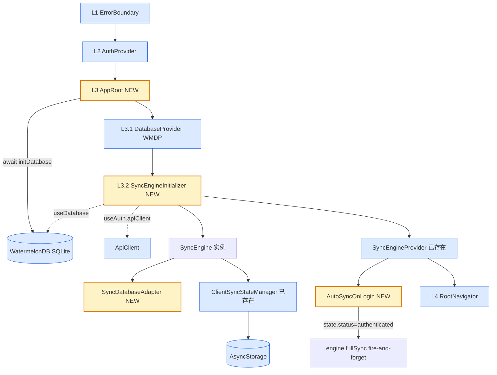

# Design Candidate — WI-0015: 数据库初始化 + WatermelonDB 同步引擎激活

> **Work Item**: WI-0015
> **Workflow Type**: feature_spec
> **Workflow Path**: requirement_change_path
> **Base Spec Version**: PSV-0001
> **Date**: 2026-07-05
> **标准依据**: specforge_final_fused_standard_v1_1_patch1_zh.md (§8.2 Candidate)
> **作者 Agent**: sf-design
> **Candidate Path**: .specforge/work-items/WI-0015/candidates/project/modules/core/design.candidate.md
> **Target Path (merge 后)**: .specforge/project/modules/core/design.md
> **Operation**: create

---

## 0. 文档定位与 Extension Registry 检查

本文档是 WI-0015 的 **Design Candidate**（§8.2），是拟写入正式规格真相源（`.specforge/project/modules/core/design.md`）的完整候选文件，不是 diff/patch。

**Extension Registry 前置检查**（v1.1 Patch1 §6）：
- 读取 `.specforge/project/extension_registry.json`，`namespaces.design_types = []`（空）。
- 本设计未引入任何新的 design_type / 结构化扩展类型，仅使用标准 Markdown 设计文档格式。
- 结论：**无需触发 Extension Subflow**，可直接产出 Candidate。

**与现有 `.specforge/project` 的关系**：当前 `project/` 下无 `modules/core/design.md`，本 Candidate 是该路径的**新建**写入（operation=create）。

---

## 1. 背景与目标

激活飞检安卓端的本地数据库（WatermelonDB）和增量同步引擎（SyncEngine），为后续业务屏幕（WI-0016~0020）提供数据层基础。

**当前状态（基于代码事实源）**：

| 文件 | 当前状态 | 问题 |
|------|----------|------|
| `react-native.config.js` | L9 屏蔽 watermelondb autolinking | JSI 原生模块未编译 |
| `src/store/database.ts` (206 行) | 含 SQLCipher 加密路径（FJDatabaseNativeModule / generateHexKey / getOrCreateEncryptionKey） | TD-ANDROID-001 已决策降级为不加密，加密路径死代码 |
| `App.tsx` (26 行) | 三层：ErrorBoundary > AuthProvider > RootNavigator | 无 DatabaseProvider / SyncEngineProvider |
| `src/di/SyncEnginePort.tsx` (70 行) | 已有 SyncEngineProvider / useSyncEngine | 未提供 SyncEngine 实例工厂，未挂载 |
| `src/api/SyncEngine.ts` (471 行) | 已完整实现 SyncEngine 类 + SyncDatabasePort 接口（L154-175） | 缺生产实现 SyncDatabaseAdapter |
| `src/api/ClientSyncStateManager.ts` (166 行) | 已完整实现，含 KeyValueStorage 注入端口 | 未被实例化 |
| `src/store/auth/AuthContext.tsx` (219 行) | useMemo 内部构造 apiClient 但未对外暴露 | SyncEngineInitializer 取不到 apiClient |

**需求来源**：intake.md IN-SCOPE 第 1-8 项。

---

## 2. 架构图



**说明**：
- 🟡 黄色 = WI-0015 新增组件
- 🔵 蓝色 = 已有组件（可能需小改）
- 虚线 = Context 消费（跨 Provider 读取）

**依赖关键路径**：`initDatabase` 必须先 resolve，才能渲染 `DatabaseProvider`；`DatabaseProvider` 必须先挂载，`useDatabase()` 才有值；`SyncEngineInitializer` 同时消费 `useAuth().apiClient` + `useDatabase()`，故必须位于两个 Provider 之内。

---

## 3. 设计决策

### DD-1 react-native.config.js 解除 watermelondb 屏蔽

**refs**: [intake.md IN-SCOPE-1, impact_analysis.md L6]
**constrained_by**: WatermelonDB 0.27+ (intake.md 技术约束), Docker `fj-builder:react-native-0.74`

**决策**：

删除 `react-native.config.js` 第 9 行：
```js
'@nozbe/watermelondb': { platforms: { android: null } },
```

修改后 `dependencies` 块从 6 条减为 5 条（保留 vision-camera / image-resizer / gesture-handler / safe-area-context / screens 的屏蔽，由各自后续 WI 解除）。

**理由**：
- WatermelonDB JSI 模式依赖 C++ 原生编译，被屏蔽时 `SQLiteAdapter({ jsi: true })` 在运行时 crash。
- 解除屏蔽是激活同步引擎的**编译前置条件**（无此步，DD-2 的 `initDatabase()` 在 Debug 构建即崩）。
- 其余 5 个模块与本 WI 无关，保持屏蔽以缩小本次原生编译变更面，降低构建失败风险（intake.md 关键风险 1）。

**备选方案**：
- ❌ 一次性解除全部 6 个屏蔽：扩大变更面，构建失败时定位困难，违反"最小变更"原则。
- ❌ 改用 `jsi: false` 绕过原生编译：性能损失显著（JSI 比 bridge 快 3-10×），且 WatermelonDB 文档明确推荐 JSI；不解除屏蔽则即使 `jsi:false` 也无法工作（模块整体未 link）。

**Errors / 失败处理**：
- 若 Docker `assembleDebug` 编译失败（关键风险 1）→ 回退方案：临时改回屏蔽 + 切换 `jsi: false`，但本 WI 不预设此回退（由验证阶段决定）。

---

### DD-2 database.ts 简化为不加密（TD-ANDROID-001 降级落地）

**refs**: [intake.md IN-SCOPE-2, schema.ts TD-ANDROID-001 决策块 L27-45]
**constrained_by**: TD-ANDROID-001 (D2-B 决策：MVP 不加密), project-rules 风格

**决策**：

对 `src/store/database.ts`（当前 206 行）做以下删减与简化，目标行数 ~80 行：

| 当前元素 | 操作 | 说明 |
|----------|------|------|
| 文件头注释 (L1-18) | **改写** | 更新为 TD-ANDROID-001 降级说明 + WI-0015 链接 |
| `import { NativeModules }` (L19) | **删除** | 不再使用 native 模块注入密钥 |
| `import * as Keychain` (L20) | **删除** | DB 加密用途移除（Auth 仍用 Keychain，由 AuthContext 自己 import） |
| `schema / migrations / MODEL_CLASSES` 导入 (L25-30) | **保留** | createAdapter 仍需 |
| `DB_NAME` 常量 (L34) | **保留** | createAdapter 仍用 |
| `DB_KEYCHAIN_SERVICE` 常量 (L36) | **保留 + 标记 @deprecated** | 兼容性常量，JSDoc 注明"TD-ANDROID-001 后不再使用，保留以防外部引用" |
| `DB_KEY_BYTES` 常量 (L38) | **删除** | 仅加密路径使用 |
| `FJDatabaseNativeModule` 接口 (L44-50) | **删除** | 加密死代码 |
| `FJDatabase` 实例 (L50) | **删除** | 同上 |
| `MODEL_CLASSES` 数组 (L57-62) | **保留** | Database 构造参数 |
| `generateHexKey` 函数 (L73-79) | **删除** | 加密死代码 |
| `getOrCreateEncryptionKey` 函数 (L94-113) | **删除** | 见子决策 |
| `createAdapter` 函数 (L125-133) | **简化** | 移除加密注释，仅 `jsi: true + dbName + schema + migrations` |
| `initDatabase` 函数 (L150-180) | **简化** | 移除步骤 1（密钥）和步骤 2（注入 native），仅保留"创建 adapter + Database + 缓存单例" |
| `databaseInstance / initializationPromise` (L116-117) | **保留** | 单例缓存机制不变 |
| `getDatabase` 函数 (L188-195) | **保留** | 业务层同步访问入口 |
| `resetDatabaseInstance` 函数 (L203-206) | **保留** | 测试 / 登出场景 |

**`getOrCreateEncryptionKey` 处理子决策**：

选择 **直接删除**（而非保留返回空串）。理由：
1. 全代码库 grep 未发现外部引用（仅在 `initDatabase` 内部调用，而该调用本次也被删除）。
2. 保留返回空串会让读者误以为仍有加密流程，违反 A1 单一职责。
3. YAGNI 原则（DD4）：未来加回 SQLCipher 时重新引入更清洁。

**简化后 `initDatabase` 形态（伪代码）**：
```typescript
export async function initDatabase(): Promise<Database> {
  if (databaseInstance) return databaseInstance;
  if (initializationPromise) return initializationPromise;
  initializationPromise = (async () => {
    const adapter = createAdapter();
    databaseInstance = new Database({ adapter, modelClasses: MODEL_CLASSES });
    return databaseInstance;
  })();
  return initializationPromise;
}
```

**理由**：
- schema.ts 顶部已声明 TD-ANDROID-001 决策为 D2-B（不加密），但 database.ts 仍保留完整加密路径 = 死代码 + 误导。
- 本 WI 激活 `initDatabase()`，若保留加密步骤则必须先实现 native 模块（`FJDatabaseModule.kt`），与本 WI 范围冲突。
- 删除加密代码使文件从 206 行降至 ~80 行，可读性提升，符合 A1 单一职责。

**备选方案**：
- ❌ 保留加密代码但用 `if (false)` 注释掉：违反 A5 边界明确，读者困惑。
- ❌ 完整实现 SQLCipher native 模块：超出本 WI 范围（OUT-OF-SCOPE 第 1 项），且 TD-ANDROID-001 已明确推迟。
- ⚠️ 保留 `getOrCreateEncryptionKey` 返回空串：被否决（见子决策）。

**Errors / 失败处理**：
- `initDatabase` 仅可能因 `new SQLiteAdapter()` / `new Database()` 抛错（JSI 初始化失败、磁盘满）→ 由 AppRoot（DD-3）的 error 分支捕获并展示重试按钮。

---

### DD-3 App.tsx 四层包裹架构 + AppRoot 组件

**refs**: [intake.md IN-SCOPE-3, App.tsx 当前 26 行]
**constrained_by**: WatermelonDB DatabaseProvider 必须在 `useDatabase()` 调用前挂载

**决策**：

修改 `App.tsx`，从三层升级为四层：
```
L1 ErrorBoundary > L2 AuthProvider > L3 AppRoot(NEW) > L4 RootNavigator
```

AppRoot 是**新组件**，文件路径 `src/AppRoot.tsx`，职责：
1. `useState<{ status: 'loading'|'error'|'ready'; db: Database|null; error: Error|null }>` 管理初始化状态。
2. `useEffect(() => { initDatabase().then(setDb ready).catch(setError) }, [])` 触发一次性初始化。
3. `loading` 态：渲染 `<View><Text>初始化数据库...</Text></View>`（无 ActivityIndicator 依赖，最简）。
4. `error` 态：渲染错误文案 + 重试按钮（重试 = 重置 state 后再调 initDatabase）。
5. `ready` 态：渲染
   ```tsx
   <DatabaseProvider database={db}>
     <SyncEngineInitializer>
       <RootNavigator />
     </SyncEngineInitializer>
   </DatabaseProvider>
   ```

`DatabaseProvider` 来源：`import { DatabaseProvider } from '@nozbe/watermelondb/react'`（官方组件，项目已在 6 个屏幕使用 `useDatabase`，确认模块就位）。

**修改后 App.tsx 形态（伪代码）**：
```tsx
import ErrorBoundary from './src/components/ErrorBoundary';
import { AuthProvider } from './src/store/auth/AuthContext';
import AppRoot from './src/AppRoot';

export default function App(): React.ReactElement {
  return (
    <ErrorBoundary>
      <AuthProvider>
        <AppRoot />
      </AuthProvider>
    </ErrorBoundary>
  );
}
```

**理由**：
- 数据库初始化是异步耗时操作，必须在渲染业务 UI 前完成（intake.md 关键风险 2）。
- AppRoot 单独成文件而非塞入 App.tsx，符合 A1 单一职责（App.tsx 只管组合根，AppRoot 管 DB 生命周期）。
- DatabaseProvider 必须在 SyncEngineInitializer（消费 useDatabase）之上，故 DatabaseProvider 在 AppRoot 内部而非 App.tsx 层。
- 重试按钮而非"崩溃即退出"：首次启动 DB 初始化失败常为瞬时（磁盘占用），重试有恢复概率（A4 失败可观测）。

**备选方案**：
- ❌ 在 App.tsx 内联初始化逻辑：App.tsx 膨胀，违背 A1。
- ❌ 把 DatabaseProvider 放到 App.tsx 顶层（AuthProvider 之外）：DatabaseProvider 需要已构造的 Database 实例，而 initDatabase 是异步的，App.tsx 同步渲染无法满足；且 AuthProvider 不依赖 DB，无前置必要。
- ❌ 用 React Suspense + lazy：RN 对 Suspense 支持有限，且 DB 初始化非组件 lazy 场景。

**Errors / 失败处理**：
- `initDatabase` reject → AppRoot error 分支展示，不冒泡到 ErrorBoundary（避免 ErrorBoundary 弹全屏错误页，体验差）。
- 重试按钮 onClick → `setStatus('loading'); setError(null); initDatabase()...`（initDatabase 内部已用 initializationPromise 防并发，重试安全）。

---

### DD-4 SyncDatabaseAdapter 实现（SyncDatabasePort 生产实现）

**refs**: [intake.md IN-SCOPE-6, SyncEngine.ts L154-175 接口定义, schema.ts MODEL_CLASSES]
**constrained_by**: WatermelonDB API (database.collections / Q / database.batch / database.write)

**决策**：

新建 `src/store/SyncDatabaseAdapter.ts`（~200 行），实现 `SyncDatabasePort` 的 4 个方法。

**TableName → Model 映射表**（关键，因为 schema 有 7 表但 MODEL_CLASSES 仅注册 4 个）：

| LocalTableName | Model 类 | 是否注册 | SyncDatabaseAdapter 处理 |
|----------------|----------|----------|--------------------------|
| daily_reports | DailyReportModel | ✅ | 处理 |
| daily_report_issues | DailyReportIssueModel | ✅ | 处理 |
| photos | PhotoModel | ✅ | 处理 |
| inspection_tasks | InspectionTaskModel | ✅ | 处理 |
| project_issues | （无 Model） | ❌ | 跳过（console.warn 未注册） |
| notifications | （无 Model） | ❌ | 跳过 |
| standard_clauses | （无 Model） | ❌ | 跳过 |

> ⚠️ 范围声明：本 WI 仅激活已注册的 4 表同步。其余 3 表的 Model 由后续 WI（如 WI-0017 通知）注册，届时 SyncDatabaseAdapter 的映射表扩展即可（开放-封闭）。

**接口实现**（伪代码，基于 WatermelonDB 0.27 API）：

```typescript
import { Database, Q, Model } from '@nozbe/watermelondb';
import type { SyncDatabasePort, DirtyRecords, PulledChangesByTable } from '../api/SyncEngine';
import { SYNC_STATUS } from '../api/SyncEngine'; // 'synced' | 'conflict'

const TABLE_TO_MODEL = {
  daily_reports: DailyReportModel,
  daily_report_issues: DailyReportIssueModel,
  photos: PhotoModel,
  inspection_tasks: InspectionTaskModel,
} as const;

type HandledTable = keyof typeof TABLE_TO_MODEL;

export class SyncDatabaseAdapter implements SyncDatabasePort {
  constructor(private readonly database: Database) {}

  async collectDirtyRecords(): Promise<DirtyRecords> {
    const result: DirtyRecords = {};
    for (const table of Object.keys(TABLE_TO_MODEL) as HandledTable[]) {
      const collection = this.database.collections.get<Model>(table);
      const dirty = await collection.query(Q.where('sync_status', SYNC_STATUS.PENDING_PUSH)).fetch();
      if (dirty.length === 0) continue;
      result[table] = dirty.map(rec => this.toDirtyRecord(table, rec));
    }
    return result;
  }

  async applyPulledChanges(changes: PulledChangesByTable): Promise<number> {
    let count = 0;
    await this.database.write(async () => {
      const batchOps: Promise<Model>[] = [];
      for (const table of Object.keys(changes) as LocalTableName[]) {
        if (!(table in TABLE_TO_MODEL)) {
          console.warn(`[SyncDatabaseAdapter] 表 ${table} 未注册 Model，跳过`);
          continue;
        }
        const collection = this.database.collections.get<Model>(table);
        for (const change of changes[table] ?? []) {
          count++;
          if (change.op === 'delete') {
            const existing = await this.findByServerId(collection, change.server_id);
            if (existing) batchOps.push(existing.markAsDeleted());
          } else {
            const existing = await this.findByServerId(collection, change.server_id);
            if (existing) {
              batchOps.push(existing.update(rec => {
                this.applyFields(table, rec, change);
                rec.syncState = SYNC_STATUS.SYNCED;
                rec.serverSeq = change.server_seq;
              }));
            } else {
              batchOps.push(collection.create(rec => {
                this.applyFields(table, rec, change);
                rec.serverId = String(change.server_id);
                rec.syncState = SYNC_STATUS.SYNCED;
                rec.serverSeq = change.server_seq;
              }));
            }
          }
        }
      }
      await this.database.batch(...batchOps);
    });
    return count;
  }

  async applyAcceptedRecords(accepted): Promise<void> {
    await this.database.write(async () => {
      const ops: Promise<Model>[] = [];
      for (const table of Object.keys(accepted) as HandledTable[]) {
        if (!(table in TABLE_TO_MODEL)) continue;
        const collection = this.database.collections.get<Model>(table);
        for (const acc of accepted[table] ?? []) {
          const rec = await this.findByClientUuid(collection, acc.client_uuid);
          if (rec) ops.push(rec.update(r => {
            r.serverId = String(acc.server_id);
            r.serverSeq = acc.server_seq;
            r.syncState = SYNC_STATUS.SYNCED;
          }));
        }
      }
      await this.database.batch(...ops);
    });
  }

  async markConflictRecords(conflicts): Promise<void> {
    await this.database.write(async () => {
      const ops: Promise<Model>[] = [];
      for (const table of Object.keys(conflicts) as HandledTable[]) {
        if (!(table in TABLE_TO_MODEL)) continue;
        const collection = this.database.collections.get<Model>(table);
        for (const c of conflicts[table] ?? []) {
          const rec = await this.findByClientUuid(collection, c.client_uuid);
          if (rec) ops.push(rec.update(r => { r.syncState = SYNC_STATUS.CONFLICT; }));
        }
      }
      await this.database.batch(...ops);
    });
  }

  // ============== 私有辅助 ==============
  private async findByServerId(collection, serverId): Promise<Model|null> {
    const rows = await collection.query(Q.where('server_id', String(serverId))).fetch();
    return rows[0] ?? null;
  }
  private async findByClientUuid(collection, clientUuid): Promise<Model|null> {
    const rows = await collection.query(Q.where('client_uuid', clientUuid)).fetch();
    return rows[0] ?? null;
  }
  private toDirtyRecord(table, rec): DirtyRecord { /* 调用对应 extractor */ }
  private applyFields(table, rec, change): void { /* 把 change.fields 写入 rec 业务字段 */ }
}
```

**字段提取/写入策略**：
- `toDirtyRecord`：复用各 Model 的 `extractXxxBusinessFields` 函数（DailyReportModel 已有，见 L99-113）；其余 3 表本 WI 在 adapter 内联提取函数（每表 ~10 行），避免污染 Model 文件。
- `applyFields`：按 table 分支，把 `change.fields` 写回 Model 业务字段（@field 反射赋值）。Date 字段需 `.getTime()` ↔ `new Date()` 转换（@date decorator 要求 Date 实例）。

**`_status=deleted` 处理**：
- collectDirtyRecords 当前仅查 `sync_status='pending_push'`，未覆盖"已 markAsDeleted 但未 push"的记录。
- V1 决策：业务层删除走"软删 + sync_status='pending_push' + op='delete' 在 fields 中标记"，不在本 adapter 单独处理 `_status`（intake.md 未要求物理删除同步）。
- 标注为 Assumption（见 §7）。

**理由**：
- SyncDatabasePort 接口在 SyncEngine.ts 已锁定 4 方法，本类是其唯一生产实现（A3 可替换性：测试可用 InMemorySyncDatabaseAdapter 替换）。
- `database.write` + `database.batch` 是 WatermelonDB 官方推荐的原子批量写入模式，避免单条 update 触发多次 notify。
- TABLE_TO_MODEL 映射表显式化，未来扩展 3 表只改映射表 + 加 Model（开放-封闭）。

**备选方案**：
- ❌ 用 WatermelonDB 的 `synchronizeCL` 官方 sync：服务端协议不兼容（飞检是自定义 §6 协议，非 WatermelonDB 标准 sync），且本仓库 SyncEngine 已自研完成。
- ❌ 每条 update 单独 await：性能差（N 条记录 N 次 IO + N 次 notify），且非原子。
- ⚠️ 为 3 表先注册空 Model：超出本 WI 范围，且 3 表无业务消费方（WI-0017+ 才用），违反 YAGNI。

**Errors / 失败处理**：
- `database.write` 内任一 create/update 抛错 → 整批回滚（WatermelonDB 事务特性），SyncEngine.pull 捕获并停止本轮同步。
- `findByServerId/findByClientUuid` 返回 null 时跳过该条（不抛错），避免单条脏数据中断整批。

---

### DD-5 SyncEnginePort 增强 + SyncEngineInitializer 组件

**refs**: [intake.md IN-SCOPE-4, SyncEnginePort.tsx 当前 70 行, AuthContext.tsx L97-104 apiClient 构造]
**constrained_by**: React Context 边界（useDatabase 必须在 DatabaseProvider 内，useAuth 必须在 AuthProvider 内）

**决策**：

#### 5.1 AuthContext 暴露 apiClient

扩展 `AuthContextValue` 类型（`src/store/auth/types.ts`），新增字段：
```typescript
interface AuthContextValue {
  state: AuthState;
  login: (username: string, password: string) => Promise<void>;
  logout: () => Promise<void>;
  clearError: () => void;
  apiClient: ApiClient;  // ← NEW
}
```

在 `AuthProvider` 的 `useMemo` value 中加入 `apiClient`：
```typescript
const value = useMemo<AuthContextValue>(
  () => ({ state, login, logout, clearError, apiClient }),  // ← 加 apiClient
  [state, login, logout, clearError, apiClient],
);
```
（apiClient 已在 L97-104 由 useMemo 稳定引用，加入 value 不会破坏渲染性能。）

#### 5.2 SyncEngineInitializer 新组件（在 SyncEnginePort.tsx 内追加）

```tsx
import AsyncStorage from '@react-native-async-storage/async-storage';
import { useDatabase } from '@nozbe/watermelondb/react';
import { useAuth } from '../store/auth/AuthContext';
import { SyncEngine } from '../api/SyncEngine';
import { ClientSyncStateManager } from '../api/ClientSyncStateManager';
import { SyncDatabaseAdapter } from '../store/SyncDatabaseAdapter';

export function SyncEngineInitializer({ children }: { children: React.ReactNode }): React.ReactElement {
  const { apiClient, state } = useAuth();
  const database = useDatabase();
  const projectId = state.user?.projectId ?? undefined;

  const engine = useMemo<SyncEngine | null>(() => {
    if (!database || !apiClient) return null;
    const syncStateMgr = new ClientSyncStateManager(AsyncStorage, projectId);
    const dbAdapter = new SyncDatabaseAdapter(database);
    return new SyncEngine(apiClient, syncStateMgr, dbAdapter, { projectId });
  }, [database, apiClient, projectId]);

  // DD-6：登录成功后 fire-and-forget fullSync
  useEffect(() => {
    if (!engine || state.status !== 'authenticated') return;
    engine.fullSync().catch(err => console.warn('[SyncEngine] fullSync 失败:', err));
  }, [engine, state.status]);

  return <SyncEngineProvider engine={engine}>{children}</SyncEngineProvider>;
}
```

#### 5.3 createSyncEngine 工厂（可选，便于测试）

抽出纯函数工厂，供单测直接调用（不依赖 React）：
```typescript
export function createSyncEngine(deps: {
  apiClient: ApiClient;
  database: Database;
  projectId?: string;
  storage?: KeyValueStorage;
}): SyncEngine {
  const storage = deps.storage ?? AsyncStorage;
  const syncStateMgr = new ClientSyncStateManager(storage, deps.projectId);
  const dbAdapter = new SyncDatabaseAdapter(deps.database);
  return new SyncEngine(deps.apiClient, syncStateMgr, dbAdapter, { projectId: deps.projectId });
}
```

**理由**：
- SyncEngineInitializer 同时消费 useAuth + useDatabase，必须位于两个 Provider 之下；放在 DatabaseProvider 内（由 AppRoot 渲染）满足此约束。
- apiClient 在 AuthProvider 内构造（DD-12/WI-0013），通过 Context 暴露是最低成本传递方式（避免再造一个 ApiClientProvider）。
- useMemo 稳定 engine 引用，避免每次 render 重建 SyncEngine（其内部有锁链状态）。
- fire-and-forget fullSync 放在此组件的 useEffect（DD-6 详述），不污染 AuthContext。

**备选方案**：
- ❌ 在 AuthContext 内部直接构造 SyncEngine：AuthProvider 在 SyncEngineProvider 之外，无法用 useSyncEngine；且 AuthContext 不应依赖 DB（违反单一职责）。
- ❌ 用 React Context 的 defaultValue 注入 apiClient：default value 静态，无法承载 useMemo 构造的实例。
- ⚠️ 新建 ApiClientProvider：过度设计（DD4 YAGNI），apiClient 与 Auth 强绑定（含 token 刷新），分拆反而增加耦合。

**Errors / 失败处理**：
- `database` 或 `apiClient` 为 null（理论不应发生，因 AppRoot 在 DB ready 后才渲染此组件）→ useMemo 返回 null，SyncEngineProvider value=null，下游 useSyncEngine() 返回 null，UI 降级（已有机制，见 SyncEnginePort.tsx L9 注释）。
- AsyncStorage 在测试环境不可用 → createSyncEngine 接受 storage 参数，单测注入内存实现（InMemoryKeyValueStorage）。

---

### DD-6 AuthContext 集成 fullSync（fire-and-forget）

**refs**: [intake.md IN-SCOPE-5, 关键风险 3]
**constrained_by**: 不能阻塞登录 UX（intake.md 关键风险 3）

**决策**：

**不在 AuthContext 内触发 fullSync**（AuthProvider 在 SyncEngineProvider 之外，取不到 engine）。改为在 **SyncEngineInitializer**（DD-5.2）的 `useEffect` 中监听 `state.status`：

```typescript
useEffect(() => {
  if (!engine || state.status !== 'authenticated') return;
  // fire-and-forget：不 await，失败仅 console.warn
  engine
    .fullSync()
    .then(() => console.log('[SyncEngine] 登录后首次同步完成'))
    .catch(err => console.warn('[SyncEngine] 登录后 fullSync 失败（不影响 UX）:', err));
}, [engine, state.status]);
```

**触发时机分析**：
- `state.status` 从 `'loading'` / `'unauthenticated'` / `'restoring'` 转为 `'authenticated'` 时触发。
- 触发源：登录成功（`LOGIN_SUCCESS` reducer）或启动恢复（`RESTORE_SESSION`）。
- 依赖数组 `[engine, state.status]`：engine 变化（首次构造）或 status 变化时执行；React 18 StrictMode 下 useEffect 会双触发，但 fullSync 内部有 `withSyncLock` 互斥（ClientSyncStateManager L136-152），双触发安全。

**理由**：
- fullSync 是网络 IO，耗时不可预测（弱网下可能 >10s），若 await 则登录按钮卡死（违反关键风险 3）。
- fire-and-forget + `.catch(console.warn)` 保证登录 UX 立即响应，同步在后台进行。
- 放在 SyncEngineInitializer 而非 AuthContext，避免 AuthContext 反向依赖 SyncEngine（循环依赖风险）。

**备选方案**：
- ❌ 在 authReducer 的 LOGIN_SUCCESS 分支内调用 fullSync：reducer 必须是纯函数（React 严格约定），不能有副作用。
- ❌ 在 AuthProvider 的 login 函数 await 后调 fullSync：阻塞登录 Promise，UX 卡顿。
- ❌ 用 setTimeout 延迟触发：不可靠，且违反"显式优于隐式"。
- ⚠️ 用 React Query / SWR 触发：引入新依赖，本 WI 不扩展技术栈。

**Errors / 失败处理**：
- fullSync reject（网络 / 服务端 / 冲突）→ `.catch(console.warn)` 吞掉，不影响 UI。
- 后续 WI-0019 可在此基础上加"同步失败 Toast 提示"，本 WI 仅打日志。
- 冲突记录已在 SyncEngine.push 内被 `markConflictRecords` 标记，fullSync 失败不丢失冲突状态。

---

### DD-7 ClientSyncStateManager 现状评估

**refs**: [intake.md IN-SCOPE-4, ClientSyncStateManager.ts 当前 166 行]

**决策**：**无需修改**。

**评估依据**：
- `ClientSyncStateManager`（166 行）已完整实现：
  - `getLastServerSeq / setLastServerSeq / updateLastServerSeq`（取 max 防回退，§6.2）
  - `getLastSyncedAt / markSyncedNow`
  - `clear`（项目切换 / 登出）
  - `withSyncLock`（互斥锁，串行化 pull/push）
  - `isSyncing`（UI loading 查询）
- `KeyValueStorage` 接口（L24-28）已定义，签名与 `@react-native-async-storage/async-storage` 默认导出对齐。
- 命名空间按 projectId 隔离（L58-65），支持多项目切换。

**本 WI 的集成工作**（不属于本类修改，归 DD-5）：
- 在 `createSyncEngine` 工厂中 `new ClientSyncStateManager(AsyncStorage, projectId)`。
- AsyncStorage 默认导出即满足 `KeyValueStorage` 接口（duck typing），无需包装。

**理由**：
- 类设计已遵循 A1-A5（单一职责、显式依赖 KeyValueStorage、可替换、失败抛错、边界清晰）。
- 修改即风险，本 WI 不触碰。

**备选方案**：
- ❌ 加单例包装：当前按 projectId 实例化是多项目必需，单例会破坏命名空间隔离。
- ❌ 改用 MMKV 替代 AsyncStorage：性能更好但引入新原生依赖，与 intake.md 范围不符。

**Errors / 失败处理**：
- AsyncStorage 读写失败（罕见，仅在磁盘满时）→ `getLastServerSeq` 内 `Number(raw)` 失败返回 0（L77 防御），`updateLastServerSeq` 取 max 后仍写入；最坏情况是重新全量 pull，不丢数据。

---

### DD-8 构建验证策略

**refs**: [intake.md IN-SCOPE-7/8, 关键风险 1]
**constrained_by**: Docker `fj-builder:react-native-0.74`, AUTH 授权

**决策**：

| 验证项 | 命令 | 通过标准 | 失败处理 |
|--------|------|----------|----------|
| TS 类型检查 | `npx tsc --noEmit` | 0 error | 修复类型错误 |
| Debug 构建 | Docker 内 `cd android && ./gradlew assembleDebug` | APK 产出 + watermelondb C++ 编译通过 | 见失败处理分支 |
| APK 产出验证 | `ls android/app/build/outputs/apk/debug/app-debug.apk` | 文件存在且 >5MB | 构建失败排查 |
| 原生模块 link 验证 | APK 内 `libwatermelondb-jsi.so` 存在 | .so 文件在 lib/arm64-v8a/ 下 | 检查 autolinking |

**Debug 而非 Release 的理由**：
- Debug 构建跳过 ProGuard / R8 纯字符串优化，编译速度快 3-5×。
- 本 WI 验证目标是"原生模块能编译 + JSI 能加载"，Debug 足够覆盖。
- Release 构建验证留给发版 WI。

**失败处理分支**（关键风险 1 缓解）：
1. **C++ 编译失败**（最常见的 watermelondb 问题）：
   - 检查 NDK 版本（fj-builder 镜像内置），检查 CMakeLists.txt。
   - 若 JSI 路径编译失败 → 降级方案：DD-2 的 createAdapter 临时改 `jsi: false`（性能损失但可运行），并在后续 WI 修复 JSI。
2. **autolinking 未生效**：
   - 确认 react-native.config.js 修改已保存，运行 `npx react-native config` 检查 watermelondb 是否在 dependencies 列表。
3. **AsyncStorage 原生模块缺失**：
   - 检查 package.json 是否已安装 `@react-native-async-storage/async-storage`（若未装，本 WI 范围内补装 + autolinking）。

**理由**：
- 构建验证是激活原生模块的"硬门"，TS 类型检查是"软门"，二者结合覆盖编译期 + 类型期错误。
- Docker 构建保证环境一致性（避免开发者本地 Android Studio 版本差异）。

**备选方案**：
- ❌ Release 构建：耗时过长，且本 WI 不发版。
- ❌ 跳过构建验证，仅 TS 检查：无法发现 JSI 原生编译问题（关键风险 1），违反 A4 失败可观测。

**Errors / 失败处理**：
- 构建失败 → 不推进 WI 至 verification_done，反馈 Orchestrator 排查。

---

## 4. FILE_CHANGES 表

| 文件 | 操作 | 行数变化 | 关联 DD | 说明 |
|------|------|----------|--------|------|
| `fj-android/react-native.config.js` | 修改 | 16 → 15 行 | DD-1 | 删除 watermelondb 屏蔽行 |
| `fj-android/src/store/database.ts` | 修改 | 206 → ~80 行 | DD-2 | 删除加密死代码，简化 initDatabase |
| `fj-android/App.tsx` | 修改 | 26 → ~15 行 | DD-3 | 改为 ErrorBoundary > AuthProvider > AppRoot |
| `fj-android/src/AppRoot.tsx` | **新建** | 0 → ~60 行 | DD-3 | DB 初始化 + DatabaseProvider + SyncEngineInitializer 包裹 |
| `fj-android/src/store/SyncDatabaseAdapter.ts` | **新建** | 0 → ~200 行 | DD-4 | SyncDatabasePort 生产实现 |
| `fj-android/src/di/SyncEnginePort.tsx` | 修改 | 70 → ~140 行 | DD-5 | 追加 SyncEngineInitializer 组件 + createSyncEngine 工厂 |
| `fj-android/src/store/auth/types.ts` | 修改 | +1 字段 | DD-5 | AuthContextValue 加 apiClient |
| `fj-android/src/store/auth/AuthContext.tsx` | 修改 | +2 行 | DD-5 | value useMemo 加 apiClient |
| `fj-android/src/api/ClientSyncStateManager.ts` | **不改** | 166 行 | DD-7 | 已完整，仅被实例化 |
| `fj-android/src/api/SyncEngine.ts` | **不改** | 471 行 | — | 已完整 |
| `fj-android/src/api/ApiClient.ts` | **不改** | 367 行 | — | 已完整 |

**总计**：5 文件修改 + 2 文件新建，净增 ~250 行（删减 ~150 行加密死代码）。

---

## 5. 测试策略

### 5.1 单元测试（Jest，project-rules test_framework）

| 测试目标 | 测试文件 | 覆盖 DD | 关键用例 |
|----------|----------|---------|----------|
| SyncDatabaseAdapter | `__tests__/store/SyncDatabaseAdapter.test.ts` | DD-4 | collectDirtyRecords 空/有数据；applyPulledChanges upsert/delete/混合；applyAcceptedRecords 回填；markConflictRecords；未注册表跳过 |
| createSyncEngine 工厂 | `__tests__/di/SyncEnginePort.test.tsx` | DD-5 | 注入 mock ApiClient + 内存 Database + InMemoryKeyValueStorage，验证 engine 实例字段 |
| SyncEngineInitializer 组件 | `__tests__/di/SyncEngineInitializer.test.tsx` | DD-5/6 | 渲染时 engine 构造；state.status 变化触发 fullSync（mock 验证调用次数）；engine=null 时 children 仍渲染 |

**Mock 策略**：
- WatermelonDB `Database` 用 `new Database({ adapter: new MemoryAdapter(...), modelClasses })` 内存实例（WatermelonDB 官方提供 `testSetup` / `MemoryAdapter`）。
- AsyncStorage 用 `@react-native-async-storage/async-storage/jest/async-storage-mock`。

### 5.2 属性测试（PBT，正确性属性）

| 属性 | 验证方式 |
|------|----------|
| **collectDirtyRecords ∘ applyAcceptedRecords 幂等性** | 任意 dirty 集合 push 后再 collect，应为空（除非新变更） |
| **applyPulledChanges 不丢记录** | 任意 changes 集合 apply 后，按 server_id 查询应全部命中 |
| **updateLastServerSeq 单调** | 任意 seq 序列 update 后，getLastServerSeq = max(序列) |
| **withSyncLock 串行** | 并发 N 次 withSyncLock，实际执行顺序无重叠（时间戳单调） |

### 5.3 集成测试

| 场景 | 验证点 |
|------|--------|
| 登录 → fullSync 全流程 | mock 后端 /sync/pull + /sync/push，验证本地 DB 写入 + last_server_seq 推进 |
| 冲突场景（4002） | mock 服务端返回 conflict，验证本地 sync_status='conflict' |
| 离线 → 联网恢复 | 断网创建记录 → 联网 fullSync → 记录 push 成功 |

### 5.4 构建验证（DD-8）

见 DD-8，Docker `assembleDebug` + TS 类型检查 + APK 产出 + .so 验证。

### 5.5 E2E / 手动验证（本 WI 不强制，留给 WI-0016）

- 首次启动 App 显示"初始化数据库..."后进入登录页。
- 登录成功后控制台出现 `[SyncEngine] 登录后首次同步完成` 日志。

---

## 6. 接口定义汇总（DD2 强制）

### 6.1 SyncDatabasePort（已存在，SyncEngine.ts L154-175，本 WI 不改）
```typescript
interface SyncDatabasePort {
  collectDirtyRecords(): Promise<DirtyRecords>;
  applyPulledChanges(changes: PulledChangesByTable): Promise<number>;
  applyAcceptedRecords(accepted: Partial<Record<LocalTableName, PushAcceptedRecord[]>>): Promise<void>;
  markConflictRecords(conflicts: Partial<Record<LocalTableName, PushConflict[]>>): Promise<void>;
  // Errors: WatermelonDB 写入失败（磁盘满 / schema 不匹配）/ 查询超时
}
```

### 6.2 SyncDatabaseAdapter（DD-4 新建）
```typescript
class SyncDatabaseAdapter implements SyncDatabasePort {
  constructor(database: Database);
  // Errors: 同上 + TABLE_TO_MODEL 未覆盖时 console.warn 跳过（不抛错）
}
```

### 6.3 SyncEngineInitializer（DD-5 新建）
```tsx
function SyncEngineInitializer({ children }: { children: React.ReactNode }): React.ReactElement;
// Errors: 内部 useEffect 的 fullSync 失败仅 console.warn，不冒泡
```

### 6.4 createSyncEngine（DD-5 新建）
```typescript
function createSyncEngine(deps: {
  apiClient: ApiClient;
  database: Database;
  projectId?: string;
  storage?: KeyValueStorage;  // 默认 AsyncStorage，测试可注入
}): SyncEngine;
```

### 6.5 AuthContextValue（DD-5 扩展）
```typescript
interface AuthContextValue {
  state: AuthState;
  login: (username: string, password: string) => Promise<void>;
  logout: () => Promise<void>;
  clearError: () => void;
  apiClient: ApiClient;  // NEW
}
```

---

## 7. Assumptions（设计假设，DD6 强制）

1. **AsyncStorage 已安装**：假设 `@react-native-async-storage/async-storage` 已在 package.json（ClientSyncStateManager.ts L12 注释提及，且为 RN 生态标配）。若未安装，DD-8 构建阶段会暴露，届时补装（属本 WI 范围内）。
2. **User 对象含 projectId**：DD-5.2 中 `state.user?.projectId`，假设 User 类型有此字段（WI-0013 产物）。若无，SyncEngine 的 projectId 为 undefined，后端按全局命名空间处理（功能不中断，仅多项目隔离失效）。
3. **首次启动无加密数据库残留**：因 TD-ANDROID-001 是 MVP 降级，假设目标设备未装过"加密版 fj.db"。若存在旧加密 db 文件，SQLiteAdapter 以不加密模式打开会报错（需手动清数据）——本 WI 不处理迁移（标注为 Out of Scope）。
4. **collectDirtyRecords 不处理物理删除同步**：假设业务层删除走"软删 + sync_status='pending_push'"，WatermelonDB 的 `_status=deleted` 记录不在本 adapter 同步范围（见 DD-4 子决策）。
5. **后端 /sync/pull + /sync/push 已就绪**：假设后端契约与 SyncEngine.ts 的类型定义（SyncPullResponse / SyncPushResponse）一致（intake.md 技术约束已声明）。
6. **Docker 镜像 fj-builder 内 NDK / CMake 已配置**：假设 watermelondb JSI 编译所需的 NDK 版本与镜像内置一致（DD-8 失败分支覆盖此假设不成立的情况）。
7. **登录后 fullSync 不重复触发**：假设 React 18 StrictMode 双触发 useEffect 下，fullSync 内部 withSyncLock 保证幂等（无重复网络请求，第二个调用等锁释放后 dirty 已空）。

---

## 8. Out of Scope（DD3 强制，A5 边界明确）

1. **SQLCipher 加密**：TD-ANDROID-001 已推迟，本 WI 仅删除死代码，不实现加密（intake.md OUT-OF-SCOPE-1）。
2. **业务屏幕实装**：WI-0016~0020 负责，本 WI 仅提供数据层（intake.md OUT-OF-SCOPE-2）。
3. **照片文件上传**：WI-0018 负责，本 WI 的 SyncDatabaseAdapter 仅同步 photos 表元数据，不触发文件分片上传（intake.md OUT-OF-SCOPE-3）。
4. **冲突解决 UI**：WI-0019 负责，本 WI 仅标记 sync_status='conflict'，不提供裁决界面（intake.md OUT-OF-SCOPE-4）。
5. **project_issues / notifications / standard_clauses 三表 Model 注册**：由各自消费 WI（如 WI-0017 通知）注册，本 WI 仅激活已注册的 4 表。
6. **旧加密 db 文件迁移**：见 Assumption 3，不处理。
7. **SafeAreaProvider 补回**：App.tsx 注释提及，待 safe-area-context 解除屏蔽后由后续 WI 处理（与本 WI 无关）。
8. **Release 构建 / ProGuard 验证**：DD-8 仅 Debug 构建。
9. **后台同步调度**（如 react-native-background-fetch）：本 WI 仅登录触发一次 fullSync，定时同步留给后续 WI。

---

## 9. 架构属性自检（A1-A5）

### A1 单一职责 ✅
| 组件 | "我是 X" 陈述 |
|------|---------------|
| AppRoot | 我是数据库初始化生命周期管理者 |
| SyncEngineInitializer | 我是 SyncEngine 实例的构造者与注入者 |
| SyncDatabaseAdapter | 我是 SyncDatabasePort 的 WatermelonDB 生产实现 |
| ClientSyncStateManager | 我是 last_server_seq 持久化与同步锁管理者（未改） |
| AutoSyncOnLogin（内嵌于 5.2 useEffect） | 我是登录后首次同步的触发器 |

全部一句话可说清 ✅

### A2 显式依赖 ✅
架构图（§2）已含所有箭头：
- AppRoot → initDatabase → Database
- SyncEngineInitializer → useAuth (apiClient) / useDatabase (database)
- SyncEngine → ApiClient / ClientSyncStateManager / SyncDatabaseAdapter
- ClientSyncStateManager → KeyValueStorage (AsyncStorage)
- SyncDatabaseAdapter → Database

代码调用与图一致 ✅

### A3 可替换性 ✅
- SyncDatabasePort 是 interface（SyncEngine.ts L154），SyncDatabaseAdapter 是其实现，测试可替换为 InMemorySyncDatabaseAdapter。
- KeyValueStorage 是 interface（ClientSyncStateManager.ts L24），AsyncStorage 是其实现，测试可替换。
- createSyncEngine 工厂接受 deps 注入，全部依赖可 mock。

### A4 失败可观测 ✅
- initDatabase 失败 → AppRoot error 分支（可见 UI）。
- fullSync 失败 → console.warn（日志落点）。
- applyPulledChanges 失败 → database.write 抛错，SyncEngine.pull 捕获，停止本轮。
- 冲突记录 → sync_status='conflict'（持久化标记，供 UI 读取）。

### A5 边界明确 ✅
- Out of Scope（§8）：9 项明确"不做什么"。
- Assumptions（§7）：7 项明确"假设什么"。

---

## 10. 设计决策覆盖矩阵（REQ → DD 追溯）

| intake.md IN-SCOPE 项 | 覆盖 DD |
|------------------------|---------|
| 1. 解除 watermelondb autolinking 屏蔽 | DD-1 |
| 2. database.ts 降级 + 激活 initDatabase | DD-2 |
| 3. App.tsx 包裹 DatabaseProvider | DD-3 |
| 4. SyncEnginePort 注入真实 SyncEngine | DD-5 |
| 5. 登录后触发 fullSync | DD-6 |
| 6. 实现 SyncDatabasePort 生产实现 | DD-4 |
| 7. Docker assembleDebug 构建验证 | DD-8 |
| 8. TypeScript 类型检查 | DD-8 |

所有 IN-SCOPE 项均有 DD 覆盖 ✅
所有 DD 均有 intake.md / impact_analysis.md 引用 ✅

---

## 11. Candidate 元信息

```json
{
  "candidate_type": "design",
  "operation": "create",
  "target_path": ".specforge/project/modules/core/design.md",
  "candidate_path": ".specforge/work-items/WI-0015/candidates/project/modules/core/design.candidate.md",
  "base_spec_version": "PSV-0001",
  "design_decisions_count": 8,
  "dd_ids": ["DD-1", "DD-2", "DD-3", "DD-4", "DD-5", "DD-6", "DD-7", "DD-8"],
  "components_defined": ["AppRoot", "SyncDatabaseAdapter", "SyncEngineInitializer", "createSyncEngine", "AutoSyncOnLogin"],
  "has_architecture_diagram": true,
  "has_out_of_scope": true,
  "has_assumptions": true,
  "has_file_changes_table": true,
  "has_test_strategy": true,
  "has_interface_definitions": true,
  "architecture_properties_checked": ["A1", "A2", "A3", "A4", "A5"]
}
```

---

**文档结束**。本 Candidate 待 Gate（required_files / schema / trace / spec_consistency）通过 + User Decision 后，由 Merge Runner 写入 `.specforge/project/modules/core/design.md`。
