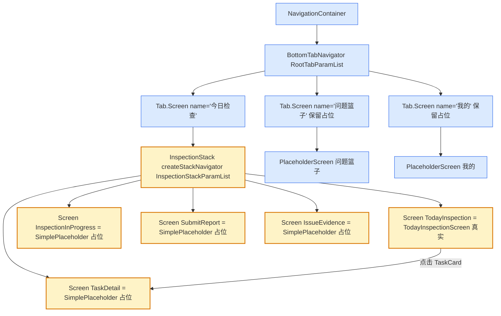

# Design Candidate — WI-0016: 今日检查屏幕实装（TodayInspectionScreen 激活 + 导航集成）

> **Work Item**: WI-0016
> **Workflow Type**: feature_spec
> **Workflow Path**: requirement_change_path
> **Base Spec Version**: PSV-0001
> **Date**: 2026-07-05
> **标准依据**: specforge_final_fused_standard_v1_1_patch1_zh.md (§8.2 Candidate)
> **作者 Agent**: sf-design
> **Candidate Path**: .specforge/work-items/WI-0016/candidates/project/modules/core/design.candidate.md
> **Target Path (merge 后)**: .specforge/project/modules/core/design.md
> **Operation**: append（在 WI-0015 design.md 已存在的基础上追加 WI-0016 章节）

---

## 0. 文档定位与 Extension Registry 检查

本文档是 WI-0016 的 **Design Candidate**（§8.2），是拟写入正式规格真相源（`.specforge/project/modules/core/design.md`）的完整候选文件。

**Extension Registry 前置检查**（v1.1 Patch1 §6）：
- 读取 `.specforge/project/extension_registry.json`，`namespaces.design_types = []`（空）。
- 本设计未引入任何新的 design_type / 结构化扩展类型，仅使用标准 Markdown 设计文档格式 + DD 决策块 + FILE_CHANGES 表。
- 结论：**无需触发 Extension Subflow**，可直接产出 Candidate。

**与现有 `.specforge/project/modules/core/design.md` 的关系**：该文件已由 WI-0015 创建（838 行），本 Candidate 采用 **append** 操作，在其后追加 `# WI-0016 章节`，不覆盖 WI-0015 已写入的 DD-1~DD-N。

---

## 1. 背景与目标

激活 `TodayInspectionScreen`（218 行骨架）与 `TaskCard`（141 行骨架），将其集成进 `AppNavigator`，并为后续 WI-0017~0020 的子页面跳转预留 Stack Navigator 骨架。

**当前状态（基于代码事实源）**：

| 文件 | 当前行数 | 当前状态 | 本 WI 改动 |
|------|----------|----------|------------|
| `src/navigation/AppNavigator.tsx` | 139 | 纯 BottomTab + 3 个 PlaceholderScreen，无嵌套 Stack | 修改：导入 TodayInspectionScreen + 嵌套 InspectionStack |
| `src/screens/today/TodayInspectionScreen.tsx` | 218 | 完整骨架（useDatabase + observe + RefreshControl + FlatList），已导出 `InspectionStackParamList` | 不改（仅被集成） |
| `src/screens/today/TaskCard.tsx` | 141 | 完整骨架（useNavigation + navigate('TaskDetail') + StatusBadge） | 不改（仅被集成） |
| `src/store/models/InspectionTaskModel.ts` | 70 | 完整 model | 不改 |

**关键矛盾**：`TaskCard` 已写死 `navigation.navigate('TaskDetail', { taskId })`，但 `AppNavigator` 当前只有 BottomTab、没有注册 `TaskDetail` 路由 → 运行时必崩。本 WI 通过嵌套 InspectionStack 解决。

**需求来源**：WI-0016 requirements.md REQ-1~REQ-5。

---

## 2. 架构图（导航结构）



**说明**：
- 🟡 黄色 = WI-0016 新增 / 改动的导航节点
- 🔵 蓝色 = 已有节点（保留不变）
- `TaskCard` 通过 `useNavigation<StackNavigationProp<InspectionStackParamList,'TaskDetail'>>()` 自动找到最近的 Stack（即 InspectionStack），无需额外连线。

---

## 3. 设计决策

### DD-1 AppNavigator 重构方案（合并式，不新增 Stack 文件）

**refs**: [requirements.md REQ-1.1, REQ-2.3, impact_analysis.md L6-L7]
**constrained_by**: `@react-navigation/stack` 已安装（TaskCard.tsx L18 已 import `StackNavigationProp`）、project-rules 最小变更原则

**决策**：

采用**合并方案**：InspectionStack 直接声明在 `AppNavigator.tsx` 内部，**不新建** `src/navigation/TodayStack.tsx`（与 impact_analysis.md 表中"新建 TodayStack.tsx"的建议不同，本设计决策**否决**该建议，理由见下）。

具体改动：
1. 在 `AppNavigator.tsx` 顶部新增导入：
   - `import { createStackNavigator } from '@react-navigation/stack';`
   - `import TodayInspectionScreen from '../screens/today/TodayInspectionScreen';`
   - `import type { InspectionStackParamList } from '../screens/today/TodayInspectionScreen';`
2. 删除 `TodayScreen` 占位函数（L51-58）。
3. 新增 `const InspectionStack = createStackNavigator<InspectionStackParamList>();`（见 DD-2）。
4. `Tab.Screen name="今日检查"` 的 `component` 改为 `InspectionStack` 组件（而非 `TodayInspectionScreen`）。
5. `IssueBasketScreen` / `ProfileScreen` 两个占位函数**保留不动**（WI-0019 / WI-0020 实装）。

**理由（为何不新建 TodayStack.tsx）**：
- 当前只有 Today 一个 Tab 需要嵌套 Stack（IssueBasket / Profile 仍是占位），新建独立文件会引入"一个 Stack 一个文件"的过早抽象，而 WI-0019/0020 实装时各自 Stack 也只需 ~30 行，合并到 AppNavigator 总量可控（见 DD-4 行数预算）。
- 减少 import 拼装层级：合并方案下 InspectionStack、SimplePlaceholder、Tab.Navigator 在同一文件，类型与路由表一目了然，降低后续维护跳转成本。
- 当三个 Tab 都需要 Stack 且 InspectionStack 超过 ~80 行时，再重构拆分（YAGNI 原则，本 WI 不预设）。

**备选方案**：
- ❌ 新建 `TodayStack.tsx`（impact_analysis 建议）：过早抽象，当前仅一个 Stack，拆分收益低于成本。
- ❌ 用 `@react-navigation/native-stack` 替代 `@react-navigation/stack`：TaskCard.tsx 已 import `StackNavigationProp` from `@react-navigation/stack`，混用两个 stack 库会类型冲突；保持单一 stack 实现。
- ❌ 把 InspectionStack 注册成 Root 的顶层 Screen（而非 Tab 内嵌）：违反"Tab 内栈式推入"需求（REQ-2），且会破坏 Tab 切换的栈状态保持（REQ-2.5）。

**Errors / 失败处理**：
- 若 `@react-navigation/stack` 实际未安装 → REQ-5 Docker 构建会失败 → 在本 WI 内补装（`npm install @react-navigation/stack`），属依赖修复不属设计回退。

---

### DD-2 嵌套 InspectionStack 设计

**refs**: [requirements.md REQ-2.1, REQ-2.2, REQ-3.1, TodayInspectionScreen.tsx L46-52]
**constrained_by**: `InspectionStackParamList` 类型已固化（不可私自新增/删除路由名）

**决策**：

在 `AppNavigator.tsx` 内声明：

```tsx
const InspectionStack = createStackNavigator<InspectionStackParamList>();

function InspectionStackNavigator(): React.ReactElement {
  return (
    <InspectionStack.Navigator screenOptions={{ headerShown: true }}>
      <InspectionStack.Screen
        name="TodayInspection"
        component={TodayInspectionScreen}
        options={{ headerTitle: '今日检查' }}
      />
      <InspectionStack.Screen
        name="TaskDetail"
        component={SimplePlaceholder}  // 占位，WI-0017 替换
        options={{ headerTitle: '任务详情' }}
      />
      <InspectionStack.Screen
        name="InspectionInProgress"
        component={SimplePlaceholder}  // 占位，WI-0017 替换
        options={{ headerTitle: '检查进行中' }}
      />
      <InspectionStack.Screen
        name="SubmitReport"
        component={SimplePlaceholder}  // 占位，后续 WI 替换
        options={{ headerTitle: '提交报告' }}
      />
      <InspectionStack.Screen
        name="IssueEvidence"
        component={SimplePlaceholder}  // 占位，WI-0018 替换
        options={{ headerTitle: '问题证据' }}
      />
    </InspectionStack.Navigator>
  );
}
```

**关键约束**：
1. **路由名严格匹配** `InspectionStackParamList` 的 5 个 key（`TodayInspection` / `TaskDetail` / `InspectionInProgress` / `SubmitReport` / `IssueEvidence`），不得新增、不得改名 —— TypeScript `createStackNavigator<InspectionStackParamList>` 泛型会强制校验。
2. **TodayInspection 是唯一真实 component**，其余 4 个用 `SimplePlaceholder`（见 DD-3）。
3. **每个 screen 配置 `options.headerTitle`**（中文标题），不依赖默认路由名做标题。
4. **`screenOptions.headerShown: true`** 在 Stack 层统一开启，与 BottomTab 的 `headerShown` 不冲突（Tab header 显示 Tab 名，Stack header 显示 screen 标题，React Navigation 支持双层 header）。

**Tab.Screen 接线**：

```tsx
<Tab.Screen
  name="Today"  // 注意：Tab name 是 RootTabParamList 的 key，与 Stack 内路由名解耦
  component={InspectionStackNavigator}
  options={{ title: '今日检查', tabBarLabel: '今日检查' }}
/>
```

**TaskCard 跳转的解析路径**：
- `TaskCard` 调用 `navigation.navigate('TaskDetail', { taskId })`。
- React Navigation 从最近的上游 Stack Navigator 查找 `'TaskDetail'` → 命中 `InspectionStack`。
- 因 `TaskDetail` 已在路由表注册（component=SimplePlaceholder），推入成功，不崩溃（满足 REQ-3.3）。
- `taskId` 参数通过 `route.params` 传给 SimplePlaceholder（占位组件可选择性显示，便于人工验证）。

**备选方案**：
- ❌ 只注册 `TodayInspection`，不注册其余 4 个路由：`TaskCard.navigate('TaskDetail')` 仍会崩溃，违反 REQ-2.2。
- ❌ 为每个占位 screen 写独立组件函数（`TaskDetailPlaceholder` / `InspectionInProgressPlaceholder` ...）：4 个函数体雷同，违反 DRY，用单一 `SimplePlaceholder` + props 区分。
- ❌ 用 `Group` 包裹占位 screen 统一配置：可行但本 WI 不必要，4 个 screen 各自 `options.headerTitle` 不同，分别声明更清晰。

---

### DD-3 占位 Screen 通用组件 SimplePlaceholder

**refs**: [requirements.md REQ-2.2, REQ-3.3]
**constrained_by**: 复用 AppNavigator.tsx 已有 `PlaceholderScreen` 的 props 形状（title + subtitle?）

**决策**：

复用并重命名现有 `PlaceholderScreen`（AppNavigator.tsx L42-49）为 `SimplePlaceholder`，使其既能服务 Tab 占位（IssueBasket / Profile）又能服务 Stack 占位（TaskDetail 等）。

**保留原 props 接口**（不破坏 IssueBasket / Profile 现有调用）：

```tsx
interface SimplePlaceholderProps {
  title: string;
  subtitle?: string;
}

function SimplePlaceholder({
  title,
  subtitle,
}: SimplePlaceholderProps): React.ReactElement {
  return (
    <View style={styles.placeholder}>
      <Text style={styles.title}>{title}</Text>
      {subtitle ? <Text style={styles.subtitle}>{subtitle}</Text> : null}
    </View>
  );
}
```

**Stack 占位调用方式**（`component` 需要是组件而非元素，故用高阶包裹传 props）：

```tsx
function makePlaceholder(title: string, subtitle: string) {
  return function PlaceholderComponent() {
    return <SimplePlaceholder title={title} subtitle={subtitle} />;
  };
}

// 在 InspectionStack 内：
<InspectionStack.Screen
  name="TaskDetail"
  component={makePlaceholder('任务详情', '占位 — WI-0017 将实装真实详情页')}
  options={{ headerTitle: '任务详情' }}
/>
```

**理由**：
- `@react-navigation/stack` 的 `component` 必须是 `React.ComponentType<StackScreenProps>`，不能直接传 `<SimplePlaceholder title=... />`（那是元素不是组件）。
- `makePlaceholder` 工厂返回无参函数组件，签名兼容 `component` 要求，且复用 `SimplePlaceholder` 渲染逻辑（DRY）。
- `subtitle` 文案标注归属 WI（如"占位 — WI-0017 将实装"），便于后续开发者一眼识别替换时机。

**备选方案**：
- ❌ 用 `children` / `element` 属性（`@react-navigation/stack` 不支持 `element`，只支持 `component`）。
- ❌ 为每个占位写独立组件：见 DD-2 备选方案，违反 DRY。
- ❌ 用 React Navigation 的 `Group` + 共享 component：4 个占位 subtitle 不同，仍需分别传 props，未简化。

---

### DD-4 AppNavigator.tsx 最终文件结构

**refs**: [requirements.md REQ-1, REQ-2, impact_analysis.md]
**constrained_by**: 最小变更 + 单文件可读性

**决策**：

重构后 `AppNavigator.tsx` 的章节顺序（预计 `<final_loc: 220>` 行，区间 200~250）：

```
L1-13     文件头注释（更新：说明已集成 TodayInspectionScreen + InspectionStack）
L14-19    导入 React / RN / NavigationContainer / createBottomTabNavigator
L20-22    新增导入 createStackNavigator + TodayInspectionScreen + InspectionStackParamList type
L24-30    RootTabParamList 类型定义（不变）
L32       const Tab = createBottomTabNavigator<RootTabParamList>()
L34       新增 const InspectionStack = createStackNavigator<InspectionStackParamList>()
L36-52    SimplePlaceholder 组件 + makePlaceholder 工厂（替换原 PlaceholderScreen）
L54-58    IssueBasketScreen 占位（保留）
L60-64    ProfileScreen 占位（保留）
L66-95    InspectionStackNavigator 组件（5 个 Screen 注册，见 DD-2）
L97-118   AppNavigator 默认导出（Tab.Navigator，Today Tab component 改为 InspectionStackNavigator）
L120-160  styles（保留原 placeholder/title/subtitle 样式）
```

**行数预算依据**：
- 原 139 行 - 删除 TodayScreen（8 行）- 删除 PlaceholderScreen 改名（净 0）= ~131 行基线。
- 新增：createStackNavigator 导入（1 行）+ TodayInspectionScreen 导入（1 行）+ type 导入（1 行）+ InspectionStack 声明（2 行）+ SimplePlaceholder+makePlaceholder（~17 行）+ InspectionStackNavigator（~30 行）+ 注释更新（~10 行）= +62 行。
- 合计 ~193 行，加上空行与样式微调 → 落在 200~250 区间。

**不拆分文件的判定**：
- 单文件 220 行仍在可读阈值内（project-rules 经验值：单组件文件 ≤ 300 行无需强制拆分）。
- InspectionStackNavigator 与 Tab.Navigator 强耦合（Tab 直接消费 Stack 组件），拆开反而增加跳转。

---

### DD-5 验证策略

**refs**: [requirements.md REQ-4, REQ-5]
**constrained_by**: Docker `fj-builder:react-native-0.74`、tsc 严格模式

**决策**：

本 WI 采用两层验证（与 WI-0015 一致，不引入单测）：

| 层级 | 命令 | 期望 | 失败处置 |
|------|------|------|----------|
| 类型 | `cd fj-android && npx tsc --noEmit` | 退出码 0，无类型错误 | 修正 `InspectionStackParamList` 泛型 / 导入路径 / props 类型 |
| 构建 | Docker 内 `cd fj-android/android && ./gradlew assembleDebug` | 退出码 0，产出 `app-debug.apk` > 1 MiB | 检查 `@react-navigation/stack` 依赖、Metro bundle、原生编译 |

**关键类型检查点**（tsc 必须覆盖）：
1. `createStackNavigator<InspectionStackParamList>()` 泛型与 5 个 `<InspectionStack.Screen name="...">` 的 name 字面量匹配（多一个/少一个/拼错都报错）。
2. `TaskCard` 的 `StackNavigationProp<InspectionStackParamList, 'TaskDetail'>` 与 InspectionStack 同源（同一份类型导入）。
3. `makePlaceholder` 返回的组件签名兼容 `component` 属性（`React.ComponentType<StackScreenProps<InspectionStackParamList, 'TaskDetail'>>`）。
4. `Tab.Screen name="Today"` 的 `component={InspectionStackNavigator}` 类型合法（Tab 接受无参组件）。

**运行时验证（人工，非 AC 强制）**：
- 启动 App → 切到"今日检查" Tab → 看到任务列表（或空状态）。
- 点击任一 TaskCard → 推入 TaskDetail 占位页（显示"任务详情 / 占位 — WI-0017 将实装"）。
- 按返回键 → 回到列表，栈状态正确。
- 切到"问题篮子"/"我的" Tab → 仍显示占位（未被本 WI 破坏）。

**不在本 WI 验证范围**：
- TaskDetail 真实业务（WI-0017）。
- 照片上传（WI-0018）。
- 单元测试（独立质量 WI）。

---

## 4. FILE_CHANGES（代码改动清单）

| 文件 | 操作 | 改动摘要 | 对应 DD | 对应 REQ |
|------|------|----------|---------|----------|
| `fj-android/src/navigation/AppNavigator.tsx` | 修改 | ① 新增导入 `createStackNavigator` + `TodayInspectionScreen` + `InspectionStackParamList` type；② 新增 `const InspectionStack`；③ `PlaceholderScreen` 改名为 `SimplePlaceholder` + 新增 `makePlaceholder` 工厂；④ 删除 `TodayScreen` 占位函数；⑤ 新增 `InspectionStackNavigator` 组件（5 路由）；⑥ `Tab.Screen name="今日检查"` 的 `component` 改为 `InspectionStackNavigator`；⑦ `IssueBasket`/`Profile` Tab 保留占位不动 | DD-1/2/3/4 | REQ-1, REQ-2, REQ-3 |
| `fj-android/src/screens/today/TodayInspectionScreen.tsx` | 不改 | 骨架已就绪，仅被 AppNavigator 导入 | — | REQ-1.3 |
| `fj-android/src/screens/today/TaskCard.tsx` | 不改 | 骨架已就绪，`navigate('TaskDetail')` 由 InspectionStack 兜底 | — | REQ-3.1 |
| `fj-android/src/store/models/InspectionTaskModel.ts` | 不改 | model 不变 | — | — |
| `fj-android/package.json` | 可能修改 | 若 `@react-navigation/stack` 未安装则补装（REQ-5 失败时触发，非预设改动） | DD-1 失败处理 | REQ-5.3 |

**改动总量**：1 个文件确定修改（AppNavigator.tsx，~62 行净增），0 个文件确定新建（合并方案），0 个文件删除。

---

## 5. 风险与缓解

| 风险 | 概率 | 影响 | 缓解 |
|------|------|------|------|
| `@react-navigation/stack` 未在 package.json 中安装 | 中 | 构建失败 | DD-1 失败处理已声明：REQ-5 失败时补装；TaskCard.tsx 已 import `StackNavigationProp` from 该库，大概率已安装 |
| Tab header 与 Stack header 双层显示导致 UI 冗余 | 低 | 视觉问题 | React Navigation 默认 Tab header 在 Stack 之下；如需隐藏可在 Tab.Screen 配 `options={{ headerShown: false }}`，本 WI 暂保留双层（后续 UI WI 调整） |
| 切换 Tab 后 InspectionStack 栈状态丢失 | 低 | 用户体验 | React Navigation 默认保留各 Tab 的栈状态（REQ-2.5 已约束不得强制 reset） |
| `InspectionStackParamList` 后续新增路由时 AppNavigator 漏注册 | 中 | tsc 报错（因泛型强制） | tsc 是安全网；新增路由必须同步改 AppNavigator，类型系统会拦截 |
| SimplePlaceholder 改名影响 IssueBasket/Profile 现有调用 | 低 | tsc 报错 | 改名是全文件内替换（L42/L60/L69 三处），tsc 会立即捕获遗漏 |

---

## 6. 与现有规格的关系

| 现有规格 | 关系 | 说明 |
|----------|------|------|
| WI-0015 design.md DD-1~DD-N（已合并） | 前置依赖 | WI-0015 激活了 DatabaseProvider / SyncEngineProvider，本 WI 的 TodayInspectionScreen 依赖其 `useDatabase()` / `useSyncEngine()` 返回非 null |
| WI-0001 §2.4 安卓端模块划分 | 上游规格 | AppNavigator 的 Tab 结构（Today/IssueBasket/Profile）源自该规格，本 WI 不改变 Tab 数量与命名 |
| TD-ANDROID-001（MVP 不加密） | 无关 | 本 WI 不涉及数据库加密 |
| WI-0017（TaskDetail 实装） | 下游消费者 | 本 WI 为其预留 `TaskDetail` 路由 + 占位，WI-0017 仅需替换 component |
| WI-0018（照片上传） | 下游消费者 | 本 WI 为其预留 `IssueEvidence` 路由 + 占位 |
| WI-0019（IssueBasket） | 下游消费者 | 本 WI 保留 IssueBasket Tab 占位不动 |
| WI-0020（Profile） | 下游消费者 | 本 WI 保留 Profile Tab 占位不动 |

---

## 7. 自检（Self-Check）

| # | 自问自答 | 答案 |
|---|---------|------|
| 1 | 是否覆盖 requirements.md 全部 5 个 REQ？ | 是：REQ-1 → DD-1；REQ-2 → DD-1/2；REQ-3 → DD-2（TaskCard 解析路径）；REQ-4 → DD-5（tsc 检查点）；REQ-5 → DD-5（Docker 构建）。 |
| 2 | 是否给出了文件改动的明确清单（FILE_CHANGES）？ | 是，§4 表格列出 5 个文件的操作与改动摘要，确定修改仅 AppNavigator.tsx 1 个。 |
| 3 | 是否声明了备选方案与否决理由？ | 是，DD-1（合并 vs 拆分 TodayStack.tsx）、DD-2（注册全部路由 vs 只注册 TodayInspection）、DD-3（makePlaceholder vs 独立组件）均列出备选与 ❌ 否决理由。 |
| 4 | 是否避免编写任务拆分 / 代码实现？ | 是，未给 TASK 编号、未拆 epic；代码片段仅为决策示意（属设计层面的接口契约），实际实现由 sf-task-planner / sf-executor 完成。 |
| 5 | 是否处理了"目标 screen 未实装导致导航崩溃"关键风险？ | 是，DD-2 明确 4 个占位 + DD-3 SimplePlaceholder 兜底；§5 风险表第 4 行覆盖路由漏注册场景（tsc 拦截）。 |
| 6 | 是否声明了 InspectionStackParamList 类型的复用与不可变性？ | 是，DD-2 关键约束 1 显式"不得新增/删除/改名"，tsc 泛型强制校验。 |
| 7 | 是否给出了行数预算与不拆分文件的判定？ | 是，DD-4 给出 ~220 行预算 + ≤300 行不强制拆分的经验阈值。 |
| 8 | 是否声明与 WI-0015 / WI-0017~0020 的边界？ | 是，§6 关系表 7 行明确上下游。 |
| 9 | 是否避免读取 host-profile.json / prod-environment.md？ | 是，全程未读取技术事实源，设计基于代码骨架事实 + requirements.md。 |
| 10 | 是否声明了验证策略的两层（tsc + Docker）？ | 是，DD-5 表格 + 关键类型检查点 4 项 + 运行时人工验证。 |
