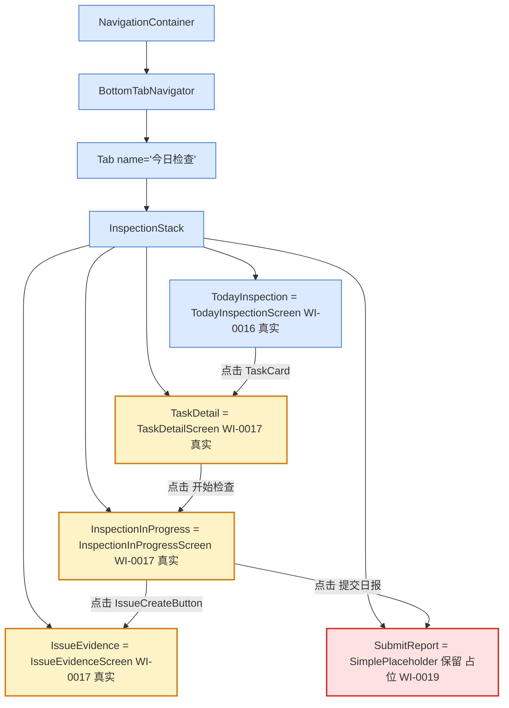

# Design Candidate — WI-0017 检查中屏幕实装

> **Work Item**: WI-0017
> **Workflow Type**: feature_spec
> **Workflow Path**: requirement_change_path
> **Base Spec Version**: PSV-0001
> **Date**: 2026-07-05
> **标准依据**: specforge_final_fused_standard_v1_1_patch1_zh.md (§8.2 Candidate)
> **作者 Agent**: sf-design
> **Candidate Path**: .specforge/work-items/WI-0017/candidates/project/modules/core/design.candidate.md
> **Target Path (merge 后)**: .specforge/project/modules/core/design.md
> **Operation**: append（在 WI-0016 design.md 已合并章节后追加 WI-0017 章节，不覆盖 WI-0015 / WI-0016 已写入的 DD-1~DD-N）

---

## 0. 文档定位与 Extension Registry 检查

本文档是 WI-0017 的 **Design Candidate**（§8.2），是拟写入正式规格真相源（`.specforge/project/modules/core/design.md`）的完整候选文件。

**Extension Registry 前置检查**（v1.1 Patch1 §6）：
- 读取 `.specforge/project/extension_registry.json`，`namespaces.design_types = []`（空）。
- 本设计未引入任何新的 design_type / 结构化扩展类型，仅使用标准 Markdown 设计文档格式 + DD 决策块 + FILE_CHANGES 表。
- 结论：**无需触发 Extension Subflow**，可直接产出 Candidate。

**与现有 `.specforge/project/modules/core/design.md` 的关系**：该文件已由 WI-0015（838 行）+ WI-0016 章节合并构成，本 Candidate 采用 **append** 操作，在其后追加 `# WI-0017 章节`，不覆盖已有 DD。

---

## 1. 背景与目标

将 WI-0016 在 `AppNavigator.tsx` 中以 `SimplePlaceholder` 兜底的 3 个 InspectionStack 路由（`TaskDetail` / `InspectionInProgress` / `IssueEvidence`）替换为已就绪的真实骨架 screen；保留 `SubmitReport` 占位不动并修正归属误标。

**当前状态（基于代码事实源）**：

| 文件 | 当前行数 | 当前状态 | 本 WI 改动 |
|------|----------|----------|------------|
| `src/navigation/AppNavigator.tsx` | 221 | WI-0016 已合并：InspectionStack 5 路由，4 个 SimplePlaceholder（TaskDetail/InspectionInProgress/SubmitReport/IssueEvidence） | 修改：3 个路由 component 替换为真实 screen + 1 处 subtitle 文案更正 |
| `src/screens/inspection/TaskDetailScreen.tsx` | 261 | 完整骨架（findAndObserve + 基本信息区 + 开始检查按钮） | 不改（仅被 import） |
| `src/screens/inspection/InspectionInProgressScreen.tsx` | 370 | 完整骨架（进度条 + 条目列表 + IssueCreateButton + 提交日报按钮） | 不改（仅被 import） |
| `src/screens/inspection/IssueEvidenceScreen.tsx` | 915 | 完整骨架（PhotoCapture + PhotoCompressor + WatermarkOverlay + 表单 + WatermelonDB 保存） | 不改（仅被 import） |
| `src/screens/inspection/IssueCreateButton.tsx` | 69 | 已存在，由 InspectionInProgressScreen 引用 | 不改 |

**关键事实**：
- 3 个 screen 均已 `export default function XxxScreen(...)`，并以 `StackScreenProps<InspectionStackParamList, 'X'>` 声明 props —— 与 WI-0016 在 AppNavigator 中 `createStackNavigator<InspectionStackParamList>()` 声明的 Stack 泛型同源，替换 component 后类型自然对齐。
- WI-0016 当前 AppNavigator.tsx L87-L130 用 children 渲染回调包裹 SimplePlaceholder（如 `{() => <SimplePlaceholder ... />}`），本 WI 需将该 4 处回调移除 3 处并改用 `component={XxxScreen}` 直接挂载。

**需求来源**：WI-0017 requirements.candidate.md REQ-1~REQ-5。

---

## 2. 架构图（导航结构 — WI-0017 增量）



**说明**：
- 🟡 黄色 = WI-0017 新增/改动的导航节点（3 个 SimplePlaceholder → 真实 screen）
- 🔴 红色 = WI-0017 显式保留 + 文案更正的节点（SubmitReport）
- 🔵 蓝色 = WI-0016 已实装节点（保留不变）

---

## 3. 设计决策

### DD-1 AppNavigator 修改方案（import 3 个组件 + 替换 SimplePlaceholder）

**refs**: [requirements.md REQ-1.1, REQ-2.1, REQ-3.1, impact_analysis.md L4-L6, AppNavigator.tsx L87-L130]

**constrained_by**: WI-0016 已固化 `InspectionStackParamList` 类型与 5 路由名（不可改名）；3 个骨架 screen 已 `export default` 且 props 类型与 Stack 泛型同源；project-rules 最小变更原则

**决策**：

对 `AppNavigator.tsx` 执行**最小替换式集成**，不重写 InspectionStack 整体结构，仅在 3 个目标路由上替换 component：

**Step 1：顶部新增 3 个 import**（紧邻 WI-0016 已有的 `TodayInspectionScreen` 导入之后）：

```tsx
import TaskDetailScreen from '../screens/inspection/TaskDetailScreen';
import InspectionInProgressScreen from '../screens/inspection/InspectionInProgressScreen';
import IssueEvidenceScreen from '../screens/inspection/IssueEvidenceScreen';
```

**Step 2：替换 3 个路由的 component**（删除 WI-0016 写的 children 渲染回调）：

```tsx
<InspectionStack.Screen
  name="TaskDetail"
  component={TaskDetailScreen}              // ← WI-0017 替换 SimplePlaceholder
  options={{ headerTitle: '任务详情' }}
/>
<InspectionStack.Screen
  name="InspectionInProgress"
  component={InspectionInProgressScreen}    // ← WI-0017 替换 SimplePlaceholder
  options={{ headerTitle: '检查中' }}
/>
<InspectionStack.Screen
  name="IssueEvidence"
  component={IssueEvidenceScreen}           // ← WI-0017 替换 SimplePlaceholder（注意：原 subtitle 误标 WI-0018，本 WI 修正）
  options={{ headerTitle: '问题证据' }}
/>
```

**Step 3：保留 `SimplePlaceholder` 组件定义** —— 仍被 SubmitReport 路由 + IssueBasket/Profile Tab 占位使用，不得删除。

**关键约束**：

1. **路由名严格不变**：5 个路由名（`TodayInspection` / `TaskDetail` / `InspectionInProgress` / `SubmitReport` / `IssueEvidence`）保持 WI-0016 已固化的字符串字面量，本 WI 不增删路由、不改名。
2. **`headerTitle` 中文文案保持一致**：与 WI-0016 已写入的标题一致（TaskDetail → "任务详情"，InspectionInProgress 由 WI-0016 的"检查中"保持，IssueEvidence → "问题证据"）；本 WI 不调整 header 文案。
3. **props 类型零改动**：3 个 screen 已用 `StackScreenProps<InspectionStackParamList, 'X'>` 声明，与 AppNavigator 的 `createStackNavigator<InspectionStackParamList>()` 同源，`component={XxxScreen}` 自动满足 React Navigation 的 `React.ComponentType<StackScreenProps<...>>` 约束。
4. **`route.params` 自动透传**：TaskDetailScreen 期望 `{ taskId }`、InspectionInProgressScreen 期望 `{ taskId }`、IssueEvidenceScreen 期望 `{ taskId; taskItemId? }` —— 均与 `InspectionStackParamList` 中对应 key 的参数类型一致（WI-0016 已固化），跳转方（TaskCard / TaskDetailScreen / IssueCreateButton）传入的参数会被 React Navigation 自动透传到 `route.params`。

**理由（为何不重写 InspectionStack 整体）**：
- WI-0016 的 InspectionStack 结构（5 路由声明顺序、screenOptions、Tab 接线）已通过 Gate + 合并，重写会引入不必要的回归风险。
- 最小替换式改动只触及 3 行 `component=` 字段 + 3 行 import + 删除 3 段 children 回调，diff 行数控制在 ~30 行以内，便于 review 与回滚。

**备选方案**：
- ❌ 重写 InspectionStack 整体（先删除再重建 5 个 Screen）：违反最小变更原则，且会牵动 SubmitReport 与 Tab 接线，引入无关回归。
- ❌ 把 3 个 import 合并到一行（`import { TaskDetailScreen, InspectionInProgressScreen, IssueEvidenceScreen } from '../screens/inspection';`）：3 个 screen 是各自独立文件（非 barrel `index.ts`），需用 3 个 default import；如改用 barrel 需新建 `screens/inspection/index.ts`，超出本 WI 范围。
- ❌ 用 `React.lazy` 动态导入 3 个 screen：InspectionStack 是同步组件树，引入 lazy 增加 Suspense 复杂度，无收益。

**Errors / 失败处理**：
- 若 tsc 报 `Module '.../TaskDetailScreen' has no default export` → 检查 screen 文件是否 `export default function`（事实是 yes），多为导入路径拼写错。
- 若 tsc 报 `component` 类型不匹配 → 多为 children 回调未完全删除导致 `component` 与 `children` 同时存在（React Navigation 不允许），需清理。

---

### DD-2 SubmitReport 占位保留（注明 WI-0019）

**refs**: [requirements.md REQ-4.1, REQ-4.2, AppNavigator.tsx L109-L119]

**constrained_by**: WI-0019 是 SubmitReportScreen 的归属 WI（intake OUT-OF-SCOPE 明确）

**决策**：

`SubmitReport` 路由保持 WI-0016 的 SimplePlaceholder 占位结构，**仅修正 subtitle 文案**：

```tsx
<InspectionStack.Screen
  name="SubmitReport"
  options={{ headerTitle: '提交日报' }}
>
  {() => (
    <SimplePlaceholder
      title="提交日报"
      subtitle="骨架占位 — WI-0019 实现"   // ← WI-0017 修正：原 "WI-0017 实现" 误标
    />
  )}
</InspectionStack.Screen>
```

**关键约束**：

1. **component 不替换**：仍用 children 渲染回调包裹 `SimplePlaceholder`，与 WI-0016 结构一致。
2. **subtitle 文案从"骨架占位 — WI-0017 实现"改为"骨架占位 — WI-0019 实现"**：消除 AppNavigator.tsx L116 当前误标（intake.md IN-SCOPE 第 1 条明确 SubmitReport 由 WI-0019 实装，WI-0017 仅做 3 个 screen 集成）。
3. **不引入 SubmitReportScreen 真实文件**：本 WI 不创建 `src/screens/inspection/SubmitReportScreen.tsx`，留给 WI-0019。

**理由**：
- 误标修正属于本 WI 范围内的"零成本清理"（同一文件内一行 subtitle 字符串修改），避免给 WI-0019 留歧义。
- 不修正的话，未来读者会误以为 SubmitReport 也属 WI-0017，与 intake 边界冲突。

**备选方案**：
- ❌ 顺便实装 SubmitReportScreen 占位文件（即使只是空组件）：超出本 WI 范围，且 WI-0019 应自行决定 SubmitReportScreen 的骨架结构。
- ❌ 把 SubmitReport 路由直接删掉（等 WI-0019 重新加）：会破坏 `InspectionStackParamList` 类型契约（5 路由不可变），且 InspectionInProgressScreen 内 `navigation.navigate('SubmitReport', { taskId })` 会运行时崩溃。

---

### DD-3 验证策略（tsc + Docker 两层）

**refs**: [requirements.md REQ-5.1, REQ-5.2, REQ-5.3, impact_analysis.md L9-L12]

**constrained_by**: Docker `fj-builder:react-native-0.74`、tsc 严格模式、WI-0016 已验证过的 Docker 授权链路

**决策**：

本 WI 采用与 WI-0016 一致的两层验证（不引入单测 / E2E）：

| 层级 | 命令 | 期望 | 失败处置 |
|------|------|------|----------|
| 类型 | Docker 内 `cd fj-android && npx tsc --noEmit` | 退出码 0，无 `error TS` 行 | 修正导入路径 / children 回调清理 / props 类型对齐 |
| 构建 | Docker 内 `cd fj-android/android && ./gradlew assembleDebug` | 退出码 0，产出 `app-debug.apk` > 1 MiB | 检查 Metro bundle 解析 / 默认导出 / `@react-navigation/stack` 依赖（WI-0016 已确认安装） |

**关键类型检查点**（tsc 必须覆盖）：

1. 3 个 `import XxxScreen from '../screens/inspection/XxxScreen'` 默认导入路径正确，对应文件确实 `export default function XxxScreen`。
2. 3 个 `<InspectionStack.Screen name="TaskDetail|InspectionInProgress|IssueEvidence" component={XxxScreen} />` 的 `name` 字面量与 `InspectionStackParamList` 的 key 完全一致（多一个/少一个/拼错都报错）。
3. 3 个 `XxxScreen` 的 props 类型 `StackScreenProps<InspectionStackParamList, 'X'>` 与 `component` 期望的 `React.ComponentType<StackScreenProps<InspectionStackParamList, 'X'>>` 兼容（同源 `InspectionStackParamList` import，自动满足）。
4. 3 个目标路由不再保留 `children` 渲染回调（与 `component` 互斥，React Navigation 类型层会报错）。

**关键运行时验证（构建期覆盖）**：
- Metro bundle 解析 3 个新导入：若导入路径错，`assembleDebug` 会报 `Module not found`。
- `app-debug.apk` 体积 > 1 MiB：3 个 screen（261 + 370 + 915 = 1546 行）被打包进 bundle，体积应略增。

**运行时人工验证（非 AC 强制）**：
- 启动 App → 今日检查 Tab → 点击 TaskCard → 进入真实 TaskDetailScreen（显示任务基本信息 + "开始检查"按钮）。
- 点击"开始检查" → 进入真实 InspectionInProgressScreen（显示进度条 + "暂无检查表条目" + IssueCreateButton + "提交日报"按钮）。
- 点击 IssueCreateButton → 进入真实 IssueEvidenceScreen（显示任务上下文 + 拍照入口 + 表单 + 保存按钮）。
- 点击"提交日报" → 推入 SubmitReport 占位（subtitle 显示"骨架占位 — WI-0019 实现"，验证修正生效）。
- 按返回键 → 各 screen 栈状态正确，不崩溃。

**不在本 WI 验证范围**：
- SubmitReport 真实业务（WI-0019）。
- PhotoCapture / PhotoCompressor 原生端口实装（WI-0018）。
- 单元测试 / E2E 测试套件（独立质量 WI）。

---

## 4. FILE_CHANGES（代码改动清单）

| 文件 | 操作 | 改动摘要 | 对应 DD | 对应 REQ |
|------|------|----------|---------|----------|
| `fj-android/src/navigation/AppNavigator.tsx` | 修改 | ① 顶部新增 3 个 import（TaskDetailScreen / InspectionInProgressScreen / IssueEvidenceScreen）；② `TaskDetail` 路由 children 回调删除 + 改为 `component={TaskDetailScreen}`；③ `InspectionInProgress` 路由同样改造；④ `IssueEvidence` 路由同样改造；⑤ `SubmitReport` 路由 subtitle 文案从"骨架占位 — WI-0017 实现"改为"骨架占位 — WI-0019 实现"；⑥ 更新文件头 JSDoc 注释（说明 3 个 screen 已激活、SubmitReport 占位由 WI-0019 替换）；⑦ 保留 SimplePlaceholder 组件定义（SubmitReport + IssueBasket/Profile 仍用） | DD-1, DD-2 | REQ-1, REQ-2, REQ-3, REQ-4 |
| `fj-android/src/screens/inspection/TaskDetailScreen.tsx` | 不改 | 261 行骨架已就绪，仅被 AppNavigator import 激活 | — | REQ-1.2, REQ-1.3 |
| `fj-android/src/screens/inspection/InspectionInProgressScreen.tsx` | 不改 | 370 行骨架已就绪，仅被 AppNavigator import 激活 | — | REQ-2.2, REQ-2.3 |
| `fj-android/src/screens/inspection/IssueEvidenceScreen.tsx` | 不改 | 915 行骨架已就绪，仅被 AppNavigator import 激活 | — | REQ-3.2, REQ-3.3 |
| `fj-android/src/screens/inspection/IssueCreateButton.tsx` | 不改 | 69 行，由 InspectionInProgressScreen 引用，跳转 IssueEvidence 路由 | — | REQ-3.2 |

**改动总量**：1 个文件确定修改（AppNavigator.tsx，~30 行净变更：+3 import + 3 处 component 替换 + 删除 3 段 children 回调 + 1 处 subtitle 文案 + JSDoc 注释更新），0 个文件新建，0 个文件删除。

---

## 5. 风险与缓解

| 风险 | 概率 | 影响 | 缓解 |
|------|------|------|------|
| 3 个 screen 的默认导出缺失（骨架阶段漏写 `export default`） | 极低 | tsc 报错 `no default export` | 事实源已确认 3 文件均 `export default function XxxScreen`；tsc 是安全网 |
| children 渲染回调删除不彻底（与 component 同时存在） | 低 | tsc 报错或运行时 React Navigation 警告 | DD-1 关键约束 4 已显式要求清理；tsc 拦截 |
| SubmitReport subtitle 文案修正遗漏 | 低 | 文档歧义（不影响功能） | DD-2 关键约束 2 显式要求；review 时肉眼可校验 |
| IssueEvidenceScreen 内 PhotoCapture/PhotoCompressor 在端口未注入时崩溃 | 低 | 取证页不可用 | 骨架代码已有 `DefaultCameraProvider` 降级提示（事实源 L24 注释 + REQ-3.3 约束）；本 WI 不引入新端口注入 |
| 检查表条目为空导致 InspectionInProgressScreen 进度计算除零 | 极低 | NaN 显示 | 骨架代码 L87 `totalCount > 0 ? completedCount / totalCount : 0` 已防御 |
| AppNavigator.tsx 修改后行数膨胀超 300 | 极低 | 可读性 | 本 WI 净增 ~10 行（删除 3 段 children 回调抵消大部分新增），最终 ~230 行仍在阈值内 |
| 3 个 screen 内部业务逻辑 bug（如 findAndObserve error 处理不当） | 中 | 运行时空状态 / 错误页 | 本 WI 不修 screen 内部逻辑（属后续 WI）；骨架代码已有 error 兜底（如 TaskDetail L61-66 的 notFound 状态） |

---

## 6. 与现有规格的关系

| 现有规格 | 关系 | 说明 |
|----------|------|------|
| WI-0015 design.md DD-1~DD-N（已合并） | 前置依赖 | WI-0015 激活了 DatabaseProvider / SyncEngineProvider，本 WI 的 3 个 screen 内 `useDatabase()` 返回非 null |
| WI-0016 design.md DD-1~DD-5（已合并） | 直接前置 | WI-0016 建立 InspectionStack + 4 个 SimplePlaceholder 占位 + SimplePlaceholder 组件定义；本 WI 在其基础上替换 3 个占位 |
| WI-0001 §2.4 安卓端模块划分 | 上游规格 | 3 个 screen 的职责划分源自该规格 |
| WI-0018（照片原生端口） | 下游 | IssueEvidenceScreen 的 PhotoCapture/PhotoCompressor 原生端口注入属 WI-0018；本 WI 仅激活骨架，端口走降级 |
| WI-0019（SubmitReportScreen + IssueBasket） | 下游 | SubmitReport 真实实装 + 占位替换属 WI-0019 |
| TD-ANDROID-001（MVP 不加密） | 无关 | 本 WI 不涉及数据库加密 |

---

## 7. 自检（Self-Check）

| # | 自问自答 | 答案 |
|---|---------|------|
| 1 | 是否覆盖 requirements.md 全部 5 个 REQ？ | 是：REQ-1/2/3 → DD-1（3 处 component 替换）；REQ-4 → DD-2（SubmitReport 占位 + 文案修正）；REQ-5 → DD-3（tsc + Docker 两层）。 |
| 2 | 是否给出了 FILE_CHANGES 明确清单？ | 是，§4 表格列出 5 个文件的操作（1 改 + 4 不改），确定修改仅 AppNavigator.tsx。 |
| 3 | 是否声明了备选方案与否决理由？ | 是，DD-1（最小替换 vs 重写 InspectionStack vs barrel import vs lazy）、DD-2（顺便实装 SubmitReport vs 删路由）均列出备选与 ❌ 否决理由。 |
| 4 | 是否避免编写任务拆分 / 代码实现？ | 是，未给 TASK 编号、未拆 epic；代码片段仅为决策示意（属设计层面的接口契约），实际实现由 sf-task-planner / sf-executor 完成。 |
| 5 | 是否处理了"骨架 screen 缺数据/缺端口"关键风险？ | 是，DD-1 关键约束 4 + 风险表第 4/5 行覆盖（PhotoCapture 降级 / 进度除零防御）；REQ-2.3 / REQ-3.3 在需求层已显式约束。 |
| 6 | 是否声明 InspectionStackParamList 类型的不可变性？ | 是，DD-1 关键约束 1 显式"5 路由名不可增删改"，与 WI-0016 DD-2 同源约束一致。 |
| 7 | 是否给出 SubmitReport 占位的处理决策？ | 是，DD-2 显式保留 component 为 SimplePlaceholder + 仅修正 subtitle 文案为 WI-0019。 |
| 8 | 是否声明与 WI-0015 / WI-0016 / WI-0018 / WI-0019 的边界？ | 是，§6 关系表 6 行明确上下游。 |
| 9 | 是否避免读取 host-profile.json / prod-environment.md？ | 是，全程未读取技术事实源，设计基于代码骨架事实 + requirements.md。 |
| 10 | 是否声明验证策略的两层（tsc + Docker）？ | 是，DD-3 表格 + 关键类型检查点 4 项 + 运行时人工验证 5 步。 |
