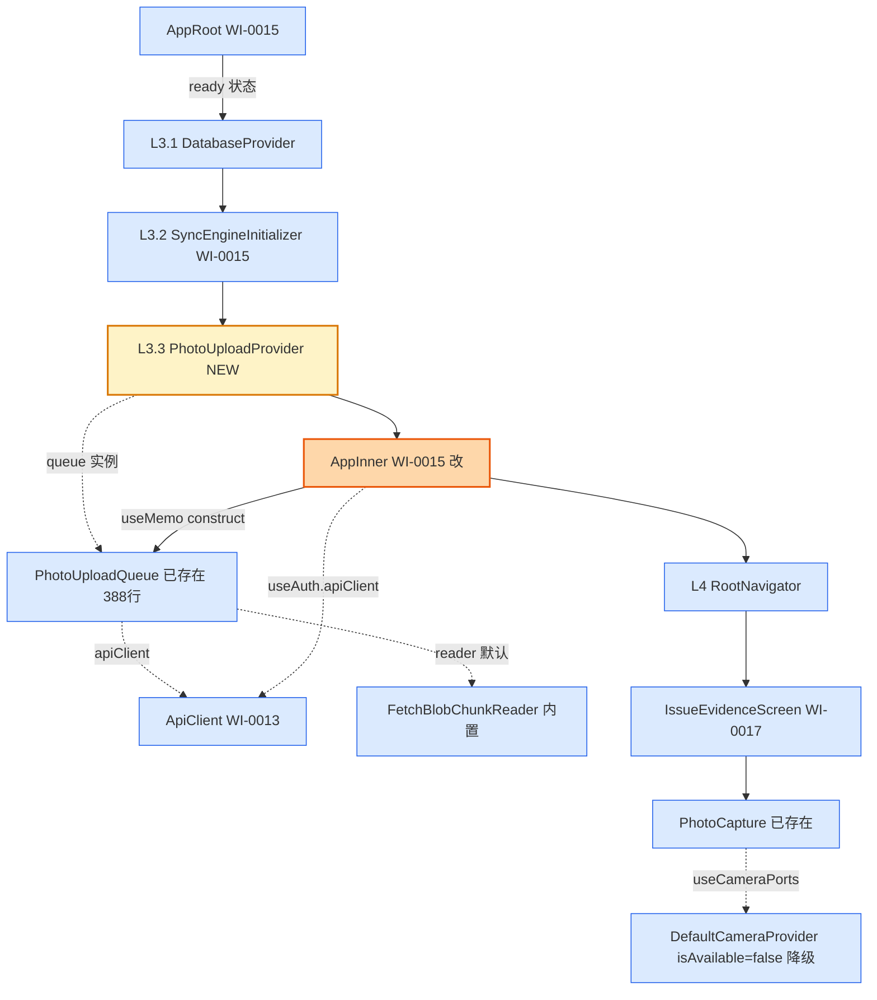

# Design Candidate — WI-0018 照片拍摄 + 分片上传骨架激活（降级模式）

> **Work Item**: WI-0018
> **Workflow Type**: feature_spec
> **Workflow Path**: requirement_change_path
> **Base Spec Version**: PSV-0001
> **Date**: 2026-07-05
> **标准依据**: specforge_final_fused_standard_v1_1_patch1_zh.md (§8.2 Candidate)
> **作者 Agent**: sf-design
> **Candidate Path**: .specforge/work-items/WI-0018/candidates/project/modules/core/design.candidate.md
> **Target Path (merge 后)**: .specforge/project/modules/core/design.md
> **Operation**: append（在 WI-0017 design.md 已合并章节后追加 WI-0018 章节，不覆盖 WI-0015 / WI-0016 / WI-0017 已写入的 DD）

---

## 0. 文档定位与 Extension Registry 检查

本文档是 WI-0018 的 **Design Candidate**（§8.2），是拟写入正式规格真相源（`.specforge/project/modules/core/design.md`）的完整候选文件。

**Extension Registry 前置检查**（v1.1 Patch1 §6）：
- 读取 `.specforge/project/extension_registry.json`，`namespaces.design_types = []`（空）。
- 本设计未引入任何新的 design_type / 结构化扩展类型，仅使用标准 Markdown 设计文档格式 + DD 决策块 + FILE_CHANGES 表。
- 结论：**无需触发 Extension Subflow**，可直接产出 Candidate。

**与现有 `.specforge/project/modules/core/design.md` 的关系**：该文件已由 WI-0015（838 行）+ WI-0016 + WI-0017 章节合并构成，本 Candidate 采用 **append** 操作，在其后追加 WI-0018 章节，不覆盖已有 DD。

---

## 1. 背景与目标

激活飞检安卓端已就绪的照片骨架代码（`PhotoUploadQueue` 388 行 + `PhotoCapture` 296 行）的 React 集成路径，使 WI-0017 已激活的 `IssueEvidenceScreen` 在降级模式下进入拍照流程不崩溃；同时为后续 WI 解除原生相机模块屏蔽后的真实拍照 + 上传链路预留就位的队列实例。

**当前状态（基于代码事实源）**：

| 文件 | 当前行数 | 当前状态 | 本 WI 改动 |
|------|----------|----------|------------|
| `src/api/PhotoUploadQueue.ts` | 388 | 完整骨架（分片 / 断点续传 / 退避 / 完成确认 + 队列查询接口）；构造函数 `constructor(apiClient, reader?)` | **不改**（仅被实例化） |
| `src/components/photo/PhotoCapture.tsx` | 296 | 已内置 `CameraPortProvider` / `useCameraPorts` + `DefaultCameraProvider`（`isAvailable()=false`）+ 降级 Alert | **不改**（仅被 IssueEvidenceScreen 引用） |
| `src/di/SyncEnginePort.tsx` | 200 | WI-0015 已合并，提供 Provider/hook/Initializer 范式 | **不改**（仅作范式参考） |
| `src/AppRoot.tsx` | 99 | WI-0015 已合并：loading/error/ready + `DatabaseProvider > SyncEngineInitializer > AppInner`；`AppInner` 调 `useAuth()` 渲染 `RootNavigator` | **修改**：`AppInner` 内构造队列 + 包裹 `PhotoUploadProvider` |
| `src/di/PhotoUploadPort.tsx` | — | 不存在 | **新建**：PhotoUploadQueue 的 React Context 注入端口 |
| `src/screens/inspection/IssueEvidenceScreen.tsx` | 915 | WI-0017 已激活，已 import PhotoCapture | **不改**（依赖既有降级行为） |

**关键事实**：
- `PhotoUploadQueue` 构造函数仅依赖 `ApiClient`（L205），文件读取走可注入 `PhotoChunkReader`（默认 `FetchBlobChunkReader`）；内部用内存 `Map` 维护队列，**不直接依赖 WatermelonDB**。
- `AppInner`（AppRoot.tsx L82-88）已位于 `AuthProvider` + `DatabaseProvider` + `SyncEngineInitializer` 子树中，`useAuth()` 可用，是构造队列 + 包裹 Provider 的理想挂载点（无需新建 Initializer 组件）。
- `PhotoCapture.tsx` 已内置降级（L121-133, L215-227, L242-255）：`isAvailable()=false` → 灰态按钮 + Alert；本 WI 无需新增降级代码。

**需求来源**：WI-0018 requirements.candidate.md REQ-1~REQ-5。

---

## 2. 架构图（WI-0018 增量）



**说明**：
- 🟡 黄色 = WI-0018 新增组件（`PhotoUploadProvider`）
- 🟠 橙色 = WI-0018 修改的组件（`AppInner`：新增队列构造 + Provider 包裹）
- 🔵 蓝色 = 已有组件（不改）
- 虚线 = Context 消费 / 依赖关系

**依赖关键路径**：`AppInner` 必须位于 `AuthProvider` 内（`useAuth` 可用）+ `SyncEngineInitializer` 内（嵌套顺序约束）；`PhotoUploadProvider` 包裹 `RootNavigator` 使所有业务屏幕可获取队列。

---

## 3. 设计决策

### DD-1 PhotoUploadPort 设计（Context + Provider + usePhotoUploadQueue hook）

**refs**: [intake.md IN-SCOPE-1, impact_analysis.md L6, SyncEnginePort.tsx L38-77 范式]
**constrained_by**: React Context API, PhotoUploadQueue 类型签名 (PhotoUploadQueue.ts L199-208)

**决策**：

新建 `src/di/PhotoUploadPort.tsx`（~45 行），完全沿用 `SyncEnginePort`（WI-0015 DD-5）的注入范式，导出三个符号：

1. **`PhotoUploadContext`**：`createContext<PhotoUploadQueue | null>(null)`，默认值 `null`（未挂载 Provider 时 hook 返回 null，降级）。
2. **`PhotoUploadProvider`**：纯传递组件，接受 `{ queue: PhotoUploadQueue | null; children: React.ReactNode }`，通过 `<PhotoUploadContext.Provider value={queue}>{children}</PhotoUploadContext.Provider>` 注入。**不在此组件内构造队列**（实例由 AppInner 构造并传入，保持单一职责 + 可测试性）。
3. **`usePhotoUploadQueue()`**：`useContext(PhotoUploadContext)`，返回 `PhotoUploadQueue | null`。

**接口形态（伪代码）**：
```typescript
import React, { createContext, useContext } from 'react';
import type { PhotoUploadQueue } from '../api/PhotoUploadQueue';

export const PhotoUploadContext = createContext<PhotoUploadQueue | null>(null);

export interface PhotoUploadProviderProps {
  queue: PhotoUploadQueue | null;
  children: React.ReactNode;
}

export function PhotoUploadProvider({
  queue,
  children,
}: PhotoUploadProviderProps): React.ReactElement {
  return (
    <PhotoUploadContext.Provider value={queue}>
      {children}
    </PhotoUploadContext.Provider>
  );
}

export function usePhotoUploadQueue(): PhotoUploadQueue | null {
  return useContext(PhotoUploadContext);
}
```

**理由**：
- `SyncEnginePort`（WI-0015 DD-5）已验证此范式：Context 默认 null + Provider 纯传递 + hook 降级返回 null，单一职责（A1）、显式依赖（A2）、可替换（A3，测试可注入 mock 队列）、失败可观测（A4，null 时屏幕降级）。
- `PhotoUploadQueue` 构造依赖（`apiClient`）属运行时配置，不适合模块级单例；通过 Context 注入保持可测试性。
- 不在此端口内构造队列（与 `SyncEngineInitializer` 不同），因为 `PhotoUploadQueue` 构造极简（仅 `new PhotoUploadQueue(apiClient)`），无需 ClientSyncStateManager 那样的多依赖组装；构造逻辑放在消费 `useAuth` 的 `AppInner`（DD-2）更直接。

**备选方案**：
- ❌ 在 `PhotoUploadPort` 内新建 `PhotoUploadInitializer` 组件（模仿 `SyncEngineInitializer`）：过度设计（DD4 YAGNI），队列构造无多依赖组装、无 fire-and-forget 副作用，一个 `useMemo` 即可。
- ❌ 用模块级单例 `let photoUploadQueue: PhotoUploadQueue | null`：违反 REQ-6.AC4 同款可测试性原则（SyncEngine 已否决此模式），且无法响应 `apiClient` 变化。
- ❌ 把队列挂到 `SyncEnginePort` 内一起注入：违反 A1 单一职责，照片上传与文本同步是独立能力。

**Errors / 失败处理**：
- `queue` 为 `null`（`apiClient` 未就绪）→ Provider 仍正常挂载，注入 null；下游 `usePhotoUploadQueue()` 返回 null，屏幕层降级（REQ-2.3 / REQ-4 隐含）。
- 组件树未挂载 Provider → hook 返回 Context 默认值 null，不抛错。

---

### DD-2 AppRoot 集成方案（AppInner 构造队列 + 包裹 PhotoUploadProvider）

**refs**: [intake.md IN-SCOPE-1, impact_analysis.md L7, AppRoot.tsx L82-88 现状]
**constrained_by**: useAuth 必须在 AuthProvider 内调用; PhotoUploadProvider 嵌套须在 SyncEngineInitializer 内

**决策**：

修改 `src/AppRoot.tsx` 的 `AppInner` 组件（当前 L82-88），新增三处改动：

1. **新增 imports**：
   ```typescript
   import { useMemo } from 'react';  // 已有 useEffect/useMemo/useState? 现有 import 是 useEffect/useMemo/useState，确认补齐 useMemo
   import { PhotoUploadQueue } from './api/PhotoUploadQueue';
   import { PhotoUploadProvider } from './di/PhotoUploadPort';
   ```
   （注：AppRoot.tsx L10 现有 `import React, { useEffect, useMemo, useState } from 'react';` 已含 `useMemo`，无需重复。）

2. **`AppInner` 内构造队列**：
   ```typescript
   function AppInner(): React.ReactElement {
     const { state, apiClient } = useAuth();  // 现有仅取 state，改为同时取 apiClient
     const photoUploadQueue = useMemo<PhotoUploadQueue | null>(
       () => (apiClient ? new PhotoUploadQueue(apiClient) : null),
       [apiClient],
     );
     return (
       <PhotoUploadProvider queue={photoUploadQueue}>
         <RootNavigator />
       </PhotoUploadProvider>
     );
   }
   ```

3. **嵌套顺序（修改后）**：
   ```
   DatabaseProvider
     └─ SyncEngineInitializer
          └─ PhotoUploadProvider   ← NEW（包裹 AppInner 返回的 RootNavigator）
               └─ RootNavigator
   ```
   即 `AppInner` 返回 `<PhotoUploadProvider><RootNavigator /></PhotoUploadProvider>`，而 `AppInner` 本身被 `SyncEngineInitializer` 包裹（AppRoot ready 分支 L70-75 现状不变），最终嵌套满足 REQ-3.1。

**AppRoot 外层结构不变**：loading 分支（L42-49）、error 分支（L51-67）、ready 分支的 `DatabaseProvider > SyncEngineInitializer > AppInner`（L69-76）保持现状，仅 `AppInner` 内部实现变化。

**理由**：
- `AppInner` 已位于 `AuthProvider` + `DatabaseProvider` + `SyncEngineInitializer` 子树内，`useAuth()` 可用，是构造队列（仅需 `apiClient`）的最直接挂载点；无需新建 Initializer 组件（DD-1 已述 YAGNI）。
- `useMemo([apiClient])` 稳定引用：`apiClient` 在 AuthContext 内由 useMemo 稳定（WI-0015 DD-5.1），故队列实例在登录态稳定期间不重建（REQ-2.2）。
- `PhotoUploadProvider` 包裹 `RootNavigator` 而非 `AppInner` 之外，保证所有业务屏幕（含 IssueEvidenceScreen）可获取队列（REQ-3.3）。
- 构造放 `AppInner` 而非 `AppRoot` 顶层：`AppRoot` 在 loading/error 分支提前 return，若在顶层 useMemo 构造会在 DB 未就绪时也执行（无害但语义不清）；`AppInner` 仅在 ready 态渲染，构造时机更精确。

**备选方案**：
- ❌ 在 `AppRoot` ready 分支内联构造并包裹：`AppRoot` 已较复杂（三态 + DB 初始化），再加队列构造违反 A1 单一职责；且 `AppRoot` ready 分支返回 `DatabaseProvider > SyncEngineInitializer > AppInner`，要在其间插 Provider 需改成 `DatabaseProvider > SyncEngineInitializer > PhotoUploadProvider > AppInner`，但 `AppInner` 是消费 `useAuth` 的边界，把 Provider 放它外面会让 Provider 内的 `useMemo` 无法访问 `useAuth`（AppInner 之外不是 AuthProvider 子树？实际 AppRoot 整体在 AuthProvider 内，可访问 useAuth，但 AppInner 已是约定消费点）。
- ❌ 新建 `PhotoUploadInitializer`（DD-1 否决方案）：过度设计。
- ❌ 把 Provider 放 `DatabaseProvider` 之外：违反 REQ-3.1 嵌套顺序（PhotoUploadProvider 须在 SyncEngineInitializer 内）。

**Errors / 失败处理**：
- `apiClient` 为 null → `useMemo` 返回 null，`PhotoUploadProvider` 接受 null 注入；`IssueEvidenceScreen` 等调用 `usePhotoUploadQueue()` 返回 null，屏幕层降级（REQ-2.3）。理论上 `AppInner` 渲染时 `AuthContext` 已初始化，`apiClient` 在未登录时为 null 是预期降级路径。
- `new PhotoUploadQueue(apiClient)` 构造不抛错（仅赋值字段，L200-208），无运行时风险。

---

### DD-3 降级模式说明（TD-WI0018-001）

**refs**: [intake.md 降级策略, impact_analysis.md 风险表, PhotoCapture.tsx L114-133 + L215-267]
**constrained_by**: react-native-vision-camera / react-native-image-resizer 保持屏蔽（react-native.config.js）, PhotoCapture 骨架降级逻辑已就绪

**决策**：

记录本 WI 的降级模式契约（TD-WI0018-001），作为后续 WI 解除屏蔽时的替换锚点：

| 维度 | 降级行为（本 WI） | 解除屏蔽后（后续 WI） |
|------|------------------|---------------------|
| 相机端口 | `DefaultCameraProvider`（`isAvailable()=false`） | 注入真实 `CameraProvider`（基于 `react-native-image-picker` / `expo-camera`），通过 `CameraPortProvider` 注入 |
| 拍照按钮 UI | 灰态 + "拍照取证（相机未配置）" + Alert 提示 | 蓝色 + "拍照取证"，点击调起相机 |
| GPS 端口 | `DefaultGpsProvider`（`getCurrent()` 返回 unavailable） | 注入真实 `GpsProvider`（`@react-native-community/geolocation`） |
| PhotoUploadQueue | 实例化但空转（`getAllEntries()=[]`，无 `uploadPhoto` 调用） | 拍照成功后业务层调用 `queue.uploadPhoto(photo)`，触发分片上传 |
| 图片压缩 | `PhotoCompressor` 骨架（未激活，无原生 image-resizer） | 解除 image-resizer 屏蔽后激活真实压缩 |
| 网络请求 | 无（队列空） | `POST /api/v1/photos/upload-chunk` + `/complete` |

**降级不变性保证**（本 WI 验证目标）：
1. `DefaultCameraProvider.isAvailable()` 恒 `false`（PhotoCapture.tsx L121-123）→ 拍照按钮永不触发 `capture()`，仅 Alert。
2. `PhotoUploadQueue.uploadPhoto()` 仅在业务层主动调用时触发；降级模式下无照片捕获 → 无调用 → 队列 `Map` 永远为空 → `getAllEntries()` 返回 `[]`、`countByStatus(...)` 返回 `0`、无 `apiClient.postFormData` / `post` 调用。
3. `IssueEvidenceScreen`（WI-0017）已 `import PhotoCapture` 并通过 `useCameraPorts()` 获取端口；降级模式下按钮灰态 + Alert，不影响表单其他字段（描述/严重等级/条款）的填写与保存。

**理由**：
- vision-camera 的 CameraX 集成编译风险大（intake OUT-OF-SCOPE-1），强行解除会扩大本 WI 变更面、引入构建失败风险（WI-0015 DD-1 已示范原生模块解除需谨慎）。
- PhotoCapture.tsx 骨架已完整实现降级（L114-133 DefaultCameraProvider + L215-227 Alert + L242-255 灰态样式），本 WI 无需新增降级代码，仅依赖其既有行为。
- 队列实例化但空转，为后续 WI 提供就位的注入点：后续 WI 解除屏蔽后，只需在 AppRoot 更外层（或 IssueEvidenceScreen 内）注入真实 `CameraPortProvider`，拍照成功后业务层调 `usePhotoUploadQueue()?.uploadPhoto(photo)`，照片自然流入已挂载的队列，**无需再改 PhotoUploadPort / AppRoot 接线**。

**备选方案**：
- ❌ 本 WI 一并解除 vision-camera 屏蔽：违反 intake OUT-OF-SCOPE-1，CameraX 编译风险大，且与本 WI"激活骨架集成"的核心目标正交。
- ❌ 不实例化 PhotoUploadQueue（等解除屏蔽后再激活）：违背"骨架激活"目标，且后续 WI 仍需做同样的 React 接线，不如本 WI 一次到位。
- ⚠️ 在 AppRoot 注入真实 `CameraPortProvider`（包裹 DefaultCameraProvider）：本 WI 范围内无意义（DefaultCameraProvider 已是 PhotoCapture 的默认 Context 值，L141-144），显式注入等同于默认值，徒增代码。

**Errors / 失败处理**：
- 降级模式下用户点击拍照按钮 → Alert 提示（PhotoCapture.tsx L222-227 已实现），无异常抛出。
- 队列空转无网络请求 → 无网络错误路径。
- 后续 WI 解除屏蔽时若 `usePhotoUploadQueue()` 返回 null（Provider 未挂载）→ 业务层应防御性判空（`queue?.uploadPhoto(...)`），本 WI 已通过 REQ-1.3 保证 hook 可降级返回 null。

---

## 4. FILE_CHANGES 表

| 文件 | 操作 | 行数变化 | 关联 DD | 说明 |
|------|------|----------|--------|------|
| `fj-android/src/di/PhotoUploadPort.tsx` | **新建** | 0 → ~45 行 | DD-1 | PhotoUploadQueue 的 React Context 注入端口（Provider + hook + Context） |
| `fj-android/src/AppRoot.tsx` | 修改 | 99 → ~115 行 | DD-2 | `AppInner` 内新增 useAuth.apiClient + useMemo 构造队列 + 包裹 PhotoUploadProvider |
| `fj-android/src/api/PhotoUploadQueue.ts` | **不改** | 388 行 | — | 已完整，仅被 AppInner 实例化 |
| `fj-android/src/components/photo/PhotoCapture.tsx` | **不改** | 296 行 | DD-3 | 降级逻辑已就绪，被 IssueEvidenceScreen 引用 |
| `fj-android/src/screens/inspection/IssueEvidenceScreen.tsx` | **不改** | 915 行 | DD-3 | WI-0017 已激活，依赖既有降级行为 |
| `fj-android/src/di/SyncEnginePort.tsx` | **不改** | 200 行 | — | WI-0015 已合并，仅作范式参考 |

**总计**：1 文件新建 + 1 文件修改，净增 ~60 行。

---

## 5. 测试策略

### 5.1 构建验证（本 WI 主验证手段）

| 验证项 | 命令 | 通过标准 | 失败处理 |
|--------|------|----------|----------|
| TS 类型检查 | `npx tsc --noEmit`（Docker 内 `cd /workspace && npx tsc --noEmit`） | 退出码 0 | 修复 PhotoUploadPort / AppRoot 类型错误 |
| Debug 构建 | Docker 内 `cd /workspace/android && ./gradlew assembleDebug` | 退出码 0 + app-debug.apk 产出 | 见失败处理分支 |
| APK 产出 | `test -f android/app/build/outputs/apk/debug/app-debug.apk` | 文件存在 + size > 1 MiB | 构建失败排查 |

**Debug 而非 Release 的理由**：本 WI 不解除原生模块屏蔽（不引入新原生编译），Debug 构建足以验证 JS 层集成 + 既有原生模块不回归。

**失败处理分支**：
1. **tsc 报错**（如 `PhotoUploadProvider` props 类型、`useAuth` 返回值缺 `apiClient`）→ 不用 `any` / `@ts-ignore` 绕过（REQ-5.3），回退修正 PhotoUploadPort / AppRoot。
2. **构建失败**（非本 WI 引入的原生回归）→ 排查是否 WI-0015 watermelondb 或其他原生模块状态变化；本 WI 无原生层改动，构建失败大概率非本 WI 引入。

### 5.2 降级行为验证（手动 / 后续 WI E2E）

| 场景 | 验证点 |
|------|--------|
| IssueEvidenceScreen 拍照按钮灰态 | 按钮文案"拍照取证（相机未配置）"+ 灰色背景（`buttonUnavailable`） |
| 点击拍照按钮 Alert | 弹出"相机未配置"标题 + 引导文案 |
| 队列空转 | `usePhotoUploadQueue()` 返回非 null，`getAllEntries()` 返回 `[]` |

> 本 WI 不强制 E2E（留给后续 WI 解除屏蔽后统一验证），仅保证类型 + 构建通过。

### 5.3 单元测试（本 WI 不强制，留给质量 WI）

`PhotoUploadPort` 接口极简（Context 透传），单测价值低；`PhotoUploadQueue` 内部逻辑（分片/退避/断点续传）的单测属质量 WI 范围（PhotoUploadQueue.ts 设计已为单测解耦 `PhotoChunkReader`）。

---

## 6. 接口定义汇总（DD2 强制）

### 6.1 PhotoUploadContext（DD-1 新建）
```typescript
import type { PhotoUploadQueue } from '../api/PhotoUploadQueue';
export const PhotoUploadContext: React.Context<PhotoUploadQueue | null>;
// 默认值 null：未挂载 Provider 时 usePhotoUploadQueue() 返回 null
```

### 6.2 PhotoUploadProvider（DD-1 新建）
```typescript
export interface PhotoUploadProviderProps {
  queue: PhotoUploadQueue | null;
  children: React.ReactNode;
}
export function PhotoUploadProvider(props: PhotoUploadProviderProps): React.ReactElement;
// Errors: 无（纯传递组件，不构造队列）
```

### 6.3 usePhotoUploadQueue（DD-1 新建）
```typescript
export function usePhotoUploadQueue(): PhotoUploadQueue | null;
// 返回 null 时调用方应降级（不抛错）
```

### 6.4 PhotoUploadQueue（已存在，PhotoUploadQueue.ts L199-388，本 WI 不改）
```typescript
class PhotoUploadQueue {
  constructor(apiClient: ApiClient, reader?: PhotoChunkReader);
  uploadPhoto(photo: LocalPhoto): Promise<UploadResult>;
  getEntry(photoClientUuid: string): QueueEntry | undefined;
  getAllEntries(): QueueEntry[];
  countByStatus(status: UploadStatus): number;
  resetToPending(photoClientUuid: string): boolean;
  remove(photoClientUuid: string): boolean;
}
```

---

## 7. Assumptions（设计假设，DD6 强制）

1. **AuthContext 已暴露 apiClient**：假设 WI-0015 DD-5.1 已合并，`useAuth()` 返回值含 `apiClient` 字段（AppRoot.tsx L83 现状 `const { state } = useAuth()` 仅取 state，本 WI 改为 `const { state, apiClient } = useAuth()`，前提是 AuthContextValue 已有 apiClient 字段 —— WI-0015 已完成此改造）。
2. **PhotoUploadQueue 构造不抛错**：假设 `new PhotoUploadQueue(apiClient)` 仅赋值字段（L200-208 事实），无运行时副作用，可在 render 期 `useMemo` 内安全调用。
3. **AppInner 是 AuthProvider 子树**：假设 App.tsx 嵌套为 `ErrorBoundary > AuthProvider > AppRoot > ... > AppInner`（WI-0015 DD-3 已确立），故 `AppInner` 内 `useAuth()` 可用。
4. **降级模式下无业务层调用 uploadPhoto**：假设 IssueEvidenceScreen（WI-0017）在相机不可用时不会调用 `queue.uploadPhoto`（PhotoCapture 降级时不回调 `onCaptured`，故无 photo 进入业务层）；若未来业务层在降级模式下误调，队列会尝试上传空 photo（由 PhotoUploadQueue 内部 reader.sizeOf 抛错），本 WI 不处理此假设不成立的情况（属业务层 bug）。
5. **Docker 镜像与授权沿用 WI-0015**：假设 `fj-builder:react-native-0.74` 镜像与 Write Guard 授权状态与 WI-0015 一致；若授权失效需重新安装（TASK-4 详述）。

---

## 8. Out of Scope（DD3 强制，A5 边界明确）

1. **解除 vision-camera 屏蔽**：intake OUT-OF-SCOPE-1，CameraX 编译风险，留给后续 WI。
2. **解除 image-resizer 屏蔽**：intake OUT-OF-SCOPE-2。
3. **真实拍照功能**：intake OUT-OF-SCOPE-3。
4. **真实照片上传端到端测试**：intake OUT-OF-SCOPE-4（需后端就绪 + 真实照片）。
5. **PhotoUploadQueue / PhotoCapture / PhotoCompressor / WatermarkOverlay 内部修改**：骨架已完整，本 WI 仅做 React 接线。
6. **照片上传调度器 / 后台重试**：队列调度属后续 WI。
7. **IssueEvidenceScreen 内部改动**：WI-0017 已激活，本 WI 依赖其既有降级行为。
8. **原生 PhotoChunkReader 实现**：本 WI 用默认 FetchBlobChunkReader（降级模式下不被调用）。
9. **单元测试 / E2E 套件**：本 WI 仅类型 + 构建验证。
10. **Release APK 构建**：DD-5 仅 Debug 构建。

---

## 9. 架构属性自检（A1-A5）

### A1 单一职责 ✅
| 组件 | "我是 X" 陈述 |
|------|---------------|
| PhotoUploadPort | 我是 PhotoUploadQueue 的 React Context 注入端口（纯传递，不构造） |
| AppInner（改后） | 我是 RootNavigator 的渲染者 + PhotoUploadQueue 的构造与注入者 |
| PhotoUploadQueue（不改） | 我是照片分片上传队列 |

全部一句话可说清 ✅

### A2 显式依赖 ✅
架构图（§2）已含所有箭头：
- AppInner → useAuth (apiClient) → ApiClient
- AppInner → useMemo → PhotoUploadQueue → ApiClient + FetchBlobChunkReader
- PhotoUploadProvider → queue 实例
- IssueEvidenceScreen → PhotoCapture → DefaultCameraProvider（降级）

代码调用与图一致 ✅

### A3 可替换性 ✅
- `PhotoUploadProvider` 接受 `queue: PhotoUploadQueue | null`，测试可注入 mock 队列或 null。
- `usePhotoUploadQueue()` 返回 null 时屏幕层降级（已为测试预留 null 路径）。
- `PhotoUploadQueue` 的 `PhotoChunkReader` 已是可注入接口（测试可用内存 reader 替换 FetchBlobChunkReader）。

### A4 失败可观测 ✅
- `apiClient` 为 null → 队列 null → hook 返回 null → 屏幕降级（可观测的 null 路径）。
- 相机不可用 → 按钮灰态 + Alert（PhotoCapture 已实现，可见 UI 反馈）。
- 队列空转 → `getAllEntries()` 返回 `[]`（可查询的空状态）。
- tsc / 构建失败 → 退出码非 0（REQ-5 验证门）。

### A5 边界明确 ✅
- Out of Scope（§8）：10 项明确"不做什么"。
- Assumptions（§7）：5 项明确"假设什么"。

---

## 10. 设计决策覆盖矩阵（REQ → DD 追溯）

| intake.md IN-SCOPE 项 | 覆盖 DD | 覆盖 REQ |
|------------------------|---------|----------|
| 1. PhotoUploadQueue 实例化 + 注入 | DD-1 + DD-2 | REQ-1 + REQ-2 + REQ-3 |
| 2. IssueEvidenceScreen 降级验证 | DD-3 | REQ-4 |
| 3. TypeScript 验证 | DD-5（构建验证） | REQ-5.1 |
| 4. Docker 构建验证 | DD-5（构建验证） | REQ-5.2 |

所有 IN-SCOPE 项均有 DD 覆盖 ✅
所有 DD 均有 intake.md / impact_analysis.md / 代码事实引用 ✅

---

## 11. Candidate 元信息

```json
{
  "candidate_type": "design",
  "operation": "append",
  "target_path": ".specforge/project/modules/core/design.md",
  "candidate_path": ".specforge/work-items/WI-0018/candidates/project/modules/core/design.candidate.md",
  "base_spec_version": "PSV-0001",
  "design_decisions_count": 3,
  "dd_ids": ["DD-1", "DD-2", "DD-3"],
  "components_defined": ["PhotoUploadPort", "PhotoUploadProvider", "usePhotoUploadQueue", "AppInner(改)"],
  "has_architecture_diagram": true,
  "has_out_of_scope": true,
  "has_assumptions": true,
  "has_file_changes_table": true,
  "has_test_strategy": true,
  "has_interface_definitions": true,
  "architecture_properties_checked": ["A1", "A2", "A3", "A4", "A5"]
}
```

---

**文档结束**。本 Candidate 待 Gate（required_files / schema / trace / spec_consistency）通过 + User Decision 后，由 Merge Runner 追加写入 `.specforge/project/modules/core/design.md`。
