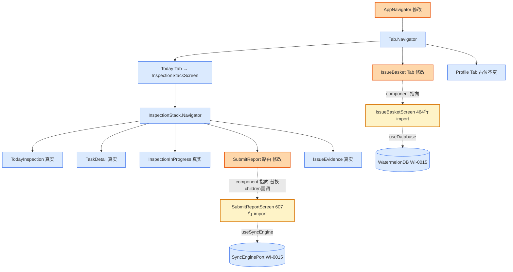

# Design Candidate — WI-0019 问题篮子 + 提交日报屏幕集成

> **Work Item**: WI-0019
> **Workflow Type**: feature_spec
> **Workflow Path**: requirement_change_path
> **Base Spec Version**: PSV-0001
> **Date**: 2026-07-05
> **标准依据**: specforge_final_fused_standard_v1_1_patch1_zh.md (§8.2 Candidate)
> **作者 Agent**: sf-design
> **Candidate Path**: .specforge/work-items/WI-0019/candidates/project/modules/core/design.candidate.md
> **Target Path (merge 后)**: .specforge/project/modules/core/design.md
> **Operation**: append（在 WI-0018 design.md 已合并章节后追加 WI-0019 章节，不覆盖已有 DD）

---

## 0. 文档定位与 Extension Registry 检查

本文档是 WI-0019 的 **Design Candidate**（§8.2），是拟写入正式规格真相源（`.specforge/project/modules/core/design.md`）的完整候选文件。

**Extension Registry 前置检查**（v1.1 Patch1 §6）：
- 读取 `.specforge/project/extension_registry.json`，`namespaces.design_types = []`（空）。
- 本设计未引入任何新的 design_type / 结构化扩展类型，仅使用标准 Markdown 设计文档格式 + DD 决策块 + FILE_CHANGES 表。
- 结论：**无需触发 Extension Subflow**，可直接产出 Candidate。

**与现有 `.specforge/project/modules/core/design.md` 的关系**：该文件已由 WI-0015 ~ WI-0018 章节合并构成，本 Candidate 采用 **append** 操作，在其后追加 WI-0019 章节，不覆盖已有 DD。

---

## 1. 背景与目标

将飞检安卓端已就绪的两个屏幕骨架（IssueBasketScreen 464 行 + SubmitReportScreen 607 行）集成到 AppNavigator 导导树，替换 SimplePlaceholder 占位。本 WI 不新建任何文件，仅修改 `AppNavigator.tsx`（206 行 → ~210 行，净改 ~10 行）。

**当前状态（基于代码事实源）**：

| 文件 | 当前行数 | 当前状态 | 本 WI 改动 |
|------|----------|----------|------------|
| `src/navigation/AppNavigator.tsx` | 206 | 骨架：3 Tab + InspectionStack 5 路由；IssueBasket Tab 挂本地同名占位函数（L124-131），SubmitReport 路由 children 回调占位（L100-110） | **修改**：import 两个真实屏幕 + 移除本地占位函数 + SubmitReport 改 component |
| `src/screens/issue-basket/IssueBasketScreen.tsx` | 464 | 完整骨架，`export default function IssueBasketScreen(...)`，含 FlatList / 删除 / 编辑 / 提交导航 | **不改**（仅被 AppNavigator import） |
| `src/screens/submit/SubmitReportScreen.tsx` | 607 | 完整骨架，`export default function SubmitReportScreen(...)`，含同步状态 / 提交触发 / 降级 | **不改**（仅被 AppNavigator import） |

**关键事实**：
- **名称冲突**：AppNavigator.tsx L124 本地定义 `function IssueBasketScreen()` 返回 SimplePlaceholder，与真实屏幕默认导出同名。集成时**必须移除本地占位函数**，否则 import 报 `Duplicate identifier` 编译错误。
- **SubmitReport 渲染方式**：当前 L100-110 使用 `<InspectionStack.Screen name="SubmitReport">{() => <SimplePlaceholder .../>}</...>` 的 children 回调形式；集成时改为 `component={SubmitReportScreen}` 标准形式，需移除 children 回调。
- 两个真实屏幕均 `export default`，AppNavigator 现有其他屏幕（TodayInspectionScreen / TaskDetailScreen / InspectionInProgressScreen / IssueEvidenceScreen）也是 `import XxxScreen from '...'`（无花括号）形式，风格一致。
- SubmitReportScreen 依赖 `useSyncEngine()`（WI-0015 SyncEnginePort）与 `useDatabase()`（WI-0015），均已挂载；IssueBasketScreen 依赖 `useDatabase()`，已挂载。

**需求来源**：WI-0019 requirements.candidate.md REQ-1~REQ-3。

---

## 2. 架构图（WI-0019 增量）



**说明**：
- 🟠 橙色 = WI-0019 修改点（AppNavigator 内 IssueBasket Tab component + SubmitReport 路由渲染方式）
- 🟡 黄色 = WI-0019 import 的真实屏幕（不改内部）
- 🔵 蓝色 = 已有组件（不改）

---

## 3. 设计决策

### DD-1 AppNavigator 修改方案（IssueBasket Tab + SubmitReport 路由集成）

**refs**: [intake.md IN-SCOPE-1/2, AppNavigator.tsx L100-131/L171-175 现状, IssueBasketScreen.tsx L90 export default, SubmitReportScreen.tsx L105 export default]
**constrained_by**: React Navigation Stack/Tab API, 现有 import 风格（无花括号 default import）, 名称冲突必须消除

**决策**：

修改 `fj-android/src/navigation/AppNavigator.tsx`，三处改动：

**改动 A — 新增 imports（L23-27 现有 import 区之后）**：
```typescript
import IssueBasketScreen from '../screens/issue-basket/IssueBasketScreen';
import SubmitReportScreen from '../screens/submit/SubmitReportScreen';
```
风格对齐现有 IssueEvidenceScreen 的 `import IssueEvidenceScreen from '../screens/inspection/IssueEvidenceScreen';`（L27，无花括号 default import）。

**改动 B — 移除 IssueBasket 本地占位函数（删 L124-131）**：
移除以下代码块（消除与 import 的命名冲突）：
```typescript
// 删除整段：
function IssueBasketScreen(): React.ReactElement {
  return (
    <SimplePlaceholder
      title="问题篮子"
      subtitle="骨架占位 — 离线草拟的问题清单，待提交到日报"
    />
  );
}
```
ProfileScreen（L136-143）保留不动（仍为占位，WI-0020 实装）。SimplePlaceholder 组件（L58-68）保留（ProfileScreen 仍引用）。

**改动 C — SubmitReport 路由改为 component 形式（改 L100-110）**：
```typescript
// 现状（children 回调，删除）：
<InspectionStack.Screen
  name="SubmitReport"
  options={{ headerTitle: '提交日报' }}
>
  {() => (
    <SimplePlaceholder
      title="提交日报"
      subtitle="骨架占位 — WI-0017 实现"
    />
  )}
</InspectionStack.Screen>

// 改为（component 形式）：
<InspectionStack.Screen
  name="SubmitReport"
  component={SubmitReportScreen}
  options={{ headerTitle: '提交日报' }}
/>
```

**IssueBasket Tab（L171-175）保持不变**：`<Tab.Screen name="IssueBasket" component={IssueBasketScreen} options={{...}} />` 中的 `component={IssueBasketScreen}` 现在指向 import 的真实屏幕（本地同名函数已删除），无需改动 JSX，仅 component 引用解析变化。

**理由**：
- 移除本地占位函数是消除名称冲突的唯一正确方式（import 与本地 function 同名 → `Duplicate identifier` 编译错误）；保留本地函数 + 改 import 别名（如 `import IssueBasketScreenReal`）会破坏 Tab.Screen component 引用且风格不一致。
- SubmitReport 改为 `component={SubmitReportScreen}` 是 React Navigation 推荐的标准挂载方式；children 回调仅用于需要包装 / 自定义渲染的场景，真实屏幕无需包装。改 component 后 React Navigation 自动注入 `navigation` + `route` props，SubmitReportScreen 的 `StackScreenProps` 解构（L105）正好匹配。
- IssueBasket Tab JSX 无需改动（`component={IssueBasketScreen}` 引用名不变，只是解析到 import 而非本地函数），改动面最小（A1 单一职责 + 最小变更原则）。

**备选方案**：
- ❌ 保留本地占位函数 + import 别名 `import { default as RealIssueBasket } ...`：default import 不支持花括号解构，需 `import RealIssueBasket from '...'`，但 Tab.Screen 仍引用 `IssueBasketScreen`（本地），需同步改 JSX，反而增加改动面且命名混乱。
- ❌ SubmitReport 保留 children 回调 + 在回调内渲染 `<SubmitReportScreen />`：可行但非必要，children 回调绕过了 React Navigation 的 navigation/route 自动注入，需手动传 props，增加复杂度（DD4 YAGNI）。
- ❌ 同时修改 IssueBasketScreen.tsx / SubmitReportScreen.tsx 的内部实现：违反 intake OUT-OF-SCOPE，两个骨架已完整。

**Errors / 失败处理**：
- `Duplicate identifier 'IssueBasketScreen'` 编译错误 → 确认本地占位函数（L124-131）已完整删除（含函数体与闭合括号）。
- SubmitReportScreen 渲染时报 `route.params` undefined → 骨架内已处理降级（intake 注释"离线模式提示"），本 WI 不改其内部。
- IssueBasketScreen navigation prop 类型不匹配（跨导航器：Tab → Stack 导航）→ 该屏幕 L37/L50 已 import `StackNavigationProp<InspectionStackParamList, ...>` 与 `InspectionStackParamList`，类型已自洽；若 tsc 报错需在 DD 范围内排查（不修改屏幕内部，可能需 AppNavigator 侧 navigation 类型对齐）。

---

### DD-2 验证策略（tsc 软门 + Docker 硬门）

**refs**: [intake.md IN-SCOPE-3, REQ-3.AC1/AC2/AC3, WI-0018 DD-5 范式]
**constrained_by**: 镜像 fj-builder:react-native-0.74, min_apk_size_bytes=1048576, 禁止 any/@ts-ignore 绕过

**决策**：

沿用 WI-0015 / WI-0017 / WI-0018 已验证的双门验证策略：

| 验证项 | 命令 | 通过标准 | 失败处理 |
|--------|------|----------|----------|
| TS 类型检查（软门） | Docker 内 `cd /workspace && npx tsc --noEmit` | 退出码 0，无 `error TS` | 回查 import 路径 / 占位函数删除 / 路由表类型 |
| Debug 构建（硬门） | Docker 内 `cd /workspace/android && ./gradlew assembleDebug` | 退出码 0 + app-debug.apk 产出 | 见失败处理分支 |
| APK 产出 | `test -f android/app/build/outputs/apk/debug/app-debug.apk` | 文件存在 + size > 1 MiB | 构建失败排查 |

**Debug 而非 Release 的理由**：本 WI 不引入新原生模块（仅 JS 层 import 切换），Debug 构建足以验证 JS 集成 + 既有原生模块不回归。

**关键验证点**（针对本 WI 特有风险）：
1. **名称冲突消除**：tsc 应无 `Duplicate identifier 'IssueBasketScreen'` 错误（确认本地占位函数已删）。
2. **路由表匹配**：tsc 应无 `SubmitReport` / `IssueBasket` 路由名在 InspectionStackParamList / RootTabParamList 中不匹配的错误（AppNavigator.tsx L35-39 已定义 RootTabParamList 含 IssueBasket；InspectionStackParamList 含 SubmitReport，定义于 TodayInspectionScreen.tsx）。
3. **component 类型对齐**：SubmitReportScreen 的 `StackScreenProps` 与 InspectionStack.Screen 的 component 泛型对齐。

**失败处理分支**：
1. **tsc 报 Duplicate identifier** → 确认本地 IssueBasketScreen 函数（L124-131）已删，包括 JSDoc 注释块。
2. **tsc 报 navigation 类型不匹配** → 检查 IssueBasketScreen 是否需要跨导航器 navigation 注入（Tab 屏幕导航到 Stack 路由的 navigation prop 类型）；优先在 AppNavigator 侧解决（不修改屏幕内部）。
3. **构建失败非本 WI 引入**（本 WI 无原生改动）→ 排查 WI-0015 watermelondb 或其他原生模块状态变化。

**备选方案**：
- ❌ 跳过 Docker 直接本地 tsc：本 WI 验证策略沿用项目约定（Docker 镜像保证工具链一致），且构建必须 Docker。
- ❌ 用 `as any` 绕过 navigation 类型不匹配：违反 REQ-3.AC3。

**Errors / 失败处理**：
- tsc / 构建失败 → 不通过 any/@ts-ignore/回退占位绕过（REQ-3.AC3），回查 DD-1 改动完整性。
- Docker Write Guard 授权失效（WI-0014 已关闭）→ 通过 `sf_hard_stop_resolve` 重新安装 work_item 级授权。

---

## 4. FILE_CHANGES 表

| 文件 | 操作 | 行数变化 | 关联 DD | 说明 |
|------|------|----------|--------|------|
| `fj-android/src/navigation/AppNavigator.tsx` | 修改 | 206 → ~210 行 | DD-1 | 新增 2 个 import + 删除 IssueBasket 本地占位函数（-8 行）+ SubmitReport 改 component（-6 行 JSX → +1 行） |
| `fj-android/src/screens/issue-basket/IssueBasketScreen.tsx` | **不改** | 464 行 | — | 仅被 AppNavigator import |
| `fj-android/src/screens/submit/SubmitReportScreen.tsx` | **不改** | 607 行 | — | 仅被 AppNavigator import |
| `fj-android/android/app/build/outputs/apk/debug/app-debug.apk` | 构建产物（非源码） | — | DD-2 | Docker assembleDebug 产出 |

**总计**：1 文件修改（净改 ~10 行），2 文件不改仅引用，1 构建产物。无新建文件。

---

## 5. 测试策略

### 5.1 构建验证（本 WI 主验证手段）

见 DD-2 验证策略表。本 WI 不强制单测 / E2E（留给质量 WI），仅保证 TypeScript 类型检查 + Docker 构建通过。

### 5.2 运行时验证（手动 / 后续 WI）

| 场景 | 验证点 |
|------|--------|
| IssueBasket Tab 点击 | 渲染真实 IssueBasketScreen（FlatList 草稿问题列表），非"骨架占位"文本 |
| SubmitReport 路由导航 | 渲染真实 SubmitReportScreen（同步状态 + 提交按钮），非"骨架占位"文本 |
| SubmitReport 离线降级 | SyncEngine 未注入时按钮禁用 + 提示（骨架既有逻辑） |

> 本 WI 仅保证类型 + 构建通过，运行时 E2E 留给后续质量 WI。

---

## 6. 接口定义汇总（DD2 强制）

本 WI 不新增任何接口 / 组件，仅消费已存在的两个屏幕：

### 6.1 IssueBasketScreen（已存在，L90 `export default`，本 WI 不改）
```typescript
export default function IssueBasketScreen(props: StackScreenProps<...>): React.ReactElement;
// 464 行骨架，含 FlatList / 删除 / 编辑 / 提交导航
```

### 6.2 SubmitReportScreen（已存在，L105 `export default`，本 WI 不改）
```typescript
export default function SubmitReportScreen(props: StackScreenProps<InspectionStackParamList, 'SubmitReport'>): React.ReactElement;
// 607 行骨架，含同步状态 / 提交触发 / 离线降级
```

---

## 7. Assumptions（设计假设，DD6 强制）

1. **InspectionStackParamList 已含 SubmitReport 路由**：假设 TodayInspectionScreen.tsx 的 InspectionStackParamList 类型已定义 `SubmitReport: { taskId: string }`（或类似），AppNavigator L42 `createStackNavigator<InspectionStackParamList>()` 已引用，本 WI 不修改该类型文件。
2. **RootTabParamList 已含 IssueBasket 路由**：AppNavigator.tsx L35-39 已定义 `IssueBasket: undefined`，真实 IssueBasketScreen 作为 Tab 屏幕不需 route.params。
3. **两个真实屏幕的依赖已挂载**：SubmitReportScreen 依赖 SyncEnginePort（WI-0015）+ Database（WI-0015），IssueBasketScreen 依赖 Database（WI-0015），均已在 AppRoot 挂载，导航树位于 Provider 子树内。
4. **Docker 镜像与授权沿用 WI-0018**：假设 `fj-builder:react-native-0.74` 镜像与 Write Guard 授权状态与 WI-0018 一致；若授权失效需重新安装。
5. **SubmitReportScreen 降级逻辑已就绪**：假设 SubmitReportScreen.tsx 内部已处理 SyncEngine 未注入（`useSyncEngine()` 返回 null）与 taskId 缺失的降级（离线提示 / 按钮禁用），本 WI 不验证其内部。

---

## 8. Out of Scope（DD3 强制，A5 边界明确）

1. **IssueBasketScreen / SubmitReportScreen 内部修改**：intake OUT-OF-SCOPE，骨架已完整。
2. **真实同步冲突 UI 人工裁决**：intake OUT-OF-SCOPE。
3. **照片上传完成态展示**：依赖 WI-0018 真实拍照。
4. **Profile Tab 集成**：属 WI-0020。
5. **InspectionStackParamList 类型扩展**：本 WI 不修改类型定义文件。
6. **SimplePlaceholder 移除**：Profile Tab 仍使用，保留。
7. **单元测试 / E2E 套件**：本 WI 仅类型 + 构建验证。
8. **Release APK 构建**：本 WI 仅 Debug 构建。

---

## 9. 架构属性自检（A1-A5）

### A1 单一职责 ✅
| 组件 | "我是 X" 陈述 |
|------|---------------|
| AppNavigator（改后） | 我是应用根导航组件，将 IssueBasket Tab 与 SubmitReport 路由挂载到真实屏幕 |
| IssueBasketScreen（不改） | 我是问题篮子页（今日草稿问题列表） |
| SubmitReportScreen（不改） | 我是提交日报页（同步状态 + 提交触发） |

### A2 显式依赖 ✅
架构图（§2）含所有箭头：AppNavigator → import IssueBasketScreen / SubmitReportScreen；两屏幕 → useDatabase / useSyncEngine。

### A3 可替换性 ✅
AppNavigator 通过 import 引用屏幕组件，测试可 mock import 替换为占位组件；不修改屏幕内部保持其可独立测试。

### A4 失败可观测 ✅
- 名称冲突 → tsc `Duplicate identifier` 错误（编译期可见）。
- 路由表不匹配 → tsc 类型错误（编译期可见）。
- 构建失败 → 退出码非 0（REQ-3 验证门）。

### A5 边界明确 ✅
Out of Scope（§8）：8 项明确"不做什么"；Assumptions（§7）：5 项明确"假设什么"。

---

## 10. 设计决策覆盖矩阵（REQ → DD 追溯）

| intake.md IN-SCOPE 项 | 覆盖 DD | 覆盖 REQ |
|------------------------|---------|----------|
| 1. AppNavigator IssueBasket Tab 集成 | DD-1（改动 A + B） | REQ-1 |
| 2. InspectionStack SubmitReport 路由集成 | DD-1（改动 C） | REQ-2 |
| 3. tsc + Docker 验证 | DD-2（验证策略） | REQ-3 |

所有 IN-SCOPE 项均有 DD 覆盖 ✅
所有 DD 均有 intake.md / impact_analysis.md / 代码事实引用 ✅

---

## 11. Candidate 元信息

```json
{
  "candidate_type": "design",
  "operation": "append",
  "target_path": ".specforge/project/modules/core/design.md",
  "candidate_path": ".specforge/work-items/WI-0019/candidates/project/modules/core/design.candidate.md",
  "base_spec_version": "PSV-0001",
  "design_decisions_count": 2,
  "dd_ids": ["DD-1", "DD-2"],
  "components_defined": [],
  "components_imported": ["IssueBasketScreen", "SubmitReportScreen"],
  "has_architecture_diagram": true,
  "has_out_of_scope": true,
  "has_assumptions": true,
  "has_file_changes_table": true,
  "has_test_strategy": true,
  "has_interface_definitions": true,
  "architecture_properties_checked": ["A1", "A2", "A3", "A4", "A5"]
}
```

---

**文档结束**。本 Candidate 待 Gate（required_files / schema / trace / spec_consistency）通过 + User Decision 后，由 Merge Runner 追加写入 `.specforge/project/modules/core/design.md`。
