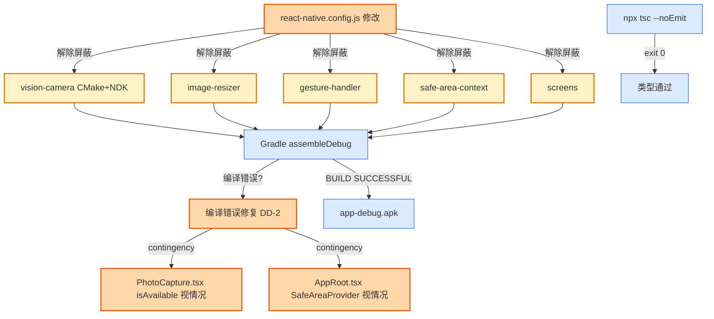

# Design Candidate — WI-0020 解除屏蔽 5 个 RN 原生模块

> **Work Item**: WI-0020
> **Workflow Type**: feature_spec
> **Workflow Path**: requirement_change_path
> **Base Spec Version**: PSV-0008
> **Date**: 2026-07-05
> **标准依据**: specforge_final_fused_standard_v1_1_patch1_zh.md (§8.2 Candidate)
> **作者 Agent**: sf-design
> **Candidate Path**: .specforge/work-items/WI-0020/candidates/project/modules/core/design.candidate.md
> **Target Path (merge 后)**: .specforge/project/modules/core/design.md
> **Operation**: append（在 WI-0019 design.md 已合并章节后追加 WI-0020 章节）

---

## 0. 文档定位与 Extension Registry 检查

本文件是 WI-0020 的 **Design Candidate**（§8.2），拟追加写入正式规格真相源 `.specforge/project/modules/core/design.md`。

**Extension Registry 前置检查**（v1.1 Patch1 §6）：
- `namespaces.design_types = []`（空），本设计未引入新 design_type / 结构化扩展类型，仅使用标准 Markdown + DD 决策块 + FILE_CHANGES 表。
- 结论：**无需触发 Extension Subflow**。

**路径事实校验（关键）**：影响分析 `impact_analysis.md` 将 `DefaultCameraProvider.isAvailable()` 标注于 `src/di/PhotoUploadPort.tsx`，**与代码事实不符**。代码事实源如下：
- `src/components/photo/PhotoCapture.tsx` L114-133：`class DefaultCameraProvider`，`isAvailable()` 返回 `false`（L121-123），`capture()` 抛错（L125-132）。
- `src/di/PhotoUploadPort.tsx`：仅 `PhotoUploadContext` / `PhotoUploadProvider` / `usePhotoUploadQueue`（React Context 注入端口，34 行，无 `isAvailable`）。
- 本设计以代码事实源 `PhotoCapture.tsx` 为准。

---

## 1. 背景与目标

将 `react-native.config.js` 中屏蔽的 5 个 RN 原生模块全部解除屏蔽，恢复 autolinking，修复编译错误，通过 tsc + Docker Debug 构建。

**当前状态（基于代码事实源）**：

| 文件 | 当前行数 | 当前状态 | 本 WI 改动 |
|------|----------|----------|------------|
| `react-native.config.js` | 17 | `dependencies` 列出 5 个模块的 `platforms.android=null` 屏蔽 | **修改**：清空屏蔽条目 |
| `src/components/photo/PhotoCapture.tsx` | 296 | `DefaultCameraProvider.isAvailable()=false`（L121-123） | **可能修改**（视编译结果，DD-2 contingency） |
| `src/AppRoot.tsx` | 128 | 未包裹 `SafeAreaProvider` / `GestureHandlerRootView` | **可能修改**（视编译/运行结果，DD-2 contingency） |

**关键事实**：
- vision-camera 需要 CMake + NDK，容器镜像 `fj-builder:react-native-0.74` 已具备（intake 约束）。
- gesture-handler / safe-area-context / screens 是 React Navigation 标准依赖，JS 层已 import，原生链接被屏蔽时降级为 JS fallback。
- `react-native.config.js` 的 `module.exports = { dependencies: {...} }` 结构合法，清空后可保留为 `dependencies: {}` 或注释。

**需求来源**：WI-0020 requirements.candidate.md REQ-1~REQ-3。

---

## 2. 架构图（WI-0020 增量）



**说明**：
- 🟠 橙色 = WI-0020 改动点（config.js + 编译修复 contingency）
- 🟡 黄色 = 解除屏蔽的 5 个原生模块
- 🔵 蓝色 = 验证手段

---

## 3. 设计决策

### DD-1 解除屏蔽策略（react-native.config.js 改造）

**refs**: [intake.md 范围, react-native.config.js L9-17 现状, REQ-1.AC1/AC2/AC3]
**constrained_by**: React Native CLI config schema, module.exports 合法结构, 不删除整个文件

**决策**：

修改 `fj-android/react-native.config.js`，将 `dependencies` 对象中的 5 个屏蔽条目全部移除：

```javascript
// 现状（17 行）：
module.exports = {
  dependencies: {
    'react-native-vision-camera': { platforms: { android: null } },
    'react-native-image-resizer': { platforms: { android: null } },
    'react-native-gesture-handler': { platforms: { android: null } },
    'react-native-safe-area-context': { platforms: { android: null } },
    'react-native-screens': { platforms: { android: null } },
  },
};

// 改为（清空屏蔽，保留历史注释）：
/**
 * React Native CLI 配置（WI-0020 解除全部原生模块屏蔽）。
 * 历史：WI-0012 屏蔽 5 个模块避免编译失败，WI-0015 解除 watermelondb，
 *       WI-0020 解除剩余 5 个（vision-camera/image-resizer/gesture-handler/
 *       safe-area-context/screens），恢复完整 autolinking。
 */
module.exports = {
  dependencies: {},
};
```

**理由**：
- `dependencies: {}` 是合法空配置，CLI 视所有 `node_modules` 依赖为普通包，按各自包内约定自动链接（A1 单一职责 + 最小变更）。
- 保留 `module.exports` 结构而非删除文件，避免 CLI 回退到默认行为时的不确定性。
- 注释保留历史演变（WI-0012 → WI-0015 → WI-0020），便于审计追溯。

**备选方案**：
- ❌ 删除整个 `react-native.config.js`：CLI 行为不确定，且丢失历史注释。
- ❌ 仅注释 5 行保留键名：`dependencies` 仍含键，CLI 可能误解析注释键。
- ❌ 分多次 WI 逐个解除：违反 intake"解除全部 5 个"目标，且无法验证模块间依赖（gesture-handler/safe-area-context/screens 同属 React Navigation 生态）。

**Errors / 失败处理**：
- CLI 解析报错 → 确认 `module.exports` 结构合法，无尾随逗号 / 语法错误。
- 某模块解除屏蔽后仍报"未链接" → 检查该模块包内是否有自己的 `react-native.config.js` 或原生目录。

---

### DD-2 编译错误修复预案（vision-camera CMake + contingency）

**refs**: [intake.md 约束, impact_analysis.md, PhotoCapture.tsx L114-133, AppRoot.tsx L71-79, REQ-2.AC1/AC2/AC3]
**constrained_by**: 容器已具备 CMake+NDK, 不改业务逻辑, 不升级依赖版本, 禁止 any/@ts-ignore/回退屏蔽

**决策**：

编译错误修复分两类——**确定项**与 **contingency 项**（视实际编译结果触发）：

**A. 确定项 — vision-camera CMake + NDK 原生编译**：
- 容器镜像 `fj-builder:react-native-0.74` 已具备 CMake + NDK 工具链（intake 约束）。
- 预期：解除屏蔽后 `assembleDebug` 自动触发 vision-camera 的 CMake 构建，无需额外配置。
- 若 CMake 报错（如 NDK 路径 / ABI 不匹配）：在 `android/app/build.gradle` 或 `android/gradle.properties` 调整最小必要配置（不降级 NDK 版本，约束）。

**B. contingency 项 1 — PhotoCapture.tsx 相机降级开关**：
- **事实校验**：影响分析标注 `PhotoUploadPort.tsx` 有误，实际 `DefaultCameraProvider.isAvailable()` 在 `src/components/photo/PhotoCapture.tsx` L121-123 返回 `false`。
- **判断逻辑**：仅解除 vision-camera autolinking **不会**自动注入真实 `CameraProvider` 实现（`CameraPortProvider` 仍用 `DefaultCameraProvider`，见 PhotoCapture.tsx L142/L173）。因此：
  - **若编译/类型检查通过**：不修改 `isAvailable()`，保留 `false`（DefaultCameraProvider 仍是降级实现，真实 vision-camera 实装属相机功能 WI，本 WI Out of Scope）。
  - **若类型检查因 vision-camera 类型导出变化报错**：仅修复类型对齐，不把 `isAvailable()` 改为 `true`（改为 true 会使 `capture()` 在运行时抛错，破坏行为不变性）。
- **结论**：DD-2 明确**默认不修改 `isAvailable()`**，将其列为 contingency 仅在类型对齐必要时触碰，且仅限类型修复。

**C. contingency 项 2 — AppRoot.tsx SafeAreaProvider 包裹**：
- `AppRoot.tsx` L71-79 当前 `DatabaseProvider > SyncEngineInitializer > PhotoUploadInitializer > AppInner`，未包裹 `SafeAreaProvider`。
- **若编译/类型检查报 `useSafeAreaInsets` 缺少 Provider**：在 `AppRoot` 最外层包裹 `<SafeAreaProvider>`（最小改动，不改业务逻辑）。
- **若编译通过但运行时 SafeArea 无效**：留给后续质量 WI（运行时验证 Out of Scope）。

**D. 其他编译错误（React Navigation 原生依赖 / 原生符号冲突）**：
- gesture-handler / screens 解除屏蔽后，React Navigation 原生依赖应自动满足。
- 若出现原生符号冲突（如重复 RCT 类）：定位冲突模块，最小必要修复（不升级版本）。

**理由**：
- vision-camera CMake 是确定项（容器已具备工具链），其余为 contingency 避免过度设计（DD4 YAGNI）。
- `isAvailable()` 默认不改：保持行为不变性（A4 失败可观测 + intake"不改业务逻辑"约束）。真实相机实装属相机功能 WI，非编译修复范围。
- SafeAreaProvider 包裹是 React Navigation 标准用法，仅在类型检查必要时添加，改动面最小。

**备选方案**：
- ❌ 直接把 `isAvailable()` 改为 `true`：会使 `capture()` 运行时抛错，破坏行为不变性，违反约束。
- ❌ 预先包裹 `GestureHandlerRootView` + `SafeAreaProvider`：过度设计，应等编译结果触发（YAGNI）。
- ❌ 屏蔽失败模块回退：违反 REQ-2.AC3 + REQ-3.AC3。

**Errors / 失败处理**：
- CMake 失败且无法在本 WI 修复 → REQ-2.AC3，记录阻塞，不降级 NDK / 不回退屏蔽。
- 类型错误无法修复 → REQ-3.AC3，记录失败，不用 `any` / `@ts-ignore`。

---

### DD-3 验证策略（tsc 软门 + Docker 硬门）

**refs**: [intake.md 验收标准, REQ-3.AC1/AC2/AC3, WI-0015~0019 DD 验证范式]
**constrained_by**: 镜像 fj-builder:react-native-0.74, min_apk_size_bytes=1048576, 禁止 any/@ts-ignore/回退屏蔽

**决策**：

沿用 WI-0015~0019 已验证的双门策略，新增 vision-camera 原生编译验证维度：

| 验证项 | 命令 | 通过标准 | 失败处理 |
|--------|------|----------|----------|
| TS 类型检查（软门） | Docker 内 `cd /workspace && npx tsc --noEmit` | 退出码 0，无 `error TS` | 回查 5 模块 JS 类型导出 / DD-2 contingency |
| vision-camera CMake（含于构建） | 含于 assembleDebug | CMake 任务 SUCCESS | 确认 NDK 工具链 / DD-2.A |
| Debug 构建（硬门） | Docker 内 `cd /workspace/android && ./gradlew assembleDebug` | 退出码 0 + `BUILD SUCCESSFUL` | 见 DD-2 失败分支 |
| APK 产出 | `test -f .../app-debug.apk` | 文件存在 + size > 1 MiB | 构建失败排查 |

**Debug 而非 Release 的理由**：本 WI 恢复原生链接，Debug 构建足以验证 5 模块原生编译 + JS 引用不回归（沿用 WI-0015~0019 基准）。

**关键验证点**：
1. **5 模块全部链接**：构建日志含 vision-camera / image-resizer / gesture-handler / safe-area-context / screens 的原生编译任务（无 `platforms.android=null` 跳过）。
2. **CMake SUCCESS**：vision-camera 的 `:react-native-vision-camera` CMake 任务成功。
3. **无类型回归**：tsc 无 `error TS`，特别关注 React Navigation 原生依赖类型。

**失败处理分支**：
1. **CMake 失败** → DD-2.A，确认 NDK 路径 / ABI，最小必要 gradle 配置（不降级）。
2. **类型错误** → DD-2.B/C contingency，仅类型对齐，不改 `isAvailable()` 业务语义。
3. **原生符号冲突** → DD-2.D，定位冲突模块。
4. **构建失败非本 WI 引入** → 排查 WI-0019 合并的 AppNavigator 集成或其他模块状态变化。

**Docker Write Guard 授权**：WI-0018 安装的授权已随 WI 关闭失效，需通过 `sf_hard_stop_resolve` 重新安装 work_item 级授权（authorization_command_family=`docker_run`, authorization_image=`fj-builder:react-native-0.74`, authorization_container_targets=`[/workspace]`, authorization_host_path_prefix=`/mnt/1t_back/project/fj1/fj-android`, authorization_expires_when=`work_item_closed`, authorization_intent=`docker_volume_mount`）。

**备选方案**：
- ❌ 跳过 Docker 直接本地 tsc：项目约定 Docker 保证工具链一致，且 CMake 必须容器内验证。
- ❌ 用 `as any` 绕过类型错误：违反 REQ-3.AC3。

**Errors / 失败处理**：见失败处理分支。

---

## 4. FILE_CHANGES 表

| 文件 | 操作 | 行数变化 | 关联 DD | 说明 |
|------|------|----------|--------|------|
| `fj-android/react-native.config.js` | 修改 | 17 → ~12 行 | DD-1 | 清空 5 个屏蔽条目，保留注释 |
| `fj-android/src/components/photo/PhotoCapture.tsx` | **可能修改**（contingency） | 296 行 | DD-2.B | 仅在类型对齐必要时触碰 `isAvailable()` 类型，不改业务语义 |
| `fj-android/src/AppRoot.tsx` | **可能修改**（contingency） | 128 → ~132 行 | DD-2.C | 仅在类型检查报错时包裹 `<SafeAreaProvider>` |
| `fj-android/android/app/build/outputs/apk/debug/app-debug.apk` | 构建产物（非源码） | — | DD-3 | Docker assembleDebug 产出 |

**总计**：1 文件确定修改（config.js），2 文件 contingency（视编译结果），1 构建产物。无新建文件。

---

## 5. 测试策略

### 5.1 构建验证（本 WI 主验证手段）

见 DD-3 验证策略表。本 WI 不强制单测 / E2E，仅保证 tsc + Docker 构建通过。

### 5.2 运行时验证（手动 / 后续 WI）

| 场景 | 验证点（后续 WI） |
|------|--------|
| 相机拍照 | vision-camera 原生链接成功（真实实装属相机功能 WI） |
| 图片压缩 | image-resizer 原生压缩生效 |
| 手势导航 | gesture-handler 原生手势（非 JS fallback） |
| SafeArea | notch/刘海屏适配渲染 |

> 本 WI 仅保证类型 + 构建通过，运行时 E2E 留给后续质量 WI。

---

## 6. 接口定义汇总（DD2 强制）

本 WI 不新增任何接口 / 组件，仅恢复 5 个第三方原生模块的 autolinking。contingency 修改限于现有文件的 Provider 包裹 / 类型对齐，不引入新接口签名。

---

## 7. Assumptions（设计假设，DD6 强制）

1. **容器 CMake + NDK 可用**：假设 `fj-builder:react-native-0.74` 镜像的 CMake + NDK 工具链能编译 vision-camera 当前 `package.json` 锁定版本（intake 约束"容器已具备"）。
2. **5 模块版本与 RN 0.74 兼容**：假设 `package.json` 锁定的 5 个模块版本与 RN 0.74 兼容（不升级版本，约束）。
3. **JS 层 import 已存在**：假设 gesture-handler / safe-area-context / screens 的 JS 层 import 已在代码中（仅原生链接被屏蔽），解除屏蔽后类型应自动满足。
4. **DefaultCameraProvider 语义不变**：假设 `isAvailable()=false` 是正确的降级语义（真实相机未实装），本 WI 不改其业务语义。
5. **Docker 授权可重新安装**：假设可通过 `sf_hard_stop_resolve` 重新安装 work_item 级 Docker 授权。

---

## 8. Out of Scope（DD3 强制，A5 边界明确）

1. **业务逻辑修改**：intake 约束。
2. **依赖版本升级**：intake 约束。
3. **Release APK 构建**：本 WI 仅 Debug。
4. **运行时 E2E 验证**：留给后续质量 WI。
5. **新增 RnCameraProvider 实装**：真实 vision-camera 拍照实现属相机功能 WI。
6. **`isAvailable()` 业务语义修改**：DD-2.B 明确默认不改，仅在类型必要时触碰类型对齐。
7. **单元测试 / E2E 套件**：本 WI 仅类型 + 构建验证。
8. **新增第六个原生模块**：仅限 intake 列出的 5 个。

---

## 9. 架构属性自检（A1-A5）

### A1 单一职责 ✅
| 组件 | "我是 X" 陈述 |
|------|---------------|
| react-native.config.js（改后） | 我是 RN CLI 配置，声明依赖 autolinking 策略 |
| 5 个原生模块（不改） | 我是第三方原生模块，由 CLI 自动链接 |
| PhotoCapture.tsx（contingency） | 我是相机降级实现（不改业务语义） |

### A2 显式依赖 ✅
架构图（§2）含 config.js → 5 模块 → 构建 → APK 全链路。

### A3 可替换性 ✅
config.js 改动可逆（重新加屏蔽条目即可回退）；contingency 改动限于 Provider 包裹 / 类型对齐。

### A4 失败可观测 ✅
- CMake 失败 → Gradle 日志 CMake task FAILED。
- 类型错误 → tsc `error TS`。
- 构建失败 → 退出码非 0 + 非 `BUILD SUCCESSFUL`。

### A5 边界明确 ✅
Out of Scope（§8）：8 项；Assumptions（§7）：5 项。

---

## 10. 设计决策覆盖矩阵（REQ → DD 追溯）

| intake.md IN-SCOPE 项 | 覆盖 DD | 覆盖 REQ |
|------------------------|---------|----------|
| 1. config.js 清空屏蔽列表 | DD-1 | REQ-1 |
| 2. 修复编译错误（CMake/Gradle/Java/Kotlin） | DD-2 | REQ-2 |
| 3. tsc + Debug APK 构建 | DD-3 | REQ-3 |

所有 IN-SCOPE 项均有 DD 覆盖 ✅
所有 DD 均有 intake.md / impact_analysis.md / 代码事实引用 ✅

---

## 11. Candidate 元信息

```json
{
  "candidate_type": "design",
  "operation": "append",
  "target_path": ".specforge/project/modules/core/design.md",
  "candidate_path": ".specforge/work-items/WI-0020/candidates/project/modules/core/design.candidate.md",
  "base_spec_version": "PSV-0008",
  "design_decisions_count": 3,
  "dd_ids": ["DD-1", "DD-2", "DD-3"],
  "components_defined": [],
  "components_imported": ["react-native-vision-camera", "react-native-image-resizer", "react-native-gesture-handler", "react-native-safe-area-context", "react-native-screens"],
  "has_architecture_diagram": true,
  "has_out_of_scope": true,
  "has_assumptions": true,
  "has_file_changes_table": true,
  "has_test_strategy": true,
  "has_interface_definitions": true,
  "architecture_properties_checked": ["A1", "A2", "A3", "A4", "A5"]
}
```

---

**文档结束**。本 Candidate 待 Gate（required_files / schema / trace / spec_consistency）通过 + User Decision 后，由 Merge Runner 追加写入 `.specforge/project/modules/core/design.md`。
