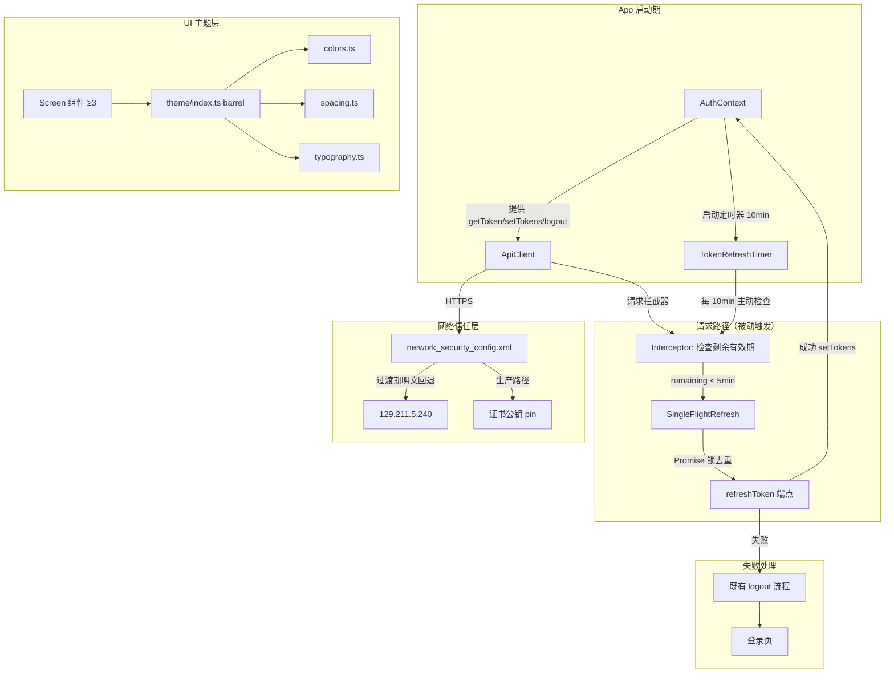

# Design Candidate — WI-0021 App 增强（Token 刷新 + HTTPS + UI Theme）

> 本文件为 Design Candidate（§8.2），拟追加写入正式规格真相源 `core/design.md`。
> 仅描述"怎么做"的方案层面：架构决策、接口契约、错误处理、测试策略。
> 任务拆分由 sf-task-planner 负责；代码实现由 sf-executor 负责。

## 文档元信息

| 项 | 值 |
|----|-----|
| Base Spec Version | PSV-0008（与 requirements.candidate.md 同源） |
| Workflow Path | requirement_change_path |
| 涉及 REQ | REQ-1, REQ-2, REQ-3 |
| 主机事实约束 | host-profile: docker 26.1.3、node/npm 可用、Asia/Shanghai 时区 |
| 项目配置状态 | project-rules.md / prod-environment.md 当前为 TODO 未填充（见 Assumption #9） |

---

## 架构图



---

## Out of Scope（本设计不做）

1. **不新增/修改 API 端点** — 复用既有 refresh 端点（与 REQ-1 约束一致）。
2. **不修改既有 logout 逻辑** — 刷新失败直接调用现有 logout（与 REQ-1.AC3 一致）。
3. **不做全量强制 HTTPS** — 过渡期保留白名单明文回退；移除回退属后续 WI。
4. **不做全量屏幕样式重构** — Theme 引用为渐进式，仅要求 ≥ 3 屏幕引用（REQ-3.AC2）。
5. **不做运行时 E2E 验证** — 真实 HTTPS 握手、token 刷新时序的运行时验证留给后续质量 WI。
6. **不做多 Tab / 多进程 token 同步** — 假设 App 单一 JS 运行时；跨进程同步另立 WI。
7. **不做 Theme 运行时切换（暗色模式）** — 本期 Theme 为静态常量集合；动态主题切换另立 WI。

---

## Assumptions（设计假设）

1. **假设** AuthContext 已持有 accessToken / refreshToken 的内存状态，并能从 token 中解析出过期时间（exp）。
2. **假设** ApiClient 为基于 axios/fetch 的单例，支持请求/响应拦截器扩展。
3. **假设** refreshToken 端点返回新 accessToken（含新 exp）与可选新 refreshToken，不依赖额外会话状态。
4. **假设** App 为单 JS 运行时（React Native JS thread），单飞 Promise 锁在进程内即可生效；无多 Web Worker 竞态。
5. **假设** 后端地址固定为 `129.211.5.240`（IP），过渡期允许该 IP 明文。
6. **假设** 网络库（okhttp）在 Android 上正确读取 `network_security_config.xml`（Android 7.0+ / API 24+）。
7. **假设** targetSdkVersion ≥ 28（Android 9），cleartext 默认被禁用，需通过 network_security_config 显式开启。
8. **假设** 项目使用 TypeScript 严格模式（`strict: true`），Theme 常量以 `as const` + 类型导出。
9. **假设** prod-environment.md / project-rules.md 当前为 TODO 未填充状态；若后续填充与本文决策冲突，需复核本设计（受影响 DD：DD-1 时区/exp 解析、DD-2 域名/SDK 版本、DD-3 字号单位）。

---

## 设计决策

### DD-1 Token 刷新策略：单飞（Single-Flight）+ 定时器双重保护

refs: [REQ-1.AC1, REQ-1.AC2, REQ-1.AC3]
constrained_by:
- REQ-1 配置点 `token_refresh_threshold_minutes=5`
- intake 约束：不新增 API 端点、刷新失败沿用既有 logout
- host-profile: Asia/Shanghai 时区（token exp 解析需考虑时区偏移）

#### 动机

REQ-1 要求两类触发场景同时满足：
- **被动触发**（请求拦截器）：业务请求发起前检查剩余有效期 < 5min。
- **主动触发**（定时器）：App 在前台时，每 10min 主动检查一次。

两个触发源可能在同一时间窗口内并发，必须保证"至多一次实际刷新调用"（REQ-1.AC2）。单飞模式是此场景的最小必要抽象：2 个调用点（拦截器 + 定时器）满足 DD4 抽象门槛。

#### 方案：双重触发 + 共享单飞锁

**触发点 1 — ApiClient 请求拦截器（被动）**：

```typescript
// src/api/ApiClient.ts 请求拦截器（契约示意，非最终实现）
apiClient.interceptors.request.use(async (config) => {
    const token = authContext.getAccessToken();
    if (token && isExpiringSoon(token, THRESHOLD_MIN)) {
        // 委托给共享单飞实例，自动去重并发调用
        const fresh = await singleFlightRefresh.refresh();
        config.headers.Authorization = `Bearer ${fresh.accessToken}`;
    }
    return config;
});
```

**触发点 2 — AuthContext 定时器（主动）**：

```typescript
// src/store/auth/AuthContext.tsx（契约示意）
useEffect(() => {
    const timer = setInterval(async () => {
        const token = getAccessToken();
        if (token && isExpiringSoon(token, THRESHOLD_MIN)) {
            await singleFlightRefresh.refresh();  // 同一模块单例
        }
    }, TIMER_INTERVAL_MS);  // 10 * 60 * 1000 = 600000
    return () => clearInterval(timer);
}, []);
```

**单飞锁（核心去重机制）**：

```typescript
// src/store/auth/SingleFlightRefresh.ts（契约示意）
class SingleFlightRefresh {
    private inflight: Promise<TokenPair> | null = null;

    async refresh(): Promise<TokenPair> {
        // 已有进行中的刷新 → 复用同一 Promise
        if (this.inflight) {
            return this.inflight;
        }
        // 发起新刷新；finally 保证无论成功失败都清理 inflight
        this.inflight = doRefresh()
            .finally(() => { this.inflight = null; });
        return this.inflight;
    }
}

export const singleFlightRefresh = new SingleFlightRefresh();  // 模块级单例
```

#### 接口定义

```typescript
interface TokenPair {
    accessToken: string;
    refreshToken: string;
    expiresAt: number;  // epoch ms
}

interface SingleFlightRefresh {
    /**
     * 触发刷新；若已有进行中刷新则复用同一 Promise。
     * 保证：同一时刻至多一个 refreshToken 端点调用。
     */
    refresh(): Promise<TokenPair>;
    // Errors: RefreshFailed（网络错误 / refreshToken 无效 / 服务端 4xx 5xx）
}

interface AuthContextShape {
    getAccessToken(): string | null;
    getRefreshToken(): string | null;
    setTokens(pair: TokenPair): void;
    logout(): void;  // 复用既有实现，不修改
}
```

#### Errors 段

| 错误 | 来源 | 处理策略 |
|------|------|----------|
| `RefreshFailed`（网络错误） | doRefresh | 触发 `authContext.logout()`（REQ-1.AC3） |
| `RefreshFailed`（refreshToken 无效，401） | refresh 端点 | 触发 `authContext.logout()` |
| `RefreshFailed`（服务端 4xx/5xx） | refresh 端点 | 触发 `authContext.logout()` |
| 时钟漂移导致 exp 解析偏差 | isExpiringSoon | 容忍 ±30s 偏差（提前触发刷新，宁可早刷） |

#### 失败处理策略（DD5）

- **timeout**: 刷新请求 10s（短于业务请求默认超时，避免拦截器阻塞过久）
- **retry**: **不重试**（refreshToken 失败多为凭证失效，重试无意义；与 REQ-1.AC3 直接 logout 一致）
- **fallback**: 无降级；直接 logout 跳登录页
- **circuit_breaker**: 不引入（刷新频率低，单飞已足够去重）

#### 正确性属性（PBT）

- **P1 单飞不变量**：任意并发 N 个 `refresh()` 调用，至多发起 1 次实际 HTTP 刷新请求。
- **P2 失败清理**：刷新失败后 `inflight` 必须归 null（finally 保证），下次调用可重试。
- **P3 阈值触发**：当 `remaining(token) < 5min` 时 refresh 被触发；当 `remaining ≥ 5min` 时不触发。
- **P4 定时器单调**：定时器间隔固定 10min，使用 setInterval（非基于 Date.now 的递归 setTimeout），不累积漂移。

---

### DD-2 HTTPS network_security_config.xml：明文白名单 + 证书公钥 pin

refs: [REQ-2.AC1, REQ-2.AC2, REQ-2.AC3]
constrained_by:
- REQ-2 配置点 `cleartext_fallback_domains`（默认 `[]`，本设计显式声明）
- intake 约束：过渡期允许明文 fallback
- host-profile: Android targetSdk 假设 ≥ 28（见 Assumption #7）

#### 动机

REQ-2 要求：
- 新建 `network_security_config.xml`（REQ-2.AC1）
- AndroidManifest `<application>` 引用（REQ-2.AC2）
- 过渡期白名单明文回退（REQ-2.AC3）

设计需同时满足：①过渡期对 `129.211.5.240` 允许明文；②生产路径启用证书公钥 pin 防中间人攻击；③默认全局禁止明文（安全基线）。

#### 方案：分层 trust 配置

**XML 结构（`android/app/src/main/res/xml/network_security_config.xml`）**：

```xml
<?xml version="1.0" encoding="utf-8"?>
<network-security-config>

    <!-- 全局默认：禁止明文（安全基线） -->
    <base-config cleartextTrafficPermitted="false">
        <trust-anchors>
            <certificates src="system"/>
        </trust-anchors>
    </base-config>

    <!-- 过渡期：对 129.211.5.240 允许明文回退 -->
    <domain-config cleartextTrafficPermitted="true">
        <domain includeSubdomains="false">129.211.5.240</domain>
    </domain-config>

    <!-- 生产：对正式域名启用证书公钥 pin -->
    <domain-config>
        <domain includeSubdomains="true">api.feijian.example.com</domain>
        <pin-set expiration="2027-07-05">
            <!-- 主公钥 SHA-256（生产证书） -->
            <pin digest="SHA-256">productionPublicKeyHash</pin>
            <!-- 备份公钥（证书轮换容灾） -->
            <pin digest="SHA-256">backupPublicKeyHash</pin>
        </pin-set>
        <trust-anchors>
            <certificates src="system"/>
        </trust-anchors>
    </domain-config>

</network-security-config>
```

**AndroidManifest 引用**：

```xml
<application
    android:networkSecurityConfig="@xml/network_security_config"
    ... >
```

#### 接口/契约定义

`network_security_config.xml` 不暴露 TypeScript 接口，其契约以 XML schema + 行为约束表达：

```typescript
/**
 * Network Security Contract（隐式接口，由 Android 系统消费）
 */
interface NetworkSecurityContract {
    // 行为契约 1：默认禁止明文（base-config cleartextTrafficPermitted=false）
    defaultCleartext: false;
    // 行为契约 2：白名单域名允许明文（domain-config cleartextTrafficPermitted=true）
    cleartextFallbackDomains: string[];  // ["129.211.5.240"]
    // 行为契约 3：生产域名启用 pin
    pinnedDomains: {
        domain: string;
        pins: string[];       // SHA-256 公钥哈希数组
        expiration: string;   // ISO date
    }[];
}
// Errors: 证书 pin 不匹配 → 连接被系统拒绝（fail-closed）
```

#### Errors 段

| 错误 | 来源 | 处理策略 |
|------|------|----------|
| 证书 pin 不匹配（中间人攻击 / 证书轮换） | okhttp / 系统 | 连接被拒绝，请求失败 → 业务层走通用错误处理（fail-closed 符合安全预期） |
| 白名单域名误配（生产域名被加入明文） | 配置错误 | code review + 配置点互斥校验（见下） |
| pin-set 过期未轮换 | 时间 | `<pin-set expiration>` 到期后该域名 trust 退化为系统默认锚点 |

#### 失败处理策略（DD5）

- **timeout**: 由业务请求层处理（本配置不干预）
- **retry**: 不适用（XML 静态配置）
- **fallback**: pin 不匹配 → 连接失败（**fail-closed**，符合安全预期，不降级为明文）
- **circuit_breaker**: 不适用

#### 配置约束与互斥规则

- `cleartext_fallback_domains`（REQ-2.AC3 配置点）默认 `[]`；本设计显式声明 `["129.211.5.240"]`（intake 确认）。
- **互斥规则**：同一域名不得同时出现在 cleartext 白名单与 pin-set 中（pin 与明文语义冲突，pin 仅对 HTTPS 有效）。
- **容灾规则**：pin-set 必须含 ≥ 2 个公钥（主 + 备份），避免证书轮换导致全员锁定。

#### 正确性属性（PBT）

- **P5 默认禁止明文**：未在 `<domain-config>` 显式声明的域名，cleartext 流量被系统拒绝。
- **P6 白名单最小化**：cleartext 白名单仅含 `129.211.5.240`，不泛化为 `*` 或子域（`includeSubdomains=false`）。
- **P7 pin 容灾**：pin-set 至少含 2 个公钥（主 + 备份），主钥失效仍可连接。
- **P8 过渡期可移除**：过渡期结束后，移除 cleartext `<domain-config>` 不影响 pin-set 与 base-config。

---

### DD-3 Theme 设计令牌：colors / spacing / typography + barrel export

refs: [REQ-3.AC1, REQ-3.AC2, REQ-3.AC3]
constrained_by:
- REQ-3 配置点 `min_theme_referencing_screens=3`
- intake 约束：渐进式引用，不强制全量重构
- host-profile: TypeScript 项目（tsc --noEmit 验证基线）

#### 动机

REQ-3 要求 Theme 常量集合覆盖 colors/spacing/typography 三维度，并通过统一入口导出；同时要求类型安全（REQ-3.AC3 禁止裸字符串散落）。设计采用分模块常量 + barrel 聚合，保持最小复杂度（YAGNI）。

#### 方案：分模块常量 + barrel 聚合

**目录结构**：

```
src/theme/
├── colors.ts        # 配色常量
├── spacing.ts       # 间距常量
├── typography.ts    # 字体常量
└── index.ts         # barrel export（统一入口）
```

**`colors.ts`**：

```typescript
export const colors = {
    primary: '#1677ff',    // 主色（按钮、链接、强调）
    danger: '#d32f2f',     // 危险/错误（删除、报错）
    success: '#4caf50',    // 成功（完成、通过）
    background: '#f5f5f5', // 页面背景
    white: '#fff',         // 卡片/输入框背景
} as const;

export type ColorKey = keyof typeof colors;
export type ColorValue = typeof colors[ColorKey];
```

**`spacing.ts`**：

```typescript
export const spacing = {
    xs: 4,
    sm: 8,
    md: 12,
    lg: 16,
    xl: 24,
    xxl: 32,
} as const;

export type SpacingKey = keyof typeof spacing;
```

**`typography.ts`**：

```typescript
export const typography = {
    fontSize: {
        caption: 12,    // 辅助说明
        body: 14,       // 正文
        title: 16,      // 标题
        subtitle: 18,   // 副标题
        headline: 24,   // 大标题
    },
    fontWeight: {
        regular: '400' as const,
        medium: '500' as const,
        semibold: '600' as const,
        bold: '700' as const,
    },
} as const;

export type FontSizeKey = keyof typeof typography.fontSize;
export type FontWeightKey = keyof typeof typography.fontWeight;
```

**`index.ts`（barrel）**：

```typescript
export { colors, type ColorKey, type ColorValue } from './colors';
export { spacing, type SpacingKey } from './spacing';
export { typography, type FontSizeKey, type FontWeightKey } from './typography';
```

#### 接口定义（类型安全契约）

```typescript
/**
 * Theme 常量访问接口
 * 所有屏幕必须通过此接口引用常量，禁止裸字符串字面量（REQ-3.AC3）。
 */
interface ThemeTokens {
    colors: Readonly<Record<'primary' | 'danger' | 'success' | 'background' | 'white', string>>;
    spacing: Readonly<Record<'xs' | 'sm' | 'md' | 'lg' | 'xl' | 'xxl', number>>;
    typography: {
        fontSize: Readonly<Record<'caption' | 'body' | 'title' | 'subtitle' | 'headline', number>>;
        fontWeight: Readonly<Record<'regular' | 'medium' | 'semibold' | 'bold', string>>;
    };
}
// Errors: 编译期错误（键名不存在时 tsc 报 TS2339，无运行时错误）
```

#### Errors 段

| 错误 | 来源 | 处理策略 |
|------|------|----------|
| 键名不存在（如 `colors.primay` 拼写错误） | tsc | 编译期 TS2339，CI 拦截（REQ-3.AC3） |
| 裸字符串字面量（如 `color="#1677ff"`） | code review | lint 规则禁止十六进制字面量散落（可选增强） |

#### 抽象边界（DD4 YAGNI）

- Theme 常量目前**仅 1 个消费模式**（屏幕直接 import 常量引用），不引入 `ThemeProvider` / Context 抽象。
- 当出现 ≥ 2 个消费需求（如暗色模式切换、运行时主题注入）时，再升级为 Provider 模式（另立 WI）。
- barrel export 本身满足 ≥ 2 调用点（colors/spacing/typography 三个子模块均通过 index.ts 聚合），抽象合理。

#### 失败处理策略（DD5）

不适用（静态常量无运行时失败路径；错误仅在编译期通过 tsc 暴露）。

#### 正确性属性（PBT）

- **P9 键完整性**：`Object.keys(colors)` 恰好等于 `['primary','danger','success','background','white']`。
- **P10 间距阶梯**：spacing 值严格递增 `[4, 8, 12, 16, 24, 32]`。
- **P11 字号阶梯**：fontSize 值严格递增 `[12, 14, 16, 18, 24]`。
- **P12 类型封闭**：所有导出值经 `as const` 冻结，运行时不可变（`Object.freeze` 语义）。

---

## 数据模型

本设计不引入持久化数据模型变更。Token 状态为内存态：

```typescript
// 内存态（AuthContext 内，非持久化）
interface AuthState {
    accessToken: string | null;
    refreshToken: string | null;
    expiresAt: number;  // epoch ms，用于 isExpiringSoon 判断
}
```

Theme 常量为静态模块导出，无运行时状态。

---

## 测试策略

### 单元测试

| 模块 | 测试目标 | 框架 | 关键用例 |
|------|----------|------|----------|
| SingleFlightRefresh | P1 单飞不变量 | jest | 并发 N 次 refresh → mock fetch 调用计数 = 1 |
| SingleFlightRefresh | P2 失败清理 | jest | refresh reject 后 inflight=null，可重试 |
| isExpiringSoon | P3 阈值触发 | jest | remaining=4min59s → true；5min1s → false |
| colors/spacing/typography | P9-P12 常量完整性 | jest | 键集合 + 递增性断言 |

### 集成测试

| 场景 | 验证点 |
|------|--------|
| ApiClient + AuthContext + SingleFlight | 请求拦截器触发刷新，header 更新为新 token |
| 定时器 + 拦截器并发触发 | 两路同时触发，refresh 端点 fetch 仅 1 次 |

### 构建验证（与全局基线一致）

- `npx tsc --noEmit` 退出码 0（覆盖 Theme 类型安全 REQ-3.AC3）
- Docker `./gradlew assembleDebug` BUILD SUCCESSFUL（覆盖 network_security_config.xml 资源编译 REQ-2）

### 兼容性测试

- Android API 24+（network_security_config 最低支持版本）
- targetSdk ≥ 28（cleartext 默认禁用前提，见 Assumption #7）

---

## 设计自检（A1-A5 好架构属性）

| 属性 | 检查 | 结果 |
|------|------|------|
| A1 单一职责 | SingleFlightRefresh 只负责"至多一次刷新"；network_security_config 只负责"域名信任策略"；Theme 只负责"视觉常量" | ✅ |
| A2 显式依赖 | 架构图含全部箭头：AuthContext→ApiClient、Interceptor→SingleFlight、Timer→Interceptor、Screen→Theme | ✅ |
| A3 可替换性 | SingleFlightRefresh 接口可被 mock（测试已体现）；Theme 常量可升级为 Provider（DD-3 已说明路径） | ✅ |
| A4 失败可观测 | 每个 DD 含 Errors 段；刷新失败→logout；pin 不匹配→连接失败；Theme 错误→tsc 编译期 | ✅ |
| A5 边界明确 | Out of Scope + Assumptions 段齐全 | ✅ |

---

## REQ → DD 追溯矩阵

| REQ | AC | 覆盖 DD | 说明 |
|-----|-----|---------|------|
| REQ-1 | AC1 | DD-1 | 拦截器 + 定时器双重触发自动刷新 |
| REQ-1 | AC2 | DD-1 | 单飞 Promise 锁去重，至多一次刷新调用 |
| REQ-1 | AC3 | DD-1 | 刷新失败→既有 logout（不修改 logout） |
| REQ-2 | AC1 | DD-2 | network_security_config.xml 新建 |
| REQ-2 | AC2 | DD-2 | AndroidManifest networkSecurityConfig 属性引用 |
| REQ-2 | AC3 | DD-2 | 白名单明文回退（129.211.5.240） |
| REQ-3 | AC1 | DD-3 | colors/spacing/typography + barrel export |
| REQ-3 | AC2 | DD-3 | ≥ 3 屏幕引用（实现侧约束，由 task-planner 落地） |
| REQ-3 | AC3 | DD-3 | as const + 类型导出，tsc 编译期校验 |

---

## 自检（Self-Check）

| # | 自问自答 | 答案 |
|---|---------|------|
| 1 | 每个 REQ-N 都有对应的 DD-N 覆盖吗？ | 是。REQ-1→DD-1，REQ-2→DD-2，REQ-3→DD-3。 |
| 2 | 每个 DD 都有 refs: [REQ-N] 吗？ | 是。三个 DD 均标注 refs 到具体 AC。 |
| 3 | 架构图画了吗？Out of Scope 写了吗？Assumptions 写了吗？ | 是。三段齐全。 |
| 4 | 每个组件都有 interface 定义 + Errors 段吗？ | 是。SingleFlightRefresh / AuthContextShape / NetworkSecurityContract / ThemeTokens 均含 Errors。 |
| 5 | 设计是否考虑了 prod-environment 的最低版本约束？ | prod-environment.md 为 TODO；Assumption #9 显式标注待复核。 |
| 6 | DD4 抽象是否满足 ≥ 2 调用点？ | SingleFlight 2 调用点（拦截器+定时器）→抽象合理；Theme 常量 1 消费模式→不抽象（已说明升级路径）。 |
| 7 | DD5 每个外部调用是否有失败处理？ | 是。刷新端点含 timeout/retry/fallback；XML 配置含 fail-closed。 |
| 8 | 是否避免编写任务拆分/可运行代码实现？ | 是。代码片段为接口契约示意，非最终实现；无任务拆分。 |
